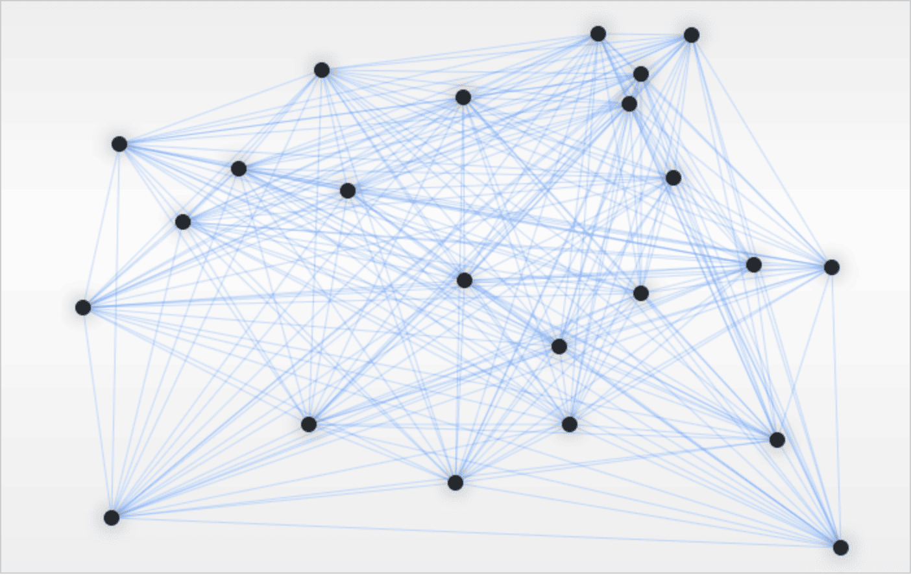
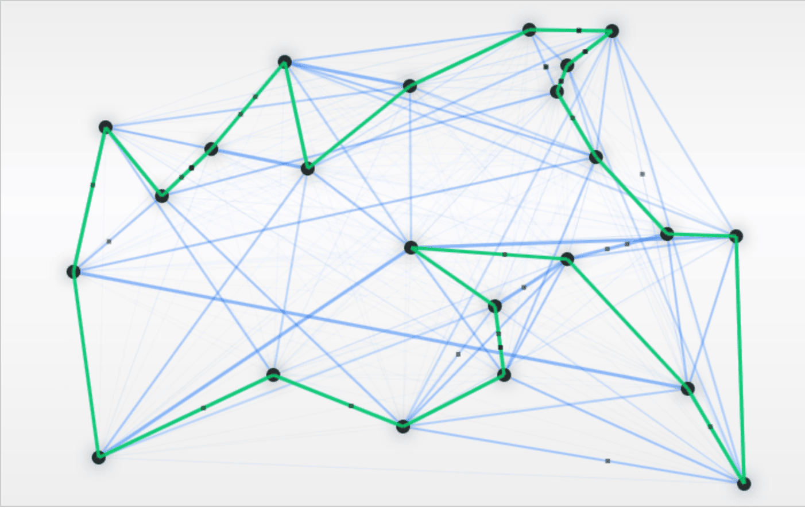

# [蚁群优化算法](https://www.baeldung.com/java-ant-colony-optimization)

算法

1. 引言

    [本系列文章](https://www.baeldung.com/java-genetic-algorithm)的目标是解释遗传算法的基本思想，并展示一些最著名的实现方式。

    在本教程中，我们将介绍**蚁群优化算法**（ant colony optimization, ACO）的概念，并提供相应的代码示例。

2. ACO 的工作原理

    ACO 是一种受蚂蚁自然行为启发的遗传算法。要完全理解 ACO 算法，我们需要熟悉它的基本概念：

    - 蚂蚁通过信息素寻找从巢穴到食物源之间的最短路径  
    - 信息素会迅速蒸发  
    - 蚂蚁倾向于选择信息素浓度更高、更短的路径  

    我们以**旅行商问题**（[TSP](https://www.baeldung.com/java-simulated-annealing-for-traveling-salesman)）为例来说明 ACO 的使用。在这种情况下，我们需要找到图中所有节点之间的最短路径：

    

    蚂蚁开始探索新路径时，遵循自然行为。颜色越深的蓝色表示该路径被使用的频率越高，绿色则表示当前找到的最短路径：

    

    最终，我们可以获得图中所有节点之间的最短路径：

    你可以在[这里](http://www.theprojectspot.com/downloads/tsp-aco.html)找到一个用于测试 ACO 的图形界面工具。

3. Java 实现

    1. ACO 参数设置

        让我们讨论一下在 `AntColonyOptimization` 类中声明的 ACO 算法的主要参数：

        ```java
        private double c = 1.0;
        private double alpha = 1;
        private double beta = 5;
        private double evaporation = 0.5;
        private double Q = 500;
        private double antFactor = 0.8;
        private double randomFactor = 0.01;
        ```

        参数 `c` 表示模拟开始时路径上的初始信息素量。`alpha` 控制信息素的重要性，而 `beta` 控制距离优先级。通常来说，为了获得最佳效果，`beta` 应大于 `alpha`。

        接下来，`evaporation` 表示每次迭代中信息素的蒸发比例；`Q` 表示每只蚂蚁在路径上留下的信息素总量；`antFactor` 表示每个城市使用的蚂蚁数量比例。

        最后，在我们的模拟中需要加入一定的随机性，这由 `randomFactor` 控制。

    2. 创建蚂蚁

        每只蚂蚁可以访问特定的城市，记住所有已访问过的城市，并跟踪其路径长度：

        ```java
        public void visitCity(int currentIndex, int city) {
            trail[currentIndex + 1] = city;
            visited[city] = true;
        }

        public boolean visited(int i) {
            return visited[i];
        }

        public double trailLength(double graph[][]) {
            double length = graph[trail[trailSize - 1]][trail[0]];
            for (int i = 0; i < trailSize - 1; i++) {
                length += graph[trail[i]][trail[i + 1]];
            }
            return length;
        }
        ```

    3. 初始化蚂蚁

        在程序开始时，我们需要初始化 ACO 的代码实现，包括路径矩阵和蚂蚁数组：

        ```java
        graph = generateRandomMatrix(noOfCities);
        numberOfCities = graph.length;
        numberOfAnts = (int) (numberOfCities * antFactor);

        trails = new double[numberOfCities][numberOfCities];
        probabilities = new double[numberOfCities];
        ants = new Ant[numberOfAnts];

        IntStream.range(0, numberOfAnts).forEach(i -> ants.add(new Ant(numberOfCities)));
        ```

        接着，我们需要为每只蚂蚁设置一个起始城市：

        ```java
        public void setupAnts() {
            IntStream.range(0, numberOfAnts)
            .forEach(i -> {
                ants.forEach(ant -> {
                    ant.clear();
                    ant.visitCity(-1, random.nextInt(numberOfCities));
                });
            });
            currentIndex = 0;
        }
        ```

        对于每次迭代，我们执行以下操作：

        ```java
        IntStream.range(0, maxIterations).forEach(i -> {
            moveAnts();
            updateTrails();
            updateBest();
        });
        ```

    4. 移动蚂蚁

        我们从 `moveAnts()` 方法开始。我们需要为所有蚂蚁选择下一个城市，同时记住每只蚂蚁都倾向于跟随其他蚂蚁的路径：

        ```java
        public void moveAnts() {
            IntStream.range(currentIndex, numberOfCities - 1).forEach(i -> {
                ants.forEach(ant -> {
                    ant.visitCity(currentIndex, selectNextCity(ant));
                });
                currentIndex++;
            });
        }
        ```

        最关键的部分是正确选择下一个城市。我们应该基于概率逻辑选择下一个城市。首先，我们可以判断是否应让蚂蚁随机选择一个城市：

        ```java
        int t = random.nextInt(numberOfCities - currentIndex);
        if (random.nextDouble() < randomFactor) {
            OptionalInt cityIndex = IntStream.range(0, numberOfCities)
            .filter(i -> i == t && !ant.visited(i))
            .findFirst();
            if (cityIndex.isPresent()) {
                return cityIndex.getAsInt();
            }
        }
        ```

        如果没有选择随机城市，我们就需要计算前往每个城市的概率，记住蚂蚁倾向于选择信息素更强且更短的路径。我们可以通过将每个城市的转移概率存储在一个数组中来实现这一点：

        ```java
        public void calculateProbabilities(Ant ant) {
            int i = ant.trail[currentIndex];
            double pheromone = 0.0;
            for (int l = 0; l < numberOfCities; l++) {
                if (!ant.visited(l)){
                    pheromone +=
                    Math.pow(trails[i][l], alpha) * Math.pow(1.0 / graph[i][l], beta);
                }
            }
            for (int j = 0; j < numberOfCities; j++) {
                if (ant.visited(j)) {
                    probabilities[j] = 0.0;
                } else {
                    double numerator =
                    Math.pow(trails[i][j], alpha) * Math.pow(1.0 / graph[i][j], beta);
                    probabilities[j] = numerator / pheromone;
                }
            }
        }
        ```

        计算完概率后，我们可以通过以下方式决定前往哪个城市：

        ```java
        double r = random.nextDouble();
        double total = 0;
        for (int i = 0; i < numberOfCities; i++) {
            total += probabilities[i];
            if (total >= r) {
                return i;
            }
        }
        ```

    5. 更新路径与信息素

        在这一步中，我们需要更新路径上的信息素值：

        ```java
        public void updateTrails() {
            for (int i = 0; i < numberOfCities; i++) {
                for (int j = 0; j < numberOfCities; j++) {
                    trails[i][j] *= evaporation;
                }
            }
            for (Ant a : ants) {
                double contribution = Q / a.trailLength(graph);
                for (int i = 0; i < numberOfCities - 1; i++) {
                    trails[a.trail[i]][a.trail[i + 1]] += contribution;
                }
                trails[a.trail[numberOfCities - 1]][a.trail[0]] += contribution;
            }
        }
        ```

    6. 更新最优解

        这是每次迭代的最后一步。我们需要更新最优解以便保留当前最优路径：

        ```java
        private void updateBest() {
            if (bestTourOrder == null) {
                bestTourOrder = ants[0].trail;
                bestTourLength = ants[0].trailLength(graph);
            }
            for (Ant a : ants) {
                if (a.trailLength(graph) < bestTourLength) {
                    bestTourLength = a.trailLength(graph);
                    bestTourOrder = a.trail.clone();
                }
            }
        }
        ```

        经过所有迭代后，最终结果将指示 ACO 找到的最佳路径。请注意，随着城市数量的增加，找到最短路径的概率会下降。

4. 总结

    本教程介绍了蚁群优化算法（ACO）。即使你没有相关领域的知识背景，只要你具备基本的编程技能，也可以通过学习掌握遗传算法。

    本文配套的代码可在 GitHub 上获取。当你以 Baeldung Pro 用户身份登录后，即可开始学习并进行项目编码。
