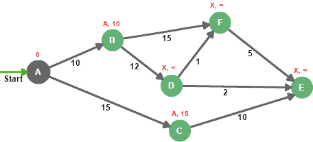

# [Java中的Dijkstra最短路径算法](https://www.baeldung.com/java-dijkstra)

1. 一览表

    本文的重点是最短路径问题（SPP），它是图论中已知的基本理论问题之一，以及如何使用Dijkstra算法来解决它。

    该算法的基本目标是确定起始节点和图形其余部分之间的最短路径。

2. Dijkstra的最短路径问题

    给定一个正加权图和一个起始节点（A），Dijkstra确定了从源到图中所有目的地的最短路径和距离：

    

    Dijkstra算法的核心思想是持续消除起始节点和所有可能的目的地之间的更长路径。

    为了跟踪这个过程，我们需要有两组不同的节点，已解决的和未解决的。

    已定点是已知与源有最小距离的节点。未确定的节点集收集了我们可以从源到达的节点，但我们不知道与起始节点的最小距离。

    以下是与Dijkstra一起解决SPP需要遵循的步骤列表：

    - 将距离设置为零开始节点。
    - 将所有其他距离设置为无限值。
    - 我们将startNode添加到未确定的节点集中。
    - 虽然未确定的节点集不是空的，但我们：
    - 从未确定的节点集中选择一个评估节点，评估节点应该是距离源距离最短的节点。
    - 通过在每次评估中保持最低距离来计算与邻居的新距离。
    - 将尚未解决的邻居添加到未解决的节点集中。

    这些步骤可以汇总为两个阶段，初始化和评估。让我们看看这如何适用于我们的示例图：

    1. 初始化

        在我们开始探索图中的所有路径之前，我们首先需要初始化所有具有无限距离和未知前身的节点，源除外。

        作为初始化过程的一部分，我们需要为节点A分配值0（我们知道从节点A到节点A的距离显然是0）

        因此，图其余部分的每个节点将用前身和距离来区分：

        

        为了完成初始化过程，我们需要将节点A添加到未确定的节点中，将其设置为在评估步骤中首先选择。请记住，已解决的节点集仍然是空的。

    2. 评估

        现在我们已经初始化了图表，我们选择距离未定集距离最低的节点，然后我们评估所有不在定点中的相邻节点：

        

        这个想法是将边缘权重添加到评估节点距离中，然后将其与目的地的距离进行比较。例如，对于节点B，0+10低于INFINITY，因此节点B的新距离是10，新的前身是A，同样适用于节点C。

        然后，节点A从未解决的节点集移动到已解决的节点。

        节点B和C被添加到未设置的节点中，因为它们可以被访问，但它们需要被评估。

        现在，我们在未解决的集合中有两个节点，我们选择距离最低的那个（节点B），然后我们重复，直到我们确定图中的所有节点：

        

        以下是汇总评估步骤中执行的迭代的表格：

        | Iteration | Unsettled | Settled       | EvaluationNode | A | B    | C    | D    | E    | F    |
        |-----------|-----------|---------------|----------------|---|------|------|------|------|------|
        | 1         | A         | –             | A              | 0 | A-10 | A-15 | X-∞  | X-∞  | X-∞  |
        | 2         | B, C      | A             | B              | 0 | A-10 | A-15 | B-22 | X-∞  | B-25 |
        | 3         | C, F, D   | A, B          | C              | 0 | A-10 | A-15 | B-22 | C-25 | B-25 |
        | 4         | D, E, F   | A, B, C       | D              | 0 | A-10 | A-15 | B-22 | D-24 | D-23 |
        | 5         | E, F      | A, B, C, D    | F              | 0 | A-10 | A-15 | B-22 | D-24 | D-23 |
        | 6         | E         | A, B, C, D, F | E              | 0 | A-10 | A-15 | B-22 | D-24 | D-23 |
        | Final     | –         | ALL           | NONE           | 0 | A-10 | A-15 | B-22 | D-24 | D-23 |

        例如，符号B-22表示节点B是直接的前身，与节点A的总距离为22。

        最后，我们可以计算节点A的最短路径如下：

        - 节点B：A –> B（总距离=10）
        - 节点C：A –> C（总距离=15）
        - 节点D：A –> B –> D（总距离=22）
        - 节点E：A –> B –> D –> E（总距离=24）
        - 节点F：A –> B –> D –> F（总距离=23）

3. Java实现

    在这个简单的实现中，我们将将图形表示为一组节点：

    ```java
    public class Graph {
        private Set<Node> nodes = new HashSet<>();
        public void addNode(Node nodeA) {
            nodes.add(nodeA);
        }
        // getters and setters 
    }
    ```

    节点可以用名称、参考最短路径的LinkedList、与源的距离和名为adjacinNodes的邻接列表来描述：

    ```java
    public class Node {

        private String name;
        
        private List<Node> shortestPath = new LinkedList<>();
        
        private Integer distance = Integer.MAX_VALUE;
        
        Map<Node, Integer> adjacentNodes = new HashMap<>();

        public void addDestination(Node destination, int distance) {
            adjacentNodes.put(destination, distance);
        }
    
        public Node(String name) {
            this.name = name;
        }
        
        // getters and setters
    }
    ```

    adjacentNodes属性用于将直接邻居与边缘长度相关联。这是邻接列表的简化实现，它更适合Dijkstra算法而不是邻接矩阵。

    至于shortshortPath属性，它是描述从起始节点计算出的最短路径的节点列表。

    默认情况下，所有节点距离都使用Integer.MAX_VALUE初始化，以模拟初始化步骤中描述的无限距离。

    现在，让我们实现Dijkstra算法：

    ```java
    public static Graph calculateShortestPathFromSource(Graph graph, Node source) {
        source.setDistance(0);

        Set<Node> settledNodes = new HashSet<>();
        Set<Node> unsettledNodes = new HashSet<>();

        unsettledNodes.add(source);

        while (unsettledNodes.size() != 0) {
            Node currentNode = getLowestDistanceNode(unsettledNodes);
            unsettledNodes.remove(currentNode);
            for (Entry < Node, Integer> adjacencyPair: 
            currentNode.getAdjacentNodes().entrySet()) {
                Node adjacentNode = adjacencyPair.getKey();
                Integer edgeWeight = adjacencyPair.getValue();
                if (!settledNodes.contains(adjacentNode)) {
                    calculateMinimumDistance(adjacentNode, edgeWeight, currentNode);
                    unsettledNodes.add(adjacentNode);
                }
            }
            settledNodes.add(currentNode);
        }
        return graph;
    }
    ```

    getLowestDistanceNode（）方法返回距离未确定节点集距离最低的节点，而ccanteminumDistance（）方法在遵循新探索的路径时将实际距离与新计算的距离进行比较：

    ```java
    private static Node getLowestDistanceNode(Set < Node > unsettledNodes) {
        Node lowestDistanceNode = null;
        int lowestDistance = Integer.MAX_VALUE;
        for (Node node: unsettledNodes) {
            int nodeDistance = node.getDistance();
            if (nodeDistance < lowestDistance) {
                lowestDistance = nodeDistance;
                lowestDistanceNode = node;
            }
        }
        return lowestDistanceNode;
    }

    private static void CalculateMinimumDistance(Node evaluationNode,
    Integer edgeWeigh, Node sourceNode) {
        Integer sourceDistance = sourceNode.getDistance();
        if (sourceDistance + edgeWeigh < evaluationNode.getDistance()) {
            evaluationNode.setDistance(sourceDistance + edgeWeigh);
            LinkedList<Node> shortestPath = new LinkedList<>(sourceNode.getShortestPath());
            shortestPath.add(sourceNode);
            evaluationNode.setShortestPath(shortestPath);
        }
    }
    ```

    既然所有必要的部分都到位了，让我们在作为文章主题的样本图上应用Dijkstra算法：

    ```java
    Node nodeA = new Node("A");
    Node nodeB = new Node("B");
    Node nodeC = new Node("C");
    Node nodeD = new Node("D");
    Node nodeE = new Node("E");
    Node nodeF = new Node("F");

    nodeA.addDestination(nodeB, 10);
    nodeA.addDestination(nodeC, 15);

    nodeB.addDestination(nodeD, 12);
    nodeB.addDestination(nodeF, 15);

    nodeC.addDestination(nodeE, 10);

    nodeD.addDestination(nodeE, 2);
    nodeD.addDestination(nodeF, 1);

    nodeF.addDestination(nodeE, 5);

    Graph graph = new Graph();

    graph.addNode(nodeA);
    graph.addNode(nodeB);
    graph.addNode(nodeC);
    graph.addNode(nodeD);
    graph.addNode(nodeE);
    graph.addNode(nodeF);

    graph = Dijkstra.calculateShortestPathFromSource(graph, nodeA);
    ```

    计算后，为图表中的每个节点设置最短路径和距离属性，我们可以迭代它们，以验证结果是否与上一节中发现的完全匹配。

4. 结论

    在本文中，我们看到了Dijkstra算法如何解决SPP，以及如何在Java中实现它。
