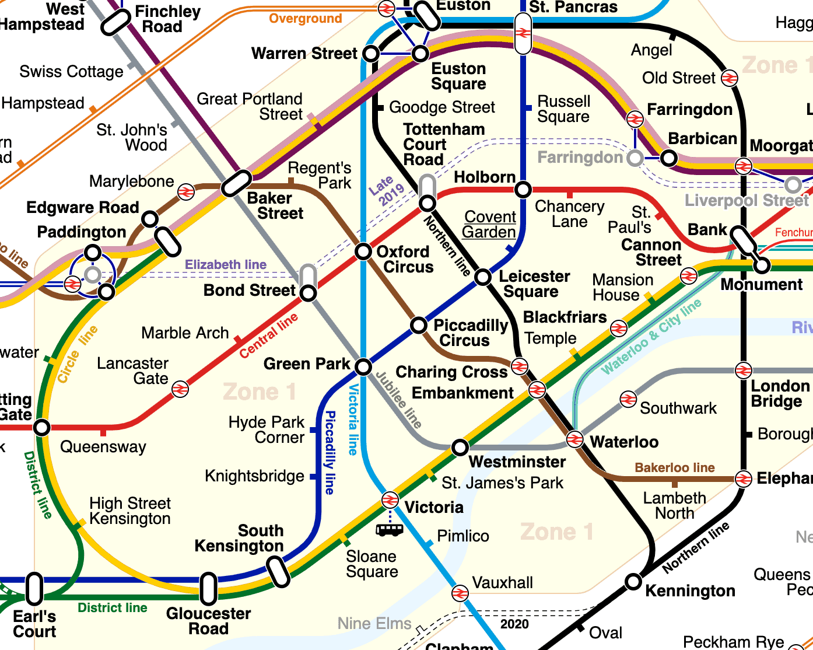

# [在Java中实现A*寻路](https://www.baeldung.com/java-a-star-pathfinding)

1. 介绍

    寻路算法是导航地图的技术，使我们能够找到两个不同点之间的路线。不同的算法有不同的利弊，通常是在算法的效率和它生成的路线的效率方面。

2. 什么是寻路算法？

    寻路算法是一种将由节点和边缘组成的图形转换为通过图形的路线的技术。这个图表可以是任何需要穿越的东西。在这篇文章中，我们将尝试穿越伦敦地铁系统的一部分：

    

    （[sameboat](https://commons.wikimedia.org/wiki/User:Sameboat)的“[伦敦地铁地面DLR Crossrail地图](https://commons.wikimedia.org/wiki/File:London_Underground_Overground_DLR_Crossrail_map.svg)”根据[CC BY-SA 4.0](https://creativecommons.org/licenses/by-sa/4.0/deed.en)获得许可）

    这有很多有趣的组成部分：

    - 我们的起点和终点之间可能有直接路线，也可能没有。例如，我们可以直接从“伯爵宫廷”到“纪念碑”，但不能去“天使”。
    - 每一步都有特定的成本。就我们而言，这是车站之间的距离。
    - 每个站点只连接到其他站点的一小部分。例如，“摄政公园”只与“贝克街”和“牛津广场”直接相连。

    所有寻路算法都以所有节点（就我们而言为站）的集合作为输入，以及它们之间的连接，以及所需的起点和终点。输出通常是一组节点，这些节点将按照我们需要的顺序从开始到结束。

3. A*是什么？

    A*是一种特定的寻路算法，由Peter Hart、Nils Nilsson和Bertram Raphael于1968年首次发布。当没有机会预先计算路由并且对内存使用没有限制时，它通常被认为是最好的算法。

    在最坏的情况下，内存和性能复杂度都可能是$O(b^d)$，因此，虽然它总是会找到最有效的路线，但它并不总是最有效的方法。

    A*实际上是Dijkstra算法的变体，其中提供了其他信息来帮助选择下一个要使用的节点。这个附加信息不需要完美——如果我们已经拥有完美的信息，那么寻路是毫无意义的。但越好，最终结果就越好。

4. A*是如何工作的？

    A*算法的工作原理是迭代选择迄今为止最好的路线，并尝试看看下一步是最好的。

    使用此算法时，我们需要跟踪几条数据。“开放集”是我们目前正在考虑的所有节点。这不是系统中的每个节点，相反，我们可能从中迈出下一步的每个节点。

    我们还将跟踪系统中每个节点的当前最佳得分、估计总分和当前最佳先前节点。

    作为其中的一部分，我们需要能够计算出两个不同的分数。一个是从一个节点到下一个节点的分数。第二个是启发式方法，可以估计从任何节点到目的地的成本。这种估计不需要准确，但更准确就会产生更好的结果。唯一的要求是两个分数彼此一致——即它们在同一单元中。

    一开始，我们的开放集由我们的起始节点组成，我们根本没有关于任何其他节点的信息。

    在每次迭代时，我们将：

    - 从我们的开放集合中选择估计总分最低的节点
    - 从打开的集合中删除此节点
    - 将我们可以从它到达的所有节点添加到打开的集合中

    当我们这样做时，我们还从这个节点到每个新节点的新分数，看看它是否是我们迄今为止得到的改进，如果是，那么我们更新我们对该节点的了解。

    然后重复，直到我们开放集中估计总分最低的节点是我们的目的地，此时我们得到了我们的路线。

    1. 工作范例

        例如，让我们从“马里波恩”开始，试着找到通往“邦德街”的路。

        一开始，我们的开放式套装仅由“Marylebone”组成。这意味着这隐含着我们获得最佳“估计总分”的节点。

        我们的下一站可以是“埃奇韦尔路”，行驶成本为0.4403公里，或“贝克街”，行驶成本为0.4153公里。然而，“埃奇韦尔路”的方向不对，所以我们从这里到目的地的启发式得分为1.4284公里，而“贝克街”的启发式得分为1.0753公里。

        这意味着，在这次迭代后，我们的开放集由两个条目组成——“埃奇韦尔路”，估计总分为1.8687公里，以及“贝克街”，估计总分为1.4906公里。

        然后我们的第二次迭代将从“贝克街”开始，因为这个估计的总分最低。从这里开始，我们的下一站可以是“马里波恩”、“圣。约翰森林”、“大波特兰街”、“摄政公园”或“邦德街”。

        我们不会解决所有这些，但让我们以“Marylebone”为例。到达那里的成本再次为0.4153公里，但这意味着现在的总成本为0.8306公里。此外，从这里到目的地的启发式得分为1.323公里。

        这意味着估计总分为2.1536公里，比之前该节点的得分要差。这是有道理的，因为在这种情况下，我们不得不做额外的工作才能一无所获。这意味着我们不会认为这是一条可行的路线。因此，“马里波恩”的详细信息没有更新，也不会将其添加回打开的集合中。

5. Java实现

    既然我们已经讨论了它是如何工作的，让我们实际实施它。我们将构建一个通用解决方案，然后我们将实施为伦敦地铁工作所需的代码。然后，我们可以通过只实现这些特定部分来将其用于其他场景。

    1. 表示图

        首先，我们需要能够表示我们希望穿越的图表。这由两个类组成——单个节点，然后是整个图形。

        我们将用一个名为GraphNode的接口来表示我们的单个节点：

        ```java
        public interface GraphNode {
            String getId();
        }
        ```

        我们的每个节点都必须有一个ID。任何其他特定于此特定图形的内容，一般解决方案不需要。这些类是简单的Java Beans，没有特殊逻辑。

        然后，我们的整体图由一个简单称为Graph的类表示：

        ```java
        public class Graph<T extends GraphNode> {
            private final Set<T> nodes;
            private final Map<String, Set<String>> connections;

            public T getNode(String id) {
                return nodes.stream()
                    .filter(node -> node.getId().equals(id))
                    .findFirst()
                    .orElseThrow(() -> new IllegalArgumentException("No node found with ID"));
            }

            public Set<T> getConnections(T node) {
                return connections.get(node.getId()).stream()
                    .map(this::getNode)
                    .collect(Collectors.toSet());
            }
        }
        ```

        这存储了我们图中的所有节点，并知道哪些节点连接到哪个节点。然后，我们可以通过ID获取任何节点，或连接到给定节点的所有节点。

        此时，我们能够表示我们想要的任何形式的图形，在任意数量的节点之间使用任意数量的边缘。

    2. 我们路线上的步骤

        接下来我们需要的是通过图表找到路线的机制。

        第一部分是在任意两个节点之间生成分数的某种方法。我们将为下一个节点的分数和目的地的估计提供评分器接口：

        ```java
        public interface Scorer<T extends GraphNode> {
            double computeCost(T from, T to);
        }
        ```

        给定一个开始节点和一个结束节点，然后我们得到它们之间移动的分数。

        我们还需要一个在节点周围携带一些额外信息的包装器。这不是GraphNode，而是RouteNode——因为它是我们计算路线中的一个节点，而不是整个图中的一个节点：

        ```java
        class RouteNode<T extends GraphNode> implements Comparable<RouteNode> {
            private final T current;
            private T previous;
            private double routeScore;
            private double estimatedScore;

            RouteNode(T current) {
                this(current, null, Double.POSITIVE_INFINITY, Double.POSITIVE_INFINITY);
            }

            RouteNode(T current, T previous, double routeScore, double estimatedScore) {
                this.current = current;
                this.previous = previous;
                this.routeScore = routeScore;
                this.estimatedScore = estimatedScore;
            }
        }
        ```

        与GraphNode一样，这些是简单的Java Beans，用于存储每个节点的当前状态，以进行当前路由计算。我们为普通情况提供了一个简单的构造函数，当我们首次访问一个节点时，还没有关于它的其他信息。

        不过，这些也需要可比性，这样我们就可以按照估计分数作为算法的一部分对它们进行排序。这意味着添加compareTo（）方法以满足可比接口的要求：

        ```java
        @Override
        public int compareTo(RouteNode other) {
            if (this.estimatedScore > other.estimatedScore) {
                return 1;
            } else if (this.estimatedScore < other.estimatedScore) {
                return -1;
            } else {
                return 0;
            }
        }
        ```

    3. 找到我们的路线

        现在，我们能够实际生成跨图的路线。这将是一个名为RouteFinder的类：

        ```java
        public class RouteFinder<T extends GraphNode> {
            private final Graph<T> graph;
            private final Scorer<T> nextNodeScorer;
            private final Scorer<T> targetScorer;

            public List<T> findRoute(T from, T to) {
                throw new IllegalStateException("No route found");
            }
        }
        ```

        我们有我们正在寻找路线的图表，以及我们的两个评分器——一个用于下一个节点的确切分数，一个用于到达目的地的估计分数。我们还有一种方法，可以采用起点和终点节点，并计算两者之间的最佳路线。

        这种方法将成为我们的A*算法。我们剩下的所有代码都包含在此方法中。

        我们从一些基本设置开始——我们可以考虑作为下一步的节点的“开放集”，以及我们迄今为止访问过的每个节点的地图以及我们对它的了解：

        ```java
        Queue<RouteNode> openSet = new PriorityQueue<>();
        Map<T, RouteNode<T>> allNodes = new HashMap<>();

        RouteNode<T> start = new RouteNode<>(from, null, 0d, targetScorer.computeCost(from, to));
        openSet.add(start);
        allNodes.put(from, start);
        ```

        我们的开放集最初只有一个节点——我们的起点。这没有以前的节点，到达那里的分数是0分，我们估计它离目的地有多远。

        将PriorityQue用于开放集意味着我们根据之前的compareTo（）方法自动从中获得最佳条目。

        现在我们迭代，直到节点用完，或者最佳可用节点是我们的目的地：

        ```java
        while (!openSet.isEmpty()) {
            RouteNode<T> next = openSet.poll();
            if (next.getCurrent().equals(to)) {
                List<T> route = new ArrayList<>();
                RouteNode<T> current = next;
                do {
                    route.add(0, current.getCurrent());
                    current = allNodes.get(current.getPrevious());
                } while (current != null);
                return route;
            }

            // ...
        ```

        当我们找到目的地时，我们可以通过反复查看上一个节点来构建路线，直到到达起点。

        接下来，如果我们还没有到达目的地，我们可以想出下一步该怎么做：

        ```java
            graph.getConnections(next.getCurrent()).forEach(connection -> { 
                RouteNode<T> nextNode = allNodes.getOrDefault(connection, new RouteNode<>(connection));
                allNodes.put(connection, nextNode);

                double newScore = next.getRouteScore() + nextNodeScorer.computeCost(next.getCurrent(), connection);
                if (newScore < nextNode.getRouteScore()) {
                    nextNode.setPrevious(next.getCurrent());
                    nextNode.setRouteScore(newScore);
                    nextNode.setEstimatedScore(newScore + targetScorer.computeCost(connection, to));
                    openSet.add(nextNode);
                }
            });

            throw new IllegalStateException("No route found");
        }
        ```

        在这里，我们正在迭代图表中的连接节点。对于每一个，我们都会获得我们拥有的RouteNode——如果需要，会创建一个新的。

        然后，我们计算这个节点的新分数，看看它是否比我们目前拥有的便宜。如果是这样，那么我们更新它以匹配这条新路线，并将其添加到开放集中，以便下次考虑。

        这就是整个算法。我们一直在重复这个，直到我们要么达到目标，要么未能达到目标。

    4. 伦敦地铁的具体细节

        到目前为止，我们拥有的是一个通用的A*探路者，但它缺乏我们确切用例所需的细节。这意味着我们需要对GraphNode和Scorer进行具体的实现。

        我们的节点是地下的站点，我们将用站点类对它们进行建模：

        ```java
        public class Station implements GraphNode {
            private final String id;
            private final String name;
            private final double latitude;
            private final double longitude;
        }
        ```

        这个名字对查看输出很有用，经纬度用于我们的评分。

        在这种情况下，我们只需要一个Scorer的实现。我们将使用Haversine公式来计算两对纬度/经度之间的直线距离：

        ```java
        public class HaversineScorer implements Scorer<Station> {
            @Override
            public double computeCost(Station from, Station to) {
                double R = 6372.8; // Earth's Radius, in kilometers

                double dLat = Math.toRadians(to.getLatitude() - from.getLatitude());
                double dLon = Math.toRadians(to.getLongitude() - from.getLongitude());
                double lat1 = Math.toRadians(from.getLatitude());
                double lat2 = Math.toRadians(to.getLatitude());

                double a = Math.pow(Math.sin(dLat / 2),2)
                + Math.pow(Math.sin(dLon / 2),2) * Math.cos(lat1) * Math.cos(lat2);
                double c = 2 * Math.asin(Math.sqrt(a));
                return R * c;
            }
        }
        ```

        我们现在几乎拥有计算任何两对站点之间的路径所需的一切。唯一缺少的是它们之间的连接图。

        让我们用它来规划一条路线。我们将从Earl's Court到Angel生成一个。这在至少两条管线上有许多不同的旅行选择：

        ```java
        public void findRoute() {
            List<Station> route = routeFinder.findRoute(underground.getNode("74"), underground.getNode("7"));
            System.out.println(route.stream().map(Station::getName).collect(Collectors.toList()));
        }
        ```

        这生成了一条伯爵宫->南肯辛顿->绿公园->尤斯顿->天使的路线。

        许多人会走的明显路线可能是伯爵伯爵->纪念碑->天使，因为那的变化更少。相反，这采取了一条更直接的路线，尽管这意味着更多的变化。

6. 结论

    在本文中，我们看到了什么是A*算法，它是如何工作的，以及如何在我们自己的项目中实现它。为什么不拿这个，然后扩展到你自己使用呢？

    也许尝试扩展它，以考虑地铁线之间的交汇，看看这如何影响所选路线？
