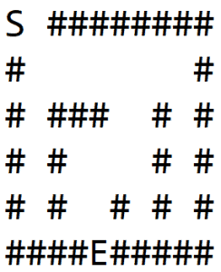
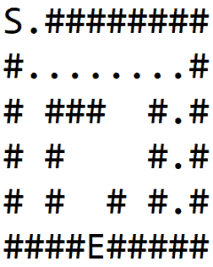
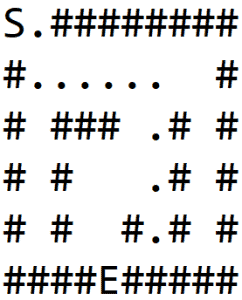
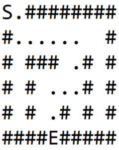
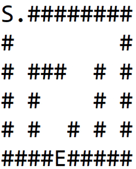

# [Java中的迷宫求解器](https://www.baeldung.com/java-solve-maze)

1. 介绍

    在本文中，我们将探索使用Java导航迷宫的可能方法。

    将迷宫视为黑白图像，黑色像素代表墙壁，白色像素代表路径。两个白色像素很特别，一个是迷宫的入口，另一个是出口。

    给定这样的迷宫，我们想找到一条从入口到出口的路径。

2. 迷宫建模

    我们将认为迷宫是一个二元整数数组。数组中数值的含义将根据以下惯例：

    - 0 -> 道路
    - 1 -> 墙
    - 2 -> 迷宫入口
    - 3 -> 迷宫出口
    - 4 -> 从进入到退出的路径的单元格部分

    我们将把迷宫建模成图形。进入和退出是两个特殊节点，在它们之间确定路径。

    典型的图形有两个属性，节点和边缘。边缘决定了图的连接性，并将一个节点链接到另一个节点。

    因此，我们将假设每个节点有四个隐式边缘，将给定的节点链接到其左、右、上和下节点。

    让我们定义方法签名：

    `public List<Coordinate> solve(Maze maze) {}`

    该方法的输入是一个迷宫，其中包含2D数组，具有上述定义的命名惯例。

    该方法的响应是节点列表，它形成从入口节点到出口节点的路径。

3. 递归回溯器（DFS）

    1. 算法

        一个相当明显的方法是探索所有可能的路径，如果存在，最终会找到一条路径。但这种方法将具有指数级的复杂性，并且不会很好地扩展。

        然而，通过回溯和标记访问的节点，可以自定义上述暴力解决方案，在合理的时间内获得路径。这种算法也被称为[深度优先搜索](https://www.baeldung.com/cs/graph-algorithms-bfs-dijkstra)。

        该算法可以概述为：

        - 如果我们在墙上或已经访问过的节点上，返回失败
        - 否则，如果我们是退出节点，那么返回成功
        - 否则，在路径列表中添加节点，并递归所有四个方向。如果返回失败，请从路径中删除节点并返回失败。找到出口时，路径列表将包含一个唯一的路径

        让我们将此算法应用于Figure-1(a)所示的迷宫，其中S是起点，E是出口。

        对于每个节点，我们按顺序遍历每个方向：右、下、左、上。

        在1(b)中，我们探索了一条道路并撞上了墙。然后我们回溯，直到找到一个具有非墙邻居的节点，并探索另一个路径，如1(c)所示。

        我们再次撞墙，重复这个过程，最终找到出口，如1（d）所示：

           

    2. 实施

        现在让我们看看Java的实现：

        首先，我们需要定义四个方向。我们可以用坐标来定义这个。当这些坐标添加到任何给定坐标时，将返回相邻坐标之一：

        `private static int[][] DIRECTIONS = { { 0, 1 }, { 1, 0 }, { 0, -1 }, { -1, 0 } };`

        我们还需要一个将两个坐标的实用方法：

        ```java
        private Coordinate getNextCoordinate(
        int row, int col, int i, int j) {
            return new Coordinate(row + i, col + j);
        }
        ```

        我们现在可以定义签名解法。这里的逻辑很简单——如果有从进入到退出的路径，则返回路径，否则，返回一个空列表：

        ```java
        public List<Coordinate> solve(Maze maze) {
            List<Coordinate> path = new ArrayList<>();
            if (
            explore(
                maze, 
                maze.getEntry().getX(),
                maze.getEntry().getY(),
                path
            )
            ) {
                return path;
            }
            return Collections.emptyList();
        }
        ```

        让我们定义上面引用的探索方法。如果有路径，则返回true，并在参数路径中包含坐标列表。这种方法有三个主要块。

        首先，我们丢弃了无效的节点，即迷宫外或墙壁的一部分节点。之后，我们将当前节点标记为已访问，这样我们就不会一次又一次地访问同一节点。

        最后，如果找不到出口，我们会递归地向各个方向移动：

        ```java
        private boolean explore(
        Maze maze, int row, int col, List<Coordinate> path) {
            if (
            !maze.isValidLocation(row, col)
            || maze.isWall(row, col)
            || maze.isExplored(row, col)
            ) {
                return false;
            }

            path.add(new Coordinate(row, col));
            maze.setVisited(row, col, true);

            if (maze.isExit(row, col)) {
                return true;
            }

            for (int[] direction : DIRECTIONS) {
                Coordinate coordinate = getNextCoordinate(
                row, col, direction[0], direction[1]);
                if (
                explore(
                    maze, 
                    coordinate.getX(), 
                    coordinate.getY(), 
                    path
                )
                ) {
                    return true;
                }
            }

            path.remove(path.size() - 1);
            return false;
        }
        ```

        此解决方案使用堆栈大小，最高可与迷宫大小相等。

4. 变体-最短路径（BFS）

    1. 算法

        上面描述的递归算法找到了路径，但它不一定是最短的路径。为了找到最短的路径，我们可以使用另一种被称为宽度优先搜索的[图遍历方法](https://en.wikipedia.org/wiki/Breadth-first_search)。

        在DFS中，先探索一个孩子及其所有孙子孙女，然后再转到另一个孩子。而在BFS中，在转到孙子孙女之前，我们将探索所有直系亲属。这将确保同时探索与父节点特定距离的所有节点。

        算法可以概述如下：

        1. 在队列中添加起始节点
        2. 当队列不是空的时，弹出一个节点，做以下操作：
           1. 如果我们到达墙壁或节点已被访问，请跳到下一个迭代
           2. 如果到达退出节点，请从当前节点回溯到起始节点，以找到最短路径
           3. 否则，在队列中四个方向添加所有直接邻居

        这里的一件重要事情是，节点必须跟踪其父节点，即它们被添加到队列的位置。一旦遇到退出节点，找到路径很重要。

        以下动画显示了使用此算法探索迷宫时的所有步骤。我们可以观察到，在进入下一个级别之前，先探索相同距离的所有节点：

        

    2. 实施

        现在让我们在Java中实现这个算法。我们将重复使用上一节中定义的DIRECTIONS变量。

        让我们首先定义一个实用方法，从给定的节点回溯到其根节点。一旦找到出口，这将用于跟踪路径：

        ```java
        private List<Coordinate> backtrackPath(
        Coordinate cur) {
            List<Coordinate> path = new ArrayList<>();
            Coordinate iter = cur;

            while (iter != null) {
                path.add(iter);
                iter = iter.parent;
            }

            return path;
        }
        ```

        现在让我们来定义核心方法的求解。我们将重复使用DFS实现中使用的三个块，即验证节点、标记访问的节点和遍历相邻节点。

        我们只会做一个小小的修改。我们将使用FIFO数据结构来跟踪邻居并迭代它们，而不是递归遍历：

        ```java
        public List<Coordinate> solve(Maze maze) {
            LinkedList<Coordinate> nextToVisit
            = new LinkedList<>();
            Coordinate start = maze.getEntry();
            nextToVisit.add(start);

            while (!nextToVisit.isEmpty()) {
                Coordinate cur = nextToVisit.remove();

                if (!maze.isValidLocation(cur.getX(), cur.getY()) 
                || maze.isExplored(cur.getX(), cur.getY())
                ) {
                    continue;
                }

                if (maze.isWall(cur.getX(), cur.getY())) {
                    maze.setVisited(cur.getX(), cur.getY(), true);
                    continue;
                }

                if (maze.isExit(cur.getX(), cur.getY())) {
                    return backtrackPath(cur);
                }

                for (int[] direction : DIRECTIONS) {
                    Coordinate coordinate 
                    = new Coordinate(
                        cur.getX() + direction[0], 
                        cur.getY() + direction[1], 
                        cur
                    );
                    nextToVisit.add(coordinate);
                    maze.setVisited(cur.getX(), cur.getY(), true);
                }
            }
            return Collections.emptyList();
        }
        ```

5. 结论

    在本教程中，我们描述了两种主要的图形算法，深度优先搜索和宽度优先搜索，以解决迷宫。我们还谈到了BFS如何提供从入口到出口的最短路径。

    如需进一步阅读，请查找其他解决迷宫的方法，如A*和Dijkstra算法。
