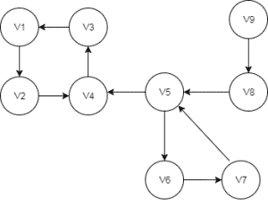
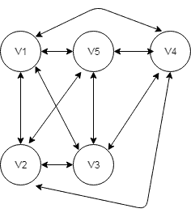
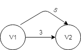
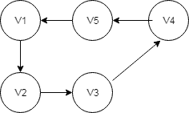

# [JGraphT简介](https://www.baeldung.com/jgrapht)

1. 一览表

    大多数时候，当我们实现基于图形的算法时，我们还需要实现一些实用函数。

    JGraphT是一个开源的Java类库，它不仅为我们提供了各种类型的图形，还为我们提供了许多有用的算法，用于解决最常遇到的图形问题。

    在本文中，我们将了解如何创建不同类型的图表，以及使用提供的实用程序有多方便。

2. Maven依赖性

    让我们从为我们的Maven项目添加依赖项开始：

    ```xml
    <dependency>
        <groupId>org.jgrapht</groupId>
        <artifactId>jgrapht-core</artifactId>
        <version>1.0.1</version>
    </dependency>
    ```

3. 创建图表

    JGraphT支持各种类型的图形。

    1. 简单的图表

        首先，让我们创建一个具有字符串类型的顶点的简单图形：

        ```java
        Graph<String, DefaultEdge> g
            = new SimpleGraph<>(DefaultEdge.class);
            g.addVertex(“v1”);
            g.addVertex(“v2”);
            g.addEdge(v1, v2);
        ```

    2. 定向/无定向图形

        它还允许我们创建有向/无向图。

        在我们的示例中，我们将创建一个有向图，并用它来演示其他实用函数和算法：

        

        ```java
        DirectedGraph<String, DefaultEdge> directedGraph 
            = new DefaultDirectedGraph<>(DefaultEdge.class);
            directedGraph.addVertex("v1");
            directedGraph.addVertex("v2");
            directedGraph.addVertex("v3");
            directedGraph.addEdge("v1", "v2");
            // Add remaining vertices and edges
        ```

    3. 完整的图表

        同样，我们也可以生成一个完整的图表：

        

        ```java
        public void createCompleteGraph() {
            completeGraph = new SimpleWeightedGraph<>(DefaultEdge.class);
            CompleteGraphGenerator<String, DefaultEdge> completeGenerator 
            = new CompleteGraphGenerator<>(size);
            VertexFactory<String> vFactory = new VertexFactory<String>() {
                private int id = 0;
                public String createVertex() {
                    return "v" + id++;
                }
            };
            completeGenerator.generateGraph(completeGraph, vFactory, null);
        }
        ```

    4. 多图

        

        除了简单图外，API还为我们提供了多图（两个顶点之间具有多个路径的图）。

        此外，我们可以在任何图形中拥有加权/非加权或用户定义的边缘。

        让我们创建一个带有加权边的多图：

        ```java
        public void createMultiGraphWithWeightedEdges() {
            multiGraph = new Multigraph<>(DefaultWeightedEdge.class);
            multiGraph.addVertex("v1");
            multiGraph.addVertex("v2");
            DefaultWeightedEdge edge1 = multiGraph.addEdge("v1", "v2");
            multiGraph.setEdgeWeight(edge1, 5);

            DefaultWeightedEdge edge2 = multiGraph.addEdge("v1", "v2");
            multiGraph.setEdgeWeight(edge2, 3);
        }
        ```

        除此之外，我们可以拥有不可修改的（只读）和可监听的（允许外部监听器跟踪修改）图表以及子图表。此外，我们总是可以创建这些图表的所有组合。

        更多API详细信息可以在[这里](http://jgrapht.org/javadoc/)找到。

4. API算法

    现在，我们有了完整的阵图对象，让我们来看看一些常见问题及其解决方案。

    1. 图形迭代

        我们可以根据要求使用各种迭代器，如BreadthFirstIterator、DepthFirstIterator、ClosestFirstIterator、RandomWalkIterator来遍历图表。
        我们只需要通过传递图形对象来创建相应迭代器的实例：

        ```java
        DepthFirstIterator depthFirstIterator
        = new DepthFirstIterator<>(directedGraph);
        BreadthFirstIterator breadthFirstIterator
        = new BreadthFirstIterator<>(directedGraph);
        ```

        一旦我们获得迭代器对象，我们就可以使用hasNext（）和next（）方法执行迭代。

    2. 找到最短的路径

        在org.jgrapht.alg.shortestpath软件包中提供了各种算法的实现，如Dijkstra、Bellman-Ford、Astar和FloydWarshall。

        让我们使用Dijkstra的算法找到最短路径：

        ```java
        @Test
        void whenGetDijkstraShortestPath_thenGetNotNullPath() {
            DijkstraShortestPath dijkstraShortestPath
            = new DijkstraShortestPath(directedGraph);
            List<String> shortestPath = dijkstraShortestPath
            .getPath("v1","v4").getVertexList();

            assertNotNull(shortestPath);
        }
        ```

        同样，使用贝尔曼-福特算法获得最短路径：

        ```java
        @Test
        void whenGetBellmanFordShortestPath_thenGetNotNullPath() {
            BellmanFordShortestPath bellmanFordShortestPath
            = new BellmanFordShortestPath(directedGraph);
            List<String> shortestPath = bellmanFordShortestPath
            .getPath("v1", "v4")
            .getVertexList();

            assertNotNull(shortestPath);
        }
        ```

    3. 寻找紧密相连的子图

        在我们开始实施之前，让我们简单看一下强连接子图的含义。只有当子图的每对顶点之间都有路径时，子图才被称为强连。

        在我们的示例中，{v1,v2,v3,v4}可以被视为一个强连的子图，如果我们可以跨越到任何顶点，无论当前顶点是什么。

        我们可以为上图所示的有向图列出四个这样的子图：
        {v9},{v8},{v5,v6,v7},{v1,v2,v3,v4}

        实现列出所有强连的子图：

        ```java
        @Test
        void whenGetStronglyConnectedSubgraphs_thenPathExists() {

            StrongConnectivityAlgorithm<String, DefaultEdge> scAlg 
            = new KosarajuStrongConnectivityInspector<>(directedGraph);
            List<DirectedSubgraph<String, DefaultEdge>> stronglyConnectedSubgraphs 
            = scAlg.stronglyConnectedSubgraphs();
            List<String> stronglyConnectedVertices 
            = new ArrayList<>(stronglyConnectedSubgraphs.get(3)
            .vertexSet());

            String randomVertex1 = stronglyConnectedVertices.get(0);
            String randomVertex2 = stronglyConnectedVertices.get(3);
            AllDirectedPaths<String, DefaultEdge> allDirectedPaths 
            = new AllDirectedPaths<>(directedGraph);

            List<GraphPath<String, DefaultEdge>> possiblePathList 
            = allDirectedPaths.getAllPaths(
                randomVertex1, randomVertex2, false,
                stronglyConnectedVertices.size());
        
            assertTrue(possiblePathList.size() > 0);
        }
        ```

    4. Eulerian回路

        图 G 中的欧拉环路是包括 G 的所有顶点和边的环路。

        让我们来看看这个图：

        

        ```java
        public void createGraphWithEulerianCircuit() {
            SimpleWeightedGraph<String, DefaultEdge> simpleGraph
            = new SimpleWeightedGraph<>(DefaultEdge.class);
            IntStream.range(1,5)
            .forEach(i-> simpleGraph.addVertex("v" + i));
            IntStream.range(1,5)
            .forEach(i-> {
                int endVertexNo = (i + 1) > 5 ? 1 : i + 1;
                simpleGraph.addEdge("v" + i,"v" + endVertexNo);
            });
        }
        ```

        现在，我们可以使用API测试图是否包含尤利电路：

        ```java
        @Test
        void givenGraph_whenCheckEluerianCycle_thenGetResult() {
            HierholzerEulerianCycle eulerianCycle
            = new HierholzerEulerianCycle<>();

            assertTrue(eulerianCycle.isEulerian(simpleGraph));
        }
        @Test
        void whenGetEulerianCycle_thenGetGraphPath() {
            HierholzerEulerianCycle eulerianCycle
            = new HierholzerEulerianCycle<>();
            GraphPath path = eulerianCycle.getEulerianCycle(simpleGraph);

            assertTrue(path.getEdgeList()
            .containsAll(simpleGraph.edgeSet()));
        }
        ```

    5. Hamiltonian电路

        正好访问每个顶点一次的GraphPath被称为Hamitonian Path。

        哈密顿循环（或哈密顿回路）是一个哈密顿路径，从最后一个顶点到路径的第一个顶点（在图中）有一个边缘。

        我们可以使用HamiltonianCycle.getApproximateOptimalForCompleteGraph（）方法为完整图找到最佳的Hamiltonian周期。

        这种方法将返回一个大致的最小旅行推销员之旅（汉密尔顿周期）。最佳解是NP完全解，所以这是一个以多项式时间运行的体面近似值：

        ```java
        void whenGetHamiltonianCyclePath_thenGetVerticeSequence() {
            List<String> verticeList = HamiltonianCycle
            .getApproximateOptimalForCompleteGraph(completeGraph);

            assertEquals(verticeList.size(), completeGraph.vertexSet().size());
        }
        ```

    6. 循环探测器

        我们还可以检查图表中是否有任何周期。目前，CycleDetector仅支持有向图：

        ```java
        @Test
        void whenCheckCycles_thenDetectCycles() {
            CycleDetector<String, DefaultEdge> cycleDetector
            = new CycleDetector<String, DefaultEdge>(directedGraph);

            assertTrue(cycleDetector.detectCycles());
            Set<String> cycleVertices = cycleDetector.findCycles();
        
            assertTrue(cycleVertices.size() > 0);
        }
        ```

5. 图形可视化

    JGraphT允许我们生成图形的可视化并将其保存为图像，首先让我们从Maven Central添加jgrapht-ext扩展依赖项：

    ```xml
    <dependency>
        <groupId>org.jgrapht</groupId>
        <artifactId>jgrapht-ext</artifactId>
        <version>1.0.1</version>
    </dependency>
    ```

    接下来，让我们创建一个包含3个顶点和3个边的简单有向图：

    ```java
    @BeforeEach
    public void createGraph() {

        File imgFile = new File("src/test/resources/graph.png");
        imgFile.createNewFile();

        DefaultDirectedGraph<String, DefaultEdge> g = 
        new DefaultDirectedGraph<String, DefaultEdge>(DefaultEdge.class);

        String x1 = "x1";
        String x2 = "x2";
        String x3 = "x3";

        g.addVertex(x1);
        g.addVertex(x2);
        g.addVertex(x3);

        g.addEdge(x1, x2);
        g.addEdge(x2, x3);
        g.addEdge(x3, x1);
    }
    ```

    我们现在可以可视化这个图表：

    ```java
    @Test
    void givenAdaptedGraph_whenWriteBufferedImage_thenFileShouldExist() throws IOException {

        JGraphXAdapter<String, DefaultEdge> graphAdapter = 
        new JGraphXAdapter<String, DefaultEdge>(g);
        mxIGraphLayout layout = new mxCircleLayout(graphAdapter);
        layout.execute(graphAdapter.getDefaultParent());
        
        BufferedImage image = 
        mxCellRenderer.createBufferedImage(graphAdapter, null, 2, Color.WHITE, true, null);
        File imgFile = new File("src/test/resources/graph.png");
        ImageIO.write(image, "PNG", imgFile);

        assertTrue(imgFile.exists());
    }
    ```

    在这里，我们创建了一个JGraphXAdapter，它接收我们的图形作为构造函数参数，并向其应用了mxCircleLayout。这以圆形的方式布局了可视化。

    此外，我们使用mxCellRenderer创建缓冲图像，然后将可视化写入png文件。

    我们可以在浏览器或我们最喜欢的渲染器中看到最终图像：

    [图表300x265](pic/graph-300x265.webp)

    我们可以在[官方文件](https://jgraph.github.io/mxgraph/docs/manual_javavis.html)中找到更多细节。

6. 结论

    JGraphT提供几乎所有类型的图形和各种图形算法。我们涵盖了如何使用一些流行的API。但是，您可以随时在官方页面上探索库。
