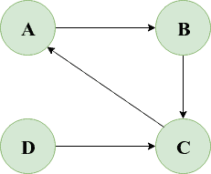

# [检查Java图是否有循环](https://www.baeldung.com/java-graph-has-a-cycle)

1. 一览表

    在这个快速教程中，我们将学习如何在给定的有向图中检测一个循环。

2. 图形表示

    对于本教程，我们将坚持使用邻接列表图表示。

    首先，让我们从在Java中定义顶点开始：

    ```java
    public class Vertex {

        private String label;
        private boolean beingVisited;
        private boolean visited;
        private List<Vertex> adjacencyList;

        public Vertex(String label) {
            this.label = label;
            this.adjacencyList = new ArrayList<>();
        }

        public void addNeighbor(Vertex adjacent) {
            this.adjacencyList.add(adjacent);
        }
        //getters and setters
    }
    ```

    在这里，顶点v的邻接列表包含与v相邻的所有顶点的列表。addNeighbor()方法将相邻的顶点添加到v的邻接列表中。

    我们还定义了两个布尔参数，beingVisited和visited，它们表示节点是当前被访问还是已经被访问。

    图形可以被认为是一组通过边缘连接的顶点或节点。

    所以，现在让我们在Java中快速表示一个图：

    ```java
    public class Graph {

        private List<Vertex> vertices;

        public Graph() {
            this.vertices = new ArrayList<>();
        }

        public void addVertex(Vertex vertex) {
            this.vertices.add(vertex);
        }

        public void addEdge(Vertex from, Vertex to) {
            from.addNeighbor(to);
        }

        // ...
    }
    ```

    我们将使用addVertex()和addEdge()方法在图中添加新的顶点和边。

3. 循环检测

    为了检测有向图中的周期，我们将使用DFS遍历的变体：

    - 选取一个未被访问的顶点 v，并将其状态标记为 “beingVisited”。
    - 检查 v 的每个相邻顶点 u：
      - 如果 u 已处于被访问状态，这显然意味着存在一条后向边，因此已检测到一个循环
      - 如果 u 还处于未访问状态，我们将以深度优先的方式递归访问 u
    - 将顶点 v 的 “beingVisited” 标记更新为 false，将其 “visited” 标记更新为 true

    请注意，我们图表的所有顶点最初都处于未访问状态，因为它们的被访问标志和访问标志都初始化为false。

    现在让我们来看看我们的Java解决方案：

    ```java
    public boolean hasCycle(Vertex sourceVertex) {
        sourceVertex.setBeingVisited(true);

        for (Vertex neighbor : sourceVertex.getAdjacencyList()) {
            if (neighbor.isBeingVisited()) {
                // backward edge exists
                return true;
            } else if (!neighbor.isVisited() && hasCycle(neighbor)) {
                return true;
            }
        }

        sourceVertex.setBeingVisited(false);
        sourceVertex.setVisited(true);
        return false;
    }
    ```

    我们可以使用图中的任何顶点作为源或起始顶点。

    对于断开连接的图形，我们必须添加一个额外的封装(wrapper)方法：

    ```java
    public boolean hasCycle() {
        for (Vertex vertex : vertices) {
            if (!vertex.isVisited() && hasCycle(vertex)) {
                return true;
            }
        }
        return false;
    }
    ```

    这是为了确保我们访问断开连接图的每个组件来检测一个循环。

4. 实施测试

    让我们考虑一下下面的循环定向图：

    

    我们可以快速编写一个JUnit来验证我们这个图的hasCycle()方法：

    ```java
    @Test
    void givenGraph_whenCycleExists_thenReturnTrue() {

        Vertex vertexA = new Vertex("A");
        Vertex vertexB = new Vertex("B");
        Vertex vertexC = new Vertex("C")
        Vertex vertexD = new Vertex("D");

        Graph graph = new Graph();
        graph.addVertex(vertexA);
        graph.addVertex(vertexB);
        graph.addVertex(vertexC);
        graph.addVertex(vertexD);

        graph.addEdge(vertexA, vertexB);
        graph.addEdge(vertexB, vertexC);
        graph.addEdge(vertexC, vertexA);
        graph.addEdge(vertexD, vertexC);

        assertTrue(graph.hasCycle());

    }
    ```

    在这里，我们的hasCycle()方法返回true，表示我们的图是循环的。

5. 结论

    在本教程中，我们学习了如何检查Java中给定的有向图中是否存在循环。
