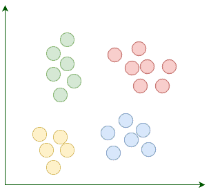
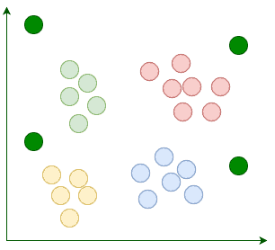
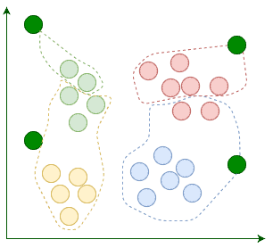
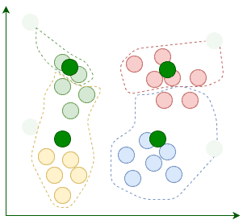
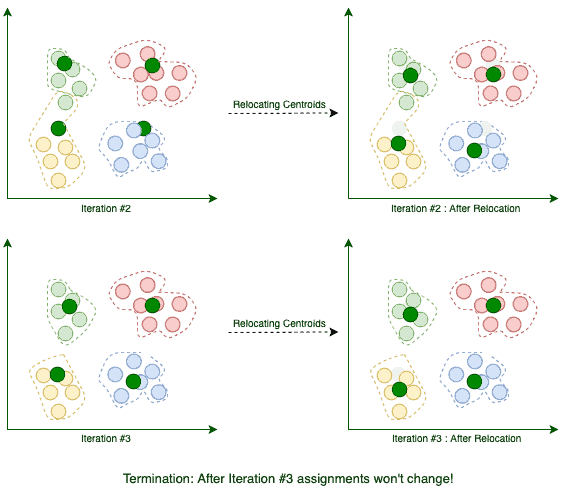
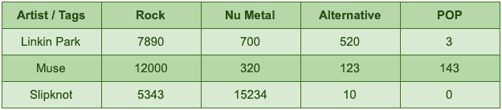
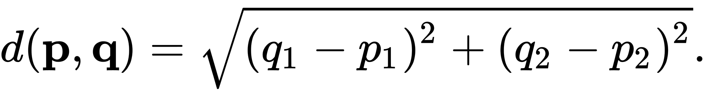
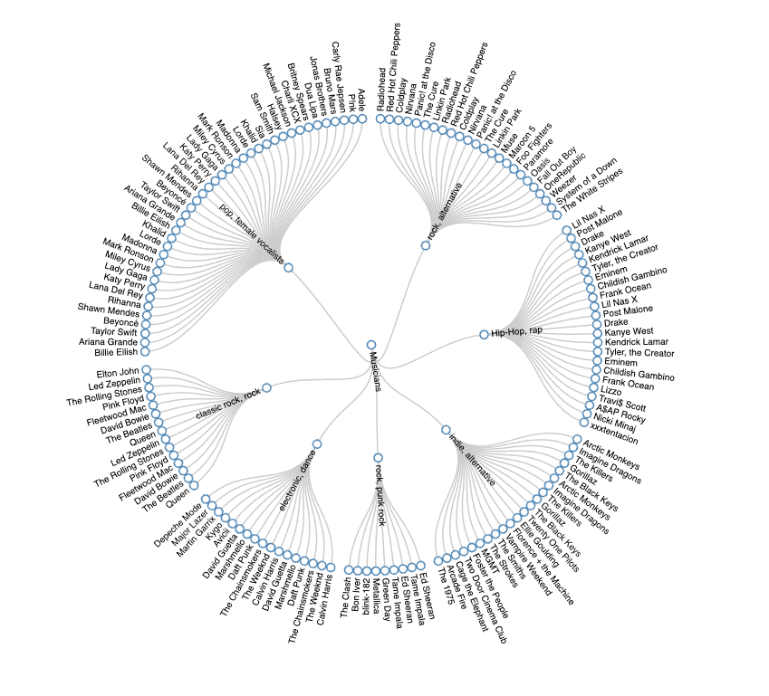
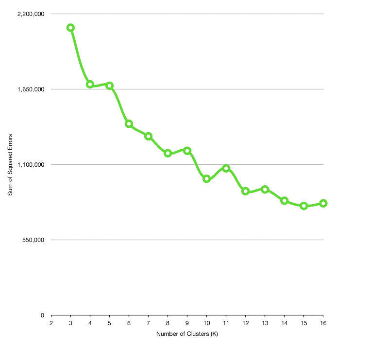

# [Java中的K-Means聚类算法](https://www.baeldung.com/java-k-means-clustering-algorithm)

人工智能

1. 一览表

    聚类是一个总称，指一类无监督的算法，用于发现彼此密切相关的事物、人或想法。

    在这个看似简单的单行定义中，我们看到了一些流行语。聚类究竟是什么？什么是无监督算法？

    在本教程中，我们将首先阐明这些概念。然后，我们将看看他们如何在Java中表现出来。

2. 无监督算法

    在我们使用大多数学习算法之前，我们应该以某种方式向它们提供一些样本数据，并允许算法从这些数据中学习。在机器学习术语中，我们称之为样本数据集-训练数据。此外，整个过程被称为训练过程。

    无论如何，我们可以根据学习算法在培训过程中需要的监督量进行分类。此类别中的两种主要学习算法类型是：

    - 监督学习：在监督算法中，训练数据应包括每个点的实际解决方案。例如，如果我们要训练我们的垃圾邮件过滤算法，我们会将示例电子邮件及其标签（即垃圾邮件或非垃圾邮件）输入到该算法。从数学上讲，我们将从包含xs和ys的训练集中推断f(x)。
    - 无监督学习：当训练数据中没有标签时，算法就是无监督的。例如，我们有很多关于音乐家的数据，我们将在数据中发现一组相似的音乐家。

3. 聚类

    聚类是一种无监督算法，用于发现相似事物、想法或人的群体。与监督算法不同，我们不是用已知标签的示例来训练聚类算法。相反，聚类试图在训练集中找到结构，而数据中的任何一点都不是标签。

    1. K-Means聚类

        K-Means是一种聚类算法，具有一个基本属性：集群的数量是事先定义的。除了K-Means之外，还有其他类型的聚类算法，如分层聚类、亲和力传播或光谱聚类。

    2. K-Means是如何工作的

        假设我们的目标是在数据集中找到一些相似的组，例如：

        

        K-Means 以随机放置的 k 个中心点开始。中心点，顾名思义，就是聚类的中心点。例如，在这里我们随机添加四个中心点：

        

        然后我们将每个现有数据点分配给其最近的重心：

        

        分配后，我们将中心点移动到分配给它的点的平均位置。请记住，中心点应该是聚类的中心点：

        

        每次我们完成中心点的重新定位后，当前迭代就结束了。我们会重复这些迭代，直到多个连续迭代之间的赋值停止变化：

        

        当算法终止时，会按预期找到这四个集群。既然我们知道了K-Means是如何工作的，让我们在Java中实现它。

    3. 特征表示

        在对不同的训练数据集进行建模时，我们需要一个数据结构来表示模型属性及其相应值。例如，音乐家可以具有像摇滚这样的类型属性。我们通常使用术语特征来指代属性及其值的组合。

        为了为特定学习算法准备数据集，我们通常使用一组通用的数值属性，可用于比较不同的项目。例如，如果我们让用户用特定流派标记每个艺术家，那么在一天结束时，我们可以计算每个艺术家用特定流派标记的次数：

        

        像林肯公园这样的艺术家的特征矢量是`[摇滚(rock)->7890，新金属(nu-metal)->700，另类(alternative)->520，流行(pop)->3]`。因此，如果我们能找到一种将属性表示为数值的方法，那么我们就可以通过比较两个不同的项目（例如艺术家）的相应向量项来进行比较。

        既然数字向量是如此通用的数据结构，我们就用它来表示特征。下面是我们如何在 Java 中实现特征向量：

        ```java
        public class Record {
            private final String description;
            private final Map<String, Double> features;
            // constructor, getter, toString, equals and hashcode
        }
        ```

    4. 寻找类似的物品

        在K-Means的每次迭代中，我们需要一种方法来找到与数据集中每个项目最近的重心。计算两个特征向量之间距离的最简单方法之一是使用[欧几里得距离](https://en.wikipedia.org/wiki/Euclidean_distance)。[p1, q1]和[p2, q2]等两个向量之间的欧几里得距离等于：

        

        让我们在Java中实现这个函数。首先，抽象：

        ```java
        public interface Distance {
            double calculate(Map<String, Double> f1, Map<String, Double> f2);
        }
        ```

        除了欧几里得距离外，还有其他方法来计算不同项目之间的距离或相似性，如皮尔逊相关系数。这种抽象使得在不同的距离指标之间切换变得容易。

        让我们看看欧几里得距离的实现：

        

        首先，我们计算相应条目之间的平方差之和。然后，通过应用sqrt函数，我们计算出实际的欧几里得距离。

    5. 重心表示

        中心类与正常特征在同一空间中，因此我们可以表示它们与特征相似：

        

        既然我们有一些必要的抽象，是时候编写我们的K-Means实现了。以下是我们的方法签名的快速查看：

        ```java
        public class KMeans {
            private static final Random random = new Random();
            public static Map<Centroid, List<Record>> fit(List<Record> records, 
            int k, 
            Distance distance, 
            int maxIterations) { 
                // omitted
            }
        }
        ```

        让我们分解一下这个方法的签名：

        - 数据集是一组特征向量。由于每个特征向量都是记录，那么数据集类型是`List<Record>`
        - k参数决定了集群的数量，我们应该提前提供
        - 距离囊括了我们将要计算两个特征之间差异的方式
        - 当任务连续几次迭代停止更改时，K-Means终止。除了这个终止条件外，我们还可以为迭代次数定上限。maxIterations参数决定了上限
        - 当K-Means终止时，每个重心应该有一些分配的特征，因此我们使用`Map<Centroid，List<Record>>`作为返回类型。基本上，每个Map条目都对应一个集群

    6. 中心生成

        第一步是随机生成k个中心点。

        虽然每个中心点可以包含完全随机的坐标，但好的做法是在每个属性可能的最小值和最大值之间生成随机坐标。在不考虑可能值范围的情况下生成随机中心点会导致算法收敛速度变慢。

        首先，我们应该计算每个属性的最小值和最大值，然后在每对值之间生成随机值：

        ```java
        private static List<Centroid> randomCentroids(List<Record> records, int k) {
            List<Centroid> centroids = new ArrayList<>();
            Map<String, Double> maxs = new HashMap<>();
            Map<String, Double> mins = new HashMap<>();

            for (Record record : records) {
                record.getFeatures().forEach((key, value) -> {
                    // compares the value with the current max and choose the bigger value between them
                    maxs.compute(key, (k1, max) -> max == null || value > max ? value : max);
                    // compare the value with the current min and choose the smaller value between them
                    mins.compute(key, (k1, min) -> min == null || value < min ? value : min);
                });
            }

            Set<String> attributes = records.stream()
            .flatMap(e -> e.getFeatures().keySet().stream())
            .collect(toSet());
            for (int i = 0; i < k; i++) {
                Map<String, Double> coordinates = new HashMap<>();
                for (String attribute : attributes) {
                    double max = maxs.get(attribute);
                    double min = mins.get(attribute);
                    coordinates.put(attribute, random.nextDouble() * (max - min) + min);
                }

                centroids.add(new Centroid(coordinates));
            }

            return centroids;
        }
        ```

        现在，我们可以将每条记录分配给其中一个随机中心点。

    7. 任务

        首先，给定一个记录，我们应该找到离它最近的中心点：

        ```java
        private static Centroid nearestCentroid(Record record, List<Centroid> centroids, Distance distance) {
            double minimumDistance = Double.MAX_VALUE;
            Centroid nearest = null;
            for (Centroid centroid : centroids) {
                double currentDistance = distance.calculate(record.getFeatures(), centroid.getCoordinates());
                if (currentDistance < minimumDistance) {
                    minimumDistance = currentDistance;
                    nearest = centroid;
                }
            }
            return nearest;
        }
        ```

        每个记录都属于其最近的重心集群：

        ```java
        private static void assignToCluster(Map<Centroid, List<Record>> clusters,  
        Record record, Centroid centroid) {
            clusters.compute(centroid, (key, list) -> {
                if (list == null) {
                    list = new ArrayList<>();
                }
                list.add(record);
                return list;
            });
        }
        ```

    8. 中心位置

        如果经过一次迭代后，某个中心点不包含任何赋值，那么我们就不会重新定位它。否则，我们应将每个属性的中心点坐标重新定位到所有分配记录的平均位置：

        ```java
        private static Centroid average(Centroid centroid, List<Record> records) {
            if (records == null || records.isEmpty()) { 
                return centroid;
            }

            Map<String, Double> average = centroid.getCoordinates();
            records.stream().flatMap(e -> e.getFeatures().keySet().stream())
            .forEach(k -> average.put(k, 0.0));
                
            for (Record record : records) {
                record.getFeatures().forEach(
                (k, v) -> average.compute(k, (k1, currentValue) -> v + currentValue)
                );
            }

            average.forEach((k, v) -> average.put(k, v / records.size()));

            return new Centroid(average);
        }
        ```

        由于我们可以重新定位单个重心，现在可以实现重新定位重心方法：

        ```java
        private static List<Centroid> relocateCentroids(Map<Centroid, List<Record>> clusters) {
            return clusters.entrySet().stream().map(e -> average(e.getKey(), e.getValue())).collect(toList());
        }
        ```

        这个简单的单行本迭代所有重心，重新定位它们，并返回新的重心。

    9. 把它全部放在一起

        在每次迭代中，将所有记录分配到最近的中心点后，我们首先要比较当前的分配和上次迭代的分配。

        如果赋值相同，则算法结束。否则，在跳转到下一次迭代之前，我们应该重新定位中心点：

        ```java
        public static Map<Centroid, List<Record>> fit(List<Record> records, 
        int k, Distance distance, int maxIterations) {

            List<Centroid> centroids = randomCentroids(records, k);
            Map<Centroid, List<Record>> clusters = new HashMap<>();
            Map<Centroid, List<Record>> lastState = new HashMap<>();

            // iterate for a pre-defined number of times
            for (int i = 0; i < maxIterations; i++) {
                boolean isLastIteration = i == maxIterations - 1;

                // in each iteration we should find the nearest centroid for each record
                for (Record record : records) {
                    Centroid centroid = nearestCentroid(record, centroids, distance);
                    assignToCluster(clusters, record, centroid);
                }

                // if the assignments do not change, then the algorithm terminates
                boolean shouldTerminate = isLastIteration || clusters.equals(lastState);
                lastState = clusters;
                if (shouldTerminate) { 
                    break; 
                }

                // at the end of each iteration we should relocate the centroids
                centroids = relocateCentroids(clusters);
                clusters = new HashMap<>();
            }

            return lastState;
        }
        ```

4. 示例：在Last.fm上发现类似艺术家

    Last.fm通过记录用户收听内容的详细信息，构建了每个用户音乐品味的详细简介。在本节中，我们将找到一组相似的艺术家。为了构建适合此任务的数据集，我们将使用来自Last.fm的三个API：

    - API在Last.fm上获取[顶级艺术家的集合](https://www.last.fm/api/show/chart.getTopArtists)。
    - 另一个API来查找[热门标签](https://www.last.fm/api/show/chart.getTopTags)。每个用户都可以用某物标记艺术家，例如摇滚。因此，Last.fm维护着这些标签及其频率的数据库。
    - 以及[获取艺术家顶级标签](https://www.last.fm/api/show/artist.getTopTags)的API，按受欢迎程度排序。由于有很多这样的标签，我们只会保留那些在全球顶级标签中的标签。

    1. Last.fm的API

        要使用这些API，我们应该从Last.fm获取一个[API密钥](https://www.last.fm/api/authentication)，并在每个HTTP请求中发送它。我们将使用以下[retrofit](https://www.baeldung.com/retrofit)来调用这些API：

        ```java
        public interface LastFmService {

            @GET("/2.0/?method=chart.gettopartists&format=json&limit=50")
            Call<Artists> topArtists(@Query("page") int page);

            @GET("/2.0/?method=artist.gettoptags&format=json&limit=20&autocorrect=1")
            Call<Tags> topTagsFor(@Query("artist") String artist);

            @GET("/2.0/?method=chart.gettoptags&format=json&limit=100")
            Call<TopTags> topTags();

            // A few DTOs and one interceptor
        }
        ```

        所以，让我们在Last.fm上找到最受欢迎的艺术家：

        ```java
        // setting up the Retrofit service

        private static List<String> getTop100Artists() throws IOException {
            List<String> artists = new ArrayList<>();
            // Fetching the first two pages, each containing 50 records.
            for (int i = 1; i <= 2; i++) {
                artists.addAll(lastFm.topArtists(i).execute().body().all());
            }

            return artists;
        }
        ```

        同样，我们可以获取顶级标签：

        ```java
        private static Set<String> getTop100Tags() throws IOException {
            return lastFm.topTags().execute().body().all();
        }
        ```

        最后，我们可以构建一个艺术家的数据集以及他们的标签频率：

        ```java
        private static List<Record> datasetWithTaggedArtists(List<String> artists, 
        Set<String> topTags) throws IOException {
            List<Record> records = new ArrayList<>();
            for (String artist : artists) {
                Map<String, Double> tags = lastFm.topTagsFor(artist).execute().body().all();
                    
                // Only keep popular tags.
                tags.entrySet().removeIf(e -> !topTags.contains(e.getKey()));

                records.add(new Record(artist, tags));
            }

            return records;
        }
        ```

    2. 组建艺术家集群

        现在，我们可以将准备好的数据集提供给我们的K-Means实现：

        ```java
        List<String> artists = getTop100Artists();
        Set<String> topTags = getTop100Tags();
        List<Record> records = datasetWithTaggedArtists(artists, topTags);

        Map<Centroid, List<Record>> clusters = KMeans.fit(records, 7, new EuclideanDistance(), 1000);
        // Printing the cluster configuration
        clusters.forEach((key, value) -> {
            System.out.println("-------------------------- CLUSTER ----------------------------");

            // Sorting the coordinates to see the most significant tags first.
            System.out.println(sortedCentroid(key)); 
            String members = String.join(", ", value.stream().map(Record::getDescription).collect(toSet()));
            System.out.print(members);

            System.out.println();
            System.out.println();
        });
        ```

        如果我们运行此代码，那么它将集群可视化为文本输出：

        ```log
        ------------------------------ CLUSTER -----------------------------------
        Centroid {classic rock=65.58333333333333, rock=64.41666666666667, british=20.333333333333332, ... }
        David Bowie, Led Zeppelin, Pink Floyd, System of a Down, Queen, blink-182, The Rolling Stones, Metallica, 
        Fleetwood Mac, The Beatles, Elton John, The Clash

        ------------------------------ CLUSTER -----------------------------------
        Centroid {Hip-Hop=97.21428571428571, rap=64.85714285714286, hip hop=29.285714285714285, ... }
        Kanye West, Post Malone, Childish Gambino, Lil Nas X, A$AP Rocky, Lizzo, xxxtentacion, 
        Travi$ Scott, Tyler, the Creator, Eminem, Frank Ocean, Kendrick Lamar, Nicki Minaj, Drake

        ------------------------------ CLUSTER -----------------------------------
        Centroid {indie rock=54.0, rock=52.0, Psychedelic Rock=51.0, psychedelic=47.0, ... }
        Tame Impala, The Black Keys

        ------------------------------ CLUSTER -----------------------------------
        Centroid {pop=81.96428571428571, female vocalists=41.285714285714285, indie=22.785714285714285, ... }
        Ed Sheeran, Taylor Swift, Rihanna, Miley Cyrus, Billie Eilish, Lorde, Ellie Goulding, Bruno Mars, 
        Katy Perry, Khalid, Ariana Grande, Bon Iver, Dua Lipa, Beyoncé, Sia, P!nk, Sam Smith, Shawn Mendes, 
        Mark Ronson, Michael Jackson, Halsey, Lana Del Rey, Carly Rae Jepsen, Britney Spears, Madonna, 
        Adele, Lady Gaga, Jonas Brothers

        ------------------------------ CLUSTER -----------------------------------
        Centroid {indie=95.23076923076923, alternative=70.61538461538461, indie rock=64.46153846153847, ... }
        Twenty One Pilots, The Smiths, Florence + the Machine, Two Door Cinema Club, The 1975, Imagine Dragons, 
        The Killers, Vampire Weekend, Foster the People, The Strokes, Cage the Elephant, Arcade Fire, 
        Arctic Monkeys

        ------------------------------ CLUSTER -----------------------------------
        Centroid {electronic=91.6923076923077, House=39.46153846153846, dance=38.0, ... }
        Charli XCX, The Weeknd, Daft Punk, Calvin Harris, MGMT, Martin Garrix, Depeche Mode, The Chainsmokers, 
        Avicii, Kygo, Marshmello, David Guetta, Major Lazer

        ------------------------------ CLUSTER -----------------------------------
        Centroid {rock=87.38888888888889, alternative=72.11111111111111, alternative rock=49.16666666, ... }
        Weezer, The White Stripes, Nirvana, Foo Fighters, Maroon 5, Oasis, Panic! at the Disco, Gorillaz, 
        Green Day, The Cure, Fall Out Boy, OneRepublic, Paramore, Coldplay, Radiohead, Linkin Park, 
        Red Hot Chili Peppers, Muse
        ```

        由于中心点坐标是按平均标签频率排序的，因此我们可以很容易地发现每个聚类中的主要流派。例如，最后一个聚类是由老牌摇滚乐队组成的聚类，而第二个聚类则充斥着说唱明星。

        虽然这种聚类很有意义，但在大多数情况下并不完美，因为数据只是从用户行为中收集的。

5. 可视化

    几分钟前，我们的算法以终端友好的方式可视化了艺术家集群。如果我们将集群配置转换为JSON并将其馈入D3.js，那么用几行JavaScript，我们将有一个对人类友好的[Radial Tidy-Tree](https://observablehq.com/@d3/radial-tidy-tree?collection=@d3/d3-hierarchy)：

    

    我们必须将`Map<Centroid，List<Record>>`转换为具有类似模式的JSON，如这个[d3.js示例](https://raw.githubusercontent.com/d3/d3-hierarchy/v1.1.8/test/data/flare.json)。

6. 集群数量

    K-Means的基本属性之一是，我们应该提前定义集群的数量。到目前为止，我们为k使用了静态值，但确定此值可能是一个具有挑战性的问题。有两种常见的方法来计算集群的数量：

    - 领域知识
    - 数学启发式

    如果我们足够幸运，对该领域的情况了如指掌，那么我们或许可以简单地猜出正确的数字。否则，我们可以采用一些启发式方法，如肘部法或剪影法，来了解聚类的数量。

    在继续深入之前，我们应该知道，这些启发式方法虽然有用，但只是启发式方法，可能无法提供明确的答案。

    1. Elbow方法

        要使用肘法，我们首先要计算每个聚类中心点与其所有成员之间的差值。当我们将更多不相关的成员归入一个聚类时，中心点与其成员之间的距离就会增加，因此聚类质量就会下降。

        进行距离计算的一种方法是使用平方误差之和。平方误差之和或 SSE 等于中心点与其所有成员之间的平方差之和：

        ```java
        public static double sse(Map<Centroid, List<Record>> clustered, Distance distance) {
            double sum = 0;
            for (Map.Entry<Centroid, List<Record>> entry : clustered.entrySet()) {
                Centroid centroid = entry.getKey();
                for (Record record : entry.getValue()) {
                    double d = distance.calculate(centroid.getCoordinates(), record.getFeatures());
                    sum += Math.pow(d, 2);
                }
            }
            return sum;
        }
        ```

        然后，我们可以为k的不同值运行K-Means算法，并计算每个值的SSE：

        ```java
        List<Record> records = // the dataset;
        Distance distance = new EuclideanDistance();
        List<Double> sumOfSquaredErrors = new ArrayList<>();
        for (int k = 2; k <= 16; k++) {
            Map<Centroid, List<Record>> clusters = KMeans.fit(records, k, distance, 1000);
            double sse = Errors.sse(clusters, distance);
            sumOfSquaredErrors.add(sse);
        }
        ```

        归根结底，通过根据SSE绘制集群数量，可以找到一个合适的k：

        

        通常，随着集群数量的增加，集群成员之间的距离会减少。然而，我们不能为k选择任何任意的大值，因为拥有多个只有一个成员的集群违背了聚类的整个目的。

        肘部方法背后的想法是找到k的适当值，使SSE在该值周围急剧下降。例如，k=9在这里可能是一个很好的候选人。

7. 结论

    在本教程中，首先，我们涵盖了机器学习中的一些重要概念。然后，我们了解了K-Means聚类算法的机制。最后，我们为K-Means编写了一个简单的实现，使用来自Last.fm的现实世界数据集测试了我们的算法，并以漂亮的图形方式可视化了聚类结果。
