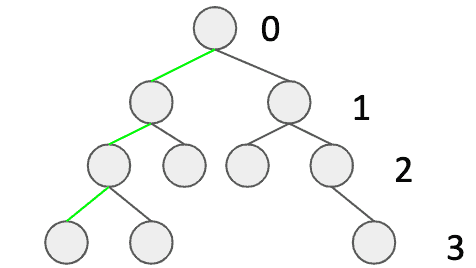

# [如何在Java中确定二叉树是否平衡](https://www.baeldung.com/java-balanced-binary-tree)

1. 一览表

    树是计算机科学中最重要的数据结构之一。我们通常对平衡的树木感兴趣，因为它具有宝贵的特性。它们的结构允许在对数时间内执行查询、插入、删除等操作。

    在本教程中，我们将学习如何确定二叉树是否平衡。

2. 定义

    首先，让我们介绍一些定义，以确保我们意见一致：

    - ——一种树，每个节点都有零、一个或两个子节点
    - 树的高度——从树根到叶子的最大距离（与最深叶的深度相同）
    - 平衡树——一种树，对于每棵子树来说，从根到任何叶子的最大距离最多比从根到任何叶子的最小距离大一

    我们可以在下面找到一个平衡二叉树的例子。三个绿色边缘是如何确定高度的简单可视化，而数字则表示水平。

    

3. 域对象

    所以，让我们从我们的树的班级开始：

    ```java
    public class Tree {
        private int value;
        private Tree left;
        private Tree right;

        public Tree(int value, Tree left, Tree right) {
            this.value = value;
            this.left = left;
            this.right = right;
        }
    }
    ```

    为了简单起见，假设每个节点都有一个整数值。请注意，如果左右树为空，则表示我们的节点是叶子。

    在我们介绍我们的主要方法之前，让我们看看它应该返回什么：

    ```java
    private class Result {
        private boolean isBalanced;
        private int height;

        private Result(boolean isBalanced, int height) {
            this.isBalanced = isBalanced;
            this.height = height;
        }
    }
    ```

    因此，对于每一个电话，我们都会有关于高度和平衡的信息。

4. 算法

    有了平衡树的定义，我们可以想出一个算法。我们需要做的是检查每个节点所需的属性。它可以通过递归深度优先搜索遍历轻松实现。

    现在，我们的递归方法将对每个节点调用。此外，它将跟踪当前的深度。每次呼叫都会返回有关高度和平衡的信息。

    现在，让我们来看看我们的深度优先方法：

    ```java
    private Result isBalancedRecursive(Tree tree, int depth) {
        if (tree == null) {
            return new Result(true, -1);
        }

        Result leftSubtreeResult = isBalancedRecursive(tree.left(), depth + 1);
        Result rightSubtreeResult = isBalancedRecursive(tree.right(), depth + 1);

        boolean isBalanced = Math.abs(leftSubtreeResult.height - rightSubtreeResult.height) <= 1;
        boolean subtreesAreBalanced = leftSubtreeResult.isBalanced && rightSubtreeResult.isBalanced;
        int height = Math.max(leftSubtreeResult.height, rightSubtreeResult.height) + 1;

        return new Result(isBalanced && subtreesAreBalanced, height);
    }
    ```

    首先，我们需要考虑如果我们的节点为空的情况：我们将返回true（这意味着树是平衡的）和-1作为高度。

    然后，我们对左侧子树和右侧子树进行两次递归调用，不断更新深度。

    至此，我们已经对当前节点的子节点进行了计算。现在，我们已经掌握了检查平衡所需的所有数据：

    - isBalanced变量检查子树的高度，并且
    - substreesAreBalanced表示子树是否都平衡

    最后，我们可以返回有关平衡和高度的信息。使用立面方法简化第一个递归调用可能也是一个好主意：

    ```java
    public boolean isBalanced(Tree tree) {
        return isBalancedRecursive(tree, -1).isBalanced;
    }
    ```

5. 摘要

    在本文中，我们讨论了如何确定二叉树是否平衡。我们已经解释了一种深度优先的搜索方法。
