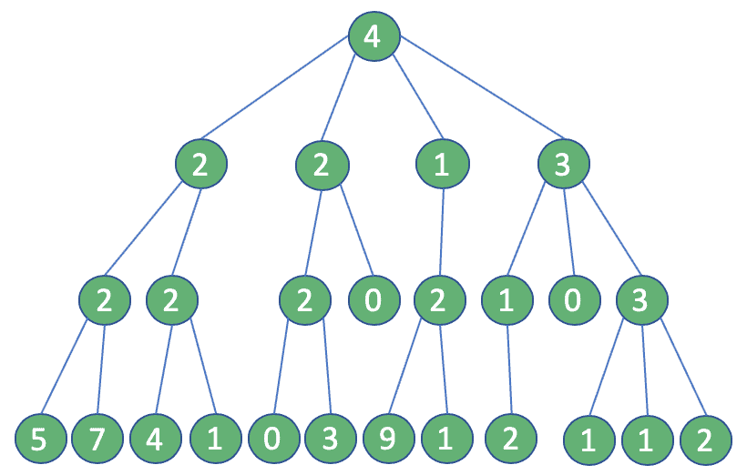
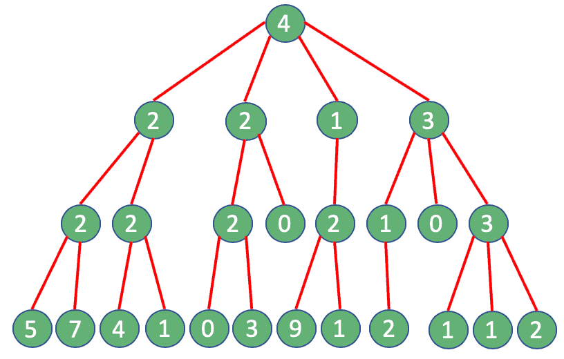
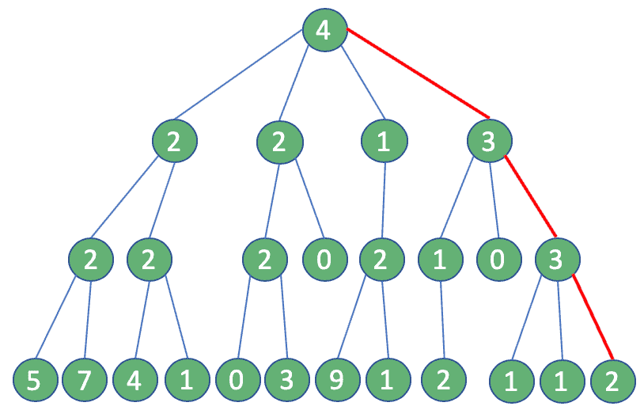

# [贪心算法入门与Java实现](https://www.baeldung.com/java-greedy-algorithms)

1. 引言

    在本教程中，我们将介绍Java生态系统中的[贪心算法](https://www.baeldung.com/cs/greedy-approach-vs-dynamic-programming)。

2. 贪心问题

    面对数学问题时，可能有多种设计解决方案的方法。我们可以实现一个迭代解决方案，或者一些高级技术，例如分治法（例如[快速排序算法](https://www.baeldung.com/java-quicksort)）或动态规划方法（例如[背包问题](https://www.baeldung.com/java-knapsack)）等等。

    大多数时候，我们都在寻找一个最优解，但遗憾的是，我们并不总是能得到这样的结果。然而，在某些情况下，即使是一个次优的结果也是有价值的。借助一些特定的策略或启发式方法，我们可能会获得这样的宝贵回报。

    在这种情况下，给定一个可分割的问题，一种在每个阶段都采取局部最优选择或“贪心选择”的策略被称为贪心算法。

    我们提到我们应该解决一个“可分割”的问题：一种可以描述为具有几乎相同特征的子问题集合的情况。因此，大多数时候，贪心算法将作为递归算法实现。

    贪心算法可以是一种引导我们在恶劣环境中找到合理解决方案的方法；缺乏计算资源、执行时间限制、API限制或任何其他类型的限制。

    1. 场景

        在这个简短的教程中，我们将实现一种贪心策略，使用其API从社交网络中提取数据。

        假设我们希望在“小蓝鸟”社交平台上吸引更多用户。实现我们目标的最佳方式是发布原创内容或转发一些能引起广泛受众兴趣的内容。

        我们如何找到这样的受众？嗯，我们必须找到一个拥有大量粉丝的账户，并为他们发布一些内容。

    2. 经典方法与贪心方法

        我们考虑以下情况：我们的账户有四个粉丝，每个粉丝分别有2、2、1和3个粉丝，如下图所示：

        

        带着这个目的，我们将从我们的账户的粉丝中选择拥有最多粉丝的那个。然后我们将重复这个过程两次，直到我们达到第三级连接（总共四步）。

        通过这种方式，我们定义了一条由用户组成的路径，将我们从我们的账户引导到最广泛的粉丝群。如果我们能向他们发布一些内容，他们肯定会访问我们的页面。

        我们可以从“传统”方法开始。在每一步，我们都会执行一个查询来获取一个账户的粉丝。作为我们选择过程的结果，账户的数量每一步都会增加。

        令人惊讶的是，总共我们将执行25次查询：

        

        这里出现了一个问题：例如，Twitter API将此类查询限制为每15分钟15次。如果我们尝试执行超过允许次数的调用，我们将收到“Rate limit exceeded code – 88”或“Returned in API v1.1 when a request cannot be served due to the application’s rate limit having been exhausted for the resource”。我们如何克服这样的限制？

        嗯，答案就在我们面前：贪心算法。如果我们使用这种方法，在每一步，我们可以假设拥有最多粉丝的用户是唯一需要考虑的：最终，我们只需要四次查询。这是一个相当大的改进！

        

        这两种方法的结果将不同。在第一种情况下，我们得到16，这是最优解，而在后者中，可达到的最大粉丝数仅为12。

        这种差异会如此有价值吗？我们稍后再决定。

3. 实现

    为了实现上述逻辑，我们初始化一个小的Java程序，在其中我们将模拟Twitter API。我们还将使用Lombok库。

    现在，让我们定义我们的组件SocialConnector，在其中我们将实现我们的逻辑。请注意，我们将放置一个计数器来模拟调用限制，但我们会将其降低到四次：

    ```java
    public class SocialConnector {
        private boolean isCounterEnabled = true;
        private int counter = 4;
        @Getter @Setter
        List users;

        public SocialConnector() {
            users = new ArrayList<>();
        }

        public boolean switchCounter() {
            this.isCounterEnabled = !this.isCounterEnabled;
            return this.isCounterEnabled;
        }
    }
    ```

    然后我们将添加一个方法来检索特定账户的粉丝列表：

    ```java
    public List getFollowers(String account) {
        if (counter < 0) {
            throw new IllegalStateException ("API limit reached");
        } else {
            if (this.isCounterEnabled) {
                counter--;
            }
            for (SocialUser user : users) {
                if (user.getUsername().equals(account)) {
                    return user.getFollowers();
                }
            }
        }
        return new ArrayList<>();
    }
    ```

    为了支持我们的过程，我们需要一些类来建模我们的用户实体：

    ```java
    public class SocialUser {
        @Getter
        private String username;
        @Getter
        private List<SocialUser> followers;

        @Override
        public boolean equals(Object obj) {
            return ((SocialUser) obj).getUsername().equals(username);
        }

        public SocialUser(String username) {
            this.username = username;
            this.followers = new ArrayList<>();
        }

        public SocialUser(String username, List<SocialUser> followers) {
            this.username = username;
            this.followers = followers;
        }

        public void addFollowers(List<SocialUser> followers) {
            this.followers.addAll(followers);
        }
    }
    ```

    1. 贪心算法

        最后，是时候实现我们的贪心策略了，所以让我们添加一个新组件——GreedyAlgorithm——在其中我们将执行递归：

        ```java
        public class GreedyAlgorithm {
            int currentLevel = 0;
            final int maxLevel = 3;
            SocialConnector sc;
            public GreedyAlgorithm(SocialConnector sc) {
                this.sc = sc;
            }
        }
        ```

        然后我们需要插入一个方法findMostFollowersPath，在其中我们将找到拥有最多粉丝的用户，计算他们的数量，然后进行下一步：

        ```java
        public long findMostFollowersPath(String account) {
            long max = 0;
            SocialUser toFollow = null;

            List followers = sc.getFollowers(account);
            for (SocialUser el : followers) {
                long followersCount = el.getFollowersCount();
                if (followersCount > max) {
                    toFollow = el;
                    max = followersCount;
                }
            }
            if (currentLevel < maxLevel - 1) {
                currentLevel++;
                max += findMostFollowersPath(toFollow.getUsername());
            } 
            return max;
        }
        ```

        记住：这是我们执行贪心选择的地方。因此，每次我们调用此方法时，我们将从列表中选择一个且仅一个元素并继续前进：我们永远不会回头！

        完美！我们准备好了，可以测试我们的应用程序了。在此之前，我们需要记住填充我们的小网络，最后执行以下单元测试：

        ```java
        public void greedyAlgorithmTest() {
            GreedyAlgorithm ga = new GreedyAlgorithm(prepareNetwork());
            assertEquals(ga.findMostFollowersPath("root"), 5);
        }
        ```

    2. 非贪心算法

        让我们创建一个非贪心方法，仅仅是为了亲眼看看会发生什么。因此，我们需要从构建一个NonGreedyAlgorithm类开始：

        ```java
        public class NonGreedyAlgorithm {
            int currentLevel = 0;
            final int maxLevel = 3; 
            SocialConnector tc;

            public NonGreedyAlgorithm(SocialConnector tc, int level) {
                this.tc = tc;
                this.currentLevel = level;
            }
        }
        ```

        让我们创建一个等效的方法来检索粉丝：

        ```java
        public long findMostFollowersPath(String account) {
            List<SocialUser> followers = tc.getFollowers(account);
            long total = currentLevel > 0 ? followers.size() : 0;

            if (currentLevel < maxLevel ) {
                currentLevel++;
                long[] count = new long[followers.size()];
                int i = 0;
                for (SocialUser el : followers) {
                    NonGreedyAlgorithm sub = new NonGreedyAlgorithm(tc, currentLevel);
                    count[i] = sub.findMostFollowersPath(el.getUsername());
                    i++;
                }

                long max = 0;
                for (; i > 0; i--) {
                    if (count[i-1] > max) {
                        max = count[i-1];
                    }
                }  
                return total + max;
            } 
            return total;
        }
        ```

        当我们的类准备好后，我们可以准备一些单元测试：一个用于验证调用限制是否超出，另一个用于检查使用非贪心策略返回的值：

        ```java
        public void nongreedyAlgorithmTest() {
            NonGreedyAlgorithm nga = new NonGreedyAlgorithm(prepareNetwork(), 0);
            Assertions.assertThrows(IllegalStateException.class, () -> {
                nga.findMostFollowersPath("root");
            });
        }

        public void nongreedyAlgorithmUnboundedTest() {
            SocialConnector sc = prepareNetwork();
            sc.switchCounter();
            NonGreedyAlgorithm nga = new NonGreedyAlgorithm(sc, 0);
            assertEquals(nga.findMostFollowersPath("root"), 6);
        }
        ```

4. 结果

    是时候回顾我们的工作了！

    首先，我们尝试了我们的贪心策略，检查其有效性。然后我们验证了使用穷举搜索的情况，包括有和没有API限制的情况。

    我们的快速贪心过程，每次做出局部最优选择，返回一个数值。另一方面，由于环境限制，我们从非贪心算法中得不到任何东西。

    比较两种方法的输出，我们可以理解我们的贪心策略如何拯救了我们，即使检索到的值不是最优的。我们可以称之为局部最优。

5. 结论

    在像社交媒体这样多变且快速变化的环境中，需要找到最优解的问题可能成为一个可怕的幻想：难以实现，同时又不切实际。

    克服限制和优化API调用是一个相当重要的主题，但正如我们所讨论的，贪心策略是有效的。选择这种方法可以为我们节省很多痛苦，以换取有价值的结果。

    请记住，并非每种情况都适合：我们需要每次都评估我们的情况。
