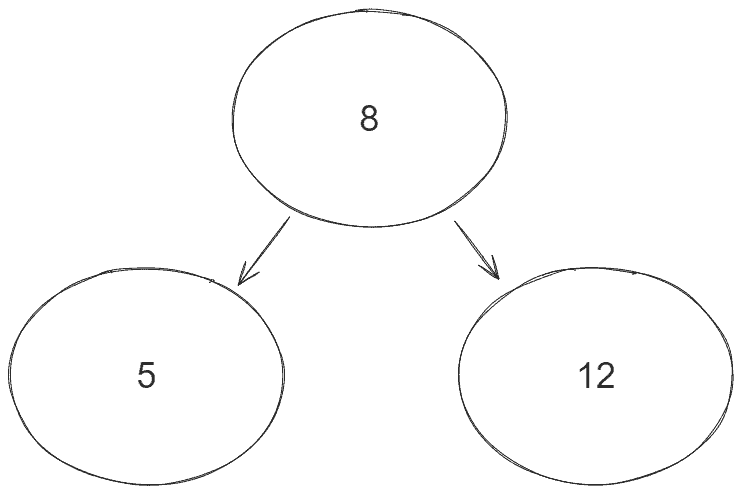
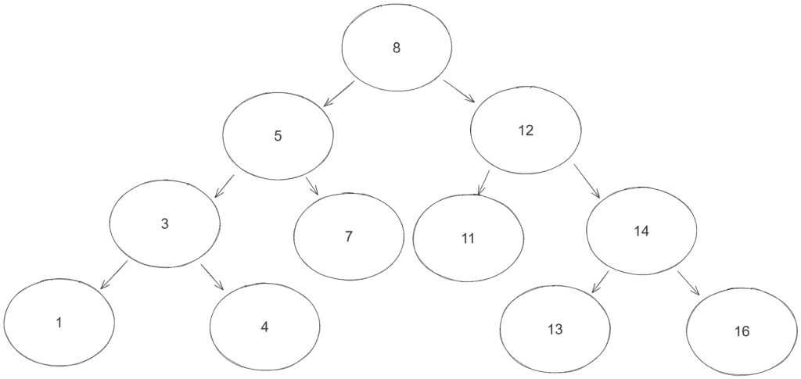

# [用 Java 查找二叉搜索树中节点的父节点](https://www.baeldung.com/java-find-parent-node-binary-search-tree)

1. 简介

    二叉搜索树（[BST](https://www.baeldung.com/cs/binary-search-trees)）是一种能帮助我们高效[解决实际问题](https://www.baeldung.com/cs/applications-of-binary-trees)的数据结构。

    在本篇文章中，我们将探讨如何解决在 BST 中查找节点父节点的问题。

2. 什么是二叉搜索树？

    BST 是一种树，其中每个节点最多指向两个节点，通常称为左子节点和右子节点。此外，每个节点的值都大于左子节点，小于右子节点。

    例如，假设有三个节点，A=2、B=1 和 C=4。因此，一个可能的 BST 以 A 为根，B 为左子节点，C 为右子节点。

    在接下来的章节中，我们将使用使用默认 insert() 方法实现的 BST 结构来练习查找节点父节点的问题。

3. 二叉查找树中节点的父节点

    在下面的章节中，我们将描述在 BST 中查找节点父节点的问题，并练习几种解决方法。

    1. 问题描述

        正如我们在整个文章中所看到的，BST 中的一个给定节点有指向其左侧和右侧子节点的指针。

        例如，让我们想象一个有三个节点的简单 BST：

        

        节点 8 包含两个子节点 5 和 12。因此，节点 8 是节点 5 和 12 的父节点。

        问题在于找到任意给定节点值的父节点。换句话说，我们必须找到其任何一个子节点等于目标值的节点。例如，在上图的 BST 中，如果我们在程序中输入 5，则输出为 8。如果输入 12，我们也期望输出 8。

        这个问题的边缘情况是为最顶层的根节点或 BST 中不存在的节点找到父节点。在这两种情况下，都没有父节点。

    2. 测试结构

        在深入探讨各种解决方案之前，让我们先为测试定义一个基本结构：

        ```java
        class BinaryTreeParentNodeFinderUnitTest {

            TreeNode subject;

            @BeforeEach
            void setUp() {
                subject = new TreeNode(8);
                subject.insert(5);
                subject.insert(12);
                subject.insert(3);
                subject.insert(7);
                subject.insert(1);
                subject.insert(4);
                subject.insert(11);
                subject.insert(14);
                subject.insert(13);
                subject.insert(16);
            }
        }
        ```

        二叉树父节点查找单元测试（BinaryTreeParentNodeFinderUnitTest）定义了一个 setUp() 方法，用于创建以下 BST：

        

4. 实现递归解决方案

    解决问题的直接方法是使用递归遍历树，并尽早返回其任何子节点等于目标值的节点。

    让我们先在 TreeNode 类中定义一个公共方法：

    ```java
    TreeNode parent(int target) throws NoSuchElementException {
        return parent(this, new TreeNode(target));
    }
    ```

    现在，让我们在 TreeNode 类中定义 parent() 方法的递归版本：

    ```java
    TreeNode parent(TreeNode current, TreeNode target) throws NoSuchElementException {
        if (target.equals(current) || current == null) {
            throw new NoSuchElementException(format("No parent node found for 'target.value=%s' " +
                "The target is not in the tree or the target is the topmost root node.",
                target.value));
        }

        if (target.equals(current.left) || target.equals(current.right)) {
            return current;
        }

        return parent(target.value < current.value ? current.left : current.right, target);
    }
    ```

    该算法首先检查当前节点是否是树中最顶端的根节点，或者该节点在树中不存在。在这两种情况下，节点都没有父节点，因此我们会抛出 NoSuchElementException 异常。

    然后，算法会检查当前节点的任何子节点是否等于目标节点。如果是，当前节点就是目标节点的父节点。因此，我们返回 current。

    最后，我们会根据目标值使用向左或向右的递归调用遍历 BST。

    让我们测试一下我们的递归解决方案：

    ```java
    @Test
    void givenBinaryTree_whenFindParentNode_thenReturnCorrectParentNode() {
        assertThrows(NoSuchElementException.class, () -> subject.parent(1231));
        assertThrows(NoSuchElementException.class, () -> subject.parent(8));
        assertEquals(8, subject.parent(5).value);
        assertEquals(5, subject.parent(3).value);
        assertEquals(5, subject.parent(7).value);
        assertEquals(3, subject.parent(4).value);
        // assertions for other nodes
    }
    ```

    在最坏的情况下，算法最多执行 n 次递归操作，每次查找父节点的成本为 O(1)，其中 n 是 BST 中的节点数。因此，该算法的[时间复杂度](https://www.baeldung.com/cs/time-vs-space-complexity#what-is-time-complexity)为 O(n)。在[平衡良好的 BST](https://www.baeldung.com/cs/self-balancing-bts) 中，时间复杂度降至 O(log n)，因为其[高度始终最多为 log n](https://www.baeldung.com/cs/height-balanced-tree)。

    此外，该算法使用[堆空间](https://www.baeldung.com/java-stack-heap#heap-space-in-java)进行递归调用。因此，在最坏的情况下，当我们找到一个叶节点时，递归调用就会停止。因此，该算法最多会堆叠 h 次递归调用，[空间复杂度](https://www.baeldung.com/cs/time-vs-space-complexity#what-is-space-complexity)为 O(h)，其中 h 是 BST 的高度。

5. 实现迭代解决方案

    几乎所有[递归解法都有迭代版本](https://www.baeldung.com/cs/convert-recursion-to-iteration)。特别是，我们还可以使用堆栈和 while 循环代替递归，找到 BST 的父节点。

    为此，让我们在 TreeNode 类中添加 iterativeParent() 方法：

    ```java
    TreeNode iterativeParent(int target) {
        return iterativeParent(this, new TreeNode(target))；
    }
    ```

    上面的方法只是下面辅助方法的一个接口：

    ```java
    TreeNode iterativeParent(TreeNode current, TreeNode target) {
        Deque <TreeNode> parentCandidates = new LinkedList<>();

        String notFoundMessage = format("No parent node found for 'target.value=%s' " +
            "The target is not in the tree or the target is the topmost root node.",
            target.value);

        if (target.equals(current)) {
            throw new NoSuchElementException(notFoundMessage);
        }

        while (current != null || !parentCandidates.isEmpty()) {

            while (current != null) {
                parentCandidates.addFirst(current);
                current = current.left;
            }

            current = parentCandidates.pollFirst();

            if (target.equals(current.left) || target.equals(current.right)) {
                return current;
            }

            current = current.right;
        }

        throw new NoSuchElementException(notFoundMessage);
    }
    ```

    该算法首先初始化一个栈，用于存储父代候选元素。然后，它主要依赖于四个主要部分：

    - 外层 while 循环检查我们是否正在访问一个非叶子节点，或者父节点候选堆栈是否为空。在这两种情况下，我们都应该继续遍历 BST，直到找到目标父节点。
    - 内部 while 循环会再次检查我们是否正在访问一个非叶节点。此时，访问非叶子节点意味着我们应该先向左遍历，因为我们使用的是无序遍历。因此，我们将父候选节点添加到堆栈中，然后继续向左遍历。
    - 访问完左侧节点后，我们会从 Deque 中轮询一个节点，检查该节点是否是目标的父节点，如果是，则返回该节点。如果没有找到父节点，我们就继续向右遍历。
    - 最后，如果主循环结束时没有返回任何节点，我们可以认为该节点不存在，或者它是最顶层的根节点。

    现在，让我们测试一下迭代(iterative)方法：

    ```java
    @Test
    void givenBinaryTree_whenFindParentNodeIteratively_thenReturnCorrectParentNode() {
        assertThrows(NoSuchElementException.class, () -> subject.iterativeParent(1231));
        assertThrows(NoSuchElementException.class, () -> subject.iterativeParent(8));
        assertEquals(8, subject.iterativeParent(5).value);
        assertEquals(5, subject.iterativeParent(3).value);
        assertEquals(5, subject.iterativeParent(7).value);
        assertEquals(3, subject.iterativeParent(4).value);

        // assertion for other nodes
    }
    ```

    在最坏的情况下，我们需要遍历整个 o 树才能找到父节点，这使得迭代求解的空间复杂度为 O(n)。同样，如果 BST 平衡良好，我们也能以 O(log n) 的速度完成同样的工作。

    当我们到达一个叶子节点时，就会开始轮询父节点候选堆栈中的元素。因此，用于存储父候选堆栈的额外堆栈最多包含 h 个元素，其中 h 是 BST 的高度。因此，它的空间复杂度也是 O(h)。

6. 用父指针创建 BST

    另一种解决方法是修改现有的 BST 数据结构，以存储每个节点的父节点。

    为此，让我们创建另一个名为 ParentKeeperTreeNode 的类，并添加一个名为 parent 的新字段：

    ```java
    class ParentKeeperTreeNode {

        int value;
        ParentKeeperTreeNode parent;
        ParentKeeperTreeNode left;
        ParentKeeperTreeNode right;

        // value field arg constructor

        // equals and hashcode
    }
    ```

    现在，我们需要创建一个自定义的 insert() 方法来保存父节点：

    ```java
    void insert(ParentKeeperTreeNode currentNode, final int value) {
        if (currentNode.left == null && value < currentNode.value) {
            currentNode.left = new ParentKeeperTreeNode(value);
            currentNode.left.parent = currentNode;
            return;
        }

        if (currentNode.right == null && value > currentNode.value) {
            currentNode.right = new ParentKeeperTreeNode(value);
            currentNode.right.parent = currentNode;
            return;
        }

        if (value > currentNode.value) {
            insert(currentNode.right, value);
        }

        if (value < currentNode.value) {
            insert(currentNode.left, value);
        }
    }
    ```

    当为当前节点创建新的左子节点或右子节点时，insert() 方法也会保存父节点。在这种情况下，由于我们创建的是新的子节点，因此父节点始终是我们正在访问的当前节点。

    最后，我们可以测试一下存储父节点指针的 BST 版本：

    ```java
    @Test
    void givenParentKeeperBinaryTree_whenGetParent_thenReturnCorrectParent() {
        ParentKeeperTreeNode subject = new ParentKeeperTreeNode(8);
        subject.insert(5);
        subject.insert(12);
        subject.insert(3);
        subject.insert(7);
        subject.insert(1);
        subject.insert(4);
        subject.insert(11);
        subject.insert(14);
        subject.insert(13);
        subject.insert(16);

        assertNull(subject.parent);
        assertEquals(8, subject.left.parent.value);
        assertEquals(8, subject.right.parent.value);
        assertEquals(5, subject.left.left.parent.value);
        assertEquals(5, subject.left.right.parent.value);

        // tests for other nodes
    }
    ```

    在这种 BST 中，我们在插入节点时计算父节点。因此，要验证结果，我们只需检查每个节点中的父节点引用即可。

    因此，我们不需要在 O(h) 的时间内计算每个给定节点的父节点()，而是可以在 O(1) 的时间内立即通过引用得到它。此外，每个节点的父节点只是对内存中另一个现有对象的引用。因此，空间复杂度也是 O(1)。

    当我们经常需要检索一个节点的父节点时，这个版本的 BST 会很有帮助，因为父节点()操作经过了很好的优化。

7. 结论

    在这篇文章中，我们看到了查找 BST 中任意给定节点的父节点的问题。

    我们通过代码示例演练了该问题的三种解决方案。其中一种使用递归遍历 BST。另一种使用堆栈来存储父节点候选并遍历 BST。最后一种在每个节点中保留父节点引用，以便在恒定时间内获取父节点。
