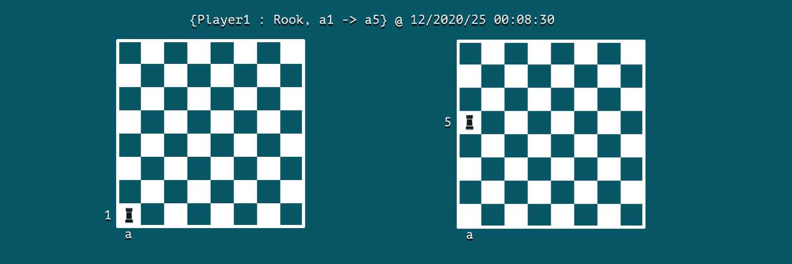
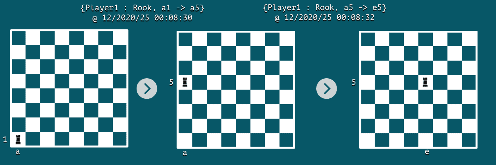

# 使用 Apache Kafka 进行数据建模

[Algorithms](https://www.baeldung.com/category/algorithms) [DevOps](https://www.baeldung.com/category/devops)

[Kafka](https://www.baeldung.com/tag/kafka)

1. 概述

    在本教程中，我们将使用 Apache Kafka 探索事件驱动架构的数据建模领域。

2. 设置

    Kafka 集群由多个与 Zookeeper 集群注册的 Kafka 代理组成。为了简单起见，我们将使用 [Confluent](https://docs.confluent.io/5.0.0/installation/docker/docs/installation/clustered-deployment.html#docker-compose-setting-up-a-three-node-kafka-cluster) 发布的现成 Docker 镜像和 docker-compose 配置。

    首先，让我们下载 3 节点 Kafka 集群的 docker-compose.yml：

    ```bash
    BASE_URL="https://raw.githubusercontent.com/confluentinc/cp-docker-images/5.3.3-post/examples/kafka-cluster"
    $ curl -Os "$BASE_URL"/docker-compose.yml
    ```

    接下来，让我们启动 Zookeeper 和 Kafka 代理节点：

    `$ docker-compose up -d`

    最后，我们可以验证所有的 Kafka 代理都已启动：

    ```bash
    $ docker-compose logs kafka-1 kafka-2 kafka-3 | grep started
    kafka-1_1      | [2020-12-27 10:15:03,783] INFO [KafkaServer id=1] started (kafka.server.KafkaServer)
    kafka-2_1      | [2020-12-27 10:15:04,134] INFO [KafkaServer id=2] started (kafka.server.KafkaServer)
    kafka-3_1      | [2020-12-27 10:15:03,853] INFO [KafkaServer id=3] started (kafka.server.KafkaServer)
    ```

3. 事件基础

    在为事件驱动系统建立数据模型之前，我们需要了解一些概念，如事件、事件流、生产者-消费者和主题。

    1. 事件

        Kafka 世界中的事件是领域世界中发生的事情的信息日志。它以键值对消息的形式记录信息，同时记录一些其他属性，如时间戳、元信息和头信息。

        假设我们正在模拟一盘棋，那么事件可以是一步棋：

        

        我们可以注意到，事件包含了行为者、动作和发生时间等关键信息。在本例中，Player1 是行为者，动作是在 12/2020/25 00:08:30 将车从 a1 格移动到 a5 格。

    2. 消息流

        Apache Kafka 是一个流处理系统，能以消息流的形式捕获事件。在我们的国际象棋游戏中，我们可以将事件流视为棋手下棋的日志。

        在每个事件发生时，棋盘的快照将代表其状态。通常情况下，我们使用传统的表模式来存储对象的最新静态状态。

        另一方面，事件流可以帮助我们以事件的形式捕捉两个连续状态之间的动态变化。如果我们播放一系列这些不可变的事件，就可以从一种状态过渡到另一种状态。这就是事件流与传统表之间的关系，通常被称为流表二元性。

        让我们把棋盘上的事件流想象成只有两个连续的事件：

        

4. 主题

    在本节中，我们将学习如何对通过 Apache Kafka 路由的消息进行分类。

    1. 分类

        在 Apache Kafka 这样的消息传递系统中，产生事件的任何东西通常被称为生产者。而读取和消费这些消息的则称为消费者。

        在现实世界中，每个生产者都可能产生不同类型的事件，因此，如果我们期望消费者过滤与他们相关的消息，而忽略其他消息，那将会浪费消费者大量的精力。

        为了解决这个基本问题，Apache Kafka 使用了主题（topic）。因此，消费者在消费事件消息时可以提高效率。

        在我们的棋盘示例中，可以使用主题将所有棋子归类到 chess-moves 主题下：

        ```bash
        $ docker run \
        --net=host --rm confluentinc/cp-kafka:5.0.0 \
        kafka-topics --create --topic chess-moves \
        --if-not-exists \
        --partitions 1 --replication-factor 1 \
        --zookeeper localhost:32181
        Created topic "chess-moves".
        ```

    2. 生产者-消费者

        现在，让我们看看生产者和消费者是如何使用 Kafka 的主题来处理消息的。我们将使用 Kafka 发行版附带的 kafka-console-producer 和 kafka-console-consumer 实用程序来演示。

        让我们[启动一个名为 kafka-producer 的容器](https://docs.docker.com/engine/reference/commandline/run/)，在其中调用 producer 实用程序：

        ```bash
        $ docker run \
        --net=host \
        --name=kafka-producer \
        -it --rm \
        confluentinc/cp-kafka:5.0.0 /bin/bash
        # kafka-console-producer --broker-list localhost:19092,localhost:29092,localhost:39092 \
        --topic chess-moves \
        --property parse.key=true --property key.separator=:
        ```

        同时，我们可以启动一个名为 kafka-consumer 的容器，在其中调用消费者工具：

        ```bash
        $ docker run \
        --net=host \
        --name=kafka-consumer \
        -it --rm \
        confluentinc/cp-kafka:5.0.0 /bin/bash
        # kafka-console-consumer --bootstrap-server localhost:19092,localhost:29092,localhost:39092 \
        --topic chess-moves --from-beginning \
        --property print.key=true --property print.value=true --property key.separator=:
        ```

        现在，让我们通过制作器来记录一些棋步：

        `>{Player1 : Rook, a1->a5}`

        由于消费者处于活动状态，它将接收到这条关键字为 Player1 的信息：

        `{Player1 : Rook, a1->a5}`

5. 分区

    接下来，让我们看看如何使用分区对信息进行进一步分类，并提高整个系统的性能。

    1. 并发

        我们可以将一个主题划分为多个分区，并调用多个消费者来消费来自不同分区的消息。通过启用这种并发行为，系统的整体性能就能得到提升。

        默认情况下，除非在创建主题时明确指定，否则在创建主题时支持 -bootstrap-server 选项的 Kafka 版本将只创建一个主题分区。不过，对于已存在的主题，我们可以增加分区的数量。让我们把 chess-moves 主题的分区数设为 3：

        ```java
        $ docker run \
        --net=host \
        --rm confluentinc/cp-kafka:5.0.0 \
        bash -c "kafka-topics --alter --zookeeper localhost:32181 --topic chess-moves --partitions 3"
        WARNING: If partitions are increased for a topic that has a key, the partition logic or ordering of the messages will be affected
        Adding partitions succeeded!
        ```

    2. 分区键

        在一个主题中，Kafka 使用分区密钥在多个分区中处理消息。在一端，生产者隐式地使用它将消息路由到其中一个分区。在另一端，每个消费者可以从特定分区读取消息。

        默认情况下，生产者会生成一个密钥哈希值，然后是一个包含分区数量的模(producer would generate a hash value of the key followed by a modulus with the number of partitions.)。然后，它会将消息发送到计算出的标识符所标识的分区。

        - [ ] TODO：Partition Key示例

        让我们使用 kafka-console-producer 工具创建新的事件消息，但这次我们将记录双方棋手的移动：

        ```bash
        # kafka-console-producer --broker-list localhost:19092,localhost:29092,localhost:39092 \
        --topic chess-moves \
        --property parse.key=true --property key.separator=:
        >{Player1: Rook, a1 -> a5}
        >{Player2: Bishop, g3 -> h4}
        >{Player1: Rook, a5 -> e5}
        >{Player2: Bishop, h4 -> g3}
        ```

        现在，我们可以有两个消费者，一个从分区-1 读取，另一个从分区-2 读取：

        ```bash
        # kafka-console-consumer --bootstrap-server localhost:19092,localhost:29092,localhost:39092 \
        --topic chess-moves --from-beginning \
        --property print.key=true --property print.value=true \
        --property key.separator=: \
        --partition 1
        {Player2: Bishop, g3 -> h4}
        {Player2: Bishop, h4 -> g3}
        ```

        我们可以看到棋手2的所有棋步都被记录在分区1中。同样，我们可以检查棋手1的棋步是否被记录到分区-0中。

6. 缩放

    如何概念化主题和分区对横向扩展至关重要。一方面，主题更像是数据的预定义分类。另一方面，分区是一种动态的数据分类，是即时发生的。

    此外，我们在一个主题中能配置多少个分区也有实际限制。这是因为每个分区都映射到代理节点文件系统中的一个目录。当我们增加分区数量时，也就增加了操作系统上打开文件句柄的数量。

    根据经验，[Confluent 的专家建议将每个经纪人的分区数量](https://www.confluent.io/blog/how-choose-number-topics-partitions-kafka-cluster/)限制在 100 x b x r，其中 b 是 Kafka 集群中经纪人的数量，r 是复制系数。

7. 结论

    在本文中，我们使用 Docker 环境为一个使用 Apache Kafka 进行消息处理的系统讲解了数据建模的基础知识。有了对事件、主题和分区的基本了解，我们现在就可以将事件流概念化并进一步使用这种架构范例了。
