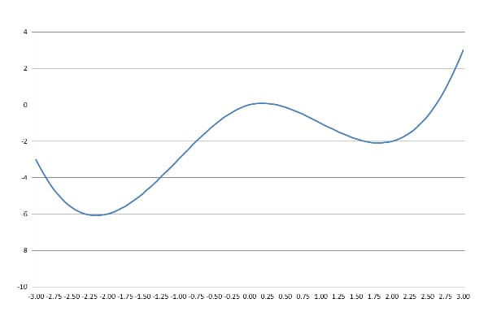
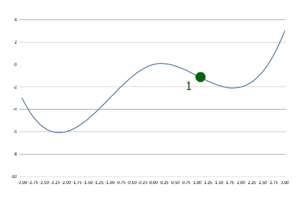
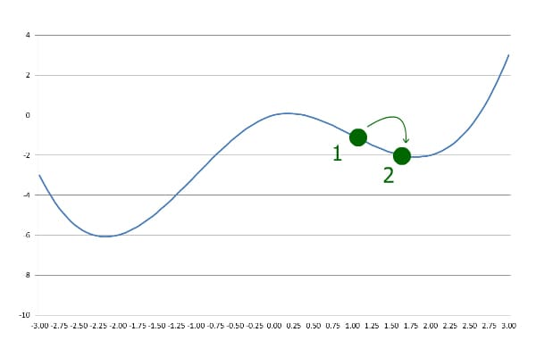
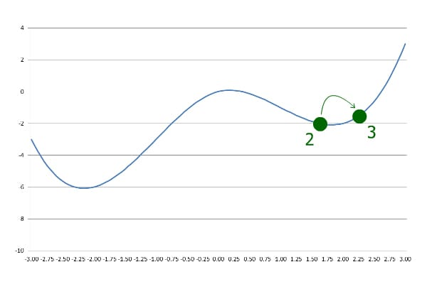
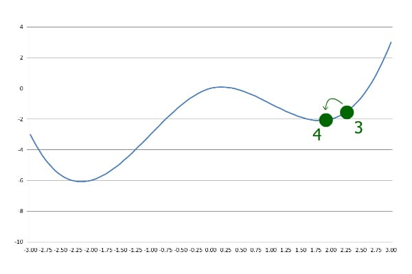

# [Java 中的梯度下降算法](https://www.baeldung.com/java-gradient-descent)

算法    数据

1. 简介
    在本教程中，我们将学习梯度下降（Gradient Descent）算法。我们将在 Java 中实现该算法，并逐步进行说明。

2. 什么是梯度下降？
    梯度下降是一种用于寻找给定函数局部最小值的优化算法。它被广泛应用于高级机器学习算法中，用于最小化损失函数（loss functions）。

    “梯度”是“斜率”的另一种说法，“下降”意味着向下走。顾名思义，梯度下降沿着函数的斜面向下移动，直到到达底部。

3. 梯度下降的特性
    梯度下降寻找的是一个**局部最小值**，这可能与全局最小值不同。起始点作为参数传入算法。

    它是一个**迭代算法**，在每一步中尝试沿斜坡向下移动，逐渐接近局部最小值。

    在实际应用中，该算法具有“回溯”性质。我们将在本教程中介绍并实现带有回溯机制的梯度下降算法。

4. 分步图解
    梯度下降需要一个函数和一个起始点作为输入。我们先定义并绘制一个函数：

    

    我们可以从任意点开始。例如，我们从 x=1 开始：

    

    第一步，梯度下降以预定义的步长向下移动：

    

    接下来，它继续以相同的步长前进。但这一次，它最终落在了一个 y 值更大的位置：

    

    这表明算法已经越过了局部最小值，因此它会以更小的步长向后移动：

    

    随后，每当当前 y 值大于前一步的 y 值时，算法就会减小步长并反向移动。这个过程持续到达到所需的精度为止。

    如图所示，梯度下降在这里找到了一个局部最小值，但它不是全局最小值。如果我们从 x=-1 而不是 x=1 开始，就能找到全局最小值。

5. Java 实现
    实现梯度下降有多种方式。在这里，我们不通过计算函数的导数来确定斜率方向，因此我们的实现也适用于不可导函数。

    我们先定义精度（precision）和步长系数（stepCoefficient），并赋予初始值：

    ```java
    double precision = 0.000001;
    double stepCoefficient = 0.1;

    double precision = 0.000001;
    double stepCoefficient = 0.1;
    ```

    第一步，我们还没有前一个 y 值可供比较。我们可以增加或减少 x 的值，看看 y 是否降低。正值的 stepCoefficient 表示我们正在增加 x 的值。

    现在执行第一步：

    ```java
    double previousX = initialX;
    double previousY = f.apply(previousX);
    currentX += stepCoefficient * previousY;
    ```

    上面代码中，`f` 是一个 `Function<Double, Double>` 类型的对象，`initialX` 是一个 double 类型的输入值。

    另一个关键点是：梯度下降**不一定保证收敛**。为了避免陷入死循环，我们需要限制最大迭代次数：

    ```java
    int iter = 100;
    ```

    稍后我们会在每次迭代中将 `iter` 减一。这样最多迭代 100 次后程序就会退出循环。

    现在我们已经有了 `previousX`，可以设置循环结构了：

    ```java
    while (previousStep > precision && iter > 0) {
        iter--;
        double currentY = f.apply(currentX);
        if (currentY > previousY) {
            stepCoefficient = -stepCoefficient / 2;
        }
        previousX = currentX;
        currentX += stepCoefficient * previousY;
        previousY = currentY;
        previousStep = StrictMath.abs(currentX - previousX);
    }
    ```

    在每一次迭代中，我们计算新的 y 值并与前一次进行比较。如果 `currentY` 大于 `previousY`，我们就改变方向并减小步长。

    当步长小于所需精度时，循环结束。最后，我们可以返回 `currentX` 作为局部最小值：

    ```java
    return currentX;
    ```

6. 总结
    在本文中，我们通过分步图解的方式讲解了梯度下降算法，并在 Java 中实现了该算法。
