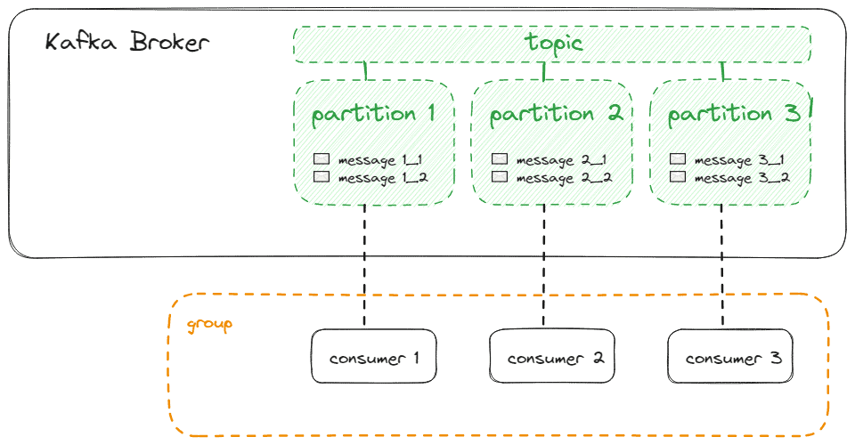
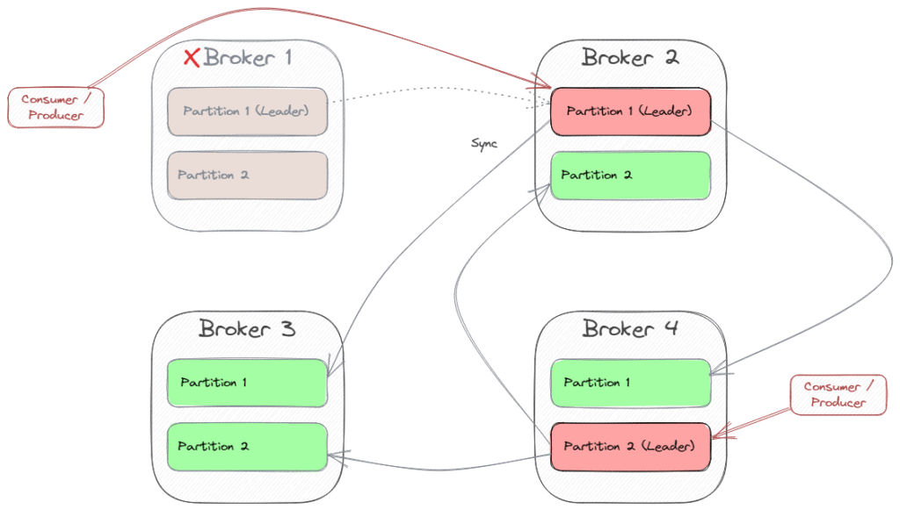

# [Apache Kafka 简介](https://www.baeldung.com/apache-kafka)

[Data](https://www.baeldung.com/category/data)

[Kafka](https://www.baeldung.com/tag/kafka)

1. 概述

    在本教程中，我们将学习 Kafka 的基础知识--任何人都应该知道的使用案例和核心概念。

2. 什么是 Kafka？

    [Kafka](https://kafka.apache.org/) 是 Apache 软件基金会开发的开源流处理平台。我们可以将它用作一个消息系统来解耦消息生产者和消费者，但与 [ActiveMQ](https://activemq.apache.org/) 等 "经典" 消息系统相比，它是专为处理实时数据流而设计的，并为处理和存储数据提供了一个分布式、容错和高度可扩展的架构。

    因此，我们可以在各种用例中使用它：

    - 实时数据处理和分析
    - 日志和事件数据聚合
    - 监控和指标收集
    - 点击流数据分析
    - 欺诈检测
    - 大数据管道中的流处理

3. 设置本地环境

    如果我们是第一次使用 Kafka，我们可能需要在本地安装以体验其功能。我们可以借助 Docker 快速实现这一点。

    1. 安装 Kafka

        我们下载一个现有的[镜像文件](https://hub.docker.com/r/bashj79/kafka-kraft)，然后用以下命令运行一个容器实例：

        `docker run -p 9092:9092 -d bashj79/kafka-kraft`

        这样，所谓的 Kafka 代理就会在主机系统上的 9092 端口可用了。现在，我们要使用 Kafka 客户端连接到代理。我们可以使用多种客户端。

    2. 使用 Kafka CLI

        Kafka CLI 是安装的一部分，可在 Docker 容器中使用。我们可以通过连接到容器的 bash 来使用它。

        首先，我们需要用这条命令找出容器的名称：

        ```bash
        docker ps
        CONTAINER ID   IMAGE                    COMMAND                  CREATED        STATUS       PORTS                    NAMES
        7653830053fa   bashj79/kafka-kraft      "/bin/start_kafka.sh"    8 weeks ago    Up 2 hours   0.0.0.0:9092->9092/tcp   awesome_aryabhata
        ```

        在这个示例中，名称是 awesome_aryabhata。然后，我们使用bash命令去链接Kafka：

        `docker exec -it awesome_aryabhata /bin/bash`

        现在，我们可以用以下命令创建一个主题（我们稍后会对这个术语进行说明）并列出所有现有主题：

        ```bash
        cd /opt/kafka/bin

        # create topic 'my-first-topic'
        sh kafka-topics.sh --bootstrap-server localhost:9092 --create --topic my-first-topic --partitions 1 --replication-factor 1

        # list topics
        sh kafka-topics.sh --bootstrap-server localhost:9092 --list

        # send messages to the topic
        sh kafka-console-producer.sh --bootstrap-server localhost:9092 --topic my-first-topic
        >Hello World
        >The weather is fine
        >I love Kafka
        ```

    3. 使用偏移资源管理器

        [Offset Explorer](https://www.kafkatool.com/)（原名：Kafka Tool）是一款用于管理 Kafka 的图形用户界面应用程序。我们可以快速下载并安装它。然后，我们创建一个连接，并指定 Kafka 代理的主机和端口：

        

        然后，我们就可以探索架构了：

        

    4. 使用 Apache Kafka 的用户界面（Kafka UI）

        Apache Kafka 的用户界面（[Kafka UI](https://github.com/provectus/kafka-ui)）是一个网页用户界面，使用 Spring Boot 和 React 实现，并以 Docker 容器的形式提供，只需使用以下命令即可进行[简单安装](https://docs.kafka-ui.provectus.io/overview/getting-started)：

        `docker run -it -p 8080:8080 -e DYNAMIC_CONFIG_ENABLED=true provectuslabs/kafka-ui`

        然后，我们可以使用 <http://localhost:8080> 在浏览器中打开用户界面，并定义一个集群，如图所示：

        

        由于 Kafka 代理运行在与 Kafka UI 后端不同的容器中，因此无法访问 localhost:9092。我们可以使用 host.docker.internal:9092 来访问主机系统，但这只是引导 URL。

        不幸的是，Kafka 本身会返回一个响应，导致再次重定向到 localhost:9092，这样就行不通了。如果我们不想配置 Kafka（因为这样会破坏其他客户端），就需要创建一个从 Kafka UI 的容器端口 9092 到主机系统端口 9092 的端口转发。下面的草图说明了连接情况：

        

        我们可以设置容器内部端口转发，例如使用 socat。我们必须在容器（Alpine Linux）内安装它，因此需要以 root 权限连接到容器的 bash。因此，我们需要从主机系统的命令行开始执行以下命令：

        ```bash
        # Connect to the container's bash (find out the name with 'docker ps')
        docker exec -it --user=root <name-of-kafka-ui-container> /bin/sh
        # Now, we are connected to the container's bash.
        # Let's install 'socat'
        apk add socat
        # Use socat to create the port forwarding
        socat tcp-listen:9092,fork tcp:host.docker.internal:9092
        # This will lead to a running process that we don't kill as long as the container's running
        ```

        不幸的是，我们需要在每次启动容器时都运行 socat。另一种方法是为 [Dockerfile](https://github.com/provectus/kafka-ui/blob/master/kafka-ui-api/Dockerfile) 提供一个扩展。

        现在，我们可以在 Kafka UI 中指定 localhost:9092 作为引导服务器，然后就可以查看和创建主题了，如下图所示：

        

    5. 使用 Kafka Java 客户端

        我们必须在项目中添加以下 Maven 依赖项：

        ```xml
        <dependency>
            <groupId>org.apache.kafka</groupId>
            <artifactId>kafka-clients</artifactId>
            <version>3.5.1</version>
        </dependency>
        ```

        然后，我们就可以连接到 Kafka 并使用之前生成的消息了：

        ```java
        // specify connection properties
        Properties props = new Properties();
        props.put(ConsumerConfig.BOOTSTRAP_SERVERS_CONFIG, "localhost:9092");
        props.put(ConsumerConfig.GROUP_ID_CONFIG, "MyFirstConsumer");
        props.put(ConsumerConfig.KEY_DESERIALIZER_CLASS_CONFIG, StringDeserializer.class.getName());
        props.put(ConsumerConfig.VALUE_DESERIALIZER_CLASS_CONFIG, StringDeserializer.class.getName());
        // receive messages that were sent before the consumer started
        props.put(ConsumerConfig.AUTO_OFFSET_RESET_CONFIG, "earliest");
        // create the consumer using props.
        try (final Consumer<Long, String> consumer = new KafkaConsumer<>(props)) {
            // subscribe to the topic.
            final String topic = "my-first-topic";
            consumer.subscribe(Arrays.asList(topic));
            // poll messages from the topic and print them to the console
            consumer
            .poll(Duration.ofMinutes(1))
            .forEach(System.out::println);
        }
        ```

        当然，Spring 中也集成了 [Kafka](https://www.baeldung.com/spring-kafka) 客户端。

4. 基本概念

    1. 生产者和消费者

        我们可以将 Kafka 客户端区分为消费者和生产者。生产者向 Kafka 发送消息，而消费者从 Kafka 接收消息。他们只通过主动轮询(polling)从 Kafka 接收消息。而 Kafka 本身则是被动的。这使得每个消费者都能拥有自己的性能，而不会阻塞 Kafka。

        当然，可以同时有多个生产者和多个消费者。当然，一个应用程序也可以同时包含生产者和消费者。

        消费者是消费者组的一部分，Kafka 通过一个简单的名称来识别消费者组。一个消费者组中只有一个消费者会收到消息。这样就可以在保证只传递一次消息的前提下，扩大消费者的规模。

        下图显示了多个生产者和消费者与 Kafka 协同工作的情况：

        

    2. 消息

        消息（根据使用情况，我们也可以将其命名为"record"或"event"）是 Kafka 处理数据的基本单位。其有效载荷可以是任何二进制格式，也可以是纯文本、[Avro](https://avro.apache.org/)、XML 或 JSON 等文本格式。

        每个生产者都必须指定一个序列化器，以便将消息对象转换成二进制有效载荷格式。每个消费者必须指定一个相应的反序列化器，以便在其 JVM 中将有效载荷格式转换回对象。我们称这些组件为SerDes。有[内置的SerDes](https://kafka.apache.org/documentation/streams/developer-guide/datatypes.html)，但我们也可以实现自定义的 SerDes。

        下图显示了有效载荷序列化和反序列化过程：

        

        此外，信息还可以有以下可选属性：

        - 密钥，也可以是任何二进制格式。如果使用密钥，我们还需要 SerDes。Kafka 使用密钥进行分区（我们将在下一章详细讨论）。
        - 时间戳表示消息产生的时间。Kafka 使用时间戳对消息进行排序或实施保留策略。
        - 我们可以[应用标头](https://www.baeldung.com/java-kafka-custom-headers)将元数据与有效载荷关联起来。例如，Spring 默认为序列化和反序列化添加了类型标头。

    3. 主题和分区

        主题是生产者发布消息的逻辑通道或类别。消费者订阅一个主题，以便在其消费者组的上下文中接收消息。

        默认情况下，主题的保留策略是 7 天，即 7 天后，Kafka 会自动删除消息，与是否向消费者交付无关。我们可以根据需要进行[配置](https://www.baeldung.com/kafka-message-retention)。

        主题由分区（至少一个）组成。确切地说，消息存储在主题的一个分区中。在一个分区中，信息会得到一个订单号（偏移量）。这样可以确保信息按照与存储在分区中相同的顺序传送给消费者。而且，通过存储消费者组已经收到的偏移量，Kafka 可以保证只交付一次。

        通过处理多个分区，我们可以确定 Kafka 可以同时提供排序保证和消费者进程池的负载平衡。

        一个消费者在订阅主题时会被分配到一个分区，例如我们已经看到的 Java Kafka 客户端 API：

        ```java
        String topic = "my-first-topic";
        consumer.subscribe(Arrays.asList(topic));
        ```

        不过，对于消费者来说，可以选择要从哪个分区轮询消息：

        ```java
        TopicPartition myPartition = new TopicPartition(topic, 1);
        consumer.assign(Arrays.asList(myPartition));
        ```

        这种变体的缺点是，所有群组消费者都必须使用这种方法，因此自动为群组消费者分配分区的方法无法与连接到特殊分区的单个消费者结合使用。此外，在架构发生变化（如向组中添加更多消费者）时，也无法重新平衡。

        理想情况下，我们拥有和分区一样多的消费者，这样每个消费者都能准确分配到一个分区，如下图所示：

        

        如果我们的消费者数量多于分区数量，那么这些消费者将不会收到来自任何分区的信息：

        

        如果我们的消费者数量少于分区数量，消费者就会接收到来自多个分区的信息，这与最佳负载均衡相冲突：

        

        生产者不一定只向一个分区发送消息。每条生产的信息都会自动分配给一个分区，具体规则如下：

        - 生产者可以在信息中指定一个分区。如果指定了，则优先级最高
        - 如果信息有密钥，则通过计算密钥的哈希值进行分区。具有相同哈希值的密钥将存储在同一个分区中。理想情况下，我们至少要有和分区一样多的哈希值
        - 否则，[Sticky Partitioner](https://cwiki.apache.org/confluence/display/KAFKA/KIP-480%3A+Sticky+Partitioner)会将信息分配到分区中。

        同样，将消息存储到同一分区会保留消息排序，而将消息存储到不同分区则会导致消息排序紊乱，但会进行并行处理。

        如果默认分区与我们的预期不符，我们可以简单地实现一个自定义分区器。因此，我们要实现 [Partitioner](https://kafka.apache.org/34/javadoc/org/apache/kafka/clients/producer/Partitioner.html) 接口，并在生产者初始化时将其注册：

        ```java
        Properties producerProperties = new Properties();
        // ...  
        producerProperties.put(ProducerConfig.PARTITIONER_CLASS_CONFIG, MyCustomPartitioner.class.getName());
        KafkaProducer<String, String> producer = new KafkaProducer<>(producerProperties);
        ```

        下图显示了生产者和消费者及其与分区的连接：

        

        每个生产者都有自己的分区器，因此，如果我们想确保消息在主题内被一致地分区，就必须确保所有生产者的分区器都以相同的方式工作，否则我们就只能使用单个生产者。

        分区按照消息到达 Kafka 代理的顺序存储消息。通常情况下，生产者不会以单个请求的形式发送每条消息，而是在一个批次中发送多条消息。如果我们需要确保消息的顺序，并在一个分区内只发送一次，我们就需要[事务感知](https://www.baeldung.com/kafka-exactly-once)的生产者和消费者。

    4. 群集和分区副本

        正如我们所发现的，Kafka 使用主题分区来实现并行消息传递和消费者的负载平衡。但 Kafka 本身必须具有可扩展性和容错性。因此，我们通常不使用单个 Kafka 代理，而是使用由多个代理组成的集群。这些代理的行为并不完全相同，但每个代理都被分配了特殊任务，如果其中一个代理出现故障，集群中的其他代理就可以承担这些任务。

        要理解这一点，我们需要扩展对主题的理解。在创建主题时，我们不仅要指定分区的数量，还要指定使用同步功能共同管理分区的代理的数量。我们称之为复制因子（Replication Factor）。例如，使用 Kafka CLI，我们可以创建一个有 6 个分区的主题，每个分区在 3 个代理服务器上同步：

        `sh kafka-topics.sh --bootstrap-server localhost:9092 --create --topic my-replicated-topic --partitions 6 --replication-factor 3`

        举例来说，复制因子为 3 意味着集群最多可承受两个副本故障（N-1 恢复能力(resiliency)）。我们必须确保至少有与我们指定的复制因子相同数量的代理。否则，Kafka 在代理数量增加之前不会创建主题。

        为了提高效率，分区的复制只在一个方向上进行。Kafka 通过声明其中一个经纪商为分区领导者（Partition Leader）来实现这一点。生产者只向分区领导者发送消息，然后由领导者与其他代理同步。消费者也会从分区领导者处轮询，因为不断增加的消费者组的偏移量也必须同步。

        分区领导者被分配给多个代理。Kafka 会尝试为不同的分区寻找不同的代理。让我们来看一个有四个代理和两个分区（复制因子为 3）的示例：

        

        代理 1 是分区 1 的领导者，代理 4 是分区 2 的领导者。因此，在从这些分区发送或轮询消息时，每个客户端都将连接到这些代理。为了获取有关分区领导者和其他可用经纪人的信息（元数据），有一个特殊的引导机制。总之，我们可以说每个代理都能提供群集的元数据，因此客户端可以初始化与每个代理的连接，然后重定向到分区领导者。这就是为什么我们可以指定多个代理作为[引导服务器](https://www.baeldung.com/java-kafka-bootstrap-server)。

        如果一个分区领导者的代理服务器出现故障，Kafka 会宣布其中一个仍在工作的代理服务器为新的分区领导者。然后，所有客户端都必须连接到新的领导者。在我们的例子中，如果代理 1 出现故障，代理 2 就会成为分区 1 的新领导者。然后，连接到 Broker 1 的客户端必须切换到 Broker 2。

        

        Kafka 使用 [Kraft](https://www.baeldung.com/kafka-shift-from-zookeeper-to-kraft)（早期版本为 Zookeeper）来协调集群内的所有 Broker。

    5. 组合在一起

        如果我们将生产者和消费者与由三个代理组成的集群放在一起，由三个代理管理一个具有三个分区和 3 个复制因子的主题，我们就会得到这样的架构：

        

5. 生态系统

    我们已经知道，有多种客户端（如 CLI、与 Spring 应用程序集成的基于 Java 的客户端以及多种 GUI 工具）可用于连接 Kafka。当然，还有其他编程语言（如 [C/C++](https://docs.confluent.io/platform/current/clients/librdkafka/html/md_INTRODUCTION.html)、[Python](https://github.com/confluentinc/confluent-kafka-python) 或 [Javascript](https://kafka.js.org/)）的客户端 API，但这些都不是 Kafka 项目的一部分。

    在这些 API 的基础上，还有更多用于特殊目的的 API。

    1. 卡夫卡连接 API

        [Kafka Connect](https://www.baeldung.com/kafka-connectors-guide) 是用于与第三方系统交换数据的 API。现有的连接器包括 AWS S3、JDBC，甚至用于在不同的 Kafka 集群之间交换数据。当然，我们也可以编写自定义连接器。

    2. 卡夫卡流 API

        [Kafka Streams](https://www.baeldung.com/java-kafka-streams) 是一个用于实现流处理应用程序的 API，这些应用程序从一个 Kafka 主题获取输入，并将结果存储到另一个 Kafka 主题中。

    3. KSQL

        KSQL 是建立在 Kafka Streams 之上的类似 SQL 的接口。它不需要我们开发 Java 代码，但我们可以声明类似 SQL 的语法来定义与 Kafka 交换的消息的流处理。为此，我们使用连接到 Kafka 集群的 ksqlDB。我们可以使用 CLI 或 Java 客户端应用程序访问 [ksqlDB](https://www.baeldung.com/ksqldb)。

    4. Kafka REST 代理

        [Kafka REST 代理](https://github.com/confluentinc/kafka-rest)为 Kafka 集群提供了一个 RESTful 接口。这样，我们就不需要任何 Kafka 客户端，也避免了使用本地 Kafka 协议。它允许网络前端连接 Kafka，并使使用 API 网关或防火墙等网络组件成为可能。

    5. 用于 Kubernetes 的 Kafka 操作器（Strimzi）

        [Strimzi](https://strimzi.io/) 是一个开源项目，提供了在 Kubernetes 和 OpenShift 平台上运行 Kafka 的方法。它引入了定制的 Kubernetes 资源，使以 Kubernetes 原生方式声明和管理 Kafka 相关资源变得更加容易。它遵循操作员模式（[Operator Pattern](https://kubernetes.io/docs/concepts/extend-kubernetes/operator/)），即操作员自动完成 Kafka 集群的配置、扩展、滚动更新和监控等任务。

6. 结论

    在本文中，我们了解到 Kafka 是专为高扩展性和容错而设计的。生产者收集消息并分批发送，主题被划分为多个分区，以便并行发送消息和平衡消费者的负载，并通过多个代理进行复制以确保容错。

    像往常一样，所有的代码实现都可以在 [GitHub](https://github.com/eugenp/tutorials/tree/master/apache-kafka-2) 上找到。
