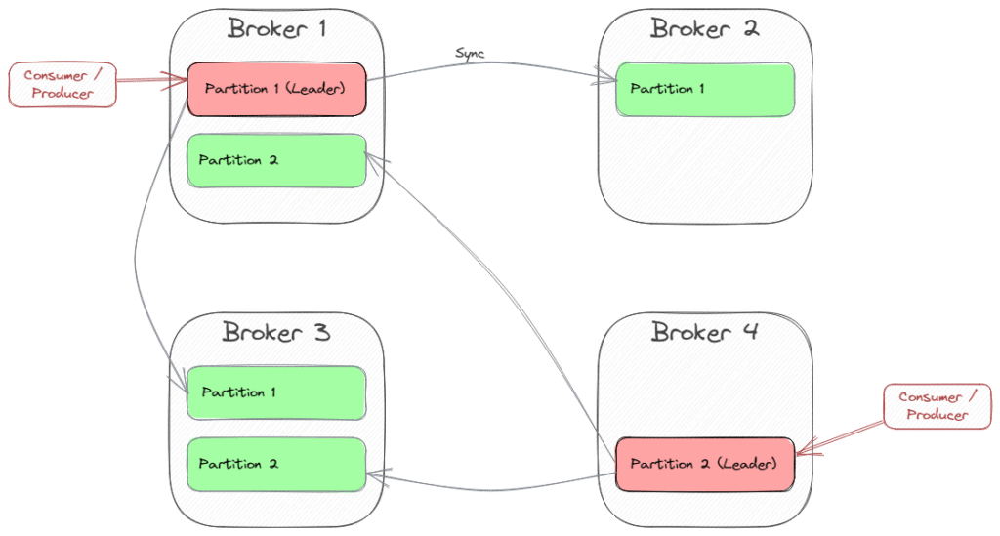
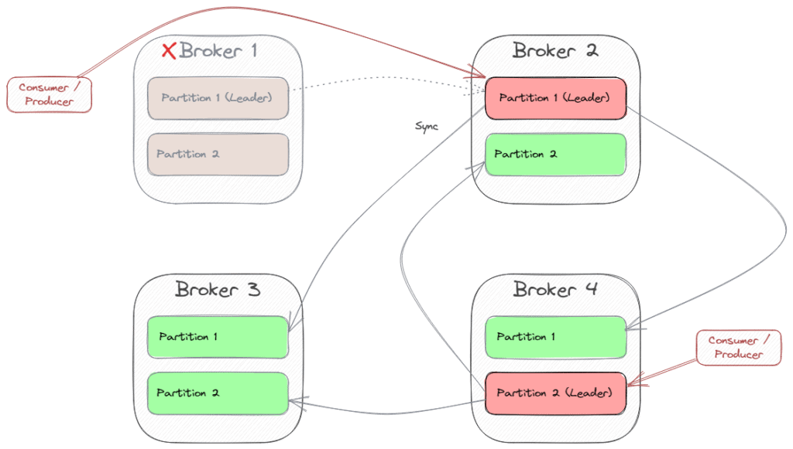

# [Kafka配置中的引导服务器](https://www.baeldung.com/java-kafka-bootstrap-server)

1. 概述

    每当我们实现 Kafka 生产者或消费者（例如使用 [Spring](https://www.baeldung.com/spring-kafka)）时，我们需要配置的其中一项内容就是 "[bootstrap.servers](https://docs.confluent.io/kafka-clients/java/current/overview.html#initialization)" 属性。

    在本教程中，我们将了解该设置的含义和用途。

2. Kafka 拓扑

    Kafka 的拓扑结构旨在实现可扩展性和高可用性。这就是为什么有一个服务器集群（broker）来处理在 Broker 之间复制的主题分区。每个分区都有一个代理作为领导者，其他代理作为跟随者。

    生产者向分区领导者发送信息，然后由分区领导者将记录传播到每个副本。消费者通常也会连接到分区领导者，因为消费信息会改变状态（消费者偏移）。

    副本的数量就是复制因子。推荐值为 3，因为它能在性能和容错之间取得适当的平衡，而且云提供商通常会提供三个数据中心（可用性区域）作为区域的一部分进行部署。

    例如，下图显示了一个由四个代理服务器组成的群集，该群集为一个主题提供两个分区，复制因子为 3：

    

    当一个分区领导者崩溃时，Kafka 会选择另一个代理作为新的分区领导者。然后，消费者和生产者（"客户"）也必须切换到新的领导者。因此，如果 Broker 1 崩溃，情况可能会变成这样：

    

3. 引导

    正如我们所看到的，整个集群是动态的，客户端需要知道当前的拓扑状态，才能连接到正确的分区领导者收发消息。这就是引导的作用所在。

    引导服务器(bootstrap-servers)配置是一个"hostname:port"对列表，其中包含一个或多个（甚至全部）代理服务器的地址。客户端通过以下步骤使用该列表：

    - 从列表中选择第一个代理服务器
    - 向代理发送请求，获取包含主题、分区和每个分区的领导代理信息的群集元数据（每个代理都可以提供此元数据）
    - 连接到所选主题分区的领导者代理

    当然，在列表中指定多个经纪人也是有意义的，因为如果第一个经纪人不可用，客户端可以选择第二个经纪人进行引导。

    Kafka 使用 Kraft（源自早期的 Zookeeper）来管理所有这类协调工作。

4. 样本

    假设我们在开发环境中使用了一个包含 Kafka 和 Kraft 的简单 Docker 镜像（如[bashj79/kafka-kraft](https://hub.docker.com/r/bashj79/kafka-kraft)）。我们可以用以下命令安装这个 Docker 镜像：

    `docker run -p 9092:9092 -d bashj79/kafka-kraft`

    这将在容器内和主机上的 9092 端口运行一个可用的 Kafka 实例。

    1. 使用 Kafka CLI

        连接到 Kafka 的一种方法是使用 [Kafka CLI](https://docs.confluent.io/kafka/operations-tools/kafka-tools.html#kafka-console-consumer-sh)，它可以在 Kafka 安装中使用。首先，让我们创建一个名为 samples 的主题。在容器的 Bash 中，我们可以运行以下命令：

        ```bash
        cd /opt/kafka/bin
        sh kafka-topics.sh --bootstrap-server localhost:9092 --create --topic samples --partitions 1 --replication-factor 1
        ```

        如果要开始使用主题，我们需要再次指定引导服务器：

        `$ sh kafka-console-consumer.sh --bootstrap-server localhost:9092,another-host.com:29092 --topic samples`

        我们还可以将集群元数据作为一种虚拟文件系统来探索。我们使用 kafka-metadata-shell 脚本连接到元数据：

        `$ sh kafka-metadata-shell.sh --snapshot /tmp/kraft-combined-logs/__cluster_metadata-0/00000000000000000167.log`

    2. 使用 Java

        在 Java 应用程序中，我们可以使用 [Kafka 客户端](https://docs.confluent.io/kafka-clients/java/current/overview.html)：

        main/.kafka.consumer/SimpleConsumerWithBootStrapServers.java:createConsumer()

        有了 Spring Boot 和 Spring 的 [Kafka 集成](https://spring.io/projects/spring-kafka)，我们只需配置 application.properties 即可：

        spring.kafka.bootstrap-servers=localhost:9092,another-host.com:29092
5. 结论

    在本文中，我们了解到 Kafka 是一个分布式系统，由多个代理组成，代理复制主题分区以确保高可用性、可扩展性和容错性。

    客户端需要从一个代理处检索元数据，以找到当前要连接的分区领导者。这个代理就是引导服务器，我们通常会提供一个引导服务器列表，在主代理无法访问的情况下为客户端提供其他选择。
