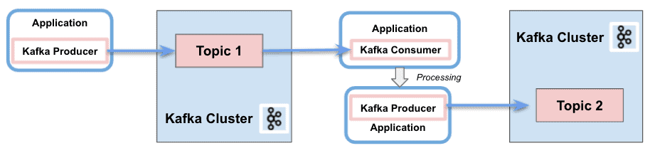
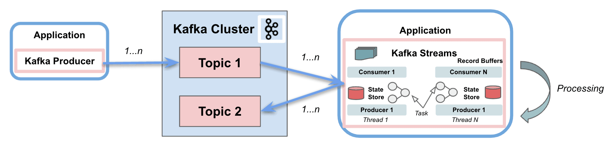
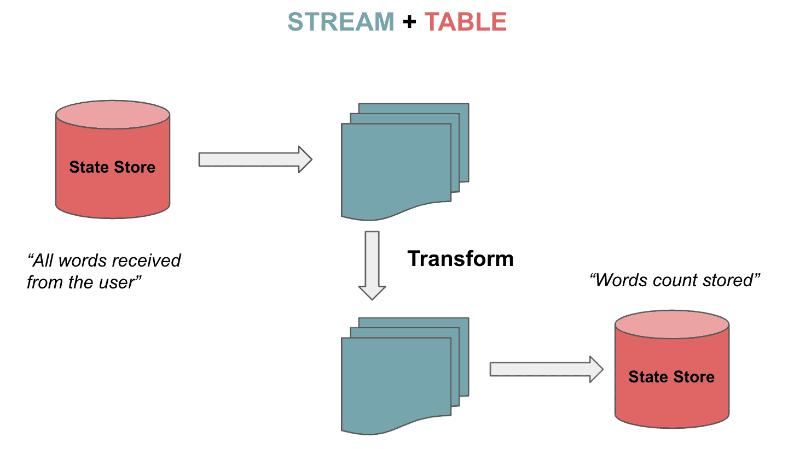

# [Kafka流与Kafka消费者](https://www.baeldung.com/java-kafka-streams-vs-kafka-consumer)

[Data](https://www.baeldung.com/category/data)

[Kafka](https://www.baeldung.com/tag/kafka)

1. 简介

    Apache Kafka 是最流行的开源分布式容错流处理系统。Kafka Consumer 提供了处理消息的基本功能。[Kafka Streams](https://www.baeldung.com/java-kafka-streams) 还在 Kafka Consumer 客户端的基础上提供实时流处理功能。

    在本教程中，我们将讲解 Kafka Streams 的功能，让您轻松体验流处理。

2. 流和消费者 API 的区别

    1. Kafka 消费者 API

        简而言之，Kafka 消费者 [API](https://kafka.apache.org/documentation/#consumerapi) 允许应用程序处理来自主题的消息。它提供了与之交互的基本组件，包括以下功能：

        - 消费者和生产者之间的责任分离
        - 单个处理
        - 支持批量处理
        - 仅支持无状态。客户端不保留之前的状态，而是单独评估流中的每条记录
        - 编写应用程序需要大量代码
        - 不使用线程或并行
        - 可以在多个 Kafka 集群中进行编写

        

    2. Kafka流 API

        Kafka Streams 极大地简化了来自主题的流处理。它建立在 Kafka 客户端库之上，提供数据并行性、分布式协调、容错和可扩展性。它将消息作为无限制、连续和实时的记录流来处理，具有以下特点：

        - 消费和生产单个 Kafka 流
        - 执行复杂的处理
        - 不支持批处理
        - 支持无状态和有状态操作
        - 编写应用程序只需几行代码
        - 线程和并行
        - 只与单个 Kafka 集群交互
        - 将流分区和任务作为存储和传输消息的逻辑单元

        

        Kafka Streams 使用分区和任务的概念，将其作为与主题分区紧密相连的逻辑单元。此外，它还使用线程来并行处理应用程序实例。Kafka Streams 支持的另一项重要功能是状态存储，用于存储和查询来自主题的数据。最后，[Kafka Streams API](https://mvnrepository.com/artifact/org.apache.kafka/kafka-streams) 会与集群交互，但不会直接在集群上运行。

        在接下来的章节中，我们将重点讨论与基本 Kafka 客户端不同的四个方面： 流-表二元性（Stream-table duality）、Kafka Streams 特定域语言（Domain Specific Language，DSL）、一次性精确处理语义（Exactly-Once processing Semantics，EOS）和交互式查询（Interactive queries）。

    3. 依赖关系

        要实现这些示例，我们只需在 pom.xml 中添加 Kafka Consumer API 和 Kafka Streams API 的依赖项：

        ```xml
        <dependency>
            <groupId>org.apache.kafka</groupId>
            <artifactId>kafka-clients</artifactId>
            <version>3.4.0</version>
        </dependency>

        <dependency>
            <groupId>org.apache.kafka</groupId>
            <artifactId>kafka-streams</artifactId>
            <version>3.4.0</version>
        </dependency>
        ```

3. 流和表的二元性

    Kafka Streams 不仅支持流，还支持可双向转换的表。 这就是所谓的[流表二元性](https://www.confluent.io/blog/kafka-streams-tables-part-1-event-streaming/#stream-table-duality)。表是一组不断变化的事实。每个新事件都会覆盖旧事件，而流则是不可改变的事实集合。

    数据流处理来自主题的完整数据流。表通过聚合来自流的信息来存储状态。让我们想象一下 [Kafka 数据建模](https://www.baeldung.com/apache-kafka-data-modeling#event-basics)中描述的下棋游戏。连续的棋步流被聚合到一个表中，我们可以从一个状态过渡到另一个状态：

    

    1. KStream、KTable 和 GlobalKTable

        Kafka Streams 为流（Streams）和表（Tables）提供了两种抽象。KStream 处理记录流。另一方面，KTable 负责管理包含给定键最新状态的更新日志流。每条数据记录都代表一次更新。

        对于非分区表还有另一种抽象方法。我们可以使用 GlobalKTables 向所有任务广播信息，或在不对输入数据重新分区的情况下进行连接。

        我们可以以流的形式读取和反序列化一个主题：

        ```java
        StreamsBuilder builder = new StreamsBuilder();
        KStream<String, String> textLines = 
        builder.stream(inputTopic, Consumed.with(Serdes.String(), Serdes.String()));
        ```

        也可以读取一个主题，以表格形式跟踪收到的最新单词：

        ```java
        KTable<String, String> textLinesTable = 
        builder.table(inputTopic, Consumed.with(Serdes.String(), Serdes.String()));
        ```

        最后，我们可以使用全局表读取主题：

        ```java
        GlobalKTable<String, String> textLinesGlobalTable = 
        builder.globalTable(inputTopic, Consumed.with(Serdes.String(), Serdes.String()));
        ```

4. Kafka流 DSL

    Kafka Streams DSL 是一种声明式和函数式编程风格。它建立在 [Streams Processor API](https://kafka.apache.org/documentation/streams/developer-guide/processor-api.html) 的基础之上。该语言为上一节提到的流和表提供了内置抽象。

    此外，它还支持无状态（映射、过滤等）和有状态转换（聚合、连接和窗口）。因此，只需几行代码就能实现流处理操作。

    1. 无状态转换

        [无状态转换](https://kafka.apache.org/documentation/streams/developer-guide/dsl-api.html#stateless-transformations)在处理时不需要状态。同样，流处理器中也不需要状态存储。操作示例包括 filter、map、flatMap 或 groupBy。

        现在让我们看看如何将值映射为大写字母，从主题中过滤并存储为流：

        ```java
        KStream<String, String> textLinesUpperCase =
        textLines
            .map((key, value) -> KeyValue.pair(value, value.toUpperCase()))
            .filter((key, value) -> value.contains("FILTER"));
        ```

    2. 有状态转换

        [有状态转换](https://kafka.apache.org/documentation/streams/developer-guide/dsl-api.html#stateful-transformations)依赖于状态来完成处理操作。消息的处理依赖于其他消息的处理（状态存储）。换句话说，任何表或状态存储都可以使用变更日志主题来恢复。

        字数统计(26个字母组成的多个单词`\\W+`)算法就是有状态转换的一个例子：

        ```java
        KTable<String, Long> wordCounts = textLines
        .flatMapValues(value -> Arrays.asList(value
            .toLowerCase(Locale.getDefault()).split("\\W+")))
        .groupBy((key, word) -> word)
            .count(Materialized.<String, Long, KeyValueStore<Bytes, byte[]>> as("counts-store"));
        ```

        我们将把这两个字符串发送到主题：

        ```java
        String TEXT_EXAMPLE_1 = "test test and test";
        String TEXT_EXAMPLE_2 = "test filter filter this sentence";
        ```

        结果是

        ```log
        Word: and -> 1
        Word: test -> 4
        Word: filter -> 2
        Word: this -> 1
        Word: sentence -> 1
        ```

        DSL 包含多种转换功能。我们可以连接或合并具有相同键的两个输入流/表，生成一个新的流/表。我们还可以将流/表中的多条记录聚合或合并为新表中的一条记录。最后，我们还可以在连接或聚合函数中应用窗口，对具有相同键的记录进行分组。

        下面是一个使用 5s 窗口分组的连接示例，它将把两个数据流中按键分组的记录合并为一个数据流：

        ```java
        KStream<String, String> leftRightSource = leftSource.outerJoin(rightSource,
        (leftValue, rightValue) -> "left=" + leftValue + ", right=" + rightValue,
            JoinWindows.of(Duration.ofSeconds(5))).groupByKey()
            .reduce(((key, lastValue) -> lastValue))
        .toStream();
        ```

        因此，我们将输入 key=1 的左侧流 value=left，以及 key=2 的右侧流 value=right。结果如下

        ```java
        (key= 1) -> (left=left, right=null)
        (key= 2) -> (left=null, right=right)
        ```

        在聚合示例中，我们将计算单词计数算法，但使用每个单词的前两个字母作为键：

        ```java
        KTable<String, Long> aggregated = input
        .groupBy((key, value) -> (value != null && value.length() > 0)
            ? value.substring(0, 2).toLowerCase() : "",
            Grouped.with(Serdes.String(), Serdes.String()))
        .aggregate(() -> 0L, (aggKey, newValue, aggValue) -> aggValue + newValue.length(),
            Materialized.with(Serdes.String(), Serdes.Long()));
        ```

        有以下条目

        `"one", "two", "three", "four", "five"`

        输出结果如下

        ```log
        Word: on -> 3
        Word: tw -> 3
        Word: th -> 5
        Word: fo -> 4
        Word: fi -> 4
        ```

5. 精确一次处理语义（EOS）

    在某些情况下，我们需要确保消费者只读一次消息。Kafka 通过事务 API（[Transactional API](https://www.baeldung.com/kafka-exactly-once)）引入了将消息包含在事务中以实现 EOS 的功能。从 0.11.0 版开始，Kafka Streams 也涵盖了同样的功能。

    要在 Kafka Streams 中配置 EOS，我们将包含以下属性：

    `streamsConfiguration.put(StreamsConfig.PROCESSING_GUARANTEE_CONFIG,StreamsConfig.EXACTLY_ONCE);`

6. 交互式查询

    [交互式查询](https://kafka.apache.org/documentation/streams/developer-guide/interactive-queries.html)允许在分布式环境中查询应用程序的状态。这意味着不仅能从本地存储中提取信息，还能从多个实例的远程存储中提取信息。基本上，我们会收集所有存储并将它们组合在一起，以获取应用程序的完整状态。

    让我们来看一个使用交互式查询的示例。首先，我们将定义处理拓扑，在我们的例子中就是字数统计算法：

    ```java
    KStream<String, String> textLines = 
    builder.stream(TEXT_LINES_TOPIC, Consumed.with(Serdes.String(), Serdes.String()));

    final KGroupedStream<String, String> groupedByWord = textLines
    .flatMapValues(value -> Arrays.asList(value.toLowerCase().split("\\W+")))
    .groupBy((key, word) -> word, Grouped.with(stringSerde, stringSerde));
    ```

    接下来，我们将为所有计算出的字数创建一个状态存储（键值）：

    ```java
    groupedByWord
    .count(Materialized.<String, Long, KeyValueStore<Bytes, byte[]>>as("WordCountsStore")
    .withValueSerde(Serdes.Long()));
    ```

    然后，我们就可以查询键值存储了：

    ```java
    ReadOnlyKeyValueStore<String, Long> keyValueStore =
    streams.store(StoreQueryParameters.fromNameAndType(
        "WordCountsStore", QueryableStoreTypes.keyValueStore()));

    KeyValueIterator<String, Long> range = keyValueStore.all();
    while (range.hasNext()) {
        KeyValue<String, Long> next = range.next();
        System.out.println("count for " + next.key + ": " + next.value);
    }
    ```

    示例的输出结果如下：

    ```log
    Count for and: 1
    Count for filter: 2
    Count for sentence: 1
    Count for test: 4
    Count for this: 1
    ```

7. 结论

    在本教程中，我们展示了 Kafka Streams 如何简化从 Kafka 主题检索消息时的处理操作。它极大地简化了在 Kafka 中处理流的实现。它不仅适用于无状态处理，也适用于有状态转换。

    当然，不使用 Kafka Streams 也可以完美地构建消费者应用程序。但我们需要手动实现免费提供的大量额外功能。

    一如既往，代码可在 [GitHub](https://github.com/eugenp/tutorials/tree/master/apache-kafka) 上获取。
