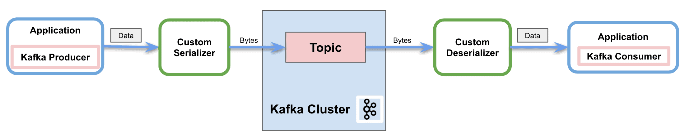

# [Apache Kafka中的自定义序列化器](https://www.baeldung.com/kafka-custom-serializer)

1. 简介

    在 Apache Kafka 中传输消息时，客户端和服务器会商定使用一种通用的语法格式。Apache Kafka 提供默认转换器（如 String 和 Long），但也支持针对特定用例的自定义序列化器。在本教程中，我们将了解如何实现它们。

2. Apache Kafka 中的序列化器

    序列化是将对象转换成字节的过程。反序列化则是将字节流转换为对象的逆过程。简而言之，它将内容转换为可读和可解释的信息。

    正如我们提到的，Apache Kafka 为几种基本类型提供了默认序列化器，并允许我们实现自定义序列化器：

    

    上图显示了通过网络向 Kafka 主题发送消息的过程。在这个过程中，自定义序列化器会在生产者将消息发送到主题之前将对象转换成字节。同样，它也显示了反序列化器如何将字节转换回对象，以便消费者正确处理。

    1. 自定义序列化器

        Apache Kafka 为几种基本类型提供了预置的序列化器和反序列化器：

        - [字符串序列化器](https://kafka.apache.org/24/javadoc/org/apache/kafka/common/serialization/StringSerializer.html)
        - [短序列化器](https://kafka.apache.org/24/javadoc/org/apache/kafka/common/serialization/ShortSerializer.html)
        - [整数序列化器](https://kafka.apache.org/24/javadoc/org/apache/kafka/common/serialization/IntegerSerializer.html)
        - [长序列化器](https://kafka.apache.org/24/javadoc/org/apache/kafka/common/serialization/LongSerializer.html)
        - [双序列化器](https://kafka.apache.org/24/javadoc/org/apache/kafka/common/serialization/DoubleSerializer.html)
        - [字节序列化器](https://kafka.apache.org/24/javadoc/org/apache/kafka/common/serialization/BytesSerializer.html)

        但它也提供了实现自定义（去）序列化器的功能。为了序列化我们自己的对象，我们将实现[序列化器](https://kafka.apache.org/24/javadoc/org/apache/kafka/common/serialization/Serializer.html)接口。同样，为了创建自定义的反序列化器，我们将实现[反序列化器](https://kafka.apache.org/24/javadoc/org/apache/kafka/common/serialization/Deserializer.html) 接口。

        这两个接口都有可覆盖的方法：

        - configure：用于实现配置细节
        - 序列化/反序列化(serialize/deserializer)： 这些方法包括自定义序列化和反序列化的实际实现。
        - close：使用该方法关闭 Kafka 会话。

3. 在 Apache Kafka 中实现自定义序列化器

    Apache Kafka 提供了自定义序列化器的功能。不仅可以为消息值实现特定的转换器，还可以为键实现特定的转换器。

    1. 依赖关系

        要实现示例，我们只需在 pom.xml 中添加 Kafka Consumer API 依赖项即可：

        ```xml
        <dependency>
            <groupId>org.apache.kafka</groupId>
            <artifactId>kafka-clients</artifactId>
            <version>3.4.0</version>
        </dependency>
        ```

    2. 自定义序列化器

        首先，我们将使用 [Lombok](https://www.baeldung.com/intro-to-project-lombok) 来指定要通过 Kafka 发送的自定义对象：

        ```java
        @Data
        @AllArgsConstructor
        @NoArgsConstructor
        @Builder
        public class MessageDto {
            private String message;
            private String version;
        }
        ```

        接下来，我们将实现 Kafka 提供的 Serializer 接口，以便生产者发送消息：

        main/.kafka.serdes/CustomSerializer.java

        我们将覆盖接口的序列化方法。因此，在我们的实现中，我们将使用 Jackson ObjectMapper 转换自定义对象。然后，我们将返回字节流，以便将消息正确发送到网络。

    3. 自定义反序列化器

        同样，我们将为消费者实现解串器接口：

        main/.kafka.serdes/CustomDeserializer.java

        与上一节一样，我们将覆盖该接口的反序列化方法。因此，我们将使用相同的 Jackson ObjectMapper 将字节流转换为自定义对象。

    4. 消费示例消息

        让我们来看一个使用自定义序列化器和反序列化器发送和接收示例消息的工作示例。

        首先，我们将创建并配置 Kafka Producer：

        main/.kafka.serdes/KafkaSerDesLiveTest.java:createKafkaProducer()

        我们将使用自定义类配置值序列化器属性，使用默认的 StringSerializer 配置键序列化器。

        其次，我们将创建 Kafka Consumer：

        main/.kafka.serdes/KafkaSerDesLiveTest.java:createKafkaConsumer()

        除了使用自定义类的键和值反序列化器外，还必须包含组 ID。除此之外，我们还将自动偏移重置配置设为最早，以确保生产者在消费者启动前发送所有消息。

        创建好生产者和消费者客户端后，我们就可以发送一条示例消息了：

        ```java
        MessageDto msgProd = MessageDto.builder().message("test").version("1.0").build();
        KafkaProducer<String, MessageDto> producer = createKafkaProducer();
        producer.send(new ProducerRecord<String, MessageDto>(TOPIC, "1", msgProd));
        System.out.println("Message sent " + msgProd);
        producer.close();
        ```

        控制台中的结果是

        ```log
        Serializing...
        Message sent MessageDto(message=test, version=1.0)
        Deserializing...
        Message received MessageDto(message=test, version=1.0)
        ```

4. 结论

    在本教程中，我们展示了生产者如何在 Apache Kafka 中使用序列化器通过网络发送消息。同样，我们还展示了消费者如何使用反序列化器来解释收到的消息。

    此外，我们还学习了可用的默认序列化器，以及最重要的实现自定义序列化器和反序列化器的能力。
