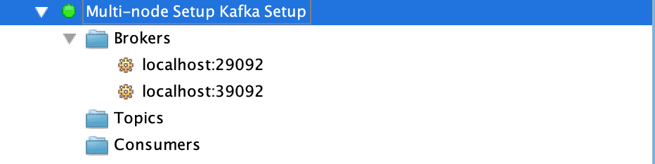

# [使用 Docker 设置 Apache Kafka 指南](https://www.baeldung.com/ops/kafka-docker-setup)

1. 概述

    Docker 是软件行业中最流行的容器引擎之一，用于创建、打包和部署应用程序。

    在本教程中，我们将学习如何使用 Docker 进行 Apache Kafka 设置。

    重要的是，自 2.8.0 版起，Apache Kafka 支持不依赖 ZooKeeper 的模式。此外，自 Confluent Platform 7.5 起，ZooKeeper 已被弃用。因此，我们特别注明 ZooKeeper 和 Kafka 容器的版本均为 7.4.4。

2. 单节点设置

    单节点的 Kafka 代理设置可以满足本地开发的大部分需求，所以我们先来学习一下这个简单的设置。

    1. docker-compose.yml 配置

        要启动 Apache Kafka 服务器，我们首先需要启动 Zookeeper 服务器。

        我们可以在 docker-compose.yml 文件中配置这一依赖关系，这样就能确保 Zookeeper 服务器总是先于 Kafka 服务器启动，然后再停止。

        让我们创建一个简单的 docker-compose.yml 文件，其中包含两个服务，即 zookeeper 和 kafka：

        ```yml
        $ cat docker-compose.yml
        version: '2'
        services:
        zookeeper:
            image: confluentinc/cp-zookeeper:7.4.4
            environment:
            ZOOKEEPER_CLIENT_PORT: 2181
            ZOOKEEPER_TICK_TIME: 2000
            ports:
            - 22181:2181
        
        kafka:
            image: confluentinc/cp-kafka:7.4.4
            depends_on:
            - zookeeper
            ports:
            - 29092:29092
            environment:
            KAFKA_BROKER_ID: 1
            KAFKA_ZOOKEEPER_CONNECT: zookeeper:2181
            KAFKA_ADVERTISED_LISTENERS: PLAINTEXT://kafka:9092,PLAINTEXT_HOST://localhost:29092
            KAFKA_LISTENER_SECURITY_PROTOCOL_MAP: PLAINTEXT:PLAINTEXT,PLAINTEXT_HOST:PLAINTEXT
            KAFKA_INTER_BROKER_LISTENER_NAME: PLAINTEXT
            KAFKA_OFFSETS_TOPIC_REPLICATION_FACTOR: 1
        ```

        在此设置中，我们的 Zookeeper 服务器在端口=2181 上监听 kafka 服务，该服务定义在同一个容器设置中。不过，对于主机上运行的任何客户端，它都将暴露在 22181 端口上。

        同样，kafka 服务是通过端口 29092 暴露给主机应用程序的，但它实际上是通过 KAFKA_ADVERTISED_LISTENERS 属性配置的容器环境中的端口 9092 公开的。

    2. 启动 Kafka 服务器

        让我们使用 docker-compose 命令启动容器来启动 Kafka 服务器：

        ```bash
        $ docker-compose up -d
        Creating network "kafka_default" with the default driver
        Creating kafka_zookeeper_1 ... done
        Creating kafka_kafka_1     ... done
        ```

        现在，让我们使用 [nc](https://www.baeldung.com/linux/netcat-command#scanning-for-open-ports-using-netcat) 命令来验证两个服务器是否都在监听各自的端口：

        ```bash
        $ nc -zv localhost 22181
        Connection to localhost port 22181 [tcp/*] succeeded!
        $ nc -zv localhost 29092
        Connection to localhost port 29092 [tcp/*] succeeded!
        ```

        此外，我们还可以在容器启动时检查verbose日志，验证Kafka服务器是否启动：

        ```bash
        $ docker-compose logs kafka | grep -i started
        kafka_1      | [2024-02-26 16:06:27,352] DEBUG [ReplicaStateMachine controllerId=1] Started replica state machine with initial state -> HashMap() (kafka.controller.ZkReplicaStateMachine)
        kafka_1      | [2024-02-26 16:06:27,354] DEBUG [PartitionStateMachine controllerId=1] Started partition state machine with initial state -> HashMap() (kafka.controller.ZkPartitionStateMachine)
        kafka_1      | [2024-02-26 16:06:27,365] INFO [KafkaServer id=1] started (kafka.server.KafkaServer)
        ```

        这样，我们的 Kafka 设置就可以使用了。

    3. 使用 Kafka 工具连接

        最后，让我们使用 [Kafka Tool](https://kafkatool.com/download.html) GUI 工具与新创建的 Kafka 服务器建立连接，稍后我们将对这一设置进行可视化。

        值得注意的是，我们可能需要使用 Bootstrap servers 属性从主机连接到监听端口为 29092 的 Kafka 服务器。

        

        最后，我们应该能在左侧边栏上看到可视化连接。

        

        由于是新设置，因此主题和消费者的条目是空的。一旦我们有了一些主题，就应该可以跨分区可视化数据了。此外，如果有活跃的消费者连接到我们的 Kafka 服务器，我们也可以查看它们的详细信息。

3. Kafka 集群设置

    对于更稳定的环境，我们需要一个弹性设置。让我们扩展 docker-compose.yml 文件，创建一个多节点的 Kafka 集群设置。

    1. docker-compose.yml 配置

        Apache Kafka 的集群设置需要为 Zookeeper 服务器和 Kafka 服务器提供冗余。

        因此，让我们为 Zookeeper 和 Kafka 服务各添加一个节点的配置：

        ```yaml
        $ cat docker-compose.yml
        ---
        version: '2'
        services:
        zookeeper-1:
            image: confluentinc/cp-zookeeper:7.4.4
            environment:
            ZOOKEEPER_CLIENT_PORT: 2181
            ZOOKEEPER_TICK_TIME: 2000
            ports:
            - 22181:2181

        zookeeper-2:
            image: confluentinc/cp-zookeeper:7.4.4
            environment:
            ZOOKEEPER_CLIENT_PORT: 2181
            ZOOKEEPER_TICK_TIME: 2000
            ports:
            - 32181:2181
        
        kafka-1:
            image: confluentinc/cp-kafka:7.4.4
            depends_on:
            - zookeeper-1
            - zookeeper-2

            ports:
            - 29092:29092
            environment:
            KAFKA_BROKER_ID: 1
            KAFKA_ZOOKEEPER_CONNECT: zookeeper-1:2181,zookeeper-2:2181
            KAFKA_ADVERTISED_LISTENERS: PLAINTEXT://kafka-1:9092,PLAINTEXT_HOST://localhost:29092
            KAFKA_LISTENER_SECURITY_PROTOCOL_MAP: PLAINTEXT:PLAINTEXT,PLAINTEXT_HOST:PLAINTEXT
            KAFKA_INTER_BROKER_LISTENER_NAME: PLAINTEXT
            KAFKA_OFFSETS_TOPIC_REPLICATION_FACTOR: 1
        kafka-2:
            image: confluentinc/cp-kafka:7.4.4
            depends_on:
            - zookeeper-1
            - zookeeper-2
            ports:
            - 39092:39092
            environment:
            KAFKA_BROKER_ID: 2
            KAFKA_ZOOKEEPER_CONNECT: zookeeper-1:2181,zookeeper-2:2181
            KAFKA_ADVERTISED_LISTENERS: PLAINTEXT://kafka-2:9092,PLAINTEXT_HOST://localhost:39092
            KAFKA_LISTENER_SECURITY_PROTOCOL_MAP: PLAINTEXT:PLAINTEXT,PLAINTEXT_HOST:PLAINTEXT
            KAFKA_INTER_BROKER_LISTENER_NAME: PLAINTEXT
            KAFKA_OFFSETS_TOPIC_REPLICATION_FACTOR: 1
        ```

        重要的是，我们应确保所有服务的服务名称和 KAFKA_BROKER_ID 都是唯一的。

        此外，每个服务都必须向主机暴露唯一的端口。尽管 zookeeper-1 和 zookeeper-2 在 2181 端口监听，但它们分别通过 22181 和 32181 端口向主机公开。同样的逻辑也适用于 kafka-1 和 kafka-2 服务，它们分别监听 29092 和 39092 端口。

    2. 启动 Kafka 集群

        让我们使用 docker-compose 命令来启动集群：

        ```bash
        $ docker-compose up -d
        Creating network "kafka_default" with the default driver
        Creating kafka_zookeeper-1_1 ... done
        Creating kafka_zookeeper-2_1 ... done
        Creating kafka_kafka-2_1     ... done
        Creating kafka_kafka-1_1     ... done
        ```

        集群启动后，让我们使用 Kafka 工具，通过为 Kafka 服务器和各自的端口指定以逗号分隔的值来连接集群：

        

        最后，让我们来看看集群中可用的多个代理节点：

        

4. 结论

    在本文中，我们使用 Docker 技术创建了 Apache Kafka 的单节点和多节点设置。

    我们还使用 Kafka 工具连接并可视化配置的代理服务器详细信息。
