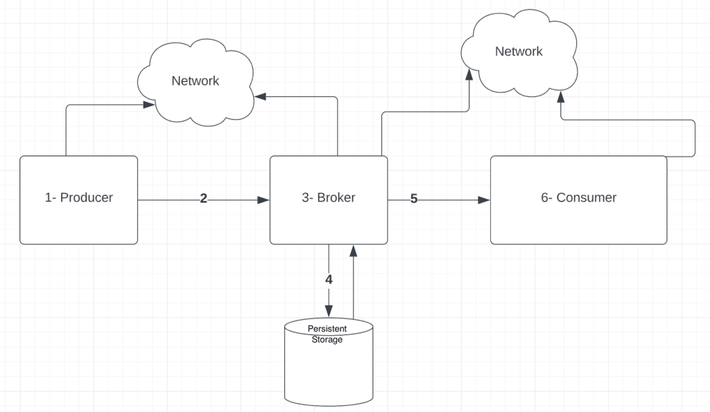
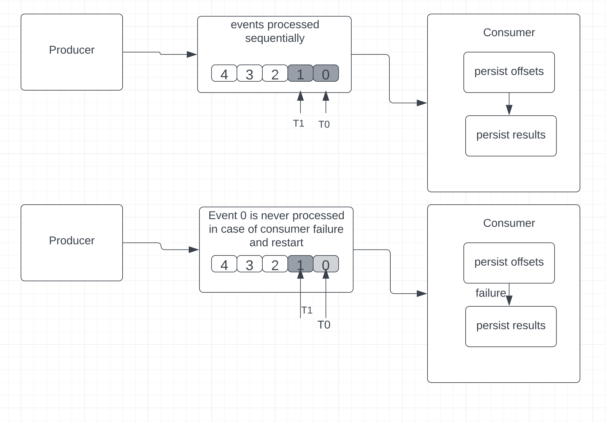
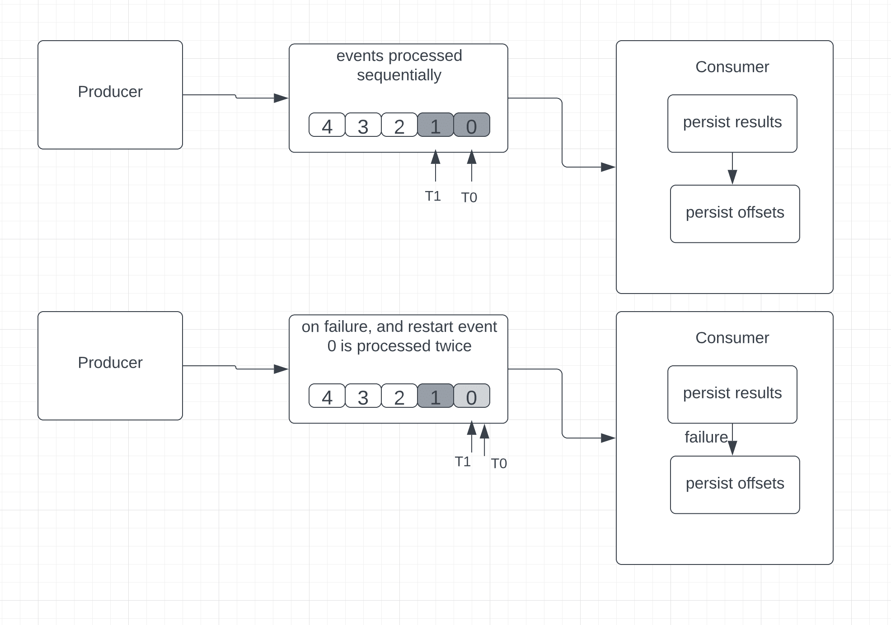
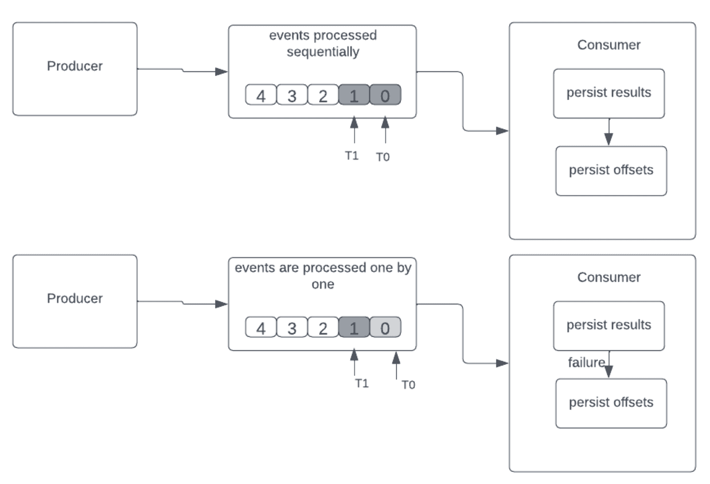

# 流媒体平台中的信息传递语义

1. 概述

    在本教程中，我们将讨论流媒体平台中的消息传递语义。

    首先，我们将快速了解流媒体平台主要组件中的事件流。接下来，我们将讨论此类平台中数据丢失和重复的常见原因。然后，我们将重点讨论现有的三种主要交付语义。

    我们将讨论如何在流媒体平台中实现这些语义，以及它们如何处理数据丢失和重复问题。

    在每种交付语义中，我们都将简要介绍在 Apache Kafka 中获得交付保证的方法。

2. 流平台的基础知识

    简单地说，Apache Kafka 和 Apache ActiveMQ 等流媒体平台以实时或接近实时的方式处理来自一个或多个源（也称为生产者）的事件，并将其传递到一个或多个目的地（也称为消费者），以便进一步处理、转换、分析或存储。

    生产者和消费者通过经纪商解耦，从而实现了可扩展性。
    流媒体应用的一些用例包括：电子商务网站的大量用户活动跟踪、实时金融交易和欺诈检测、需要实时处理的自主移动设备等。

    信息传输平台有两个重要的考虑因素：

    - 准确性
    - 延迟

    在[分布式实时系统](https://www.baeldung.com/cs/distributed-systems-guide)中，我们常常需要在延迟和准确性之间做出权衡，这取决于什么对系统更重要。

    这时，我们需要了解流媒体平台开箱即提供的传输保证，或使用消息元数据和平台配置实现所需的传输保证。

    接下来，让我们简单了解一下流媒体平台中的数据丢失和重复问题，然后再讨论管理这些问题的交付语义。

3. 可能出现的数据丢失和重复情况

    为了理解流媒体平台中的数据丢失和/或重复，让我们快速后退一步，看看流媒体平台中的高层事件流：

    

    在这里，我们可以看到，从生产者到消费者的流程中可能存在多个故障点。

    这通常会导致数据丢失、滞后和信息重复等问题。

    让我们聚焦上图中的每个组件，看看可能会出现什么问题，以及对流系统可能造成的后果。

    1. 生产者故障

        生产者故障会导致一些问题：

        - 生产者生成消息后，可能会在通过网络发送之前发生故障。这可能会导致数据丢失。
        - 生产者在等待接收来自代理的确认时可能会发生故障。当生产者恢复时，它会假定缺少来自代理的确认，尝试重新发送信息。这可能会在代理处造成数据重复。

    2. 生产者和代理之间的网络问题

        生产者和代理之间可能出现网络故障：

        - 生产者可能会发送一条信息，但由于网络问题，该信息从未到达过代理。
        - 也可能出现这样的情况：由于网络问题，经纪商收到信息并发送确认，但生产者从未收到确认。

        在这两种情况下，生产者都会重新发送信息，从而导致数据在代理处重复。

    3. 代理故障

        同样，代理故障也会导致数据重复：

        - 在将消息提交到持久化存储之后、向生产者发送确认之前，代理可能会发生故障。这会导致生产者重新发送数据，造成数据重复。
        - 代理服务器可能会跟踪消费者迄今为止已读取的消息。中介可能会在提交此信息前发生故障。这会导致消费者多次读取同一信息，从而造成数据重复。

    4. 消息持久性问题

        从内存状态向磁盘写入数据时可能会发生故障，导致数据丢失。

    5. 用户与代理之间的网络问题

        代理和消费者之间可能出现网络故障：

        - 尽管代理发送了报文并记录了它发送了报文，但消费者可能永远收不到报文。
        - 同样，消费者可能会在收到信息后发送确认，但确认可能永远不会到达代理。

        在这两种情况下，代理都可能重新发送信息，导致数据重复。

    6. 消费者故障

        - 消费者可能在处理报文前发生故障。
        - 消费者可能在持久化存储中记录其处理了消息之前发生故障。
        - 消费者也可能在记录处理信息后、发送确认之前发生故障。

        这可能导致消费者再次向代理请求相同的消息，造成数据重复。

        接下来，让我们看看流媒体平台中可用来处理这些问题的传输语义，以满足个别系统的要求。

4. 交付语义

    交付语义定义了流媒体平台如何在我们的流媒体应用中保证事件从源头到目的地的交付。

    有三种不同的交付语义可供选择：

    - 最多一次(at-most-once)
    - 至少一次(at-least-once)
    - 精确一次(exactly-once)

    1. 最多一次传送

        在这种方法中，消费者首先保存最后接收到的事件的位置，然后再进行处理。

        简单地说，如果事件处理中途失败，消费者重启后就无法返回读取旧事件。

        因此，无法保证成功处理所有接收到的事件。
        对于不存在数据丢失问题且不强制要求准确性的情况，"最多" 语义是理想的选择。

        以 Apache Kafka 为例，它对消息使用了偏移量（offsets），At-Most-Once 保证的顺序是

        - 持久化偏移量
        - 持续结果

        为了在 Kafka 中启用 "最多一次(At-Most-Once)" 语义，我们需要在消费者处将 "enable.auto.commit" 设置为 "true"。

        如果出现故障，消费者重新启动，它就会查看上次持久化的偏移量。由于偏移量是在实际事件处理之前持久化的，因此我们无法确定消费者收到的每个事件是否都已成功处理。在这种情况下，消费者可能会错过一些事件。

        让我们将这一语义形象化：

        

    2. 至少一次交付

        在这种方法中，消费者处理接收到的事件，将结果持久化，最后保存最后接收到的事件的位置。

        与 "最多一次" 不同的是，如果出现故障，消费者可以读取并重新处理旧事件。

        在某些情况下，这会导致数据重复。举个例子，消费者在处理和保存事件后，但在保存最后一个已知事件位置（也称为偏移量）前发生故障。

        消费者将重新启动并从偏移位置读取数据。在这种情况下，消费者会对事件进行不止一次的重新处理，因为即使在故障发生前已成功处理了报文，但最后收到的事件的位置却没有被成功保存：

        

        这种方法非常适合任何更新股票或仪表以显示当前值的应用程序。但是，需要精确聚合的使用案例（如总和和计数器）并不适合采用 "至少一次 " 处理，这主要是因为重复事件会导致不正确的结果。

        因此，在这种交付语义中，数据不会丢失，但可能会出现同一事件被重新处理的情况。

        为了避免重复处理同一事件，我们可以使用幂等消费者。

        从本质上讲，empotent 消费者可以多次消费一条信息，但只处理一次。

        结合以下方法，就能在至少一次交付中使用empotent 消费者：

        - 生产者为每条信息分配一个唯一的信息 ID。
        - 消费者在数据库中维护所有已处理信息的记录。
        - 当有新消息到达时，消费者会根据持久存储表中现有的 messageIds 对其进行检查。
        - 如果出现匹配，消费者会更新偏移量，而不会重新消费，并发送回执，从而有效地将信息标记为已消费。
        - 如果事件尚未出现，数据库事务就会启动，并插入一个新的信息 ID。接下来，会根据所需的业务逻辑处理这条新信息。消息处理完成后，事务将最终提交。

        在 Kafka 中，为确保 "至少一次" 语义，生产者必须等待来自代理的确认。

        如果没有收到来自代理的确认，生产者就会重新发送消息。

        此外，由于生产者会分批向代理写入消息，如果写入失败，生产者会重试，那么批次内的消息可能会在 Kafka 中被写入不止一次。

        不过，为了避免重复，Kafka 引入了惰性生产者（idempotent producer）功能。

        从本质上讲，为了在 Kafka 中启用至少写一次的语义，我们需要：

        - 在生产者端将属性 "ack" 设置为值 "1"
        - 在消费者端将 "enable.auto.commit" 属性设置为 "false"
        - 将 "enable.idempotence" 属性设置为 "true"
        - 将序列号和生产者 ID 附加到来自生产者的每条消息上

        Kafka Broker 可以使用序列号和生产者 ID 识别主题上的重复消息。

    3. 一次准确交付

        这种交付保证与至少一次（at-least-once）语义类似。首先，对收到的事件进行处理，然后将处理结果存储在某处。如果发生故障或重启，消费者可以重新读取和处理旧事件。不过，与最少一次处理不同的是，任何重复的事件都会被丢弃，不会被处理，从而实现一次处理。

        这非常适合任何对精确度要求较高的应用，如涉及精确计数器等聚合的应用，或其他任何只需对事件进行一次无损处理的应用。

        处理顺序如下

        - 持续结果
        - 持续偏移

        在下图中，我们可以看到当消费者处理完事件但未保存偏移量时发生故障的情况：

        

        我们可以通过以下几种方法来消除actly-once语义中的重复：

        - idempotent更新--我们将根据生成的唯一密钥或ID保存结果。在重复的情况下，生成的密钥或 ID 将已经存在于结果中（例如数据库），因此消费者可以删除重复而无需更新结果
        - 事务更新--我们将以批次的形式保存结果，这需要一个事务开始和一个事务提交，因此一旦提交，事件将被成功处理。在这里，我们只需删除重复的事件，而无需更新结果。

        让我们看看在 Kafka 中[启用精确一次性语义](https://www.baeldung.com/kafka-exactly-once)需要做些什么：

        - 通过为每个生产者设置唯一的 "transaction.id" 值，在生产者上启用empotent生产者和事务功能
        - 通过将属性 "isolation.level" 设置为 "read_committed" 值，启用消费者的事务功能

5. 结论

    在本文中，我们了解了流媒体平台中使用的三种交付语义之间的差异。

    在简要介绍了流式平台中的事件流之后，我们探讨了数据丢失和重复的问题。然后，我们了解了如何使用各种交付语义来缓解这些问题。然后，我们研究了 "最少一次" 交付，接着是 "最多一次" 交付，最后是 "完全一次" 交付语义。
