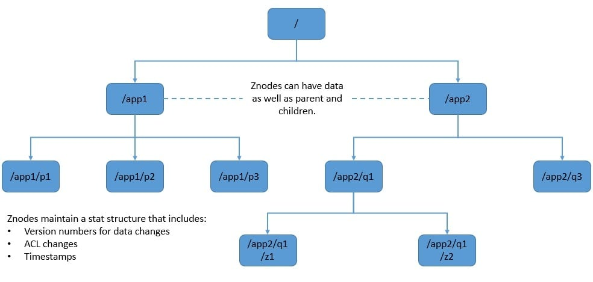
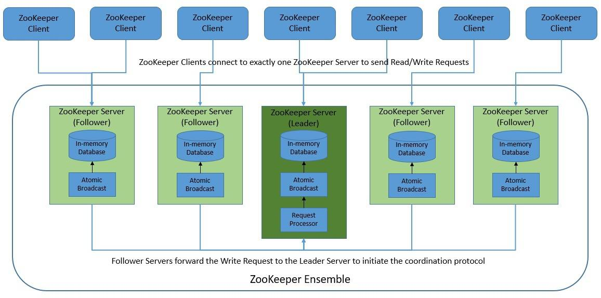
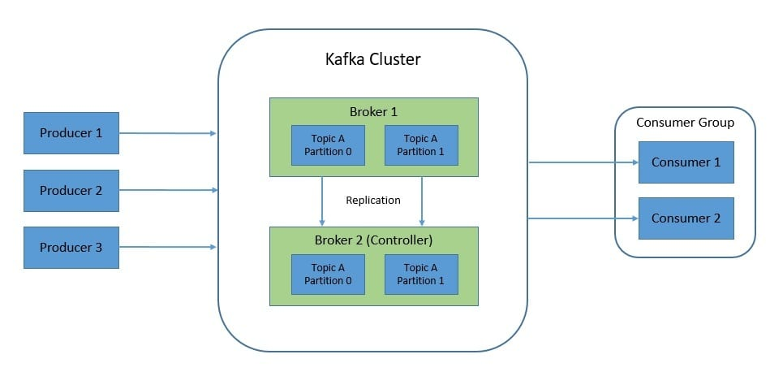
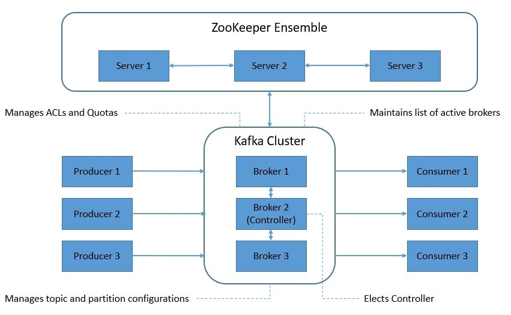
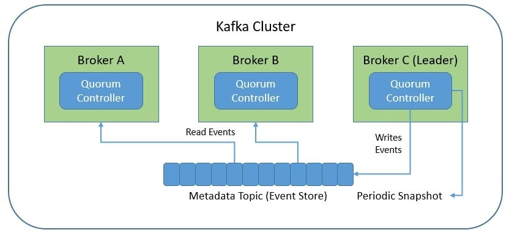

# 卡夫卡从 ZooKeeper 到 Kraft 的转变

1. 简介

    Kafka 最近在架构上从 ZooKeeper 转向了基于法定人数的控制器，后者使用了一种名为 Kafka Raft 的新共识协议，简称为 Kraft（发音为 "craft"）。

    在本教程中，我们将探讨 Kafka 做出这一决定的原因，以及这一改变如何简化了其架构并使其功能更加强大。

2. ZooKeeper 简介

    [ZooKeeper](https://zookeeper.apache.org/) 是一种实现高度可靠的分布式协调的服务。它最初由雅虎开发，用于简化在大数据集群上运行的流程。它最初是 Hadoop 的一个子项目，后来在 2008 年成为一个独立的 Apache 基金会项目。它被广泛应用于大型分布式系统中的多个用例。

    1. ZooKeeper 架构

        ZooKeeper 将数据存储在一个分级命名空间中，类似于标准的文件系统。命名空间由称为 [znodes](https://www.baeldung.com/java-zookeeper) 的数据寄存器组成。名称是由斜线分隔的路径元素序列。

        名称空间中的每个节点都由一个路径来标识：

        

        ZooKeeper 命名空间中可以有三种类型的 znodes：

        - 第一种是持久型，即默认类型，在删除前一直保留在 ZooKeeper 中。
        - 第二种是短暂型，如果创建znode的会话断开连接，它就会被删除。此外，短暂znode不能有子节点。
        - 第三种是顺序型，我们可以用它来创建 ID 等顺序号。

        通过其简单的架构，ZooKeeper 提供了一个具有快速处理和可扩展性的可靠系统。ZooKeeper 的目的是在一组称为集合的服务器上进行复制。每台服务器都会在内存中维护一个状态映像，并在持久存储中维护一个转换日志和快照：

        

        ZooKeeper 客户端只连接到一台服务器，但如果该服务器不可用，则可故障切换到另一台服务器。读取请求由每个服务器数据库的本地副本提供服务。写入请求由协议处理。这包括将所有此类请求转发给领导者服务器，由其使用 ZooKeeper 原子广播（[ZAB](https://zookeeper.apache.org/doc/r3.4.13/zookeeperInternals.html#sc_atomicBroadcast)）协议进行协调。

        基本上，原子消息传递是 ZooKeeper 的核心，它能让所有服务器保持同步。它能确保信息的可靠传递。此外，它还能确保信息按照完整的因果顺序传递。消息传递系统基本上是在服务器之间建立点对点的先进先出（FIFO）通道，利用 TCP 进行通信。

    2. ZooKeeper 的使用

        ZooKeeper 为来自客户端的所有更新提供顺序一致性和原子性。而且，它不允许并发写入。此外，无论客户端连接到哪个服务器，都能看到相同的服务视图。总之，ZooKeeper 为高性能、高可用性和严格的有序访问提供了出色的保证。

        ZooKeeper 还实现了极高的吞吐量和极低的延迟。这些特性使它非常适合解决大型分布式系统中的一些协调问题。其中包括命名服务、配置管理、数据同步、领导者选举、消息队列和通知系统等用例。

3. Kafka 中的 ZooKeeper

    Kafka 是一个分布式事件存储和流处理平台。它最初由 LinkedIn 开发，随后于 2011 年在 Apache 软件基金会下开源。Kafka 为处理实时数据馈送提供了一个高吞吐量、低延迟的平台。它被广泛用于流式分析和数据集成等高性能用例。

    1. Kafka 架构

        Kafka 是一个分布式系统，由使用基于二进制 TCP 协议进行通信的服务器和客户端组成。它以一个或多个服务器（也称为 "代理"）集群的形式运行。代理还充当事件的存储层。

        Kafka 将事件持久地组织在主题中。主题可以有零个、一个或多个生产者和消费者。主题还可以分区，并分布在不同的代理服务器上，以实现高度的可扩展性。此外，每个主题还可以在集群中复制。

        

        在 Kafka 集群中，其中一个代理作为控制器。控制器负责管理分区和副本的状态，并执行重新分配分区等管理任务。在任何时候，集群中都只能有一个控制器。

        客户端使应用程序能够以并行、大规模和容错的方式读取、写入和处理事件流。生产者是向 Kafka 发布事件的客户端应用程序。同时，消费者是从 Kafka 订阅这些事件的。

    2. ZooKeeper 的作用

        Kafka 的设计属性使其具有高可用性和容错性。但是，作为一个分布式系统，Kafka 需要一种机制来协调所有活动代理之间的多个决策。它还需要对集群及其配置保持一致的看法。长期以来，Kafka 一直使用 ZooKeeper 来实现这一目标。

        基本上，在最近改用 Kraft 之前，ZooKeeper 一直充当 Kafka 的元数据管理工具，以完成几个关键功能：

        

        - 控制器选举(Controller Election)： 控制器选举在很大程度上依赖于 ZooKeeper。为了选举控制器，每个代理都会尝试在 ZooKeeper 中创建一个短暂节点。第一个创建该短暂节点的代理将担任控制者角色，并被分配一个控制者纪元。
        - 集群成员(Cluster Membership)： ZooKeeper 在管理集群中的代理成员资格方面发挥着重要作用。当一个代理连接到 ZooKeeper 实例时，就会在一个组 znode 下创建一个短暂的 znode。如果代理失败，这个短暂的 znode 就会被删除。
        - 主题配置(Topic Configuration)： Kafka 为 ZooKeeper 中的每个主题维护一组配置。这些配置可以是每个主题的，也可以是全局的。它还存储了现有主题列表、每个主题的分区数量和副本位置等详细信息。
        - 访问控制列表（ACLs）： Kafka 还维护 ZooKeeper 中所有主题的 ACL。这有助于决定谁或什么人可以读取或写入每个主题。它还保存了消费者组列表和每个消费者组的成员等信息。
        - 配额(Quotas)： Kafka 中间商可以控制客户端可以使用的中间商资源。这些资源以配额的形式存储在 ZooKeeper 中。配额有两种：按字节速率阈值定义的网络带宽配额和按 CPU 使用率阈值定义的请求速率配额。

    3. ZooKeeper 的问题

        正如我们迄今为止所看到的，ZooKeeper 在 Kafka 架构中长期以来一直扮演着相当成功的重要角色。那么，他们为什么决定改变它呢？用简单明了的话来说，ZooKeeper 为 Kafka 增加了一个额外的管理层。管理分布式系统是一项复杂的任务，即使像ZooKeeper这样简单而强大。

        Kafka 并不是唯一一个需要一种机制来协调各成员任务的分布式系统。还有其他一些系统，如 MongoDB、Cassandra 和 Elasticsearch，它们都以各自的方式解决了这个问题。不过，它们并不依赖于像 ZooKeeper 这样的外部工具来进行元数据管理。基本上，它们依赖内部机制来实现这一目的。

        除了其他好处外，它还使部署和运行管理变得更加简单。试想一下，如果我们只需管理一个分布式系统，而不是两个！此外，由于元数据处理效率更高，这也提高了可扩展性。将元数据存储在 Kafka 内部而不是 ZooKeeper 中，可以让元数据的管理变得更容易，并提供更好的保证。

4. 卡夫卡筏（Kraft）协议

    受带有 ZooKeeper 的 Kafka 复杂性的启发，有人提交了一份 Kafka 改进提案（KIP），用一个自我管理的元数据法定人数来取代 ZooKeeper。虽然基础 KIP 500 定义了愿景，但随后又有多个 KIP 来解决细节问题。作为 Kafka 2.8 的一部分，自管理模式首次作为早期访问版本发布。

    自管理模式整合了 Kafka 内部的元数据管理责任。该模式利用了 Kafka 中新的法定人数控制器服务。法定人数控制器使用事件源存储模型。此外，它还使用 Kafka Raft（Kraft）作为共识协议，以确保元数据在法定人数中得到准确复制。

    Kraft 基本上是 Raft 共识协议的一个基于事件的变体。它也类似于 ZAB 协议，但有一个显著区别，即它使用的是事件驱动架构。法定人数控制器使用事件日志来存储状态，并定期将其删节为快照，以防止其无限增长：

    

    其中一个法定人数控制器作为领导者，在 Kafka 的元数据主题中创建事件。法定人数中的其他控制器通过响应这些事件来跟随领导控制器。当其中一个代理因分区而发生故障时，它可以在重新加入时从日志中补回错过的事件。这就减少了不可用窗口。

    与基于 ZooKeeper 的控制器不同，法定人数控制器无需从 ZooKeeper 加载状态。当领导层发生变化时，新的活动控制器内存中已经有了所有已提交的元数据记录。此外，同样的事件驱动机制也用于跟踪整个集群中的所有元数据。

5. 简化且更好的 Kafka！

    改用基于法定人数的控制器应该会给 Kafka 社区带来极大的便利。首先，系统管理员将更容易监控、管理和支持 Kafka。开发人员将不得不处理整个系统的单一安全模型。此外，我们还有一个轻量级的单进程部署来开始使用 Kafka。

    新的元数据管理还显著提高了 Kafka 的控制平面性能。首先，它允许控制器更快地进行故障切换。基于 ZooKeeper 的元数据管理一直是整个集群分区限制的瓶颈。新的法定人数控制器旨在处理每个集群中数量更多的分区。

    自 Kafka 2.8 版起，自管理（Kraft）模式与 ZooKeeper 同时可用。它在 3.0 版本中作为预览功能发布。最后，经过多项改进，它在 3.3.1 版中被宣布为生产就绪。Kafka 可能会在 3.4 版本中淘汰 ZooKeeper。不过，可以肯定地说，Kafka 的使用体验已经有了显著改善！

6. 总结

    在本文中，我们讨论了 ZooKeeper 的细节以及它在 Kafka 中扮演的角色。此外，我们还介绍了该架构的复杂性，以及 Kafka 选择用基于法定人数的控制器来取代 ZooKeeper 的原因。

    最后，我们介绍了这一变化在简化架构和提高可扩展性方面给 Kafka 带来的好处。
