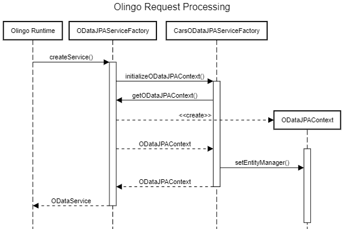

# [使用 Olingo 学习 OData](https://www.baeldung.com/olingo)

1. 简介

    本教程是《OData 协议指南》的后续教程，我们在该指南中探讨了 OData 协议的基础知识。

    现在，我们将了解如何使用 Apache Olingo 库实现一个简单的 OData 服务。

    该库提供了一个使用 OData 协议公开数据的框架，从而允许以标准为基础轻松访问那些原本被锁在内部数据库中的信息。

2. 什么是 Olingo？

    Olingo 是 Java 环境中的 "特色" OData 实现之一，另一个是 [SDL OData Framework](https://github.com/sdl/odata)。它由 Apache 基金会维护，由三个主要模块组成：

    - Java V2 - 支持 OData V2 的客户端和服务器库
    - Java V4 - 支持 OData V4 的服务器库
    - Javascript V4--支持 OData V4 的 Javascript 客户端库

    在本文中，我们将只介绍支持与 JPA 直接集成的服务器端 V2 Java 库。由此产生的服务支持 CRUD 操作和其他 OData 协议功能，包括排序、分页和过滤。

    另一方面，Olingo V4 只处理协议的底层方面，如内容类型协商和 URL 解析。这就意味着我们开发人员需要编写所有细节代码，如元数据生成、根据 URL 参数生成后端查询等。

    至于 JavaScript 客户端库，我们暂不考虑，因为 OData 是基于 HTTP 的协议，我们可以使用任何 REST 库来访问它。

3. Olingo Java V2 服务

    让我们用两个实体集创建一个简单的 OData 服务，这两个实体集我们已经在协议本身的简要介绍中使用过了。Olingo V2 的核心是一组 JAX-RS 资源，因此，我们需要提供使用它所需的基础架构。也就是说，我们需要一个 JAX-RS 实现和一个兼容的 servlet 容器。

    在本例中，我们选择使用 Spring Boot，因为它能快速创建合适的环境来托管我们的服务。我们还将使用 Olingo 的 JPA 适配器，它可以直接与用户提供的 EntityManager "对话"，以便收集创建 OData EntityDataModel 所需的所有数据。

    虽然这不是一个严格的要求，但包含 JPA 适配器大大简化了创建服务的任务。

    除了标准的 Spring Boot 依赖项，我们还需要添加几个 Olingo 的 jar：

    ```xml
    <dependency>
        <groupId>org.apache.olingo</groupId>
        <artifactId>olingo-odata2-core</artifactId>
        <version>2.0.11</version>
        <exclusions>
            <exclusion>
                <groupId>javax.ws.rs</groupId>
                <artifactId>javax.ws.rs-api</artifactId>
            </exclusion>
        </exclusions>
    </dependency>
    <dependency>
        <groupId>org.apache.olingo</groupId>
        <artifactId>olingo-odata2-jpa-processor-core</artifactId>
        <version>2.0.11</version>
    </dependency>
    <dependency>
        <groupId>org.apache.olingo</groupId>
        <artifactId>olingo-odata2-jpa-processor-ref</artifactId>
        <version>2.0.11</version>
        <exclusions>
            <exclusion>
                <groupId>org.eclipse.persistence</groupId>
                <artifactId>eclipselink</artifactId>
            </exclusion>
        </exclusions>
    </dependency>
    ```

    这些库的最新版本可从 Maven 的中央仓库获取：

    - olingo-odata2-core
    - olingo-odata2-jpa-processor-core
    - olingo-odata2-jpa-processor-ref

    我们需要将这些排除在此列表之外，因为 Olingo 依赖 EclipseLink 作为其 JPA 提供者，而且使用的 JAX-RS 版本与 Spring Boot 不同。

    1. 领域类

        使用 Olingo 实现基于 JPA 的 OData 服务的第一步是创建域实体。在这个简单的示例中，我们将只创建两个类：CarMaker 和 CarModel，它们之间只有一对多的关系：

        main/.examples.olingo2.domain/CarMaker.java

        main/.examples.olingo2.domain/CarModel.java

    2. ODataJPAServiceFactory 的实现

        为了从 JPA 域提供数据服务，我们需要向 Olingo 提供的关键组件是一个名为 ODataJPAServiceFactory 的抽象类的具体实现。该类应扩展 ODataServiceFactory，并充当 JPA 和 OData 之间的适配器。我们将以我们领域的主题命名该工厂为 CarsODataJPAServiceFactory：

        main/.examples.olingo2/CarsODataJPAServiceFactory.java:initializeODataJPAContext()

        Olingo 会调用该类的 initializeJPAContext() 方法来获取用于处理每个 OData 请求的新 ODataJPAContext。在这里，我们使用基础类中的 getODataJPAContext() 方法获取一个 "plain" 实例，然后对其进行一些定制。

        这个过程有些复杂，所以让我们画一个 UML 序列来直观地说明这一切是如何发生的：

        

        请注意，我们有意使用 setEntityManager() 而不是 setEntityManagerFactory()。我们可以从 Spring 获取一个实体管理器，但如果将其传递给 Olingo，就会与 Spring Boot 处理生命周期的方式相冲突，尤其是在处理事务时。

        因此，我们将采用传递一个已有的 EntityManager 实例的方式，并告知其生命周期由外部管理。注入的 EntityManager 实例来自当前请求的一个可用属性。我们稍后会看到如何设置该属性。

    3. Jersey资源注册

        下一步是向 Olingo 运行时注册我们的 ServiceFactory，并向 JAX-RS 运行时注册 Olingo 的入口点。我们将在 ResourceConfig 派生类中完成这项工作，同时定义服务的 OData 路径为 /odata：

        main/.examples.olingo2/JerseyConfig.java

        Olingo 提供的 ODataApplication 是一个普通的 JAX-RS 应用程序类，它使用标准回调 getClasses() 注册了几个提供程序。

        除了 ODataRootLocator 类，我们可以使用其他所有类。该类负责使用 Java 的 newInstance() 方法实例化我们的 ODataJPAServiceFactory 实现。但是，由于我们希望由 Spring 来代为管理，因此需要用自定义定位器来替代它。

        这个定位器是一个非常简单的 JAX-RS 资源，它扩展了 Olingo 现有的 ODataRootLocator，并在需要时返回由 Spring 管理的 ServiceFactory：

        main/.examples.olingo2/JerseyConfig.java:class CarsRootLocator

    4. 实体管理器过滤器

        实体管理器过滤器（EntityManagerFilter）是 OData 服务的最后一个剩余部分。该过滤器会在当前请求中注入一个 EntityManager，以便 ServiceFactory 可以使用它。它是一个简单的 JAX-RS @Provider 类，同时实现了 ContainerRequestFilter 和 ContainerResponseFilter 接口，因此可以正确处理事务：

        main/.examples.olingo2/JerseyConfig.java:class EntityManagerFilter

        第一个 filter() 方法在资源请求开始时调用，它使用提供的 EntityManagerFactory 创建一个新的 EntityManager 实例，然后将其置于一个属性下，以便以后由 ServiceFactory 恢复。我们还跳过了 GET 请求，因为它不应该有任何副作用，所以我们不需要事务。

        第二个 filter() 方法在 Olingo 处理完请求后调用。在这里，我们也会检查请求方法，并在需要时提交事务。

    5. 测试

        让我们用简单的 curl 命令来测试我们的实现。首先，我们可以获取服务的 $metadata 文档：

        `curl http://localhost:8080/odata/$metadata`

        不出所料，该文档包含两个类型（CarMaker 和 CarModel）和一个关联。现在，让我们再玩一下我们的服务，检索顶级集合和实体：

        ```bash
        curl http://localhost:8080/odata/CarMakers
        curl http://localhost:8080/odata/CarModels
        curl http://localhost:8080/odata/CarMakers(1)
        curl http://localhost:8080/odata/CarModels(1)
        curl http://localhost:8080/odata/CarModels(1)/CarMakerDetails
        ```

        现在，让我们测试一个简单的查询，返回所有名称以 "B "开头的汽车制造商：

        `curl http://localhost:8080/odata/CarMakers?$filter=startswith(Name,'B')`

        更完整的示例 URL 列表请参阅我们的《OData 协议指南》文章。

4. 结论

    在本文中，我们了解了如何使用 Olingo V2 创建一个由 JPA 域支持的简单 OData 服务。

    截至本文撰写时，Olingo 的 JIRA 上有一个开放问题正在跟踪 V4 版 JPA 模块的工作，但最后一条评论要追溯到 2016 年。此外，SAP 的 GitHub 存储库中还有一个第三方开源 JPA 适配器，虽然尚未发布，但目前似乎比 Olingo 的适配器功能更完备。
