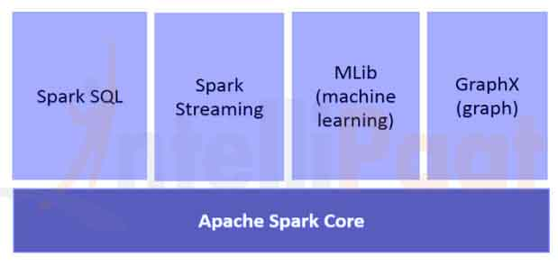

# [Apache Spark 简介](https://www.baeldung.com/apache-spark)

1. 简介

    [Apache Spark](https://spark.apache.org/) 是一个开源集群计算框架。它为 Scala、Java、Python 和 R 提供了优雅的开发 API，允许开发人员在各种数据源（包括 HDFS、Cassandra、HBase、S3 等）上执行各种数据密集型工作负载。

    从历史上看，Hadoop 的 MapReduce 对于一些迭代和交互式计算工作来说效率很低，这最终导致了 Spark 的开发。有了 Spark，我们在内存中运行逻辑的速度可以比 Hadoop 快两个数量级，或在磁盘上快一个数量级。

2. Spark 架构

    如下图所示，Spark 应用程序作为独立的进程集运行在一个集群上：

    

    这些进程集由主程序（称为驱动程序）中的 SparkContext 对象协调。SparkContext 会连接到几种类型的集群管理器（Spark 自带的独立集群管理器、Mesos 或 YARN），这些管理器会在应用程序之间分配资源。

    连接后，Spark 会获取集群节点上的执行器，这些执行器是为应用程序运行计算和存储数据的进程。

    接下来，它会将应用程序代码（由传递给 SparkContext 的 JAR 或 Python 文件定义）发送给执行器。最后，SparkContext 将任务发送给执行器运行。

3. 核心组件

    下[图](https://intellipaat.com/tutorial/spark-tutorial/apache-spark-components/)清晰地展示了 Spark 的不同组件：

    

    1. 星火核心

        Spark 核心组件负责所有基本的 I/O 功能、调度和监控 Spark 集群上的作业、任务调度、与不同存储系统联网、故障恢复和高效内存管理。

        与 Hadoop 不同，Spark 通过使用一种称为 RDD（弹性分布式数据集）的特殊数据结构，避免了将共享数据存储在亚马逊 S3 或 HDFS 等中间存储中。

        弹性分布式数据集是不可变的分区记录集合，可以并行操作，并允许容错的 “内存” 计算。

        RDD 支持两种操作：

        - 转换 - Spark RDD 转换是从现有 RDD 生成新 RDD 的函数。转换器将 RDD 作为输入，并生成一个或多个 RDD 作为输出。转换具有懒惰性，即当我们调用一个操作时，转换就会被执行。
        - 操作--转换相互创建 RDD，但当我们要处理实际数据集时，就会执行操作。因此，操作是提供非 RDD 值的 Spark RDD 操作。操作值会存储到驱动程序或外部存储系统中。

        操作是执行器向驱动程序发送数据的方式之一。

        执行器是负责执行任务的代理。而驱动程序是一个 JVM 进程，负责协调工作者和任务的执行。Spark 的一些操作包括计数和收集。

    2. Spark SQL

        Spark SQL 是用于结构化数据处理的 Spark 模块。它主要用于执行 SQL 查询。DataFrame 是 Spark SQL 的主要抽象。在 Spark 中，按命名列排序的分布式数据集合称为 DataFrame。

        Spark SQL 支持从 Hive、Avro、Parquet、ORC、JSON 和 JDBC 等不同来源获取数据。它还可使用 Spark 引擎扩展到数千个节点和多小时的查询--该引擎提供完全的查询中期容错。

    3. Spark 流

        Spark Streaming 是核心 Spark API 的扩展，可对实时数据流进行可扩展、高吞吐量、容错的流处理。数据可以从 Kafka、Flume、Kinesis 或 TCP 套接字等多个来源获取。

        最后，经过处理的数据可以推送到文件系统、数据库和实时仪表盘。

    4. Spark Mlib

        MLlib 是 Spark 的机器学习（ML）库。它的目标是使实用机器学习可扩展且简单易行。在高层次上，它提供了以下工具：

        - ML 算法--分类、回归、聚类和协同过滤等常见学习算法
        - 特征化--特征提取、转换、降维和选择
        - 管道--用于构建、评估和调整 ML 管道的工具
        - 持久性--保存和加载算法、模型和管道
        - 实用工具--线性代数、统计、数据处理等

    5. Spark GraphX

        GraphX 是用于图形和图形并行计算的组件。在高层次上，GraphX 通过引入新的图抽象扩展了 Spark RDD：有向多图，每个顶点和边都附带属性。

        为了支持图计算，GraphX 公开了一组基本运算符（如 subgraph、joinVertices 和 aggregateMessages）。

        此外，GraphX 还包含不断增加的图算法和构建器，以简化图分析任务。

4. Spark 中的 Hello World

    既然已经了解了核心组件，我们就可以开始基于 Maven 的简单 Spark 项目--用于计算字数。

    我们将演示 Spark 在本地模式下运行的情况，即所有组件都在同一台机器上本地运行，其中包括主节点、执行节点或 Spark 的独立集群管理器。

    1. Maven 设置

        让我们在 pom.xml 文件中设置一个包含 Spark 相关依赖项的 Java Maven 项目：

        ```xml
        <dependencies>
            <dependency>
                <groupId>org.apache.spark</groupId>
                <artifactId>spark-core_2.10</artifactId>
                <version>1.6.0</version>
            </dependency>
        </dependencies>
        ```

    2. 字数统计 - Spark 作业

        现在让我们编写 Spark 作业来处理包含句子的文件，并输出文件中不同的单词及其计数：

        ```java
        public static void main(String[] args) throws Exception {
            if (args.length < 1) {
                System.err.println("Usage: JavaWordCount <file>");
                System.exit(1);
            }
            SparkConf sparkConf = new SparkConf().setAppName("JavaWordCount");
            JavaSparkContext ctx = new JavaSparkContext(sparkConf);
            JavaRDD<String> lines = ctx.textFile(args[0], 1);

            JavaRDD<String> words 
            = lines.flatMap(s -> Arrays.asList(SPACE.split(s)).iterator());
            JavaPairRDD<String, Integer> ones 
            = words.mapToPair(word -> new Tuple2<>(word, 1));
            JavaPairRDD<String, Integer> counts 
            = ones.reduceByKey((Integer i1, Integer i2) -> i1 + i2);

            List<Tuple2<String, Integer>> output = counts.collect();
            for (Tuple2<?, ?> tuple : output) {
                System.out.println(tuple._1() + ": " + tuple._2());
            }
            ctx.stop();
        }
        ```

        请注意，我们将本地文本文件的路径作为参数传递给 Spark 作业。

        SparkContext 对象是 Spark 的主要入口点，代表与已运行的 Spark 集群的连接。它使用 SparkConf 对象来描述应用程序配置。SparkContext 用于以 JavaRDD 对象的形式读取内存中的文本文件。

        接下来，我们使用 flatmap 方法将 lines(行) JavaRDD 对象转换为 words(单词) JavaRDD 对象，首先将每一行转换为空格分隔的单词，然后将每一行的处理输出扁平化。

        我们再次应用转换操作 mapToPair，该操作基本上是将单词的每次出现映射为单词和计数为 1 的元组。

        然后，我们应用 reduceByKey 操作，将计数为 1 的任何单词的多次出现分组为单词元组，并将计数相加。

        最后，我们执行收集 RDD 操作，得到最终结果。

    3. 执行 Spark 作业

        现在，让我们使用 Maven 构建项目，在目标文件夹中生成 apache-spark-1.0-SNAPSHOT.jar。

        接下来，我们需要向 Spark 提交 WordCount 作业：

        ```shell
        ${spark-install-dir}/bin/spark-submit --class com.baeldung.WordCount
        --master local ${WordCount-MavenProject}/target/apache-spark-1.0-SNAPSHOT.jar
        ${WordCount-MavenProject}/src/main/resources/spark_example.txt
        ```

        运行上述命令前，需要更新 Spark 安装目录和 WordCount Maven 项目目录。

        在提交过程中，有几个步骤会在幕后进行：

        - 从驱动程序代码中，SparkContext 连接到集群管理器（在我们的例子中是本地运行的 spark 独立集群管理器）。
        - 集群管理器为其他应用程序分配资源
        - Spark 在集群节点上获取执行器。在此，我们的字数统计应用程序将获得自己的执行器进程
        - 将应用程序代码（jar 文件）发送给执行器
        - 任务由 SparkContext 发送给执行器。

        最后，Spark 作业的结果将返回给驱动程序，我们将看到文件中的字数统计作为输出：

        ```log
        Hello 1
        from 2
        Baledung 2
        Keep 1
        Learning 1
        Spark 1
        Bye 1
        ```

5. 结论

    在本文中，我们讨论了 Apache Spark 的架构和不同组件。我们还演示了一个 Spark 作业从文件中获取字数的工作示例。
