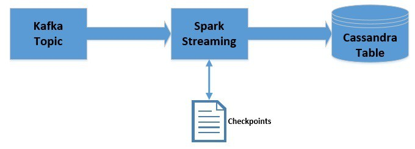

# [使用 Kafka、Spark Streaming 和 Cassandra 构建数据管道](https://www.baeldung.com/kafka-spark-data-pipeline)

1. 概述

    Apache Kafka 是一个可扩展、高性能、低延迟的平台，可以像消息系统一样读写数据流。我们可以非常容易地在 Java 中开始使用 Kafka。

    [Spark Streaming](https://spark.apache.org/streaming/) 是 [Apache Spark](https://spark.apache.org/) 平台的一部分，可以对数据流进行可扩展、高吞吐量和容错处理。虽然是用 Scala 编写的，但 [Spark 提供了 Java API](https://www.baeldung.com/apache-spark) 以供使用。

    [Apache Cassandra](http://cassandra.apache.org/) 是一种分布式宽列 NoSQL 数据存储。有关 Cassandra 的更多详情，请参阅我们之前的[文章](https://www.baeldung.com/cassandra-with-java)。

    在本教程中，我们将把它们结合起来，为实时数据流创建一个高度可扩展和容错的数据管道。

2. 安装

    首先，我们需要在本机上安装 Kafka、Spark 和 Cassandra 以运行应用程序。我们将逐步了解如何使用这些平台开发[数据管道](https://www.baeldung.com/cs/data-pipelines)。

    不过，我们将保留所有默认配置，包括所有安装的端口，这将有助于教程顺利运行。

    1. 卡夫卡

        在本地计算机上安装 Kafka 相当简单，可以在官方文档中找到。我们将使用 2.1.0 版本的 Kafka。

        此外，Kafka 需要 Apache Zookeeper 才能运行，但在本教程中，我们将使用 Kafka 附带的单节点 Zookeeper 实例。

        按照官方指南在本地启动 Zookeeper 和 Kafka 后，我们就可以创建名为 "messages" 的主题了：

        ```bash
        $KAFKA_HOME$\bin\windows\kafka-topics.bat --create \
        --zookeeper localhost:2181 \
        --replication-factor 1 --partitions 1 \
        --topic messages
        ```

        请注意，上述脚本适用于 Windows 平台，但 Unix 类平台也有类似的脚本。

    2. Spark

        Spark 使用 Hadoop 的 HDFS 和 YARN 客户端库。因此，组装所有这些库的兼容版本可能非常棘手。不过，Spark 的官方[下载](https://spark.apache.org/downloads.html)预装了常用的 Hadoop 版本。在本教程中，我们将使用为 Apache Hadoop 2.7 及更高版本预构建的 2.3.0 版本软件包。

        一旦解压了正确的 Spark 软件包，就可以使用可用脚本提交应用程序。我们稍后在 Spring Boot 中开发应用程序时将看到这一点。

    3. Cassandra

        DataStax 为包括 Windows 在内的不同平台提供 Cassandra 社区版。我们可以根据官方文档轻松下载并在本地计算机上安装。我们将使用 3.9.0 版本。

        在本地计算机上安装并启动 Cassandra 后，我们就可以创建键空间和表了。可以使用安装时随附的 CQL Shell 来完成：

        ```sql
        CREATE KEYSPACE vocabulary
            WITH REPLICATION = {
                'class' : 'SimpleStrategy',
                'replication_factor' : 1
            };
        USE vocabulary;
        CREATE TABLE words (word text PRIMARY KEY, count int);
        ```

        请注意，我们创建了一个名为 vocabulary 的命名空间和一个名为 words 的表，其中有两列：word 和 count。

3. 依赖关系

    我们可以通过 Maven 将 Kafka 和 Spark 的依赖关系集成到应用程序中。我们将从 Maven Central 提取这些依赖项：

    - Core Spark
    - SQL Spark
    - Streaming Spark
    - Streaming Kafka Spark
    - Cassandra Spark
    - Cassandra Java Spark

    我们可以相应地将它们添加到 pom 中。

    请注意，其中一些依赖项被标记为在作用域中提供。这是因为这些依赖项将由 Spark 安装程序提供，我们将使用 spark-submit 提交应用程序以供执行。

4. Spark Streaming - Kafka 集成策略

    在这一点上，值得简要谈谈 Spark 和 Kafka 的集成策略。

    Kafka 在 0.8 和 0.10 版本之间引入了新的消费者 API。因此，两个代理版本都有相应的 Spark Streaming 软件包。根据可用的代理和所需的功能选择正确的软件包非常重要。

    1. Spark Streaming Kafka 0.8

        0.8 版本是稳定的集成 API，可选择使用基于接收器的方法或直接方法。关于这些方法的详细信息，我们可以在官方[文档](https://spark.apache.org/docs/2.2.0/streaming-kafka-0-8-integration.html)中找到，这里就不赘述了。需要注意的是，该软件包兼容 Kafka Broker 0.8.2.1 或更高版本。

    2. Spark Streaming Kafka 0.10

        目前处于实验状态，仅兼容 Kafka Broker 0.10.0 或更高版本。 该软件包仅提供直接方法，现在使用新的 Kafka 消费者 API。我们可以在官方[文档](https://spark.apache.org/docs/2.2.0/streaming-kafka-0-10-integration.html)中找到更多相关细节。重要的是，它不向后兼容旧版本的 Kafka Broker。

        请注意，在本教程中，我们将使用 0.10 软件包。上一节中提到的依赖关系仅指这一点。

5. 开发数据管道

    我们将使用 Spark 在 Java 中创建一个简单的应用程序，它将与我们之前创建的 Kafka 主题集成。该应用程序将读取发布的消息，并计算每条消息中的词频。然后将在我们之前创建的 Cassandra 表中进行更新。

    让我们快速了解一下数据是如何流动的：

    

    1. 获取 JavaStreamingContext

        首先，我们将初始化 JavaStreamingContext，它是所有 Spark Streaming 应用程序的入口：

        ```java
        SparkConf sparkConf = new SparkConf();
        sparkConf.setAppName("WordCountingApp");
        sparkConf.set("spark.cassandra.connection.host", "127.0.0.1");
        JavaStreamingContext streamingContext = new JavaStreamingContext(
        sparkConf, Durations.seconds(1));
        ```

    2. 从 Kafka 获取 DStream

        现在，我们可以从 JavaStreamingContext 连接到 Kafka 主题：

        ```java
        Map<String, Object> kafkaParams = new HashMap<>();
        kafkaParams.put("bootstrap.servers", "localhost:9092");
        kafkaParams.put("key.deserializer", StringDeserializer.class);
        kafkaParams.put("value.deserializer", StringDeserializer.class);
        kafkaParams.put("group.id", "use_a_separate_group_id_for_each_stream");
        kafkaParams.put("auto.offset.reset", "latest");
        kafkaParams.put("enable.auto.commit", false);
        Collection<String> topics = Arrays.asList("messages");

        JavaInputDStream<ConsumerRecord<String, String>> messages = 
        KafkaUtils.createDirectStream(
            streamingContext, 
            LocationStrategies.PreferConsistent(), 
            ConsumerStrategies.<String, String> Subscribe(topics, kafkaParams));
        ```

        请注意，我们必须为 key 和 value 提供反序列化器。对于字符串等常见数据类型，反序列化器默认是可用的。但是，如果我们想检索自定义数据类型，就必须提供自定义反序列化器。

        在这里，我们获得了 JavaInputDStream，它是 Spark Streaming 提供的基本抽象--Discretized Streams 或 DStreams 的实现。DStreams 在内部不过是一系列连续的 RDDs。

    3. 处理获取的 DStream

        现在，我们将对 JavaInputDStream 执行一系列操作，以获取消息中的词频：

        ```java
        JavaPairDStream<String, String> results = messages
        .mapToPair( 
            record -> new Tuple2<>(record.key(), record.value())
        );
        JavaDStream<String> lines = results
        .map(
            tuple2 -> tuple2._2()
        );
        JavaDStream<String> words = lines
        .flatMap(
            x -> Arrays.asList(x.split("\\s+")).iterator()
        );
        JavaPairDStream<String, Integer> wordCounts = words
        .mapToPair(
            s -> new Tuple2<>(s, 1)
        ).reduceByKey(
            (i1, i2) -> i1 + i2
            );
        ```

    4. 将处理过的 DStream 持久化到 Cassandra 中

        最后，我们可以遍历处理过的 JavaPairDStream，将它们插入 Cassandra 表中：

        ```java
        wordCounts.foreachRDD(
            javaRdd -> {
            Map<String, Integer> wordCountMap = javaRdd.collectAsMap();
            for (String key : wordCountMap.keySet()) {
                List<Word> wordList = Arrays.asList(new Word(key, wordCountMap.get(key)));
                JavaRDD<Word> rdd = streamingContext.sparkContext().parallelize(wordList);
                javaFunctions(rdd).writerBuilder(
                "vocabulary", "words", mapToRow(Word.class)).saveToCassandra();
            }
            }
        );
        ```

    5. 运行应用程序

        由于这是一个流处理程序，我们希望它一直运行下去：

        ```java
        streamingContext.start();
        streamingContext.awaitTermination();
        ```

6. 利用检查点

    在流处理应用中，在批次数据处理之间保留状态通常很有用。

    例如，在我们之前的尝试中，我们只能存储单词的当前频率。如果我们想存储累计频率呢？Spark Streaming 通过一个名为检查点（checkpoints）的概念使之成为可能。

    现在，我们将修改之前创建的管道，以利用检查点：

    

    请注意，我们将仅在数据处理过程中使用检查点。这并不提供容错功能。不过，检查点也可用于容错。

    为了利用检查点，我们必须对应用程序进行一些更改。这包括为 JavaStreamingContext 提供检查点位置：

    `streamingContext.checkpoint("./.checkpoint");`

    在这里，我们使用本地文件系统来存储检查点。不过，为了稳健起见，检查点应存储在 HDFS、S3 或 Kafka 等位置。有关这方面的更多信息，请参阅官方[文档](https://spark.apache.org/docs/2.2.0/streaming-programming-guide.html#checkpointing)。

    接下来，我们要获取检查点，并在使用映射函数处理每个分区时创建累计字数统计：

    ```java
    JavaMapWithStateDStream<String, Integer, Integer, Tuple2<String, Integer>> cumulativeWordCounts = wordCounts
    .mapWithState(
        StateSpec.function( 
            (word, one, state) -> {
            int sum = one.orElse(0) + (state.exists() ? state.get() : 0);
            Tuple2<String, Integer> output = new Tuple2<>(word, sum);
            state.update(sum);
            return output;
            }
        )
        );
    ```

    获得累积字数后，我们就可以继续迭代，并像以前一样将它们保存在 Cassandra 中。

    请注意，虽然数据检查点对有状态处理很有用，但它会带来延迟成本。因此，有必要明智地使用这种方法，并确定最佳的检查点间隔。

7. 了解偏移

    如果我们回顾一下之前设置的一些 Kafka 参数，就会发现以下几点

    ```java
    kafkaParams.put("auto.offset.reset", "latest");
    kafkaParams.put("enable.auto.commit", false);
    ```

    这些基本意思是，我们不想自动提交偏移量，而是希望每次初始化消费者组时都选取最新的偏移量。因此，我们的应用程序只能消费运行期间发布的消息。

    如果我们想消费所有发布的消息，而不管应用程序是否在运行，并且还想跟踪已发布的消息，我们就必须适当配置偏移量并保存偏移量状态，不过这有点超出本教程的范围。

    这也是 Spark Streaming 提供 "精确一次" 等特定级别保证的一种方式。这基本上意味着在 Kafka 主题上发布的每条消息只会被 Spark Streaming 处理一次。

8. 部署应用程序

    我们可以使用 Spark 安装时预装的 Spark-submit 脚本来部署应用程序：

    ```bash
    $SPARK_HOME$\bin\spark-submit \
    --class com.baeldung.data.pipeline.WordCountingAppWithCheckpoint \
    --master local[2] 
    \target\spark-streaming-app-0.0.1-SNAPSHOT-jar-with-dependencies.jar
    ```

    请注意，我们使用 Maven 创建的 jar 应包含未标记为在作用域中提供的依赖项。

    提交此应用程序并在之前创建的 Kafka 主题中发布一些消息后，我们就能在之前创建的 Cassandra 表中看到累计字数。

9. 总结

    总之，在本教程中，我们学习了如何使用 Kafka、Spark Streaming 和 Cassandra 创建一个简单的数据管道。我们还学习了如何利用 Spark Streaming 中的检查点来维护批次之间的状态。
