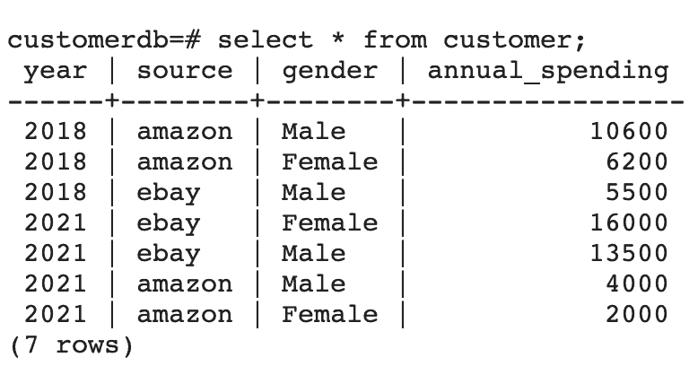

# [Spark 数据帧](https://www.baeldung.com/spark-dataframes)

1. 概述

    Apache Spark 是一个开源的分布式分析和处理系统，可实现大规模的数据工程和数据科学。它为数据传输、大规模转换和分发提供了统一的 API，从而简化了面向分析的应用程序的开发。

    DataFrame 是 Spark API 的重要组成部分。在本教程中，我们将通过一个简单的客户数据示例来了解一些 Spark DataFrame API。

2. Spark 中的数据帧

    从逻辑上讲，DataFrame 是一组不可变的记录，这些记录被组织到命名的列中。它与 RDBMS 中的表或 Java 中的 ResultSet 有相似之处。

    作为一个 API，DataFrame 提供了对多个 Spark 库（包括 Spark SQL、Spark Streaming、MLib 和 GraphX）的统一访问。

    在 Java 中，我们使用 `Dataset<Row>` 来表示 DataFrame。

    从本质上讲，Row 使用的是名为 Tungsten 的高效存储，与前代产品相比，它高度优化了 Spark 操作。

3. Maven 依赖项

    首先，让我们在 pom.xml 中添加 spark-core 和 spark-sql 依赖项：

    ```xml
    <dependency>
        <groupId>org.apache.spark</groupId>
        <artifactId>spark-core_2.11</artifactId>
        <version>2.4.8</version>
    </dependency>

    <dependency>
        <groupId>org.apache.spark</groupId>
        <artifactId>spark-sql_2.11</artifactId>
        <version>2.4.8</version>
    </dependency>
    ```

4. 数据帧和模式

    从本质上讲，DataFrame 是带有模式的 [RDD](https://www.baeldung.com/scala/apache-spark-rdd)。模式可以通过推断获得，也可以定义为 StructType。

    StructType 是 Spark SQL 的内置数据类型，我们用它来表示 StructField 对象的集合。

    让我们定义一个示例客户模式 StructType：

    ```java
    public static StructType minimumCustomerDataSchema() {
        return DataTypes.createStructType(new StructField[] {
        DataTypes.createStructField("id", DataTypes.StringType, true),
        DataTypes.createStructField("name", DataTypes.StringType, true),
        DataTypes.createStructField("gender", DataTypes.StringType, true),
        DataTypes.createStructField("transaction_amount", DataTypes.IntegerType, true) }
        );
    }
    ```

    在这里，每个 StructField 都有一个表示 DataFrame 列名、类型和布尔值的名称，布尔值表示是否可归零。

5. 构建数据帧

    每个 Spark 应用程序的第一个操作是通过 master 获取 SparkSession。

    它为我们提供了访问 DataFrames 的入口。让我们从创建 SparkSession 开始：

    ```java
    public static SparkSession getSparkSession() {
        return SparkSession.builder()
        .appName("Customer Aggregation pipeline")
        .master("local")
        .getOrCreate();
    }
    ```

    请注意，我们使用本地主站连接 Spark。如果我们要连接到集群，则需要提供集群地址。

    一旦有了 SparkSession，我们就可以使用各种方法创建 DataFrame。让我们简要了解其中的一些方法。

    1. 从 `List<POJO>` 创建 DataFrame

        让我们先创建一个 `List<Customer>`：

        ```java
        List<Customer> customers = Arrays.asList(
        aCustomerWith("01", "jo", "Female", 2000), 
        aCustomerWith("02", "jack", "Male", 1200)
        );
        ```

        接下来，让我们使用 createDataFrame 从 `List<Customer>` 中构建 DataFrame：

        ```java
        Dataset<Row> df = SPARK_SESSION
        .createDataFrame(customerList, Customer.class);
        ```

    2. 从数据集创建数据帧

        如果我们有一个 Dataset，我们可以通过在 Dataset 上调用 toDF 将其轻松转换为 DataFrame。

        首先，让我们使用 createDataset 创建一个 `Dataset<Customer>`，它接收 `org.apache.spark.sql.Encoders.Dataset<Customer>` 和 `org.apache.spark.sql.Encoders.Dataset<Customer>` 的数据：

        ```java
        Dataset<Customer> customerPOJODataSet = SPARK_SESSION
        .createDataset(CUSTOMERS, Encoders.bean(Customer.class));
        ```

        接下来，让我们将其转换为 DataFrame：

        `Dataset<Row> df = customerPOJODataSet.toDF();`

    3. 使用 RowFactory 从 POJO 中生成行

        既然 DataFrame 本质上是 `Dataset<Row>`，那么让我们看看如何从客户 POJO 创建行。

        基本上，通过实现 `MapFunction<Customer, Row>` 并重载调用方法，我们可以使用 RowFactory.create 将每个客户映射到一个行：

        ```java
        public class CustomerToRowMapper implements MapFunction<Customer, Row> {
            @Override
            public Row call(Customer customer) throws Exception {
                Row row = RowFactory.create(
                customer.getId(),
                customer.getName().toUpperCase(),
                StringUtils.substring(customer.getGender(),0, 1),
                customer.getTransaction_amount()
                );
                return row;
            }
        }
        ```

        我们需要注意的是，在将客户数据转换为行数据之前，我们可以在此处对其进行操作。

    4. 从 `List<Row>` 创建 DataFrame

        我们还可以从 Row 对象列表创建 DataFrame：

        ```java
        List<Row> rows = customer.stream()
        .map(c -> new CustomerToRowMapper().call(c))
        .collect(Collectors.toList());
        ```

        现在，让我们把这个 `List<Row>` 和 StructType 模式一起交给 SparkSession：

        ```java
        Dataset<Row> df = SparkDriver.getSparkSession()
        .createDataFrame(rows, SchemaFactory.minimumCustomerDataSchema());
        ```

        请注意，`List<Row>` 将根据模式定义转换为 DataFrame。模式中不存在的任何字段都不会成为 DataFrame 的一部分。

    5. 来自结构化文件和数据库的 DataFrame

        DataFrame 可以像 CSV 文件一样存储列式信息，也可以像 JSON 文件一样存储嵌套字段和数组。

        无论我们处理的是 CSV 文件、JSON 文件或其他格式文件以及数据库，DataFrame API 都是一样的。

        让我们从多行 JSON 数据中创建 DataFrame：

        ```java
        Dataset<Row> df = SparkDriver.getSparkSession()
            .read()
            .format("org.apache.spark.sql.execution.datasources.json.JsonFileFormat")
            .option("multiline", true)
            .load("data/minCustomerData.json");
        ```

        同样，在从数据库读取数据的情况下，我们将使用

        ```java
        Dataset<Row> df = SparkDriver.getSparkSession()
            .read()
            .option("url", "jdbc:postgresql://localhost:5432/customerdb")
            .option("dbtable", "customer")
            .option("user", "user")
            .option("password", "password")
            .option("serverTimezone", "EST")
            .format("jdbc")
            .load();
        ```

6. 将数据帧转换为数据集

    现在，让我们看看如何将 DataFrame 转换为数据集。如果我们想操作现有的 POJO 和仅适用于 DataFrame 的扩展 API，这种转换将非常有用。

    我们将继续使用上一节中从 JSON 创建的 DataFrame。

    让我们调用一个映射器函数，获取 `Dataset<Row>` 的每一行并将其转换为客户对象：

    ```java
    Dataset<Customer> ds = df.map(
    new CustomerMapper(),
    Encoders.bean(Customer.class)
    );
    ```

    在这里，CustomerMapper 实现了 `MapFunction<Row, Customer>`：

    ```java
    public class CustomerMapper implements MapFunction<Row, Customer> {
        @Override
        public Customer call(Row row) {
            Customer customer = new Customer();
            customer.setId(row.getAs("id"));
            customer.setName(row.getAs("name"));
            customer.setGender(row.getAs("gender"));
            customer.setTransaction_amount(Math.toIntExact(row.getAs("transaction_amount")));
            return customer;
        }
    }
    ```

    我们应该注意的是，无论要处理多少条记录，`MapFunction<Row, Customer>` 都只实例化一次。

7. 数据帧操作和转换

    现在，让我们以客户数据为例建立一个简单的管道。我们要从两个不同的文件源以 DataFrame 的形式摄取客户数据，将其规范化，然后对数据进行一些转换。

    最后，我们将把转换后的数据写入数据库。

    这些转换的目的是找出按性别和来源排序的年度支出。

    1. 输入数据

        首先，让我们使用 SparkSession 的读取方法从几个来源摄取数据，从 JSON 数据开始：

        ```java
        Dataset<Row> jsonDataToDF = SPARK_SESSION.read()
        .format("org.apache.spark.sql.execution.datasources.json.JsonFileFormat")
        .option("multiline", true)
        .load("data/customerData.json");
        ```

        现在，让我们对 CSV 源做同样的处理：

        ```java
        Dataset<Row> csvDataToDF = SPARK_SESSION.read()
        .format("csv")
        .option("header", "true")
        .schema(SchemaFactory.customerSchema())
        .option("dateFormat", "m/d/YYYY")
        .load("data/customerData.csv");
        csvDataToDF.show();
        csvDataToDF.printSchema();
        return csvData;
        ```

        重要的是，为了读取 CSV 数据，我们提供了一个 StructType 模式，用于确定列的数据类型。

        获取数据后，我们可以使用 show 方法检查 DataFrame 的内容。

        此外，我们还可以通过在 show 方法中提供大小来限制行数。我们还可以使用 printSchema 来检查新创建的 DataFrame 的模式。

        我们会发现这两个模式有一些差异。因此，在进行任何转换之前，我们需要对模式进行规范化。

    2. 规范化数据帧

        接下来，我们将对代表 CSV 和 JSON 数据的原始 DataFrames 进行规范化。

        下面，让我们来看看进行了哪些转换：

        ```java
        private Dataset<Row> normalizeCustomerDataFromEbay(Dataset<Row> rawDataset) {
            Dataset<Row> transformedDF = rawDataset
            .withColumn("id", concat(rawDataset.col("zoneId"),lit("-"), rawDataset.col("customerId")))
            .drop(column("customerId"))
            .withColumn("source", lit("ebay"))
            .withColumn("city", rawDataset.col("contact.customer_city"))
            .drop(column("contact"))
            .drop(column("zoneId"))
            .withColumn("year", functions.year(col("transaction_date")))
            .drop("transaction_date")
            .withColumn("firstName", functions.split(column("name"), " ")
                .getItem(0))
            .withColumn("lastName", functions.split(column("name"), " ")
                .getItem(1))
            .drop(column("name"));
            return transformedDF; 
        }
        ```

        上例中对 DataFrame 的一些重要操作如下

        - concat 用于连接多个列的数据和字面值，以生成新的 id 列
        - lit 静态函数返回一列的文字值
        - functions.year 用于从交易日期中提取年份
        - function.split 用于将姓名拆分为名和姓两列
        - drop 方法删除数据帧中的一列
        - col 方法根据列名返回数据集的列
        - withColumnRenamed 方法返回列的重命名值

        重要的是，我们可以看到 DataFrame 是不可变的。因此，无论何时需要更改任何内容，我们都必须创建一个新的 DataFrame。

        最终，两个数据框架都被规范化为相同的模式，如下所示：

        ```log
        root
        |-- gender: string (nullable = true)
        |-- transaction_amount: long (nullable = true)
        |-- id: string (nullable = true)
        |-- source: string (nullable = false)
        |-- city: string (nullable = true)
        |-- year: integer (nullable = true)
        |-- firstName: string (nullable = true)
        |-- lastName: string (nullable = true)
        ```

    3. 组合数据框

        接下来让我们来组合规范化的 DataFrames：

        ```java
        Dataset<Row> combineDataframes(Dataset<Row> df1, Dataset<Row> df2) {
            return df1.unionByName(df2); 
        }
        ```

        重要的是，我们应该注意到

        - 如果我们在联合两个 DataFrame 时关心列名，则应使用 unionByName
        - 如果我们在联合两个 DataFrame 时不关心列名，则应使用 union

    4. 聚合数据框

        接下来，让我们对合并的 DataFrames 进行分组，按年份、来源和性别找出年度支出。

        然后，我们将按年份升序和年度支出降序对聚合数据进行排序：

        ```java
        Dataset<Row> aggDF = dataset
        .groupBy(column("year"), column("source"), column("gender"))
        .sum("transactionAmount")
        .withColumnRenamed("sum(transaction_amount)", "yearly spent")
        .orderBy(col("year").asc(), col("yearly spent").desc());
        ```

        上例中对 DataFrame 的一些重要操作如下

        - groupBy 用于在 DataFrame 上将相同数据分组，然后执行类似于 SQL “GROUP BY” 子句的聚合函数
        - sum 在分组后对列 transactionAmount 应用聚合函数
        - orderBy 按一列或多列对 DataFrame 排序
        - 列类中的 asc 和 desc 函数可用于指定排序顺序

        最后，让我们使用 show 方法来看看数据帧转换后的样子：

        ```log
        +----+------+------+---------------+
        |year|source|gender|annual_spending|
        +----+------+------+---------------+
        |2018|amazon|  Male|          10600|
        |2018|amazon|Female|           6200|
        |2018|  ebay|  Male|           5500|
        |2021|  ebay|Female|          16000|
        |2021|  ebay|  Male|          13500|
        |2021|amazon|  Male|           4000|
        |2021|amazon|Female|           2000|
        +----+------+------+---------------+
        ```

        因此，最终转换后的模式应为

        ```log
        root
        |-- source: string (nullable = false)
        |-- gender: string (nullable = true)
        |-- year: integer (nullable = true)
        |-- yearly spent: long (nullable = true)
        ```

    5. 从数据帧写入关系数据库

        最后，让我们把转换后的 DataFrame 写成关系数据库中的表：

        ```java
        Properties dbProps = new Properties();
        dbProps.setProperty("connectionURL", "jdbc:postgresql://localhost:5432/customerdb");
        dbProps.setProperty("driver", "org.postgresql.Driver");
        dbProps.setProperty("user", "postgres");
        dbProps.setProperty("password", "postgres");
        ```

        接下来，我们可以使用 Spark 会话向数据库写入数据：

        ```java
        String connectionURL = dbProperties.getProperty("connectionURL");
        dataset.write()
        .mode(SaveMode.Overwrite)
        .jdbc(connectionURL, "customer", dbProperties);
        ```

8. 测试

    现在，我们可以使用 postgres 和 pgAdmin Docker 镜像，使用两个摄取源对管道进行端到端测试：

    ```java
    @Test
    void givenCSVAndJSON_whenRun_thenStoresAggregatedDataFrameInDB() throws Exception {
        Properties dbProps = new Properties();
        dbProps.setProperty("connectionURL", "jdbc:postgresql://localhost:5432/customerdb");
        dbProps.setProperty("driver", "org.postgresql.Driver");
        dbProps.setProperty("user", "postgres");
        dbProps.setProperty("password", "postgres");
        pipeline = new CustomerDataAggregationPipeline(dbProps);
        pipeline.run();
        String allCustomersSql = "Select count(*) from customer";
        Statement statement = conn.createStatement();
        ResultSet resultSet = statement.executeQuery(allCustomersSql);
        resultSet.next();
        int count = resultSet.getInt(1);
        assertEquals(7, count);
    }
    ```

    运行此操作后，我们可以验证是否存在一个表，其中包含与 DataFrame 相对应的列和行。最后，我们还可以通过 pgAdmin4 客户端观察此输出：

    

    在这里我们需要注意几个要点：

    - 写入操作会自动创建客户表。
    - 使用的模式是 SaveMode.Overwrite。因此，这将覆盖表中已存在的任何内容。其他可用选项包括追加、忽略和 ErrorIfExists。

    此外，我们还可以使用写操作将 DataFrame 数据导出为 CSV、JSON 或 parquet 等格式。

9. 总结

    在本教程中，我们介绍了如何使用 DataFrames 在 Apache Spark 中执行数据操作和聚合。

    首先，我们从各种输入源创建了 DataFrames。然后，我们使用一些 API 方法对数据进行规范化、组合和聚合。

    最后，我们将 DataFrame 导出为关系数据库中的表格。
