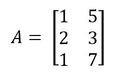
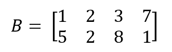
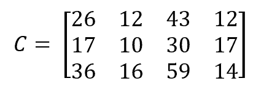
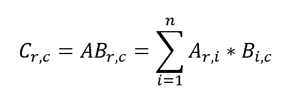

# [Java中的矩阵乘法](https://www.baeldung.com/java-matrix-multiplication)

算法

JMH 数学

1. 概述

    在本教程中，我们将探讨如何在Java中进行两个矩阵的乘法运算。

    由于矩阵概念在语言中并不原生存在，我们将自行实现它，并且也会使用一些库来看看它们是如何处理矩阵乘法的。

    最后，我们会对所探索的不同解决方案进行一些简单的基准测试，以确定哪个是最快的。

2. 例子

    让我们开始设置一个可以在整个教程中引用的例子。

    首先，我们想象一个3×2的矩阵：

    ```java
    double[][] firstMatrix = {
        new double[]{1d, 5d},
        new double[]{2d, 3d},
        new double[]{1d, 7d}
    };
    ```

    

    现在，让我们想象第二个矩阵，这次是两行四列：

    ```java
    double[][] secondMatrix = {
        new double[]{1d, 2d, 3d, 7d},
        new double[]{5d, 2d, 8d, 1d}
    };
    ```

    

    然后，第一个矩阵与第二个矩阵相乘，将得到一个3×4的矩阵：

    ```java
    double[][] expected = {
        new double[]{26d, 12d, 43d, 12d},
        new double[]{17d, 10d, 30d, 17d},
        new double[]{36d, 16d, 59d, 14d}
    };
    ```

    

    作为提醒，这个结果是通过计算每个结果矩阵单元格使用以下公式得出的：

    \[ \text{result}_{r,c} = \sum_{i=1}^{n} A_{r,i} * B_{i,c} \]

    

    其中，`r` 是矩阵A的行数，`c` 是矩阵B的列数，`n` 是矩阵A的列数（必须等于矩阵B的行数）。

3. 矩阵乘法

    1. 自己的实现

        让我们从自己的矩阵实现开始。  

        为了简单起见，我们仅使用二维双精度浮点数组：

        ```java
        double[][] firstMatrix = {
            new double[]{1d, 5d},
            new double[]{2d, 3d},
            new double[]{1d, 7d}
        };
        double[][] secondMatrix = {
            new double[]{1d, 2d, 3d, 7d},
            new double[]{5d, 2d, 8d, 1d}
        };
        ```

        这两个矩阵就是我们的示例中的矩阵。接下来创建预期的结果矩阵：

        ```java
        double[][] expected = {
            new double[]{26d, 12d, 43d, 12d},
            new double[]{17d, 10d, 30d, 17d},
            new double[]{36d, 16d, 59d, 14d}
        };
        ```

        现在万事俱备，我们可以实现乘法算法了。首先创建一个空的结果数组，并遍历其每个单元格，存储期望值：

        ```java
        double[][] multiplyMatrices(double[][] firstMatrix, double[][] secondMatrix) {
            double[][] result = new double[firstMatrix.length][secondMatrix[0].length];
            for (int row = 0; row < result.length; row++) {
                for (int col = 0; col < result[row].length; col++) {
                    result[row][col] = multiplyMatricesCell(firstMatrix, secondMatrix, row, col);
                }
            }
            return result;
        }
        ```

        最后，我们实现单个单元格的计算。为此，我们使用之前介绍的公式：

        ```java
        double multiplyMatricesCell(double[][] firstMatrix, double[][] secondMatrix, int row, int col) {
            double cell = 0;
            for (int i = 0; i < secondMatrix.length; i++) {
                cell += firstMatrix[row][i] * secondMatrix[i][col];
            }
            return cell;
        }
        ```

        最后检查算法的结果是否匹配预期结果：

        ```java
        double[][] actual = multiplyMatrices(firstMatrix, secondMatrix);
        assertThat(actual).isEqualTo(expected);
        ```

    2. EJML

        我们要看的第一个库是EJML（Efficient Java Matrix Library）。在编写本教程时，这是最常更新的Java矩阵库之一。它的目标是在计算和内存使用方面尽可能高效。  
        我们需要将该库的依赖添加到`pom.xml`中：

        ```xml
        <dependency>
            <groupId>org.ejml</groupId>
            <artifactId>ejml-all</artifactId>
            <version>0.38</version>
        </dependency>
        ```

        我们会使用与之前几乎相同的模式：创建两个矩阵并验证它们的乘积是否为我们先前计算的结果。  
        因此，让我们使用EJML创建矩阵。为此，我们将使用库提供的`SimpleMatrix`类。  
        它可以接受一个二维双精度数组作为构造函数参数：

        ```java
        SimpleMatrix firstMatrix = new SimpleMatrix(
            new double[][] {
                new double[] {1d, 5d},
                new double[] {2d, 3d},
                new double[] {1d ,7d}
            }
        );
        SimpleMatrix secondMatrix = new SimpleMatrix(
            new double[][] {
                new double[] {1d, 2d, 3d, 7d},
                new double[] {5d, 2d, 8d, 1d}
            }
        );
        ```

        现在，让我们定义预期的乘积矩阵：

        ```java
        SimpleMatrix expected = new SimpleMatrix(
            new double[][] {
                new double[] {26d, 12d, 43d, 12d},
                new double[] {17d, 10d, 30d, 17d},
                new double[] {36d, 16d, 59d, 14d}
            }
        );
        ```

        现在一切就绪，看看如何将两个矩阵相乘。`SimpleMatrix`类提供了一个`mult()`方法，该方法接受另一个`SimpleMatrix`作为参数，并返回两个矩阵的乘积：

        ```java
        SimpleMatrix actual = firstMatrix.mult(secondMatrix);
        ```

        让我们检查获得的结果是否匹配预期结果。  
        由于`SimpleMatrix`没有重写`equals()`方法，我们不能依赖它来进行验证。但提供了替代方法：`isIdentical()`方法，它不仅接受另一个矩阵参数，还接受一个双精度容差参数，用于忽略由于双精度引起的微小差异：

        ```java
        assertThat(actual).matches(m -> m.isIdentical(expected, 0d));
        ```

        这样便完成了使用EJML库的矩阵乘法。让我们看看其他库能提供什么。

    3. ND4J

        接下来尝试ND4J库。ND4J是一个计算库，属于deeplearning4j项目的一部分。除其他功能外，ND4J还提供了矩阵计算功能。  

        首先，我们需要获取库的依赖项：

        ```xml
        <dependency>
            <groupId>org.nd4j</groupId>
            <artifactId>nd4j-native</artifactId>
            <version>1.0.0-beta4</version>
        </dependency>
        ```

        注意，我们在这里使用的是beta版本，因为GA版本似乎存在一些bug。

        为了简洁起见，我们不再重写二维双精度数组，并只关注它们在每个库中的使用方式。因此，在ND4J中，我们必须创建一个`INDArray`。为此，我们调用`Nd4j.create()`工厂方法并传入一个表示我们的矩阵的双精度数组：

        ```java
        INDArray matrix = Nd4j.create(/* 一个二维双精度数组 */);
        ```

        如前一节所述，我们将创建三个矩阵：两个要相乘的矩阵和一个预期结果矩阵。  
        之后，我们想要实际执行前两个矩阵之间的乘法运算，使用`INDArray.mmul()`方法：

        ```java
        INDArray actual = firstMatrix.mmul(secondMatrix);
        ```

        然后，我们再次检查实际结果是否与预期结果一致。这次可以依赖等式比较：

        ```java
        assertThat(actual).isEqualTo(expected);
        ```

        这展示了如何使用ND4J库进行矩阵计算。

    4. Apache Commons

        接下来谈谈Apache Commons Math3模块，它为我们提供了包括矩阵操作在内的数学计算功能。  
        同样，我们需要在`pom.xml`中指定依赖项：

        ```xml
        <dependency>
            <groupId>org.apache.commons</groupId>
            <artifactId>commons-math3</artifactId>
            <version>3.6.1</version>
        </dependency>
        ```

        一旦设置完成，我们就可以使用`RealMatrix`接口及其`Array2DRowRealMatrix`实现来创建常用的矩阵。实现类的构造函数接受一个二维双精度数组作为参数：

        ```java
        RealMatrix matrix = new Array2DRowRealMatrix(/* 一个二维双精度数组 */);
        ```

        至于矩阵乘法，`RealMatrix`接口提供了一个`multiply()`方法，该方法接受另一个`RealMatrix`参数：

        ```java
        RealMatrix actual = firstMatrix.multiply(secondMatrix);
        ```

        最后，我们可以验证结果是否等于我们所期望的：

        ```java
        assertThat(actual).isEqualTo(expected);
        ```

        让我们看看下一个库！

    5. LA4J

        名为LA4J，代表Java的线性代数。也需要添加相应的依赖，并使用`Basic2DMatrix`实现来创建矩阵。

        这个库名为LA4J，即“Linear Algebra for Java”。  
        让我们也添加这个库的依赖项：

        ```xml
        <dependency>
            <groupId>org.la4j</groupId>
            <artifactId>la4j</artifactId>
            <version>0.6.0</version>
        </dependency>
        ```

        现在，LA4J的工作方式与其他库大致相同。它提供了一个`Matrix`接口以及一个`Basic2DMatrix`实现，该实现接受一个二维双精度数组作为输入：

        ```java
        Matrix matrix = new Basic2DMatrix(/* 一个二维双精度数组 */);
        ```

        与Apache Commons Math3模块一样，乘法方法是`multiply()`，并且接受另一个`Matrix`作为参数：

        ```java
        Matrix actual = firstMatrix.multiply(secondMatrix);
        ```

        再次，我们可以检查结果是否符合我们的预期：

        ```java
        assertThat(actual).isEqualTo(expected);
        ```

        让我们现在看一下最后一个库：Colt。

    6. Colt

        Colt是一个由CERN开发的库。它提供了一些特性，使得高性能科学和技术计算成为可能。  
        正如前面的库一样，我们必须获取正确的依赖项：

        ```xml
        <dependency>
            <groupId>colt</groupId>
            <artifactId>colt</artifactId>
            <version>1.2.0</version>
        </dependency>
        ```

        为了使用Colt创建矩阵，我们必须使用`DoubleFactory2D`类。它有三个工厂实例：dense、sparse和rowCompressed，每个实例都针对生成特定类型的矩阵进行了优化。

        对于我们的目的，我们将使用dense实例。这次，需要调用的方法是`make()`，它接受一个二维双精度数组，并生成一个`DoubleMatrix2D`对象：

        ```java
        DoubleMatrix2D matrix = doubleFactory2D.make(/* 一个二维双精度数组 */);
        ```

        一旦我们的矩阵被实例化，我们就希望将它们相乘。这一次，矩阵对象上没有这样的方法。我们必须创建一个`Algebra`类的实例，它有一个`mult()`方法，接受两个矩阵作为参数：

        ```java
        Algebra algebra = new Algebra();
        DoubleMatrix2D actual = algebra.mult(firstMatrix, secondMatrix);
        ```

        然后，我们可以将实际结果与预期结果进行比较：

        ```java
        assertThat(actual).isEqualTo(expected);
        ```

4. **基准测试**

    完成了对不同矩阵乘法可能性的探索后，接下来检查哪一个是最有效的。这部分内容描述了如何使用JMH（Java Microbenchmark Harness）进行性能测试，特别是针对小型矩阵的情况。这有助于理解各种方法的实际性能表现。

    请注意，原文档似乎在最后一部分未完整展示关于JMH基准测试的具体细节。不过，上述翻译涵盖了文档的主要内容，包括几种不同的矩阵乘法实现方式及其基本使用方法。

    现在我们已经完成了对不同矩阵乘法方式的探索，接下来来看看哪些方法性能最优

    1. 小型矩阵

        让我们从小型矩阵开始。这里是一个3×2矩阵和一个2×4矩阵。

        为了实现性能测试，我们将使用JMH基准库。让我们配置一个基准测试类，选项如下：

        ```java
        public static void main(String[] args) throws Exception {
            Options opt = new OptionsBuilder()
            .include(MatrixMultiplicationBenchmarking.class.getSimpleName())
            .mode(Mode.AverageTime)
            .forks(2)
            .warmupIterations(5)
            .measurementIterations(10)
            .timeUnit(TimeUnit.MICROSECONDS)
            .build();
            new Runner(opt).run();
        }
        ```

        这样，JMH将为每个标记有@Benchmark注解的方法运行两次完整运行，每次有五次预热迭代（不计入平均计算）和十次测量迭代。至于测量，它将收集不同库的平均执行时间，以微秒为单位。
        我们还需要创建一个包含我们数组的状态对象：

        ```java
        @State(Scope.Benchmark)
        public class MatrixProvider {
            private double[][] firstMatrix;
            private double[][] secondMatrix;
            public MatrixProvider() {
                firstMatrix =
                new double[][] {
                    new double[] {1d, 5d},
                    new double[] {2d, 3d},
                    new double[] {1d ,7d}
                };
                secondMatrix =
                new double[][] {
                    new double[] {1d, 2d, 3d, 7d},
                    new double[] {5d, 2d, 8d, 1d}
                };
            }
        }
        ```

        这样，我们可以确保数组初始化不是基准测试的一部分。之后，我们仍然需要创建进行矩阵乘法的方法，使用`MatrixProvider`对象作为数据源。我们不会在此重复代码，因为我们已经在前面看到了每个库的实现。
        最后，我们使用main方法运行基准测试。这给了我们以下结果：

        ```log
        Benchmark                                                           Mode  Cnt   Score   Error  Units
        MatrixMultiplicationBenchmarking.apacheCommonsMatrixMultiplication  avgt   20   1,008 ± 0,032  us/op
        MatrixMultiplicationBenchmarking.coltMatrixMultiplication           avgt   20   0,219 ± 0,014  us/op
        MatrixMultiplicationBenchmarking.ejmlMatrixMultiplication           avgt   20   0,226 ± 0,013  us/op
        MatrixMultiplicationBenchmarking.homemadeMatrixMultiplication       avgt   20   0,389 ± 0,045  us/op
        MatrixMultiplicationBenchmarking.la4jMatrixMultiplication           avgt   20   0,427 ± 0,016  us/op
        MatrixMultiplicationBenchmarking.nd4jMatrixMultiplication           avgt   20  12,670 ± 2,582  us/op
        ```

        正如我们所看到的，EJML和Colt的表现非常好，每操作大约五分之一微秒，而ND4J则不太高效，每操作超过十微秒。其他库的性能位于中间位置。
        另外值得注意的是，当将预热迭代次数从5增加到10时，所有库的性能都有所提高。

    2. 大型矩阵

        那么如果采用更大的矩阵，例如3000×3000呢？为了查看会发生什么情况，我们首先创建另一个状态类，提供生成的此类大小的矩阵：

        ```java
        @State(Scope.Benchmark)
        public class BigMatrixProvider {
            private double[][] firstMatrix;
            private double[][] secondMatrix;
            public BigMatrixProvider() {}
            @Setup
            public void setup(BenchmarkParams parameters) {
                firstMatrix = createMatrix();
                secondMatrix = createMatrix();
            }
            private double[][] createMatrix() {
                Random random = new Random();
                double[][] result = new double[3000][3000];
                for (int row = 0; row < result.length; row++) {
                    for (int col = 0; col < result[row].length; col++) {
                        result[row][col] = random.nextDouble();
                    }
                }
                return result;
            }
        }
        ```

        正如我们所见，我们将创建填充随机实数的3000×3000二维双精度数组。

        现在让我们创建基准测试类：

        ```java
        public class BigMatrixMultiplicationBenchmarking {
            public static void main(String[] args) throws Exception {
                Map<String, String> parameters = parseParameters(args);
                ChainedOptionsBuilder builder = new OptionsBuilder()
                .include(BigMatrixMultiplicationBenchmarking.class.getSimpleName())
                .mode(Mode.AverageTime)
                .forks(2)
                .warmupIterations(10)
                .measurementIterations(10)
                .timeUnit(TimeUnit.SECONDS);
                new Runner(builder.build()).run();
            }
            @Benchmark
            public Object homemadeMatrixMultiplication(BigMatrixProvider matrixProvider) {
                return HomemadeMatrix
                .multiplyMatrices(matrixProvider.getFirstMatrix(), matrixProvider.getSecondMatrix());
            }
            @Benchmark
            public Object ejmlMatrixMultiplication(BigMatrixProvider matrixProvider) {
                SimpleMatrix firstMatrix = new SimpleMatrix(matrixProvider.getFirstMatrix());
                SimpleMatrix secondMatrix = new SimpleMatrix(matrixProvider.getSecondMatrix());
                return firstMatrix.mult(secondMatrix);
            }
            @Benchmark
            public Object apacheCommonsMatrixMultiplication(BigMatrixProvider matrixProvider) {
                RealMatrix firstMatrix = new Array2DRowRealMatrix(matrixProvider.getFirstMatrix());
                RealMatrix secondMatrix = new Array2DRowRealMatrix(matrixProvider.getSecondMatrix());
                return firstMatrix.multiply(secondMatrix);
            }
            @Benchmark
            public Object la4jMatrixMultiplication(BigMatrixProvider matrixProvider) {
                Matrix firstMatrix = new Basic2DMatrix(matrixProvider.getFirstMatrix());
                Matrix secondMatrix = new Basic2DMatrix(matrixProvider.getSecondMatrix());
                return firstMatrix.multiply(secondMatrix);
            }
            @Benchmark
            public Object nd4jMatrixMultiplication(BigMatrixProvider matrixProvider) {
                INDArray firstMatrix = Nd4j.create(matrixProvider.getFirstMatrix());
                INDArray secondMatrix = Nd4j.create(matrixProvider.getSecondMatrix());
                return firstMatrix.mmul(secondMatrix);
            }
            @Benchmark
            public Object coltMatrixMultiplication(BigMatrixProvider matrixProvider) {
                DoubleFactory2D doubleFactory2D = DoubleFactory2D.dense;
                DoubleMatrix2D firstMatrix = doubleFactory2D.make(matrixProvider.getFirstMatrix());
                DoubleMatrix2D secondMatrix = doubleFactory2D.make(matrixProvider.getSecondMatrix());
                Algebra algebra = new Algebra();
                return algebra.mult(firstMatrix, secondMatrix);
            }
        }
        ```

        当我们运行此基准测试时，获得了完全不同的结果：

        ```log
        Benchmark                                                              Mode  Cnt    Score    Error  Units
        BigMatrixMultiplicationBenchmarking.apacheCommonsMatrixMultiplication  avgt   20  511.140 ± 13.535   s/op
        BigMatrixMultiplicationBenchmarking.coltMatrixMultiplication           avgt   20  197.914 ±  2.453   s/op
        BigMatrixMultiplicationBenchmarking.ejmlMatrixMultiplication           avgt   20   25.830 ±  0.059   s/op
        BigMatrixMultiplicationBenchmarking.homemadeMatrixMultiplication       avgt   20  497.493 ±  2.121   s/op
        BigMatrixMultiplicationBenchmarking.la4jMatrixMultiplication           avgt   20   35.523 ±  0.102   s/op
        BigMatrixMultiplicationBenchmarking.nd4jMatrixMultiplication           avgt   20    0.548 ±  0.006   s/op
        ```

        正如我们所看到的，自制实现和Apache库现在的表现非常糟糕，几乎需要10分钟才能完成两个矩阵的乘法运算。
        Colt用了超过3分钟，这比之前好一些但仍非常长。EJML和LA4J表现出色，运行时间接近30秒。但是，ND4J胜出本次基准测试，使用CPU后端在不到一秒内完成。

    3. 分析

        这表明，矩阵乘法的性能高度依赖于矩阵的大小和结构，因此很难简单地指出“最好的”解决方案。对于小矩阵来说，EJML 和 Colt 更优；而对于大型矩阵，ND4J 凭借其底层优化和对 CPU/GPU 加速的支持，展现出压倒性优势。

        ---

5. 总结

    在本文中，我们学习了如何在 Java 中实现矩阵乘法，包括自行实现以及使用 EJML、ND4J、Apache Commons Math、LA4J 和 Colt 等外部库的方法。在探索了所有解决方案之后，我们对其进行了基准测试，并发现除了ND4J之外，它们都在小型矩阵上表现良好。另一方面，在较大的矩阵上，ND4J处于领先地位。

    通过对多种解决方案的比较与性能测试，我们发现：

    - 对于小型矩阵，大部分库表现良好，其中 EJML 和 Colt 最快；
    - 对于大型矩阵，ND4J 表现出显著优势，尤其适合高性能计算场景。

    因此，在选择矩阵运算库时，应根据应用场景（如矩阵规模、是否需要 GPU 支持等）综合考虑，以获得最佳性能。
