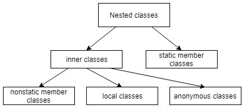

# Java语言OOP核心-继承

本模块包含有关 Java 继承的文章

- [Java语言OOP核心-继承](#java语言oop核心-继承)
  - [Java中的抽象类](#java中的抽象类)
  - [Java接口](#java接口)
  - [Super关键词指南](#super关键词指南)
  - [Java中的继承指南](#java中的继承指南)
  - [Java中的对象类型转换](#java中的对象类型转换)
  - [Java中的匿名类](#java中的匿名类)
  - [原文](#原文)
  - [Code](#code)

## Java中的抽象类

1. 概述

    在实现一个合同时，有很多情况下我们想把实现的某些部分推迟到以后完成。在Java中，我们可以通过抽象类轻松实现这一目标。

    在本教程中，我们将学习Java中的抽象类的基本知识，以及在哪些情况下它们会有帮助。

2. 抽象类的关键概念

    在深入探讨何时使用抽象类之前，让我们看看它们最相关的特征：

    - 我们用class关键字前面的abstract修饰词来定义一个抽象类。
    - 抽象类可以被子类化，但它不能被实例化。
    - 如果一个类定义了一个或多个抽象方法，那么这个类本身就必须被声明为抽象的。
    - 一个抽象类可以同时声明抽象和具体方法
    - 从一个抽象类派生出来的子类必须实现基类的所有抽象方法，或者本身就是抽象的。

    为了更好地理解这些概念，我们将创建一个简单的例子。

    让我们让我们的基抽象类定义一个棋盘游戏的抽象API：

    abstractclasses.overview/BoardGame.java

    然后，我们可以创建一个实现play方法的子类：

    abstractclasses.overview/Checkers.java

3. 何时使用抽象类

    现在，让我们来分析一下几个典型的场景，在这些场景中，我们应该选择抽象类而不是接口和具体类：

    - 我们想在一个地方封装一些共同的功能（代码重用），让多个相关的子类共享这些功能。
    - 我们需要部分地定义一个API，使我们的子类可以很容易地扩展和完善。
    - 子类需要继承一个或多个带有受保护访问修饰符的公共方法或字段

    让我们记住，所有这些情况都是完全的、基于继承的遵守[开放/封闭原则](https://en.wikipedia.org/wiki/Open–closed_principle)的好例子。

    此外，由于使用抽象类隐含地处理了基类型和子类型，我们也在利用[多态性(Polymorphism)](https://www.baeldung.com/java-polymorphism)。

    请注意，代码重用是使用抽象类的一个非常有说服力的理由，只要类层次结构中的 "is-a" 关系被保留下来。

    而[Java 8又增加了另一个问题](https://www.baeldung.com/java-static-default-methods)，即默认方法，它有时可以取代需要创建一个抽象类的位置。

    > With Java 8’s "default method" feature, any abstract class without direct or inherited field should be converted into an interface. However, this change may not be appropriate in libraries or other applications where the class is intended to be used as an API.

4. 文件读取器的层次结构样本

    为了更清楚地了解抽象类带来的功能，让我们再看一个例子。

    1. 定义一个基础抽象类

        因此，如果我们想拥有几种类型的文件阅读器，我们可能会创建一个抽象类来封装文件阅读的通用功能：

        abstractclasses.filereader/BaseFileReader.java

        请注意，我们已经将filePath设置为保护状态，以便子类在需要时可以访问它。更重要的是，我们留下了一些未完成的工作：如何从文件的内容中实际解析出一行文本。

        我们的计划很简单：虽然我们的具体类没有各自的特殊方式来存储文件路径或浏览文件，但它们将各自有特殊的方式来转换每一行。

        乍一看，BaseFileReader 似乎没有必要。然而，它是一个简洁、易于扩展的设计的基础。从它开始，我们可以很容易地实现不同版本的文件阅读器，可以专注于它们独特的业务逻辑。

    2. 定义子类

        一个自然的实现可能是将文件的内容转换为小写字母：

        abstractclasses.filereader/LowercaseFileReader.java

        或者另一个可能是将文件内容转换为大写字母的：

        abstractclasses.filereader/UppercaseFileReader.java

        正如我们从这个简单的例子中所看到的，每个子类都可以专注于其独特的行为，而不需要指定文件阅读的其他方面。

    3. 使用一个子类

        最后，使用一个继承自抽象类的类与其他具体类没有什么不同：

        abstractclasses/LowercaseFileReaderUnitTest.java

        为简单起见，目标文件位于 src/main/resources/files 文件夹下。因此，我们使用了一个应用程序类加载器来获取示例文件的路径。请随时查看我们[关于Java中类加载器的教程](https://www.baeldung.com/java-classloaders)。

5. 总结

    在这篇简短的文章中，我们了解了Java中抽象类的基本知识，以及何时使用它们来实现抽象并将通用的实现封装在一个地方。

## Java接口

1. 概述

    在本教程中，我们将讨论Java中的接口。我们还将看到Java是如何使用接口来实现多态性和多重继承的。

2. 什么是Java中的接口？

    在Java中，接口是一种抽象的类型，它包含了方法和常量变量的集合。它是Java的核心概念之一，用来实现抽象、多态和多继承。

    让我们看看Java中接口的一个简单例子：

    interfaces/Electronic.java

    我们可以通过使用 implements 关键字在一个Java类中实现一个接口。

    接下来，我们也来创建一个计算机类，实现我们刚刚创建的电子接口：

    interfaces/Computer.java

    1. 创建接口的规则

        在一个接口中，我们允许使用：

        - constants variables [常量变量](https://www.baeldung.com/java-final)
        - abstract methods [抽象方法](https://www.baeldung.com/java-abstract-class)
        - static methods [静态方法](https://www.baeldung.com/java-static-default-methods)
        - default methods 默认方法

        我们还应该记住：

        - 我们不能直接对接口进行实例化
        - 一个接口可以是空的，里面没有方法或变量
        - 我们不能在接口定义中使用最后一个词，因为这将导致编译器错误
        - 所有的接口声明都应该有public或default访问修饰词；抽象修饰词将由编译器自动添加
        - 接口方法不能是保护的或最终的
        - 在Java 9之前，接口方法不能是私有的；但是，Java 9引入了在接口中定义[私有方法的可能性](https://www.baeldung.com/java-interface-private-methods)
        - 根据定义，接口变量是公共的、静态的和最终的；我们不允许改变它们的可见性。

3. 我们通过使用它们可以实现什么？

    1. 行为上的功能

        我们使用接口来增加某些行为功能，这些功能可以被不相关的类所使用。例如，Comparable、Comparator和Cloneable是可以由不相关的类实现的Java接口。下面是一个比较器接口的例子，它被用来比较Employee类的两个实例：

        interfaces/Employee.java

        interfaces/EmployeeSalaryComparator.java

        更多信息，请访问我们的[《Java中的比较器和可比较》](https://www.baeldung.com/java-comparator-comparable)教程。

    2. 多重继承

        Java类支持单一的继承。然而，通过使用接口，我们也能够实现多重继承。

        例如，在下面的例子中，我们注意到汽车类实现了飞翔和转换接口。通过这样做，它继承了飞翔和变换的方法：

        ```java
        public interface Transform {
            void transform();
        }

        public interface Fly {
            void fly();
        }

        public class Car implements Fly, Transform {

            @Override
            public void fly() {
                System.out.println("I can Fly!!");
            }

            @Override
            public void transform() {
                System.out.println("I can Transform!!");
            }
        }
        ```

    3. 多态性

        让我们先问一个问题：什么是[多态性](https://www.baeldung.com/java-polymorphism)？它是指一个对象在运行时采取不同形式的能力。更具体地说，它是在运行时执行与特定对象类型有关的覆盖方法。

        在Java中，我们可以通过接口来实现多态性。例如，"形状" 接口可以有不同的形式--它可以是一个圆形或一个方形。

        让我们先来定义Shape接口：

        interfaces.polymorphysim/Shape.java

        现在我们也来创建Circle类：

        interfaces.polymorphysim/Circle.java

        还有方形类：

        interfaces.polymorphysim/Square.java

        最后，是时候使用我们的Shape接口和它的实现来看看多态性的作用了。让我们实例化一些Shape对象，将它们添加到List中，最后，在一个循环中打印它们的名字：

        interfaces.polymorphysim/MainTestClass.java

4. 接口中的默认方法

    Java 7及以下版本的传统接口不提供向后兼容性。

    这意味着，如果你有在Java 7或更早写的遗留代码，而你决定给一个现有的接口添加一个抽象方法，那么所有实现该接口的类都必须覆盖新的抽象方法。否则，代码就会中断。

    Java 8通过引入默认方法解决了这个问题，该方法是可选的，可以在接口层实现。

5. 接口继承规则

    为了实现通过接口的多重继承，我们必须记住一些规则。让我们来详细了解一下这些规则。

    1. 接口扩展另一个接口

        当一个接口扩展另一个接口时，它继承了该接口的所有抽象方法。让我们先创建两个接口，HasColor和Shape：

        ```java
        public interface HasColor {
            String getColor();
        }

        public interface Box extends HasColor {
            int getHeight()
        }

        ```

        在上面的例子中，Box使用关键字extends继承了HasColor。通过这样做，Box接口继承了getColor。因此，Box接口现在有两个方法：getColor和getHeight。

    2. 抽象类实现一个接口

        当一个抽象类实现了一个接口，它就继承了所有的抽象和缺省方法。让我们来看看Transform接口和实现它的抽象类Vehicle：

        interfaces.multiinheritance/Transform.java

        interfaces.multiinheritance/Vehicle.java

        在这个例子中，Vehicle类继承了两个方法：抽象的transform方法和默认的printSpecs方法。

6. 功能性接口

    Java从早期就有很多功能接口，如Comparable（从Java 1.2开始）和Runnable（从Java 1.0开始）。

    Java 8引入了新的函数式接口，如Predicate、Consumer和Function。要了解更多关于这些的信息，请访问我们的[《Java 8中的函数式接口》](https://www.baeldung.com/java-8-functional-interfaces)教程。

7. 总结

    在本教程中，我们对Java接口进行了概述，并谈到了如何使用接口来实现多态性和多重继承。

## Super关键词指南

1. 简介

    在这个快速教程中，我们将看一下super Java关键字。

    简单地说，我们可以使用super关键字来访问父类。

    让我们来探索这个核心关键字在语言中的应用。

2. 带有构造函数的super关键字

    我们可以使用super()来调用父类的默认构造函数。它应该是构造函数中的第一个语句。

    在我们的例子中，我们使用super(message)和String参数：

    superkeyword/SuperSub.java: SuperSub(String)

    让我们创建一个子类实例，看看后面发生了什么：

    `SuperSub child = new SuperSub("message from the child class");`

    new关键字调用了SuperSub的构造函数，它本身首先调用了父类的构造函数，并将String参数传递给它。

3. 访问父类变量

    让我们创建一个带有消息实例变量的父类：

    superkeyword/SuperBase.java

    现在，我们用同名的变量创建一个子类：

    superkeyword/SuperSub.java: getParentMessage()

    我们可以通过使用super关键字从子类中访问父类变量。

4. 使用方法覆盖的super关键字

    在进一步讨论之前，我们建议回顾我们的方法[覆盖指南](https://www.baeldung.com/java-method-overload-override)。

    让我们为我们的父类添加一个实例方法：

    superkeyword/SuperBase.java: printMessage()

    并在我们的子类中覆盖printMessage()方法：

    superkeyword/SuperSub.java: printMessage()

    我们可以使用super来访问子类中的重载方法。构造函数中的super.printMessage()调用SuperBase中的父方法。

## Java中的继承指南

1. 概述

    面向对象编程的核心原则之一--继承--使我们能够重复使用现有的代码或扩展现有的类型。

    简单地说，在Java中，一个类可以继承另一个类和多个接口，而一个接口可以继承其他接口。

    在这篇文章中，我们将从继承的必要性开始，转到继承如何在类和接口中发挥作用。

    然后，我们将介绍变量/方法名和访问修饰符如何影响被继承的成员。

    最后，我们将看到继承一个类型意味着什么。

2. 继承的必要性

    想象一下，作为一个汽车制造商，你向你的客户提供多种汽车型号。尽管不同的汽车型号可能提供不同的功能，如天窗或防弹窗，但它们都包括共同的部件和功能，如发动机和车轮。

    创建一个基本的设计并扩展它以创建它们的专门版本是有意义的，而不是从头开始单独设计每个汽车模型。

    以类似的方式，通过继承，我们可以创建一个具有基本特征和行为的类，并通过创建继承这个基类的类来创建其专门版本。以同样的方式，接口可以扩展现有的接口。

    我们会注意到使用了多个术语来指代一个被另一个类型继承的类型，特别是：

    - 基类型也被称为超类型或父类型 a base type is also called a super or a parent type
    - 一个派生类型被称为扩展类型、子类型或儿童类型 a derived type is referred to as an extended, sub or a child type

3. 类的继承

    1. 扩展一个类

        一个类可以继承另一个类并定义额外的成员。

        让我们从定义一个基类Car开始：

        inheritance/Car.java

        ArmoredCar类可以通过在其声明中使用关键字extends来继承Car类的成员：

        inheritance/ArmoredCar.java

        我们现在可以说，ArmoredCar类是Car的子类，而后者是ArmoredCar的超类。

        Java中的类支持单继承；ArmoredCar类不能扩展多个类。

        另外，请注意，在没有extends关键字的情况下，一个类隐含地继承了java.lang.Object类。

        一个子类继承了超类中的非静态保护成员和公共成员(non-static protected and public members)。此外，如果两个类在同一个包中，具有默认（package-private）访问权的成员也被继承。

        另一方面，一个类的私有和静态成员不被继承。

    2. 从子类中访问父类成员

        要访问继承的属性或方法，我们可以简单地直接使用它们：

        ```java
        public class ArmoredCar extends Car {
            public String registerModel() {
                return model; // 未定义
            }
        }
        ```

        注意，我们不需要对超类的引用来访问其成员。

4. 接口继承

    1. 实现多个接口

        尽管类只能继承一个类，但它们可以实现多个接口。

        想象一下，我们在上一节中定义的ArmoredCar是需要一个超级间谍的。所以汽车制造公司想到了增加飞行和漂浮功能：

        inheritance/Floatable.java

        inheritance/Flyable.java

        inheritance/ArmoredCar.java

        在上面的例子中，我们注意到使用了关键字 implements 来继承一个接口。

    2. 多重继承的问题

        Java允许使用接口进行多重继承。

        在Java 7之前，这并不是一个问题。接口只能定义抽象的方法，也就是没有任何实现的方法。因此，如果一个类用相同的方法签名实现了多个接口，这并不是一个问题。实现类最终只有一个方法需要实现。

        让我们看看这个简单的等式是如何随着Java 8在接口中引入默认方法而发生变化的。

        从Java 8开始，接口可以选择为其方法定义默认的实现（接口仍然可以定义抽象的方法）。这意味着，如果一个类实现了多个接口，而这些接口定义了具有相同签名的方法，那么子类将继承不同的实现。这听起来很复杂，是不允许的。

        Java不允许继承在不同接口中定义的同一方法的多个实现。

        下面是一个例子：

        ```java
        public interface Floatable {
            default void repair() {
                System.out.println("Repairing Floatable object");
            }
        }
        public interface Flyable {
            default void repair() {
                System.out.println("Repairing Flyable object");
            }
        }
        public class ArmoredCar extends Car implements Floatable, Flyable {
            // this won't compile
        }
        ```

        如果我们确实想实现这两个接口，我们就必须重写 repair() 方法。

        如果前面的例子中的接口定义了同名的变量，比如说持续时间，那么如果不在变量名称前加上接口名称，我们就无法访问它们：

        ```java
        public interface Floatable {
            int duration = 10;
        }
        public interface Flyable {
            int duration = 20;
        }
        public class ArmoredCar extends Car implements Floatable, Flyable {
            public void aMethod() {
                System.out.println(duration); // won't compile
                System.out.println(Floatable.duration); // outputs 10
                System.out.println(Flyable.duration); // outputs 20
            }
        }
        ```

    3. 接口扩展其他接口

        一个接口可以扩展多个接口。下面是一个例子：

        inheritance/Floatable.java

        inheritance/Flyable.java

        inheritance/SpaceTraveller.java

        一个接口通过使用关键字extends来继承其他接口。类使用关键字 implements 来继承一个接口。

5. 继承类型

    当一个类继承另一个类或接口时，除了继承它们的成员外，它还继承它们的类型。这也适用于一个继承其他接口的接口。

    这是一个非常强大的概念，它允许开发者对一个接口（基类或接口）进行编程，而不是对其实现进行编程。

    例如，想象一下这样一种情况：一个组织维护着其员工所拥有的汽车的列表。当然，所有员工可能拥有不同的汽车型号。那么，我们怎样才能引用不同的汽车实例呢？这里有一个解决方案：

    inheritance/Employee.java

    因为Car的所有派生类都继承了Car的类型，派生类的实例可以通过使用Car类的变量来引用：

    ```java
    Employee e1 = new Employee("Shreya", new ArmoredCar());
    Employee e2 = new Employee("Paul", new SpaceCar());
    Employee e3 = new Employee("Pavni", new BMW());
    ```

6. 隐藏的类成员

    1. 隐藏的实例成员

        如果超类和子类都定义了一个同名的变量或方法会怎样？别担心，我们仍然可以同时访问它们。然而，我们必须向Java表明我们的意图，在变量或方法前加上关键字this或super。

        this关键字指的是它所使用的实例。super关键字（似乎很明显）指的是父类实例：

        inheritance/ArmoredCar.java: getAValue()

        很多开发者使用this和super关键字来明确说明他们所指的是哪个变量或方法。然而，对所有成员使用它们会使我们的代码看起来很杂乱。

    2. 隐藏的静态成员

        当我们的基类和子类用相同的名字定义静态变量和方法时会发生什么？我们可以像访问实例变量那样，在派生类中访问基类中的静态成员吗？

        让我们通过一个例子来了解一下：

        inheritance/Car.java: String msg()

        ```java
        public class ArmoredCar extends Car {
            public static String msg() {
                return super.msg(); // this won't compile.
            }
        }
        ```

        不，我们不能。静态成员属于一个类而不是实例。所以我们不能在msg()中使用非静态的super关键字。

        由于静态成员属于一个类，我们可以将前面的调用修改如下：

        `return Car.msg();`

        考虑下面的例子，基类和派生类都定义了一个具有相同签名的静态方法msg()：

        inheritance/Car.java: String msg()

        inheritance/ArmoredCar.java: String msg()

        下面是我们如何调用它们：

        ```java
        Car first = new ArmoredCar();
        ArmoredCar second = new ArmoredCar();
        ```

        对于前面的代码，first.msg()将输出 "Car"， second.msg()将输出 "ArmoredCar"。被调用的静态信息取决于用于引用ArmoredCar实例的变量的类型。

7. 总结

    在这篇文章中，我们涵盖了Java语言的一个核心方面--继承。

    我们看到了Java是如何支持类的单继承和接口的多继承的，并讨论了该机制在语言中的错综复杂的工作方式。

## Java中的对象类型转换

1. 概述

    Java 类型系统由两种类型组成：基元(primitives)和引用(references)。

    我们在[本文](https://www.baeldung.com/java-primitive-conversions)中介绍了基元转换，这里我们将重点介绍引用类型转换，以便充分了解 Java 是如何处理类型的。

    进一步阅读：

    [Java 泛型基础](https://www.baeldung.com/java-generics)

    快速介绍 Java 生成器的基础知识

    [Java instanceof 操作符](https://www.baeldung.com/java-instanceof)

    了解 Java 中的 instanceof 操作符

2. 基元与引用

    虽然基元转换(primitive conversions)和引用变量铸造(reference variable casting)看起来很相似，但它们是[完全不同的概念](https://docs.oracle.com/javase/specs/jls/se8/html/jls-4.html#jls-4.1)。

    在这两种情况下，我们都是将一种类型 "转换" 成另一种类型。但是，简化地说，基元变量包含其值，而基元变量的转换意味着其值的不可逆变化：

    ```java
    double myDouble = 1.1;
    int myInt = (int) myDouble;     
    assertNotEquals(myDouble, myInt);
    ```

    在上例中转换后，myInt 变量的值是 1，我们无法从中恢复以前的值 1.1。

    引用变量则不同，引用变量只是引用对象，并不包含对象本身。

    而投射引用变量并不会触及它所引用的对象，只是以另一种方式给这个对象贴上标签，从而扩大或缩小了使用它的机会。上投(Upcasting)缩小了该对象可用的方法和属性列表，而下投(downcasting)可以扩展该对象。

    引用就像对象的遥控器。遥控器上的按钮有多有少，取决于其类型，而对象本身则存储在堆中。当我们进行下投时，我们会改变遥控器的类型，但不会改变对象本身。

3. Upcasting向上传递

    从子类向超类的传递称为上传递。通常情况下，编译器会隐式地进行上播。

    上投与继承（Java 的另一个核心概念）密切相关。使用引用变量来引用更具体的类型是很常见的。每当我们这样做时，就会发生隐式上播。

    为了演示向上传递，让我们定义一个动物（Animal）类：Animal.java

    现在我们来扩展动物：Cat.java

    现在，我们可以创建一个 Cat 类对象，并将其赋值给 Cat 类型的引用变量：

    `Cat cat = new Cat();`

    我们还可以将它赋值给动物类型的引用变量：

    `Animal animal = cat;`

    在上述赋值中，进行了隐式上播。

    我们也可以显式地进行赋值

    `animal = (Animal) cat;`

    但没有必要在继承树中进行显式上推。编译器知道 cat 是一种动物，不会显示任何错误。

    请注意，引用可以指向声明类型的任何子类型。

    通过向上传递，我们限制了 Cat 实例可用方法的数量，但并没有改变实例本身。现在，我们不能做任何与 Cat 相关的事情--我们不能在动物变量上调用 meow()。

    虽然 Cat 对象仍然是 Cat 对象，但调用 meow() 会导致编译器错误：

    `// animal.meow(); The method meow() is undefined for the type Animal`

    要调用 meow()，我们需要对 animal 进行降类，稍后我们将进行降类。

    但现在我们要描述的是，是什么为我们提供了向上广播。多亏了上转，我们才能利用多态性(polymorphism)。

    1. 多态性

        让我们定义 Animal 的另一个子类 Dog 类：Dog.java

        现在我们可以定义 feed() 方法，它将所有猫和狗都当作动物对待：AnimalFeeder.java/feed()

        我们不希望 AnimalFeeder 关心列表中的动物是猫还是狗。在 feed() 方法中，它们都是动物。

        当我们向动物列表中添加特定类型的对象时，就会发生隐式上播：

        whenUpcastToAnimal_thenOverridenMethodsCalled()

        我们添加猫和狗，并隐式地将它们上传到动物类型。每只猫都是一种动物，每只狗都是一种动物。它们是多态的。

        顺便说一句，所有 Java 对象都是多态的，因为每个对象至少都是一个对象。我们可以将 Animal 的实例赋值给 Object 类型的引用变量，编译器不会抱怨：

        `Object object = new Animal();`

        这就是为什么我们创建的所有 Java 对象都有特定于 Object 的方法，例如 toString()。

        上传到接口也很常见。

        我们可以创建 Mew 接口(Mew.java)，并让 Cat 实现它：

        Cat.java/meow()

        现在，任何猫对象都可以上传到 Mew：

        Mew mew = new Cat();

        猫是一种Mew；上推是合法的，而且是隐式的。

        因此，Cat 既是 Mew，又是动物、对象和猫。在我们的示例中，它可以被赋值给所有四种类型的引用变量。

    2. 重写

        在上面的示例中，eat() 方法被重载。这意味着，虽然 eat() 是在 Animal 类型的变量上调用的，但工作是由实际对象（猫和狗）上调用的方法完成的：

        ```java
        public void feed(List<Animal> animals) {
            animals.forEach(animal -> {
                animal.eat();
            });
        }
        ```

        如果我们在类中添加一些日志记录，就会看到 Cat 和 Dog 方法被调用：

        ```log
        web - 2018-02-15 22:48:49,354 [main] INFO com.baeldung.casting.Cat - cat is eating
        web - 2018-02-15 22:48:49,363 [main] INFO com.baeldung.casting.Dog - dog is eating
        ```

        总结一下：

        - 如果对象与变量的类型相同或属于子类型，引用变量就可以引用对象。
        - 上播是隐式的。
        - 所有 Java 对象都是多态的，并且可以通过上播被视为超类型的对象。

4. 下播

    如果我们想使用 Animal 类型的变量来调用仅 Cat 类可用的方法，该怎么办？这就是下播。这就是从超类向子类的传递。

    让我们来看一个例子：

    `Animal animal = new Cat();`

    我们知道 animal 变量指的是 Cat 的实例。我们想在 animal 上调用 Cat 的 meow() 方法。但编译器抱怨说，Animal 类型不存在 meow() 方法。

    要调用 meow()，我们应该将 animal 下拉到 Cat：

    `((Cat) animal).meow();`

    内括号及其包含的类型有时被称为下投运算符。请注意，编译代码时还需要外部括号。

    让我们用 meow() 方法重写前面的 AnimalFeeder 示例：AnimalFeeder.java/feed()

    现在，我们可以访问 Cat 类的所有可用方法。查看日志以确保 meow() 确实被调用：

    ```java
    web - 2018-02-16 18:13:45,445 [main] INFO com.baeldung.casting.Cat - cat is eating
    web - 2018-02-16 18:13:45,454 [main] INFO com.baeldung.casting.Cat - meow
    web - 2018-02-16 18:13:45,455 [main] INFO com.baeldung.casting.Dog - dog is eating
    ```

    请注意，在上面的示例中，我们只试图下传那些真正是 Cat 实例的对象。为此，我们使用了操作符 instanceof。

    1. 运算符instanceof

        我们经常在下传之前使用 instanceof 操作符来检查对象是否属于特定类型：

        `if (animal instanceof Cat) {...}`

    2. 类转换异常

        如果我们没有使用 instanceof 操作符检查类型，编译器就不会抱怨(complained)。但在运行时，就会出现异常。

        为了证明这一点，让我们删除上面代码中的 instanceof 操作符：

        ```java
        public void uncheckedFeed(List<Animal> animals) {
            animals.forEach(animal -> {
                animal.eat();
                ((Cat) animal).meow();
            });
        }
        ```

        这段代码的编译没有问题。但如果我们尝试运行它，就会出现异常：

        `java.lang.ClassCastException: com.baeldung.casting.Dog cannot be cast to com.baeldung.casting.Cat`

        这意味着我们正试图将 Dog 实例转换为 Cat 实例。

        如果我们下投的类型与实际对象的类型不匹配，运行时总会抛出 ClassCastException。

        请注意，如果我们试图向下传递一个不相关的类型，编译器是不会允许的：

        ```java
        Animal animal;
        String s = (String) animal;
        ```

        编译器会说："Cannot cast from Animal to String."。

        为了使代码能够编译，这两种类型应该在同一个继承树中。

        总结一下

        - 要访问子类特有的成员，必须进行降类。
        - 下投是使用cast操作符完成的。
        - 要安全地进行下投，我们需要使用 instanceof 操作符。
        - 如果真实对象与我们下投的类型不匹配，那么运行时将抛出 ClassCastException。

5. cast() 方法

    还有另一种使用类的方法进行对象下投的方法：

    whenDowncastToCatWithCastMethod_thenMeowIsCalled()

    在上述示例中，使用了 cast() 和 isInstance() 方法，而不是相应的 cast 和 instanceof 操作符。

    在泛型中使用 cast() 和 isInstance() 方法很常见。

    让我们创建带有 feed() 方法的 `AnimalFeederGeneric<T>` 类，该方法只能 "feeds" 一种动物，即猫或狗，具体取决于类型参数的值：

    AnimalFeederGeneric.java

    feed() 方法会检查每个动物，并只返回 T 的实例。

    请注意，Class 实例也应传递给泛型类，因为我们无法从类型参数 T 中获取它。

    让我们将 T 设为 Cat，并确保该方法只返回猫：

    whenParameterCat_thenOnlyCatsFed()

6. 结论

    在本基础教程中，我们探讨了上播、下播、如何使用它们，以及这些概念如何帮助您利用多态性。

## Java中的匿名类

1. 匿名类简介

    在本教程中，我们将讨论 Java 中的匿名类。

    我们将介绍如何声明和创建匿名类实例。我们还将简要讨论匿名类的属性和限制。

2. 匿名类声明

    匿名类是没有名称的内部类。由于它们没有名称，因此我们不能使用它们来创建匿名类的实例。因此，我们必须在使用时用一个表达式声明并实例化匿名类。

    我们可以扩展现有的类，也可以实现接口。

    1. 扩展一个类

        当我们从一个已有类实例化一个匿名类时，我们使用以下语法：

        

        在括号中，我们指定了要扩展的类的构造函数所需的参数：Main.java\Book("Design Patterns")

        当然，如果父类构造函数不接受任何参数，我们应该将括号留空。

    2. 实现接口

        我们也可以从接口实例化匿名类：

        

        显然，Java 的接口没有构造函数，所以括号始终为空。这是我们实现接口方法的唯一方法：

        ```java
        new Runnable() {
            @Override
            public void run() {
                ...
            }
        }
        ```

        实例化匿名类后，我们可以将该实例赋值给一个变量，以便以后在某处引用它。

        我们可以使用 Java 表达式的标准语法来做到这一点：

        ```java
        Runnable action = new Runnable() {
            @Override
            public void run() {
                ...
            }
        };
        ```

        如前所述，匿名类声明是一个表达式，因此它必须是语句的一部分。这也解释了为什么我们要在语句末尾加上分号。

        显然，如果我们内联创建实例，就可以避免将实例赋值给变量：

        ```java
        List<Runnable> actions = new ArrayList<Runnable>();
        actions.add(new Runnable() {
            @Override
            public void run() {
                ...
            }
        });
        ```

        我们应该谨慎使用这种语法，因为它很容易影响代码的可读性，尤其是当 run() 方法的实现占用大量空间时。

3. 匿名类属性

    与通常的顶级类相比，匿名类的使用有一些特殊性。在此，我们将简要谈谈最实际的问题。有关最准确和最新的信息，我们可以随时查阅《[Java语言规范](https://docs.oracle.com/javase/specs/jls/se8/html/index.html)》。

    1. 构造函数

        匿名类的语法不允许我们让它们实现多个接口。在构造过程中，匿名类可能只存在一个实例。因此，匿名类不可能是抽象类。由于匿名类没有名称，我们无法对其进行扩展。出于同样的原因，匿名类不能有明确声明的构造函数。

        事实上，由于以下原因，没有构造函数对我们来说没有任何问题：

        - 我们在声明匿名类的同时就创建了匿名类实例
        - 从匿名类实例中，我们可以访问局部变量和外层类的成员

    2. 静态成员

        除了常量成员外，匿名类不能有任何静态成员。

        例如，以下代码将无法编译：

        ```java
        new Runnable() {
            static final int x = 0;
            static int y = 0; // compilation error!
            @Override
            public void run() {...}
        };
        ```

        相反，我们会得到以下错误：

        `The field y cannot be declared static in a non-static inner type, unless initialized with a constant expression`

    3. 变量的范围

        匿名类捕获的局部变量属于我们声明该类的代码块的作用域：

        ```java
        int count = 1;
        Runnable action = new Runnable() {
            @Override
            public void run() {
                System.out.println("Runnable with captured variables: " + count);
            }           
        };
        ```

        正如我们所见，局部变量 count 和 action 定义在同一个代码块中。因此，我们可以在类声明中访问 count。

        请注意，要使用局部变量，它们必须是有效的最终变量。从 JDK 8 开始，我们不再需要用关键字 final 来声明变量。不过，这些变量必须是 final 变量。否则会出现编译错误：

        `[ERROR] local variables referenced from an inner class must be final or effectively final`

        为了让编译器判定一个变量事实上是不可变的，在代码中，我们应该只在一个地方为它赋值。我们可以在文章 "[为什么Lambdas中使用的局部变量必须是最终变量或有效最终变量？](https://www.baeldung.com/java-lambda-effectively-final-local-variables)"中找到更多关于有效最终变量的信息。

        我们只需提到，匿名类与所有内部类一样，可以访问其外层类的所有成员。

        我们只需指出，与每个内部类一样，匿名类可以访问其外层类的所有成员。

4. 匿名类用例

    匿名类的应用可能多种多样。让我们来探讨一些可能的用例。

    1. 类的层次结构和封装

        我们应在一般用例中使用内层类，而在非常特殊的用例中使用匿名类，以便在应用程序中实现更清晰的类层次结构。使用内层类时，我们可以对外层类的数据进行更精细的封装。如果我们在顶层类中定义了内部类的功能，那么外层类的部分成员就应该是公共的或包可见的。当然，在有些情况下，这种做法并不受欢迎，甚至不被接受。

    2. 更简洁的项目结构

        当我们需要临时修改某些类的方法实现时，通常会使用匿名类。在这种情况下，我们可以避免为了定义顶层类而在项目中添加新的 *.java 文件。尤其是在顶层类只使用一次的情况下。

    3. 用户界面事件监听器

        在具有图形界面的应用程序中，匿名类最常见的用途是创建各种事件监听器。例如，在以下代码段中

        ```java
        button.addActionListener(new ActionListener() {
            public void actionPerformed(ActionEvent e) {
                ...
            }
        }
        ```

        我们创建了一个匿名类的实例，该类实现了 ActionListener 接口。当用户点击按钮时，它的 actionPerformed 方法就会被触发。

        不过从 Java 8 开始，lambda 表达式似乎是一种更受欢迎的方式。

5. General Picture

    上文提到的匿名类只是嵌套类的一种特殊情况。一般来说，嵌套类是在另一个类或接口内部声明的类：

    

    从图中我们可以看到，匿名类与局部成员类和非静态成员类一起构成了所谓的内部类。它们与静态成员类一起构成嵌套类。

6. 结论

    在本文中，我们讨论了 Java 匿名类的各个方面。我们还描述了嵌套类的一般层次结构。

## 原文

- [x] [Java Interfaces](https://www.baeldung.com/java-interfaces)
- [x] [Abstract Classes in Java](https://www.baeldung.com/java-abstract-class)
- [A Guide to Inner Interfaces in Java](https://www.baeldung.com/java-inner-interfaces)
- [x] [Guide to the super Java Keyword](https://www.baeldung.com/java-super)
- [x] [Anonymous Classes in Java](https://www.baeldung.com/java-anonymous-classes)
- [Polymorphism in Java](https://www.baeldung.com/java-polymorphism)
- [x] [Guide to Inheritance in Java](https://www.baeldung.com/java-inheritance)
- [x] [Object Type Casting in Java](https://www.baeldung.com/java-type-casting)
- [Variable and Method Hiding in Java](https://www.baeldung.com/java-variable-method-hiding)
- [Inner Classes Vs. Subclasses in Java](https://www.baeldung.com/java-inner-classes-vs-subclasses)

## Code

像往常一样，本教程中的所有代码样本都可以在[GitHub](https://github.com/eugenp/tutorials/tree/master/core-java-modules/core-java-lang-oop-inheritance)上找到。
