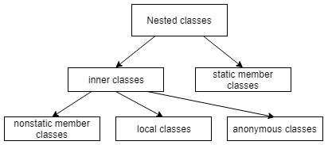

# Java语言OOP核心-继承

本模块包含有关 Java 继承的文章

- [Java语言OOP核心-继承](#java语言oop核心-继承)
  - [Java中的对象类型转换](#java中的对象类型转换)
  - [Java中的匿名类](#java中的匿名类)
  - [原文](#原文)
  - [Code](#code)

## Java中的对象类型转换

1. 概述

    Java 类型系统由两种类型组成：基元(primitives)和引用(references)。

    我们在[本文](https://www.baeldung.com/java-primitive-conversions)中介绍了基元转换，这里我们将重点介绍引用类型转换，以便充分了解 Java 是如何处理类型的。

2. 基元与引用

    虽然基元转换(primitive conversions)和引用变量铸造(reference variable casting)看起来很相似，但它们是[完全不同的概念](https://docs.oracle.com/javase/specs/jls/se8/html/jls-4.html#jls-4.1)。

    在这两种情况下，我们都是将一种类型 "转换" 成另一种类型。但是，简化地说，基元变量包含其值，而基元变量的转换意味着其值的不可逆变化：

    ```java
    double myDouble = 1.1;
    int myInt = (int) myDouble;     
    assertNotEquals(myDouble, myInt);
    ```

    在上例中转换后，myInt 变量的值是 1，我们无法从中恢复以前的值 1.1。

    引用变量则不同，引用变量只是引用对象，并不包含对象本身。

    而投射引用变量并不会触及它所引用的对象，只是以另一种方式给这个对象贴上标签，从而扩大或缩小了使用它的机会。上投(Upcasting)缩小了该对象可用的方法和属性列表，而下投(downcasting)可以扩展该对象。

    引用就像对象的遥控器。遥控器上的按钮有多有少，取决于其类型，而对象本身则存储在堆中。当我们进行下投时，我们会改变遥控器的类型，但不会改变对象本身。

3. Upcasting向上传递

    从子类向超类的传递称为上传递。通常情况下，编译器会隐式地进行上播。

    上投与继承（Java 的另一个核心概念）密切相关。使用引用变量来引用更具体的类型是很常见的。每当我们这样做时，就会发生隐式上播。

    为了演示向上传递，让我们定义一个动物（Animal）类：Animal.java

    现在我们来扩展动物：Cat.java

    现在，我们可以创建一个 Cat 类对象，并将其赋值给 Cat 类型的引用变量：

    `Cat cat = new Cat();`

    我们还可以将它赋值给动物类型的引用变量：

    `Animal animal = cat;`

    在上述赋值中，进行了隐式上播。

    我们也可以显式地进行赋值

    `animal = (Animal) cat;`

    但没有必要在继承树中进行显式上推。编译器知道 cat 是一种动物，不会显示任何错误。

    请注意，引用可以指向声明类型的任何子类型。

    通过向上传递，我们限制了 Cat 实例可用方法的数量，但并没有改变实例本身。现在，我们不能做任何与 Cat 相关的事情--我们不能在动物变量上调用 meow()。

    虽然 Cat 对象仍然是 Cat 对象，但调用 meow() 会导致编译器错误：

    `// animal.meow(); The method meow() is undefined for the type Animal`

    要调用 meow()，我们需要对 animal 进行降类，稍后我们将进行降类。

    但现在我们要描述的是，是什么为我们提供了向上广播。多亏了上转，我们才能利用多态性(polymorphism)。

    1. 多态性

        让我们定义 Animal 的另一个子类 Dog 类：Dog.java

        现在我们可以定义 feed() 方法，它将所有猫和狗都当作动物对待：AnimalFeeder.java/feed()

        我们不希望 AnimalFeeder 关心列表中的动物是猫还是狗。在 feed() 方法中，它们都是动物。

        当我们向动物列表中添加特定类型的对象时，就会发生隐式上播：

        whenUpcastToAnimal_thenOverridenMethodsCalled()

        我们添加猫和狗，并隐式地将它们上传到动物类型。每只猫都是一种动物，每只狗都是一种动物。它们是多态的。

        顺便说一句，所有 Java 对象都是多态的，因为每个对象至少都是一个对象。我们可以将 Animal 的实例赋值给 Object 类型的引用变量，编译器不会抱怨：

        `Object object = new Animal();`

        这就是为什么我们创建的所有 Java 对象都有特定于 Object 的方法，例如 toString()。

        上传到接口也很常见。

        我们可以创建 Mew 接口(Mew.java)，并让 Cat 实现它：

        Cat.java/meow()

        现在，任何猫对象都可以上传到 Mew：

        Mew mew = new Cat();

        猫是一种Mew；上推是合法的，而且是隐式的。

        因此，Cat 既是 Mew，又是动物、对象和猫。在我们的示例中，它可以被赋值给所有四种类型的引用变量。

    2. 重写

        在上面的示例中，eat() 方法被重载。这意味着，虽然 eat() 是在 Animal 类型的变量上调用的，但工作是由实际对象（猫和狗）上调用的方法完成的：

        ```java
        public void feed(List<Animal> animals) {
            animals.forEach(animal -> {
                animal.eat();
            });
        }
        ```

        如果我们在类中添加一些日志记录，就会看到 Cat 和 Dog 方法被调用：

        ```log
        web - 2018-02-15 22:48:49,354 [main] INFO com.baeldung.casting.Cat - cat is eating
        web - 2018-02-15 22:48:49,363 [main] INFO com.baeldung.casting.Dog - dog is eating
        ```

        总结一下：

        - 如果对象与变量的类型相同或属于子类型，引用变量就可以引用对象。
        - 上播是隐式的。
        - 所有 Java 对象都是多态的，并且可以通过上播被视为超类型的对象。

4. 下播

    如果我们想使用 Animal 类型的变量来调用仅 Cat 类可用的方法，该怎么办？这就是下播。这就是从超类向子类的传递。

    让我们来看一个例子：

    `Animal animal = new Cat();`

    我们知道 animal 变量指的是 Cat 的实例。我们想在 animal 上调用 Cat 的 meow() 方法。但编译器抱怨说，Animal 类型不存在 meow() 方法。

    要调用 meow()，我们应该将 animal 下拉到 Cat：

    `((Cat) animal).meow();`

    内括号及其包含的类型有时被称为下投运算符。请注意，编译代码时还需要外部括号。

    让我们用 meow() 方法重写前面的 AnimalFeeder 示例：AnimalFeeder.java/feed()

    现在，我们可以访问 Cat 类的所有可用方法。查看日志以确保 meow() 确实被调用：

    ```java
    web - 2018-02-16 18:13:45,445 [main] INFO com.baeldung.casting.Cat - cat is eating
    web - 2018-02-16 18:13:45,454 [main] INFO com.baeldung.casting.Cat - meow
    web - 2018-02-16 18:13:45,455 [main] INFO com.baeldung.casting.Dog - dog is eating
    ```

    请注意，在上面的示例中，我们只试图下传那些真正是 Cat 实例的对象。为此，我们使用了操作符 instanceof。

    1. 运算符instanceof

        我们经常在下传之前使用 instanceof 操作符来检查对象是否属于特定类型：

        `if (animal instanceof Cat) {...}`

    2. 类转换异常

        如果我们没有使用 instanceof 操作符检查类型，编译器就不会抱怨(complained)。但在运行时，就会出现异常。

        为了证明这一点，让我们删除上面代码中的 instanceof 操作符：

        ```java
        public void uncheckedFeed(List<Animal> animals) {
            animals.forEach(animal -> {
                animal.eat();
                ((Cat) animal).meow();
            });
        }
        ```

        这段代码的编译没有问题。但如果我们尝试运行它，就会出现异常：

        `java.lang.ClassCastException: com.baeldung.casting.Dog cannot be cast to com.baeldung.casting.Cat`

        这意味着我们正试图将 Dog 实例转换为 Cat 实例。

        如果我们下投的类型与实际对象的类型不匹配，运行时总会抛出 ClassCastException。

        请注意，如果我们试图向下传递一个不相关的类型，编译器是不会允许的：

        ```java
        Animal animal;
        String s = (String) animal;
        ```

        编译器会说："Cannot cast from Animal to String."。

        为了使代码能够编译，这两种类型应该在同一个继承树中。

        总结一下

        - 要访问子类特有的成员，必须进行降类。
        - 下投是使用cast操作符完成的。
        - 要安全地进行下投，我们需要使用 instanceof 操作符。
        - 如果真实对象与我们下投的类型不匹配，那么运行时将抛出 ClassCastException。

5. cast() 方法

    还有另一种使用类的方法进行对象下投的方法：

    whenDowncastToCatWithCastMethod_thenMeowIsCalled()

    在上述示例中，使用了 cast() 和 isInstance() 方法，而不是相应的 cast 和 instanceof 操作符。

    在泛型中使用 cast() 和 isInstance() 方法很常见。

    让我们创建带有 feed() 方法的 `AnimalFeederGeneric<T>` 类，该方法只能 "feeds" 一种动物，即猫或狗，具体取决于类型参数的值：

    AnimalFeederGeneric.java

    feed() 方法会检查每个动物，并只返回 T 的实例。

    请注意，Class 实例也应传递给泛型类，因为我们无法从类型参数 T 中获取它。

    让我们将 T 设为 Cat，并确保该方法只返回猫：

    whenParameterCat_thenOnlyCatsFed()

6. 结论

    在本基础教程中，我们探讨了上播、下播、如何使用它们，以及这些概念如何帮助您利用多态性。

## Java中的匿名类

1. 匿名类简介

    在本教程中，我们将讨论 Java 中的匿名类。

    我们将介绍如何声明和创建匿名类实例。我们还将简要讨论匿名类的属性和限制。

2. 匿名类声明

    匿名类是没有名称的内部类。由于它们没有名称，因此我们不能使用它们来创建匿名类的实例。因此，我们必须在使用时用一个表达式声明并实例化匿名类。

    我们可以扩展现有的类，也可以实现接口。

    1. 扩展一个类

        当我们从一个已有类实例化一个匿名类时，我们使用以下语法：

        

        在括号中，我们指定了要扩展的类的构造函数所需的参数：Main.java\Book("Design Patterns")

        当然，如果父类构造函数不接受任何参数，我们应该将括号留空。

    2. 实现接口

        我们也可以从接口实例化匿名类：

        

        显然，Java 的接口没有构造函数，所以括号始终为空。这是我们实现接口方法的唯一方法：

        ```java
        new Runnable() {
            @Override
            public void run() {
                ...
            }
        }
        ```

        实例化匿名类后，我们可以将该实例赋值给一个变量，以便以后在某处引用它。

        我们可以使用 Java 表达式的标准语法来做到这一点：

        ```java
        Runnable action = new Runnable() {
            @Override
            public void run() {
                ...
            }
        };
        ```

        如前所述，匿名类声明是一个表达式，因此它必须是语句的一部分。这也解释了为什么我们要在语句末尾加上分号。

        显然，如果我们内联创建实例，就可以避免将实例赋值给变量：

        ```java
        List<Runnable> actions = new ArrayList<Runnable>();
        actions.add(new Runnable() {
            @Override
            public void run() {
                ...
            }
        });
        ```

        我们应该谨慎使用这种语法，因为它很容易影响代码的可读性，尤其是当 run() 方法的实现占用大量空间时。

3. 匿名类属性

    与通常的顶级类相比，匿名类的使用有一些特殊性。在此，我们将简要谈谈最实际的问题。有关最准确和最新的信息，我们可以随时查阅《[Java语言规范](https://docs.oracle.com/javase/specs/jls/se8/html/index.html)》。

    1. 构造函数

        匿名类的语法不允许我们让它们实现多个接口。在构造过程中，匿名类可能只存在一个实例。因此，匿名类不可能是抽象类。由于匿名类没有名称，我们无法对其进行扩展。出于同样的原因，匿名类不能有明确声明的构造函数。

        事实上，由于以下原因，没有构造函数对我们来说没有任何问题：

        - 我们在声明匿名类的同时就创建了匿名类实例
        - 从匿名类实例中，我们可以访问局部变量和外层类的成员

    2. 静态成员

        除了常量成员外，匿名类不能有任何静态成员。

        例如，以下代码将无法编译：

        ```java
        new Runnable() {
            static final int x = 0;
            static int y = 0; // compilation error!
            @Override
            public void run() {...}
        };
        ```

        相反，我们会得到以下错误：

        `The field y cannot be declared static in a non-static inner type, unless initialized with a constant expression`

    3. 变量的范围

        匿名类捕获的局部变量属于我们声明该类的代码块的作用域：

        ```java
        int count = 1;
        Runnable action = new Runnable() {
            @Override
            public void run() {
                System.out.println("Runnable with captured variables: " + count);
            }           
        };
        ```

        正如我们所见，局部变量 count 和 action 定义在同一个代码块中。因此，我们可以在类声明中访问 count。

        请注意，要使用局部变量，它们必须是有效的最终变量。从 JDK 8 开始，我们不再需要用关键字 final 来声明变量。不过，这些变量必须是 final 变量。否则会出现编译错误：

        `[ERROR] local variables referenced from an inner class must be final or effectively final`

        为了让编译器判定一个变量事实上是不可变的，在代码中，我们应该只在一个地方为它赋值。我们可以在文章 "[为什么Lambdas中使用的局部变量必须是最终变量或有效最终变量？](https://www.baeldung.com/java-lambda-effectively-final-local-variables)"中找到更多关于有效最终变量的信息。

        我们只需提到，匿名类与所有内部类一样，可以访问其外层类的所有成员。

        我们只需指出，与每个内部类一样，匿名类可以访问其外层类的所有成员。

4. 匿名类用例

    匿名类的应用可能多种多样。让我们来探讨一些可能的用例。

    1. 类的层次结构和封装

        我们应在一般用例中使用内层类，而在非常特殊的用例中使用匿名类，以便在应用程序中实现更清晰的类层次结构。使用内层类时，我们可以对外层类的数据进行更精细的封装。如果我们在顶层类中定义了内部类的功能，那么外层类的部分成员就应该是公共的或包可见的。当然，在有些情况下，这种做法并不受欢迎，甚至不被接受。

    2. 更简洁的项目结构

        当我们需要临时修改某些类的方法实现时，通常会使用匿名类。在这种情况下，我们可以避免为了定义顶层类而在项目中添加新的 *.java 文件。尤其是在顶层类只使用一次的情况下。

    3. 用户界面事件监听器

        在具有图形界面的应用程序中，匿名类最常见的用途是创建各种事件监听器。例如，在以下代码段中

        ```java
        button.addActionListener(new ActionListener() {
            public void actionPerformed(ActionEvent e) {
                ...
            }
        }
        ```

        我们创建了一个匿名类的实例，该类实现了 ActionListener 接口。当用户点击按钮时，它的 actionPerformed 方法就会被触发。

        不过从 Java 8 开始，lambda 表达式似乎是一种更受欢迎的方式。

5. General Picture

    上文提到的匿名类只是嵌套类的一种特殊情况。一般来说，嵌套类是在另一个类或接口内部声明的类：

    

    从图中我们可以看到，匿名类与局部成员类和非静态成员类一起构成了所谓的内部类。它们与静态成员类一起构成嵌套类。

6. 结论

    在本文中，我们讨论了 Java 匿名类的各个方面。我们还描述了嵌套类的一般层次结构。

## 原文

- [A Guide to Inner Interfaces in Java](https://www.baeldung.com/java-inner-interfaces)
- [x] [Anonymous Classes in Java](https://www.baeldung.com/java-anonymous-classes)
- [x] [Object Type Casting in Java](https://www.baeldung.com/java-type-casting)
- [Variable and Method Hiding in Java](https://www.baeldung.com/java-variable-method-hiding)
- [Inner Classes Vs. Subclasses in Java](https://www.baeldung.com/java-inner-classes-vs-subclasses)

## Code

像往常一样，本教程中的所有代码样本都可以在[GitHub](https://github.com/eugenp/tutorials/tree/master/core-java-modules/core-java-lang-oop-inheritance)上找到。
