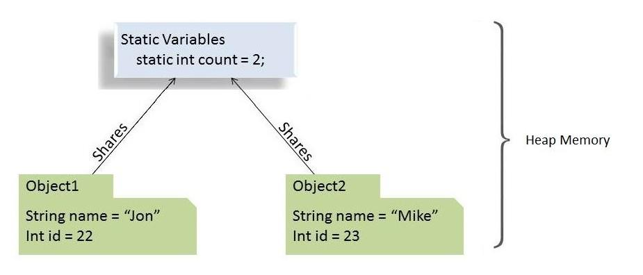

# 核心Java语言OOP-修饰符

本模块包含有关 Java 中修饰符的文章。

- [x] [Java中的访问修饰符](#java中的访问修饰符)
- [Java 中的"公共"访问修饰符](https://www.baeldung.com/java-public-keyword)
- [Java 中的"private"访问修饰符](https://www.baeldung.com/java-private-keyword)
- [x] [Java中的"final"关键字](#final关键字)
- [x] [Java中的静态关键字指南](#java中的静态关键字指南)
- [Java 中接口中的静态和默认方法](https://www.baeldung.com/java-static-default-methods)
- [Java 中的 stringfp 关键字](https://www.baeldung.com/java-strictfp)
- [Java 中的静态类与单例模式](https://www.baeldung.com/java-static-class-vs-singleton)

## Java中的访问修饰符

1. 概述

    在本教程中，我们将讨论Java中的访问修饰符，它用于设置对类、变量、方法和构造函数的访问级别(classes, variables, methods, and constructors.)。

    简单地说，有四个访问修饰符：public、private、protected和default（无关键字）。

    在我们开始之前，让我们注意到一个顶层的类只能使用公共或默认的访问修饰符。在成员层，我们可以使用所有四个。

2. 缺省

    当我们没有明确使用任何关键字时，Java将为一个给定的类、方法或属性设置默认访问。默认访问修改器也被称为包-私有(package-private)，这意味着所有成员在同一包内是可见的，但不能从其他包中访问：

    ```java
    package com.baeldung.accessmodifiers;

    public class SuperPublic {
        static void defaultMethod() {
            ...
        }
    }
    ```

    defaultMethod()可以在同一个包的另一个类中访问：

    ```java
    package com.baeldung.accessmodifiers;

    public class Public {
        public Public() {
            SuperPublic.defaultMethod(); // Available in the same package.
        }
    }
    ```

    然而，在其他包中是不可用的。

3. 公开

    如果我们给一个类、方法或属性添加public关键字，那么我们就会让它对整个世界可用，也就是说，所有包中的所有其他类都能使用它。这是限制性最小的访问修改器：

    ```java
    package com.baeldung.accessmodifiers;

    public class SuperPublic {
        public static void publicMethod() {
            ...
        }
    }
    ```

    publicMethod()在另一个包中可用：

    ```java
    package com.baeldung.accessmodifiers.another;

    import com.baeldung.accessmodifiers.SuperPublic;

    public class AnotherPublic {
        public AnotherPublic() {
            SuperPublic.publicMethod(); // Available everywhere. Let's note different package.
        }
    }
    ```

    关于public关键字在应用于类、接口、嵌套的公有类或接口和方法时的行为的更多细节，请参阅[专门的文章](https://www.baeldung.com/java-public-keyword)。

4. 私有

    任何带有private关键字的方法、属性或构造函数都只能从同一个类中访问。这是限制性最强的访问修饰语，是封装概念的核心。所有的数据都将从外界隐藏起来：

    ```java
    package com.baeldung.accessmodifiers;

    public class SuperPublic {
        static private void privateMethod() {
            ...
        }
        
        private void anotherPrivateMethod() {
            privateMethod(); // available in the same class only.
        }
    }
    ```

    这篇[更详细的文章](https://www.baeldung.com/java-private-keyword)将展示private关键字在应用于字段、构造函数、方法和内类时的表现。

5. 受保护的

    在公有和私有访问级别之间，有一个受保护的访问修改器。

    如果我们用protected关键字声明一个方法、属性或构造函数，我们可以从同一个包中访问这个成员（和包-私有访问级别一样），此外还可以从其类的所有子类中访问，即使它们位于其他包中：

    ```java
    package com.baeldung.accessmodifiers;

    public class SuperPublic {
        static protected void protectedMethod() {
            ...
        }
    }
    ```

    protectedMethod()在子类中是可用的（不管是什么包）：

    ```java
    package com.baeldung.accessmodifiers.another;

    import com.baeldung.accessmodifiers.SuperPublic;

    public class AnotherSubClass extends SuperPublic {
        public AnotherSubClass() {
            SuperPublic.protectedMethod(); // Available in subclass. Let's note different package.
        }
    }
    ```

    [专门的文章](https://www.baeldung.com/java-protected-access-modifier)描述了更多关于关键字在字段、方法、构造函数、内类中使用时的情况，以及同一包或不同包中的可访问性。

6. 比较

    下表总结了可用的访问修改器。我们可以看到，一个类，无论使用何种访问修饰符，总是可以访问其成员：

    | Modifier  | Class | Package | Subclass | World |
    |-----------|-------|---------|----------|-------|
    | public    | Y     | Y       | Y        | Y     |
    | protected | Y     | Y       | Y        | N     |
    | default   | Y     | Y       | N        | N     |
    | private   | Y     | N       | N        | N     |

7. 总结

    在这篇短文中，我们讨论了Java中的访问修改器。

    对任何给定的成员使用最严格的访问级别以防止滥用是一个好的做法。我们应该始终使用私有访问修饰符，除非有很好的理由不这样做。

    只有当一个成员是API的一部分时，才应该使用公共访问级别。

## final关键字

1. 概述

    虽然继承使我们能够重用现有的代码，但有时我们确实需要出于各种原因对可扩展性进行限制；final关键字正好允许我们这样做。

    在本教程中，我们将看看final关键字对类、方法和变量意味着什么。

    测试代码参见：FinalUnitTest.java

2. 最终类

    标记为final的类不能被扩展。如果我们看一下Java核心库的代码，我们会发现那里有许多final类。一个例子是String类。

    考虑一下这种情况，如果我们可以扩展String类，覆盖它的任何方法，并且用我们特定的String子类的实例代替所有的String实例。

    那么，对String对象的操作结果将变得不可预测。鉴于String类到处都在使用，这是不可以接受的。这就是为什么String类被标记为final。

    任何试图继承一个最终类的行为都会导致编译器错误。为了证明这一点，我们来创建最终类Cat：

    finalkeyword/Cat.java

    让我们试着去扩展它：

    `public class BlackCat extends Cat {}`

    我们会看到编译器的错误：

    `The type BlackCat cannot subclass the final class Cat`

    注意，类声明中的final关键字并不意味着这个类的对象是不可改变的。我们可以自由改变Cat对象的字段：

    whenChangedFinalClassProperties_thenChanged()

    我们只是不能扩展它。

    如果我们严格遵循良好的设计规则，我们应该谨慎地创建和记录一个类，或者为了安全起见声明它是最终的。然而，在创建final类时，我们应该谨慎行事。

    请注意，将一个类定为final意味着其他程序员不能改进它。想象一下，我们正在使用一个类，但没有它的源代码，而且有一个方法出现了问题。

    如果这个类是最终的，我们就不能扩展它来覆盖这个方法并解决这个问题。换句话说，我们失去了可扩展性，这是面向对象编程的好处之一。

3. 最终方法

    标记为final的方法不能被重写。当我们设计一个类，觉得某个方法不应该被重写时，我们可以把这个方法定为最终方法。我们也可以在Java核心库中找到许多最终方法。

    有时我们不需要完全禁止一个类的扩展，而只需要防止对某些方法的重写。这方面的一个好例子是Thread类。对它进行扩展是合法的，因此可以创建一个自定义的线程类。但是它的isAlive()方法是最终的。

    这个方法检查一个线程是否是活的。由于许多原因，不可能正确地重写isAlive()方法。其中之一就是这个方法是本地的。原生代码是用另一种编程语言实现的，而且往往是针对它所运行的操作系统和硬件的。

    让我们创建一个狗类，并使其sound()方法成为最终方法：

    finalkeyword/Dog.java

    现在让我们扩展狗类并尝试覆盖它的sound()方法：

    ```java
    public class BlackDog extends Dog {
        public void sound() {
        }
    }
    ```

    我们会看到编译器的错误：

    ```log
    - overrides
    com.baeldung.finalkeyword.Dog.sound
    - Cannot override the final method from Dog
    sound() method is final and can’t be overridden
    ```

    如果我们类的某些方法被其他方法调用，我们应该考虑将被调用的方法变成final。否则，覆盖它们会影响调用者的工作，并导致令人惊讶的结果。

    如果我们的构造函数调用了其他方法，出于上述原因，我们一般应该将这些方法声明为final。

    把类的所有方法都定为final和把类本身定为final有什么区别？在第一种情况下，我们可以扩展该类并为其添加新方法。

    在第二种情况下，我们不能这样做。

4. 最终变量

    标记为final的变量不能被重新分配。一旦一个最终变量被初始化，它就不能被改变。

    1. 最终原始变量

        让我们声明一个原始的最终变量i，然后给它赋值1。

        让我们试着给它赋值为2：

        ```java
        public void whenFinalVariableAssign_thenOnlyOnce() {
            final int i = 1;
            //...
            i=2;
        }
        ```

        编译器说：

        `The final local variable i may already have been assigned`

    2. 最终参考变量

        如果我们有一个最终引用变量，我们也不能重新分配它。但这并不意味着它所指的对象是不可改变的。我们可以自由地改变这个对象的属性。

        为了证明这一点，让我们声明最终引用变量cat并初始化它：

        `final Cat cat = new Cat();`

        如果我们试图重新赋值它，我们会看到一个编译器错误：

        `The final local variable cat cannot be assigned. It must be blank and not using a compound assignment`

        但是我们可以改变Cat实例的属性：

        ```java
        cat.setWeight(5);
        assertEquals(5, cat.getWeight());
        ```

    3. 最终字段

        最终字段可以是常量，也可以是一次性写入的字段。为了区分它们，我们应该问一个问题--如果我们要对对象进行序列化，我们会包括这个字段吗？如果不会，那么它就不是对象的一部分，而是一个常量。

        注意，根据命名惯例，类常量应该是大写的，组件之间用下划线（"_"）字符分隔：

        `static final int MAX_WIDTH = 999;`

        注意，任何最终字段必须在构造函数完成之前被初始化。

        对于静态最终字段，这意味着我们可以初始化它们：

        - 如上例所示，在声明中
        - 在静态初始化块中

        对于实例最终字段，这意味着我们可以初始化它们：

        - 在声明时
        - 在实例初始化程序块中
        - 在构造函数中

        否则，编译器会给我们一个错误。

    4. 最终参数

        final关键字也是合法的，可以放在方法参数之前。一个最终参数不能在方法中被改变：

        ```java
        public void methodWithFinalArguments(final int x) {
            x=1;
        }
        ```

        上述赋值导致了编译器错误：

        `The final local variable x cannot be assigned. It must be blank and not using a compound assignment`

5. 总结

    在这篇文章中，我们学习了final关键字对类、方法和变量的意义。尽管我们在内部代码中可能不会经常使用final关键字，但它可能是一个好的设计方案。

## Java中的静态关键字指南

1. 概述

    在本教程中，我们将详细探讨Java语言的静态关键字。

    我们将了解如何将静态关键字应用于变量、方法、块和嵌套类，以及它有什么不同。

2. 静态关键字的剖析

    在Java编程语言中，关键字static意味着特定成员属于一个类型本身，而不是该类型的一个实例。

    这意味着我们将只创建一个静态成员的实例，在类的所有实例中共享。

    

    我们可以将该关键字应用于变量、方法、块和嵌套类。

3. 静态字段（或类变量）

    在Java中，当我们声明一个字段为静态时，该字段的单一副本就会被创建并在该类的所有实例中共享。

    我们对一个类进行多少次实例化并不重要。总是只有一个属于它的静态字段的副本。这个静态字段的值在所有同一类的对象中共享。

    从内存的角度来看，静态变量被存储在堆内存中。

    1. 静态字段的例子

        假设我们有一个汽车类，有几个属性（实例变量）。

        每当我们从这个汽车蓝图中实例化新对象时，每个新对象都会有其独特的这些实例变量的副本。

        然而，假设我们想要一个变量来保存已实例化的汽车对象的数量，并在所有实例中共享，这样它们就可以在初始化时访问它并增加它。

        这就是静态变量的作用：

        staticmodifier/Car.java

        现在，对于我们实例化的这个类的每一个对象，numberOfCars变量的相同副本都会被递增。

        所以，在这种情况下，这些将是真的：staticmodifier/CarUnitTest.java

    2. 使用静态字段的令人信服的理由

        下面是一些我们想使用静态字段的原因：

        - 当变量的值是独立于对象的时候
        - 当值应该在所有对象之间共享时。

    3. 要记住的关键点

        由于静态变量属于一个类，我们可以使用类的名称直接访问它们。所以，我们不需要任何对象引用。

        我们只能在类的层次上声明静态变量。

        我们可以不通过对象初始化来访问静态字段。

        最后，我们可以使用对象引用访问静态字段（如ford.numberOfCars++）。但是我们应该避免这样做，因为这样就很难弄清楚它是一个实例变量还是一个类变量。相反，我们应该总是使用类的名称来引用静态变量（Car.numberOfCars++）。

4. 静态方法（或类方法）

    与静态字段类似，静态方法也属于一个类而不是一个对象。因此，我们可以在不创建它们所在的类的对象的情况下调用它们。

    1. 静态方法的例子

        我们通常使用静态方法来执行一个不依赖实例创建的操作。

        为了在该类的所有实例中共享代码，我们把它写在一个静态方法中：

        staticmodifier/Car.java: setNumberOfCars(int)

        我们也经常使用静态方法来创建实用类或辅助类，这样我们就可以在不创建这些类的新对象的情况下得到它们。

        作为例子，我们可以看看JDK的[Collections](https://docs.oracle.com/en/java/javase/11/docs/api/java.base/java/util/Collections.html)或[Math](https://docs.oracle.com/en/java/javase/11/docs/api/java.base/java/lang/Math.html)实用类，Apache的[StringUtils](https://commons.apache.org/proper/commons-lang/apidocs/org/apache/commons/lang3/StringUtils.html)，或Spring框架的[CollectionUtils](https://docs.spring.io/spring/docs/current/javadoc-api/org/springframework/util/CollectionUtils.html)，注意它们的实用方法都是静态的。

    2. 使用静态方法的令人信服的理由

        让我们来看看为什么我们要使用静态方法的几个原因：

        - 访问/操纵(manipulate)静态变量和其他不依赖对象的静态方法。
        - 静态方法在实用类(utility)和辅助类(helper)中被广泛使用。

    3. 需要记住的关键点

        Java中的静态方法是在编译时解决的。由于方法重写是运行时多态的一部分，静态方法不能被重写。

        抽象方法不能是静态的。

        静态方法不能使用 this 或 super 关键字。

        实例、类方法和变量的以下组合是有效的：

        - 实例方法可以直接访问实例方法和实例变量
        - 实例方法也可以直接访问静态变量和静态方法
        - 静态方法可以访问所有静态变量和其他静态方法
        - 静态方法不能直接访问实例变量和实例方法。它们需要一些对象的引用才能做到这一点。

5. 静态块

    我们使用一个静态块来初始化静态变量。尽管我们可以在声明时直接初始化静态变量，但有些情况下我们需要进行多行处理。在这种情况下，静态块就会派上用场。

    如果静态变量在初始化过程中需要额外的、多语句(multi-statement)逻辑，我们可以使用静态块。

    1. 静态块的例子

        例如，假设我们想用一些预定义的值来初始化一个List对象。

        这在静态块中变得很容易：

        staticmodifier/StaticBlockDemo.java: Static {}

        我们不可能将所有的初始值和声明一起初始化一个List对象。所以，这就是为什么我们在这里利用了静态块。

    2. 使用静态块的令人信服的理由

        以下是使用静态块的几个原因：

        - 如果静态变量的初始化除了赋值外还需要一些额外的逻辑
        - 如果静态变量的初始化很容易出错，需要进行异常处理。

    3. 需要记住的关键点

        一个类可以有多个静态块。

        静态字段和静态块的解析和运行顺序与它们在类中出现的顺序相同。

6. 一个静态类

    Java允许我们在一个类中创建一个类。它提供了一种将我们只在一个地方使用的元素分组的方法。这有助于保持我们的代码更有组织性和可读性。

    一般来说，嵌套类的架构分为两种类型：

    - 我们声明为静态的嵌套类被称为静态嵌套类
    - 非静态的嵌套类被称为内部类

    这两者的主要区别在于，内层类可以访问包围类的所有成员（包括私有成员），而**静态嵌套类只能访问外层类的静态成员**。

    事实上，静态嵌套类的行为与其他顶层类完全一样，只是被封闭在唯一会访问它的类中，以提供更好的封装便利。

    1. 静态类的例子

        创建单子对象最广泛使用的方法是通过静态嵌套类：

        staticmodifier/Singleton.java

        我们使用这个方法是因为它不需要任何同步，而且很容易学习和实现。

    2. 使用静态内类的令人信服的理由

        让我们来看看在我们的代码中使用静态内类的几个理由：

        - 将只在一个地方使用的类分组，增加了封装性
        - 我们使代码更接近唯一会使用它的地方。这增加了可读性，代码也更容易维护。
        - 如果一个嵌套类不需要访问它的包围类的实例成员，最好将它声明为静态的。这样，它就不会被耦合到外层类，因此是更理想的，因为它们不需要任何堆或栈内存(heap or stack memory)。

    3. 需要记住的关键点

        基本上，一个静态嵌套类不能访问任何外层类的实例成员。它只能通过一个对象的引用来访问它们。

        静态嵌套类可以访问包围类的所有静态成员，包括私有成员。

        Java编程规范不允许我们将顶层类声明为静态的。只有类中的类（嵌套类）可以被定为静态。

7. 理解错误 "不能从静态上下文中引用非静态变量"

    通常情况下，当我们在静态上下文中使用非静态变量时，会出现这个错误。

    正如我们前面看到的，静态变量属于类，在类加载时被加载。另一方面，为了引用非静态变量，我们需要创建一个对象。

    所以，Java编译器会抱怨，因为需要有一个对象来调用或使用非静态变量。

    现在我们知道了错误的原因，让我们用一个例子来说明它：

    ```java
    public class MyClass {
        int instanceVariable = 0;
        
        public static void staticMethod() { 
            System.out.println(instanceVariable); 
        }
        
        public static void main(String[] args) {
            MyClass.staticMethod();
        }
    }
    ```

    我们可以看到，我们在静态方法staticMethod中使用了instanceVariable，这是一个非静态变量。

    因此，我们会得到一个错误：Non-static variable cannot be referenced from a static context.。

8. 结论

    在这篇文章中，我们看到了静态关键字的作用。

    我们还讨论了使用静态字段、静态方法、静态块和静态内类的原因和优点。

    最后，我们了解到是什么原因导致编译器出现 "不能从静态上下文引用非静态变量" 的错误。

## Relevant Articles

- [x] [Access Modifiers in Java](https://www.baeldung.com/java-access-modifiers)
- [Java ‘public’ Access Modifier](https://www.baeldung.com/java-public-keyword)
- [Java ‘private’ Access Modifier](https://www.baeldung.com/java-private-keyword)
- [x] [The “final” Keyword in Java](https://www.baeldung.com/java-final)
- [x] [A Guide to the Static Keyword in Java](https://www.baeldung.com/java-static)
- [Static and Default Methods in Interfaces in Java](https://www.baeldung.com/java-static-default-methods)
- [The strictfp Keyword in Java](https://www.baeldung.com/java-strictfp)
- [Static Classes Versus the Singleton Pattern in Java](https://www.baeldung.com/java-static-class-vs-singleton)

## Code

像往常一样，代码的例子可以在[Github](https://github.com/eugenp/tutorials/tree/master/core-java-modules/core-java-lang-oop-modifiers)上找到。
