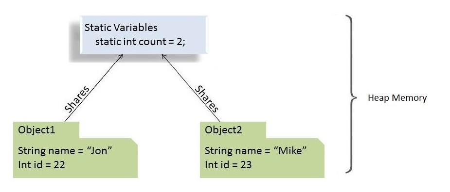

# [Java中的静态关键字指南](https://www.baeldung.com/java-static)

1. 概述

    在本教程中，我们将详细探讨Java语言的静态关键字。

    我们将了解如何将静态关键字应用于变量、方法、块和嵌套类，以及它有什么不同。

2. 静态关键字的剖析

    在Java编程语言中，关键字static意味着特定成员属于一个类型本身，而不是该类型的一个实例。

    这意味着我们将只创建一个静态成员的实例，在类的所有实例中共享。

    

    我们可以将该关键字应用于变量、方法、块和嵌套类。

3. 静态字段（或类变量）

    在Java中，当我们声明一个字段为静态时，该字段的单一副本就会被创建并在该类的所有实例中共享。

    我们对一个类进行多少次实例化并不重要。总是只有一个属于它的静态字段的副本。这个静态字段的值在所有同一类的对象中共享。

    从内存的角度来看，静态变量被存储在堆内存中。

    1. 静态字段的例子

        假设我们有一个汽车类，有几个属性（实例变量）。

        每当我们从这个汽车蓝图中实例化新对象时，每个新对象都会有其独特的这些实例变量的副本。

        然而，假设我们想要一个变量来保存已实例化的汽车对象的数量，并在所有实例中共享，这样它们就可以在初始化时访问它并增加它。

        这就是静态变量的作用：

        staticmodifier/Car.java

        现在，对于我们实例化的这个类的每一个对象，numberOfCars变量的相同副本都会被递增。

        所以，在这种情况下，这些将是真的：staticmodifier/CarUnitTest.java

    2. 使用静态字段的令人信服的理由

        下面是一些我们想使用静态字段的原因：

        - 当变量的值是独立于对象的时候
        - 当值应该在所有对象之间共享时。

    3. 要记住的关键点

        由于静态变量属于一个类，我们可以使用类的名称直接访问它们。所以，我们不需要任何对象引用。

        我们只能在类的层次上声明静态变量。

        我们可以不通过对象初始化来访问静态字段。

        最后，我们可以使用对象引用访问静态字段（如ford.numberOfCars++）。但是我们应该避免这样做，因为这样就很难弄清楚它是一个实例变量还是一个类变量。相反，我们应该总是使用类的名称来引用静态变量（Car.numberOfCars++）。

4. 静态方法（或类方法）

    与静态字段类似，静态方法也属于一个类而不是一个对象。因此，我们可以在不创建它们所在的类的对象的情况下调用它们。

    1. 静态方法的例子

        我们通常使用静态方法来执行一个不依赖实例创建的操作。

        为了在该类的所有实例中共享代码，我们把它写在一个静态方法中：

        staticmodifier/Car.java: setNumberOfCars(int)

        我们也经常使用静态方法来创建实用类或辅助类，这样我们就可以在不创建这些类的新对象的情况下得到它们。

        作为例子，我们可以看看JDK的[Collections](https://docs.oracle.com/en/java/javase/11/docs/api/java.base/java/util/Collections.html)或[Math](https://docs.oracle.com/en/java/javase/11/docs/api/java.base/java/lang/Math.html)实用类，Apache的[StringUtils](https://commons.apache.org/proper/commons-lang/apidocs/org/apache/commons/lang3/StringUtils.html)，或Spring框架的[CollectionUtils](https://docs.spring.io/spring/docs/current/javadoc-api/org/springframework/util/CollectionUtils.html)，注意它们的实用方法都是静态的。

    2. 使用静态方法的令人信服的理由

        让我们来看看为什么我们要使用静态方法的几个原因：

        - 访问/操纵(manipulate)静态变量和其他不依赖对象的静态方法。
        - 静态方法在实用类(utility)和辅助类(helper)中被广泛使用。

    3. 需要记住的关键点

        Java中的静态方法是在编译时解决的。由于方法重写是运行时多态的一部分，静态方法不能被重写。

        抽象方法不能是静态的。

        静态方法不能使用 this 或 super 关键字。

        实例、类方法和变量的以下组合是有效的：

        - 实例方法可以直接访问实例方法和实例变量
        - 实例方法也可以直接访问静态变量和静态方法
        - 静态方法可以访问所有静态变量和其他静态方法
        - 静态方法不能直接访问实例变量和实例方法。它们需要一些对象的引用才能做到这一点。

5. 静态块

    我们使用一个静态块来初始化静态变量。尽管我们可以在声明时直接初始化静态变量，但有些情况下我们需要进行多行处理。在这种情况下，静态块就会派上用场。

    如果静态变量在初始化过程中需要额外的、多语句(multi-statement)逻辑，我们可以使用静态块。

    1. 静态块的例子

        例如，假设我们想用一些预定义的值来初始化一个List对象。

        这在静态块中变得很容易：

        staticmodifier/StaticBlockDemo.java: Static {}

        我们不可能将所有的初始值和声明一起初始化一个List对象。所以，这就是为什么我们在这里利用了静态块。

    2. 使用静态块的令人信服的理由

        以下是使用静态块的几个原因：

        - 如果静态变量的初始化除了赋值外还需要一些额外的逻辑
        - 如果静态变量的初始化很容易出错，需要进行异常处理。

    3. 需要记住的关键点

        一个类可以有多个静态块。

        静态字段和静态块的解析和运行顺序与它们在类中出现的顺序相同。

6. 一个静态类

    Java允许我们在一个类中创建一个类。它提供了一种将我们只在一个地方使用的元素分组的方法。这有助于保持我们的代码更有组织性和可读性。

    一般来说，嵌套类的架构分为两种类型：

    - 我们声明为静态的嵌套类被称为静态嵌套类
    - 非静态的嵌套类被称为内部类

    这两者的主要区别在于，内层类可以访问包围类的所有成员（包括私有成员），而**静态嵌套类只能访问外层类的静态成员**。

    事实上，静态嵌套类的行为与其他顶层类完全一样，只是被封闭在唯一会访问它的类中，以提供更好的封装便利。

    1. 静态类的例子

        创建单子对象最广泛使用的方法是通过静态嵌套类：

        staticmodifier/Singleton.java

        我们使用这个方法是因为它不需要任何同步，而且很容易学习和实现。

    2. 使用静态内类的令人信服的理由

        让我们来看看在我们的代码中使用静态内类的几个理由：

        - 将只在一个地方使用的类分组，增加了封装性
        - 我们使代码更接近唯一会使用它的地方。这增加了可读性，代码也更容易维护。
        - 如果一个嵌套类不需要访问它的包围类的实例成员，最好将它声明为静态的。这样，它就不会被耦合到外层类，因此是更理想的，因为它们不需要任何堆或栈内存(heap or stack memory)。

    3. 需要记住的关键点

        基本上，一个静态嵌套类不能访问任何外层类的实例成员。它只能通过一个对象的引用来访问它们。

        静态嵌套类可以访问包围类的所有静态成员，包括私有成员。

        Java编程规范不允许我们将顶层类声明为静态的。只有类中的类（嵌套类）可以被定为静态。

7. 理解错误 "不能从静态上下文中引用非静态变量"

    通常情况下，当我们在静态上下文中使用非静态变量时，会出现这个错误。

    正如我们前面看到的，静态变量属于类，在类加载时被加载。另一方面，为了引用非静态变量，我们需要创建一个对象。

    所以，Java编译器会抱怨，因为需要有一个对象来调用或使用非静态变量。

    现在我们知道了错误的原因，让我们用一个例子来说明它：

    ```java
    public class MyClass {
        int instanceVariable = 0;
        
        public static void staticMethod() { 
            System.out.println(instanceVariable); 
        }
        
        public static void main(String[] args) {
            MyClass.staticMethod();
        }
    }
    ```

    我们可以看到，我们在静态方法staticMethod中使用了instanceVariable，这是一个非静态变量。

    因此，我们会得到一个错误：Non-static variable cannot be referenced from a static context.。

8. 结论

    在这篇文章中，我们看到了静态关键字的作用。

    我们还讨论了使用静态字段、静态方法、静态块和静态内类的原因和优点。

    最后，我们了解到是什么原因导致编译器出现 "不能从静态上下文引用非静态变量" 的错误。
