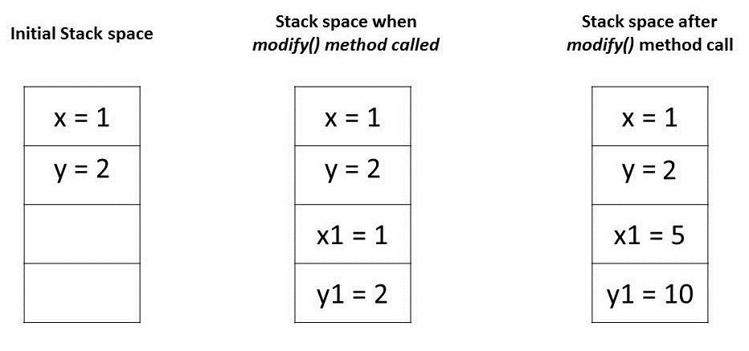
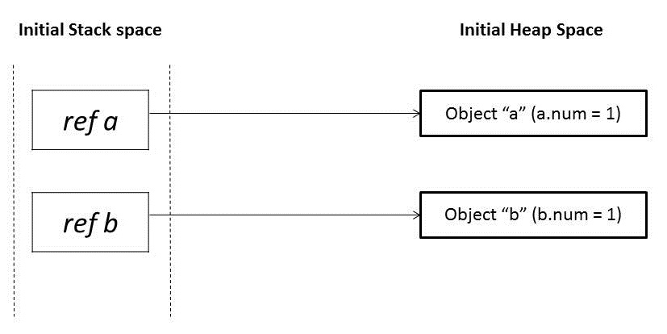
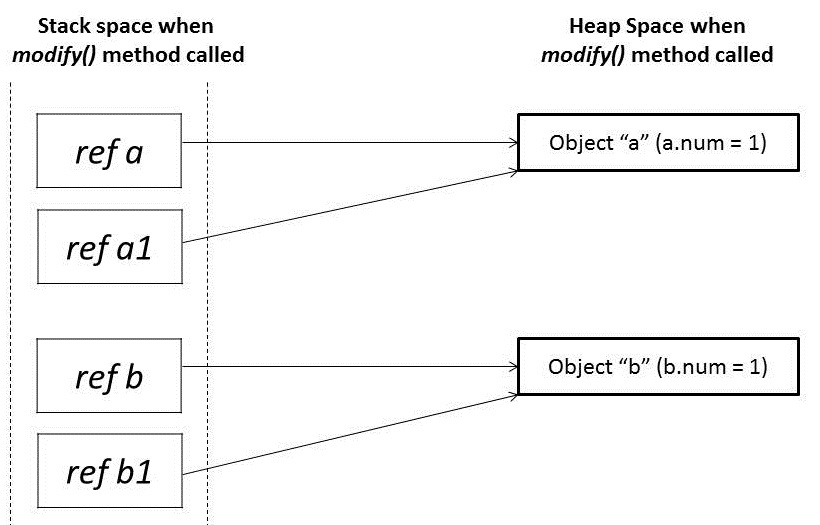
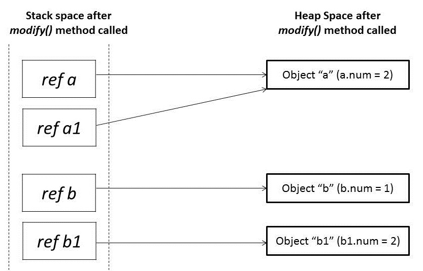

# [Java 中的值传递作为参数传递机制](https://www.baeldung.com/java-pass-by-value-or-pass-by-reference)

1. 简介

    向方法传递参数的两种最常见方式是“值传递”（Pass-by-Value）和“引用传递”（Pass-by-Reference）。不同编程语言对这些概念的使用方式各不相同。就 Java 而言，一切严格采用值传递。

    在本教程中，我们将通过各种类型的示例，说明 Java 是如何传递参数的。

2. 逐值传递与逐指传递

    首先，我们来看一下向函数传递参数的几种不同机制：

    - 值传递（value）
    - 引用传递（reference）
    - 结果传递（result）
    - 值-结果传递（value-result）
    - 名称传递（name）

    在现代编程语言中，最常用的两种机制是“值传递”和“引用传递”。在继续之前，我们先分别讨论一下：

    1. 值传递（Pass-by-Value）

        当参数以值传递方式传入时，调用方（caller）和被调用方（callee）操作的是两个彼此独立的变量，它们互为副本。对其中一个变量的任何修改都不会影响另一个。

        也就是说，在调用方法时，传递给被调用方法的参数是原始参数的克隆。在被调用方法中对参数所做的任何修改，都不会影响调用方法中的原始参数。

    2. 引用传递（Pass-by-Reference）

        当参数以引用传递方式传入时，调用方和被调用方操作的是同一个对象。

        这意味着，当一个变量以引用方式传递时，对象的唯一标识符（即内存地址）会被传入方法。对该参数实例成员的任何修改，都会直接反映到原始对象上。

3. Java中的参数传递

    任何编程语言的基本概念都包括“值”和“引用”。在 Java 中，基本类型变量（primitive variables）直接存储实际值，而非基本类型（即对象）则存储引用变量（reference variables），这些引用指向它们所引用对象的内存地址。无论是值还是引用，都存储在栈内存中。

    Java中的参数总是按值传递的。在方法调用过程中，每个参数的副本，无论是值还是引用，都会在堆栈内存中创建，然后传递给方法。

    如果是基元(primitives)，值被简单地复制到堆栈内存中，然后传递给被调用的方法；如果是非基元(non-primitives)，堆栈内存中的引用指向驻留在堆中的实际数据。当我们传递一个对象时，堆栈内存中的引用被复制，新的引用被传递给方法。

    现在让我们在一些代码例子的帮助下看看这个动作。

    1. 传递原始类型

        Java编程语言有八个原始数据类型。原始变量直接存储在堆栈内存中。每当任何原始数据类型的变量被作为参数传递时，实际参数被复制到形式参数，这些形式参数在堆栈内存中积累了自己的空间。

        这些形式参数的寿命只持续到该方法运行时，在返回时，这些形式参数会从堆栈中清除并被丢弃。

        让我们试着借助一个代码例子来理解它。

        

        让我们试着通过分析这些值是如何存储在内存中的，来理解上述程序中的断言。

        - 主方法中的变量 "x" 和 "y" 是原始类型，它们的值直接存储在堆栈内存中。
        - 当我们调用方法modify()时，这些变量的每一个副本都被创建并存储在堆栈内存中的不同位置。
        - 对这些副本的任何修改都只影响它们，而使原始变量不被改变。

        

    2. 传递对象引用

        在 Java 中，所有对象在底层都动态存储在堆（Heap）空间中。这些对象通过称为“引用变量”的引用来访问。

        与基本类型不同，Java 对象的存储分为两个部分：引用变量存储在栈内存中，而它们所指向的实际对象则存储在堆内存中。

        每当一个对象作为参数传递时，会创建该引用变量的一个精确副本，这个副本仍然指向堆内存中同一个对象。

        因此，当我们在方法内部修改该对象的内容时，这种修改会反映到原始对象上。但是，如果我们为传入的引用变量分配一个新对象，则不会影响原始对象。

        让我们借助于一个代码例子来理解这个问题。

        

        让我们分析一下上述程序中的断言。我们在modify()方法中传递了具有相同值1的对象a和b。最初，这些对象引用是指向堆(heap)空间中两个不同的对象位置。

        

        当这些引用a和b被传递到modify()方法中时，它创建了这些引用a1和b1的镜像副本，它们指向相同的旧对象。

        

        在modify()方法中，当我们修改引用a1时，它改变了原始对象。然而，对于引用b1，我们已经分配了一个新的对象。所以它现在是指向堆内存中的一个新对象。

        对b1所做的任何改变都不会反映在原始对象中。

        

4. 总结

    在这篇文章中，我们看了在基元和非基元的情况下是如何处理参数传递的。

    我们了解到，Java中的参数传递始终是逐值传递。然而，根据我们处理的是基元还是对象，情况会发生变化。

    - 对于基本类型：传递的是值的副本（真正的值传递）。
    - 对于对象类型：传递的是对象引用的副本（即“引用的值”被传递），因此方法内可以修改原始对象的内容，但不能改变原始引用本身所指向的对象。

    > 注意：尽管对象引用的副本指向同一个对象，使得看起来像“引用传递”，但 Java 本质上仍然是**值传递**——传递的是引用的值（即地址的副本），而非引用本身。
