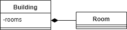
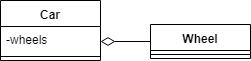
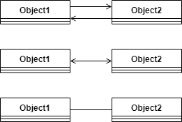
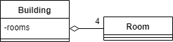
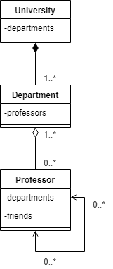

# 核心Java语言OOP-模式

本模块包含有关 Java 中面向对象编程 (OOP) 模式的文章

- [x] [Java中的组合、聚合和关联](#java中的组合聚合和关联)
- [x] [Java中的继承和组合（Is-a与Has-a关系）](#java中的继承和组合is-a与has-a关系)
- [x] [Java中的不可变对象](#java中的不可变对象)
- [如何在Java中深度复制对象](https://www.baeldung.com/java-deep-copy)
- [x] [在Java中使用接口与抽象类](#在java中使用接口与抽象类)

## Java中的组合、聚合和关联

1. 简介

    无论是在现实生活中还是在编程中，对象之间都有关系。有时，要理解或实现这些关系是很困难的。

    在本教程中，我们将重点介绍Java对三种有时容易混淆的关系类型的处理：组合、聚合和关联。

2. 组成

    组成是一种 "belongs-to" 类型的关系。它意味着其中一个对象是一个逻辑上更大的结构，它包含另一个对象。换句话说，它是另一个对象的一部分或成员。

    另外，我们通常称它为 "has-a"关系（与 "is-a"关系相反，后者是继承关系）。

    例如，一个房间属于一个建筑，或者换句话说，一个建筑有一个房间。所以基本上，我们把它叫做 "belongs-to" 还是 "has-a"，只是一个观点问题。

    构成是一种强烈的 "has-a" 关系，因为包含对象拥有它。因此，这些对象的生命周期是绑定的。这意味着，如果我们摧毁了所有者对象，它的成员也将随之被摧毁。例如，在我们前面的例子中，房间和建筑一起被摧毁。

    请注意，这并不意味着包含对象在没有其任何部分的情况下就不能存在。例如，我们可以拆掉建筑物内的所有墙壁，从而摧毁房间。但这栋楼仍然存在。

    在cardinality方面，一个包含对象可以有我们想要的多少个部分。但是，所有的部分都需要正好有一个容器。

    1. UML

        在UML中，我们用以下符号表示组成：

        

        注意，钻石是在包含对象处，是线条的底端，而不是箭头。为了清楚起见，我们经常也画箭头：

        

        那么，我们就可以在我们的Building-Room例子中使用这个UML结构：

        

    2. 源代码

        在Java中，我们可以用一个非静态内类来建模：

        relationships.composition/Building.java

        或者，我们也可以在方法体中声明这个类。不管它是一个命名的类、一个匿名的类还是一个lambda，都无所谓：

        relationships.composition/BuildingWithDefinitionRoomInMethod.java

        注意，至关重要的是，我们的内层类应该是非静态的，因为它将其所有的实例都绑定到了包含类上。

        通常情况下，包含对象想要访问其成员。因此，我们应该存储它们的引用：

        ```java
        class Building {
            List<Room> rooms;
            class Room {}
        }
        ```

        注意，所有的内部类对象都存储了对其包含对象的隐式引用。因此，我们不需要手动存储它来访问它：

        ```java
        class Building {
            String address;
            class Room {
                String getBuildingAddress() {
                    return Building.this.address;
                }   
            }
        }
        ```

3. 聚合

    聚合(Aggregation)也是一种 "have-a" 关系。它与组合的不同之处在于，它不涉及所有权。因此，这些对象的生命周期并不相连：它们中的每一个都可以独立存在。

    例如，一辆汽车和它的车轮。我们可以取下车轮，而它们仍然存在。我们可以安装其他（预先存在的）车轮，或者将这些车轮安装到另一辆车上，一切都会正常工作。

    当然，一辆没有轮子的车或一个脱落的轮子不会像一辆有轮子的车那样有用。但这就是为什么这种关系首先存在的原因：把零件组装成一个更大的构造，它能够比它的零件做更多的事情。

    由于聚合并不涉及拥有，一个成员不需要只与一个容器联系在一起。例如，一个三角形是由线段组成的。但三角形可以共享线段作为其边。

    1. UML

        聚合与组合非常相似。唯一的逻辑区别是聚合是一种较弱的关系。

        因此，UML的表示方法也非常相似。唯一的区别是钻石是空的：

        

        对于汽车和轮子，那么，我们会做：

        

    2. 源代码

        在Java中，我们可以用一个普通的老引用来建立聚合模型：

        relationships.aggregation/Wheel.java

        relationships.aggregation/Car.java

        成员可以是任何类型的类，除了非静态的内部类。

        在上面的代码片段中，两个类都有其独立的源文件。然而，我们也可以使用一个静态的内部类：

        ```java
        class Car {
            List<Wheel> wheels;
            static class Wheel {}
        }
        ```

        请注意，Java只在非静态的内部类中创建隐式引用。正因为如此，我们必须在需要的地方手动维护这种关系：

        ```java
        class Wheel {
            Car car;
        }
        class Car {
            List<Wheel> wheels;
        }
        ```

4. 关联

    关联是三者之间最弱的关系。它不是一个 "has-a" 的关系，没有一个对象是另一个对象的部分或成员。

    关联只意味着这些对象 "know" 对方。例如，一个母亲和她的孩子。

    1. UML

        在UML中，我们可以用一个箭头来标记一个关联：

        

        如果关联是双向的，我们可以使用两个箭头，一个两端都有箭头的箭头，或者一个没有任何箭头的线：

        

        那么，我们可以用UML表示一个母亲和她的孩子：

        

    2. 源代码

        在Java中，我们可以用与聚合相同的方式对关联进行建模：

        `class Child {}`

        relationships.association/Mother.java

        但是，等等，我们怎么能知道一个引用是指聚合还是关联呢？

        嗯，我们不能。区别只是逻辑上的：其中一个对象是否是另一个对象的一部分。

        而且，我们必须在两端手动维护引用，就像我们在聚合中做的那样：

        relationships.association/Child.java

        relationships.association/Mother.java

5. UML旁注Sidenote

    为了清晰起见，有时我们想在UML图上定义一个关系的cardinality。我们可以通过把它写在箭头的两端来做到这一点：

    

    注意，把零写成cardinality是没有意义的，因为它意味着没有关系。唯一的例外是当我们想用一个范围来表示一个可选的关系：

    

    还要注意的是，由于在构成中正好有一个所有者，所以我们不在图上标明它。

6. 一个复杂的例子

    让我们看看一个（小小的）更复杂的例子!

    我们将建立一所大学的模型，这所大学有很多系。教授们在每个系工作，他们之间也有朋友。

    在我们关闭大学之后，这些部门还会存在吗？当然不会，因此它是一个组合。

    但教授们仍将存在（希望如此）。我们必须决定哪一个更符合逻辑：如果我们把教授看作是系里的一部分，或者不是。或者说：他们到底是不是系里的成员？是的，他们是。因此，它是一个聚合。除此之外，一个教授可以在多个部门工作。

    教授之间的关系是关联的，因为说一个教授是另一个教授的一部分没有任何意义。

    因此，我们可以用下面的UML图来模拟这个例子：

    

    而Java代码看起来是这样的：

    relationships.university/University.java

    relationships.university/Department.java

    relationships.university/Professor.java

    注意，如果我们依靠 "has-a"、"below-to"、"member-of"、"part-of" 等术语，我们可以更容易地识别我们的对象之间的关系。

7. 结语

    在这篇文章中，我们看到了组合、聚合和关联的属性和表现。我们还看到了如何在UML和Java中对这些关系进行建模。

## Java中的继承和组合（Is-a与Has-a关系）

1. 概述

    继承和组合--与抽象、封装和多态一起--是面向对象编程（OOP）的基石。

    在本教程中，我们将介绍继承和组合的基础知识，我们将重点关注发现这两种关系之间的差异。

2. 继承的基础知识

    继承是一个强大但被过度使用和误用的机制。

    简单地说，通过继承，一个基类（又称基类型）定义了一个特定类型所共有的状态和行为，并让子类（又称子类型）提供该状态和行为的专门版本。

    为了清楚地了解如何使用继承，让我们创造一个例子：一个基类Person定义了一个人的通用字段和方法，而子类Waitress和Actress提供了额外的、细粒度的方法实现。

    这里是Person类：inheritancecomposition.model/Person.java

    而这些是子类：

    Waitress.java: serveStarter()

    Actress.java: readScript()

    此外，让我们创建一个单元测试来验证女服务员和女演员类的实例也是人的实例，从而表明在类型级别上满足 "is-a "条件：

    InheritanceUnitTest.java

    在此必须强调继承的语义方面的问题。除了重复使用Person类的实现之外，我们还在基类型Person和子类型Waitress和Actress之间创建了一个定义明确的 "is-a" 关系。女服务员和女演员，实际上就是人。

    这可能会引起我们的疑问：在哪些用例中，继承是正确的做法？

    如果子类型满足了 "is-a" 的条件，并且主要是为类的层次结构提供附加的功能，那么继承就是正确的做法。

    当然，只要被覆盖的方法保留了[里氏替换原则（Liskov Substitution principle）](https://en.wikipedia.org/wiki/Liskov_substitution_principle)所提倡的基础类型/子类型的可替代性，那么方法的覆盖是允许的。

    此外，我们应该记住，子类型继承了基类型的API，这在某些情况下可能是矫枉过正或者仅仅是不可取(overkill or merely)的。

    否则，我们应该使用组合来代替。

3. 设计模式中的继承性

    虽然大家都认为在可能的情况下，我们应该选择组合而不是继承，但在一些典型的用例中，继承也有其存在的意义。

    1. 层超类型模式

        Layer Supertype Pattern, 在这种情况下，我们使用继承来将普通的代码转移到基类（超类型），在每个层的基础上。

        下面是这种模式在领域层的基本实现：

        ```java
        public class Entity {
            protected long id;
            // setters
        }
        public class User extends Entity {
            // additional fields and methods
        }
        ```

        我们可以将同样的方法应用于系统中的其他层，如服务层和持久化层。

    2. 模板方法模式

        Template Method Pattern, 在模板方法模式中，我们可以用一个基类来定义算法的不变部分，然后在子类中实现变体部分：

        ```java
        public abstract class ComputerBuilder {
            public final Computer buildComputer() {
                addProcessor();
                addMemory();
            }
            public abstract void addProcessor();
            public abstract void addMemory();
        }

        public class StandardComputerBuilder extends ComputerBuilder {
            @Override
            public void addProcessor() {
                // method implementation
            }
            @Override
            public void addMemory() {
                // method implementation
            }
        }
        ```

4. 组合的基本原理

    组合是OOP提供的另一种重用实现的机制。

    简而言之，组合允许我们对由其他对象组成的对象进行建模，从而定义了它们之间的 "has-a" 关系。

    此外，组合是最强的[关联](https://en.wikipedia.org/wiki/Association_(object-oriented_programming))形式，这意味着当一个对象被销毁时，组成或被一个对象包含的对象也会被销毁。

    为了更好地理解构成的作用，让我们假设我们需要与代表计算机的对象一起工作。

    一台计算机是由不同的部分组成的，包括微处理器、内存、声卡等等，所以我们可以把计算机和它的每个部分都建模为单独的类。

    下面是计算机类的一个简单实现：

    inheritancecomposition.model/Computer.java

    下面的类对一个微处理器、内存和声卡进行了建模（为了简洁起见，省略了接口）：

    inheritancecomposition.model/StandardProcessor.java

    inheritancecomposition.model/StandardMemory.java

    inheritancecomposition.model/StandardSoundCard.java

    很容易理解推动组合而不是继承背后的动机。在每一个有可能在一个给定的类和其他类之间建立语义上正确的 "有-a "关系的场景中，组合都是正确的选择。

    在上面的例子中，计算机符合 "has-a" 的条件，它与为其部分建模的类。

    还值得注意的是，在这种情况下，包含的计算机对象对所包含的对象拥有所有权，前提是这些对象不能在另一个计算机对象中重复使用。如果它们可以，我们就会使用聚合，而不是组合，因为在组合中并不隐含所有权。

5. 没有抽象的组合

    另外，我们也可以通过硬编码计算机类的依赖关系来定义组合关系，而不是在构造函数中声明它们：

    ```java
    public class Computer {
        private StandardProcessor processor
        = new StandardProcessor("Intel I3");
        private StandardMemory memory
        = new StandardMemory("Kingston", "1TB");
        // additional fields / methods
    }
    ```

    当然，这将是一个僵化的、紧密耦合的设计，因为我们将使计算机强烈依赖于处理器和内存的具体实现。

    我们将无法利用接口和依赖注入所提供的抽象层次的优势。

    通过基于接口的初始设计，我们得到了一个松散耦合的设计，这也更容易测试。

6. 总结

    在这篇文章中，我们学习了Java中继承和组合的基本原理，并深入探讨了这两种关系（"is-a "与"has-a"）之间的区别。

## Java中的不可变对象

1. 概述

    在本教程中，我们将学习是什么使得对象不可变、如何在 Java 中实现不可变以及这样做有什么好处。

    测试代码：ImmutableObjectsUnitTest.java

2. 什么是不可变对象？

    不可变对象是一种在完全创建后内部状态保持不变的对象。

    这意味着，不可变对象的公共应用程序接口（API）可以保证它在整个生命周期中的行为方式都是相同的。

    如果我们看一下 String 类，就会发现即使它的 API 似乎通过 replace 方法为我们提供了一种可变行为，原始 String 也不会发生变化：

    whenCallingStringReplace_thenStringDoesNotMutate()

    API 给我们提供的是只读方法，绝不应包含改变对象内部状态的方法。

3. Java 中的 final 关键字

    在尝试实现 Java 中的不变性之前，我们应该先谈谈 final 关键字。

    在 Java 中，变量默认情况下是可变的，这意味着我们可以更改它们所持有的值。

    在声明变量时使用 final 关键字，Java 编译器就不会让我们更改该变量的值。相反，它会在编译时报错：

    whenReassignFinalValue_thenCompilerError()

    请注意，final 只禁止我们更改变量的引用，并不保护我们通过使用其公共 API 来更改引用对象的内部状态：

    whenAddingElementToList_thenSizeChange()

    第二个 assertEquals 将失败，因为向列表中添加元素会改变其大小，因此它不是不可变对象。

4. Java 中的不可变性

    既然我们知道了如何避免变量内容发生变化，我们就可以用它来构建不可变对象的 API。

    构建不可变对象的 API 要求我们保证，无论我们如何使用其 API，其内部状态都不会发生变化。

    朝着正确方向迈出的一步就是在声明属性时使用 final：

    Money.java

    请注意，Java 保证 amount 的值不会改变，所有原始类型变量都是如此。

    但是，在我们的示例中，我们只保证货币不会发生变化，所以我们必须依靠货币 API 来保护自己免受变化的影响。

    大多数情况下，我们需要对象的属性来保存自定义值，而初始化不可变对象内部状态的地方就是它的构造函数。

    正如我们之前所说，为了满足不可变 API 的要求，我们的 Money 类只有只读方法。

    使用反射 API，我们可以打破不可变性并更改[不可变对象](https://stackoverflow.com/questions/20945049/is-a-java-string-really-immutable)。但是，反射违反了不可变对象的公共 API，通常我们应该避免这样做。

5. 优点

    由于不可变对象的内部状态在时间上保持不变，因此我们可以在多个线程之间安全地共享它。

    我们还可以自由地使用它，引用它的对象都不会发现任何不同，可以说不可变对象是没有副作用的。

6. 结论

    不可变对象不会及时改变其内部状态，是线程安全和无副作用的。由于这些特性，不可变对象在处理多线程环境时也特别有用。

## 在Java中使用接口与抽象类

1. 简介

    [抽象](https://www.baeldung.com/java-oop#abstraction)是面向对象编程的主要特征之一。它允许我们通过更简单的接口提供功能，从而隐藏复杂的实现。在 Java 中，我们通过使用接口或抽象类来实现抽象。

    本文将讨论在设计应用程序时何时使用[接口](https://www.baeldung.com/java-interfaces)，何时使用[抽象类](https://www.baeldung.com/java-abstract-class)。此外，我们还将讨论它们之间的主要区别，以及根据我们想要实现的目标选择哪一种。

2. 类与接口

    首先，我们来看看普通具体类与接口之间的区别。

    类是用户定义的类型，是创建对象的蓝图。它可以有属性和方法，分别代表对象的状态和行为。

    接口也是一种用户定义的类型，在语法上与类相似。它可以拥有一个字段常量和方法签名集合，这些常量和方法签名将被接口实现类覆盖。

    除此之外，Java 8 的[新功能](https://www.baeldung.com/java-8-new-features)还支持接口中的[静态和默认方法](https://www.baeldung.com/java-static-default-methods)，以支持向后兼容性。如果接口中的方法不是静态或默认的，并且所有方法都是公开的，那么这些方法就是隐式抽象的。

    不过，从 Java 9 开始，我们也可以在接口中添加[私有方法](https://www.baeldung.com/new-java-9#3-interface-private-method)。

3. 接口与抽象类

    抽象类就是使用 abstract 关键字声明的类。它还允许我们使用抽象关键字声明方法签名（抽象方法），并强制其子类实现所有声明的方法。假设一个类的方法是抽象的，那么这个类本身也必须是抽象的。

    抽象类对字段和方法修饰符没有限制，而在接口中，所有修饰符默认都是公共的。我们可以在抽象类中使用实例和静态初始化块，而在接口中则永远不能使用。抽象类还可能有构造函数，这些构造函数将在子对象实例化时执行。

    Java 8 引入了[函数式接口](https://www.baeldung.com/java-8-functional-interfaces)，这种接口限制声明的抽象方法不得超过一个。除静态方法和默认方法外，任何拥有一个抽象方法的接口都被视为功能接口。我们可以利用这一特性来限制抽象方法的声明数量。而在抽象类中，我们永远无法限制抽象方法的声明数量。

    抽象类在某些方面类似于接口：

    - 也就是说，我们不能直接使用语句 new TypeName() 来实例化一个对象。如果使用上述语句，我们必须使用[匿名类](https://www.baeldung.com/java-anonymous-classes)覆盖所有方法
    - 例如，接口中的静态和默认方法（已定义）、抽象类中的实例方法（已定义）、两者中的抽象方法（已声明）。

4. 何时使用接口

    让我们来看看什么情况下应该使用接口：

    - 如果问题需要通过多重继承来解决，并且由不同的类层次结构组成
    - 当不相关的类实现了我们的接口时。例如，[Comparable](https://www.baeldung.com/java-comparator-comparable#comparable) 提供了 compareTo() 方法，可以通过重载该方法来比较两个对象。
    - 当应用程序的功能必须以契约的形式定义，但又不关心由谁实现该行为时，即第三方供应商需要完全实现该行为。
    - 当我们的问题提出 "A能够[这样做]"时，可以考虑使用接口。例如，"Clonable能够克隆一个对象"、"Drawable能够绘制一个形状"等。

    让我们来看一个使用接口的例子：

    Sender.java

    ImageSender.java

    在这里，Sender 是一个带有 send() 方法的接口。因此，"Sender 能够发送文件"，我们将其作为一个接口来实现。ImageSender 实现了向目标发送图像的接口。我们还可以进一步使用上述接口来实现 VideoSender 和 DocumentSender，以完成各种工作。

    请看一个使用上述接口及其实现类的单元测试案例：

    SenderUnitTest.java\givenImageUploaded_whenButtonClicked_thenSendImage()

5. 何时使用抽象类

    现在，让我们来看看什么情况下应该使用抽象类：

    - 当试图在代码中使用继承概念时（在许多相关类之间共享代码），通过提供子类覆盖的通用基类方法
    - 如果我们指定了需求，但只有部分实现细节
    - 当扩展抽象类的类有几个共同的字段或方法（需要非公开修饰符）时
    - 如果想用非最终或非静态方法来修改对象的状态
    - 当我们的问题提出"A是B"的证据时，可以考虑使用抽象类和继承。例如，"狗是一种动物"、"兰博基尼是一辆汽车 "等。

    让我们来看一个使用抽象类的例子：

    Vehicle.java

    Car.java

    在上述代码中，车辆类与其他抽象方法一起被定义为抽象类。该类提供了现实世界中任何车辆的通用操作，并具有若干通用功能。扩展了 Vehicle 类的 Car 类通过提供汽车的实现细节（"Car is a Vehicle"）来重写所有方法。

    因此，我们将 "Vehicle" 类定义为抽象类，其中的功能可由小汽车和公共汽车等任何实际车辆实现。例如，在现实世界中，汽车和公交车的启动方式永远不会相同（它们各自需要不同的实现细节）。

    现在，让我们考虑一个使用上述代码的简单单元测试：

    VehicleUnitTest.java\givenVehicle_whenNeedToDrive_thenStart()

6. 结论

    本文讨论了接口和抽象类的概述以及它们之间的主要区别。此外，我们还探讨了在工作中何时使用它们，以便编写出灵活、简洁的代码。

## Relevant Articles

- [x] [Composition, Aggregation, and Association in Java](https://www.baeldung.com/java-composition-aggregation-association)
- [x] [Inheritance and Composition (Is-a vs Has-a relationship) in Java](https://www.baeldung.com/java-inheritance-composition)
- [x] [Immutable Objects in Java](https://www.baeldung.com/java-immutable-object)
- [How to Make a Deep Copy of an Object in Java](https://www.baeldung.com/java-deep-copy)
- [Using an Interface vs. Abstract Class in Java](https://www.baeldung.com/java-interface-vs-abstract-class)

## Code

一如既往，本教程中的所有代码样本都可以在[GitHub](https://github.com/eugenp/tutorials/tree/master/core-java-modules/core-java-lang-oop-patterns)上找到。
