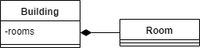
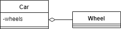
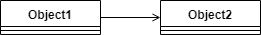
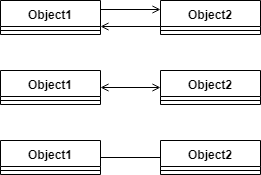
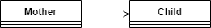
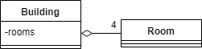
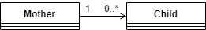
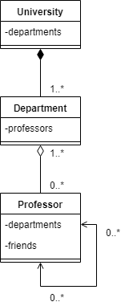

# [Java中的组合、聚合和关联](https://www.baeldung.com/java-composition-aggregation-association)

1. 简介

    无论是在现实生活中还是在编程中，对象之间都有关系。有时，要理解或实现这些关系是很困难的。

    在本教程中，我们将重点介绍Java对三种有时容易混淆的关系类型的处理：组合、聚合和关联。

2. 组成

    组成是一种 "belongs-to" 类型的关系。它意味着其中一个对象是一个逻辑上更大的结构，它包含另一个对象。换句话说，它是另一个对象的一部分或成员。

    另外，我们通常称它为 "has-a"关系（与 "is-a"关系相反，后者是继承关系）。

    例如，一个房间属于一个建筑，或者换句话说，一个建筑有一个房间。所以基本上，我们把它叫做 "belongs-to" 还是 "has-a"，只是一个观点问题。

    构成是一种强烈的 "has-a" 关系，因为包含对象拥有它。因此，这些对象的生命周期是绑定的。这意味着，如果我们摧毁了所有者对象，它的成员也将随之被摧毁。例如，在我们前面的例子中，房间和建筑一起被摧毁。

    请注意，这并不意味着包含对象在没有其任何部分的情况下就不能存在。例如，我们可以拆掉建筑物内的所有墙壁，从而摧毁房间。但这栋楼仍然存在。

    在cardinality方面，一个包含对象可以有我们想要的多少个部分。但是，所有的部分都需要正好有一个容器。

    1. UML

        在UML中，我们用以下符号表示组成：

        

        注意，钻石是在包含对象处，是线条的底端，而不是箭头。为了清楚起见，我们经常也画箭头：

        

        那么，我们就可以在我们的Building-Room例子中使用这个UML结构：

        

    2. 源代码

        在Java中，我们可以用一个非静态内类来建模：

        relationships.composition/Building.java

        或者，我们也可以在方法体中声明这个类。不管它是一个命名的类、一个匿名的类还是一个lambda，都无所谓：

        relationships.composition/BuildingWithDefinitionRoomInMethod.java

        注意，至关重要的是，我们的内层类应该是非静态的，因为它将其所有的实例都绑定到了包含类上。

        通常情况下，包含对象想要访问其成员。因此，我们应该存储它们的引用：

        ```java
        class Building {
            List<Room> rooms;
            class Room {}
        }
        ```

        注意，所有的内部类对象都存储了对其包含对象的隐式引用。因此，我们不需要手动存储它来访问它：

        ```java
        class Building {
            String address;
            class Room {
                String getBuildingAddress() {
                    return Building.this.address;
                }   
            }
        }
        ```

3. 聚合

    聚合(Aggregation)也是一种 "have-a" 关系。它与组合的不同之处在于，它不涉及所有权。因此，这些对象的生命周期并不相连：它们中的每一个都可以独立存在。

    例如，一辆汽车和它的车轮。我们可以取下车轮，而它们仍然存在。我们可以安装其他（预先存在的）车轮，或者将这些车轮安装到另一辆车上，一切都会正常工作。

    当然，一辆没有轮子的车或一个脱落的轮子不会像一辆有轮子的车那样有用。但这就是为什么这种关系首先存在的原因：把零件组装成一个更大的构造，它能够比它的零件做更多的事情。

    由于聚合并不涉及拥有，一个成员不需要只与一个容器联系在一起。例如，一个三角形是由线段组成的。但三角形可以共享线段作为其边。

    1. UML

        聚合与组合非常相似。唯一的逻辑区别是聚合是一种较弱的关系。

        因此，UML的表示方法也非常相似。唯一的区别是钻石是空的：

        

        对于汽车和轮子，那么，我们会做：

        

    2. 源代码

        在Java中，我们可以用一个普通的老引用来建立聚合模型：

        relationships.aggregation/Wheel.java

        relationships.aggregation/Car.java

        成员可以是任何类型的类，除了非静态的内部类。

        在上面的代码片段中，两个类都有其独立的源文件。然而，我们也可以使用一个静态的内部类：

        ```java
        class Car {
            List<Wheel> wheels;
            static class Wheel {}
        }
        ```

        请注意，Java只在非静态的内部类中创建隐式引用。正因为如此，我们必须在需要的地方手动维护这种关系：

        ```java
        class Wheel {
            Car car;
        }
        class Car {
            List<Wheel> wheels;
        }
        ```

4. 关联

    关联是三者之间最弱的关系。它不是一个 "has-a" 的关系，没有一个对象是另一个对象的部分或成员。

    关联只意味着这些对象 "know" 对方。例如，一个母亲和她的孩子。

    1. UML

        在UML中，我们可以用一个箭头来标记一个关联：

        

        如果关联是双向的，我们可以使用两个箭头，一个两端都有箭头的箭头，或者一个没有任何箭头的线：

        

        那么，我们可以用UML表示一个母亲和她的孩子：

        

    2. 源代码

        在Java中，我们可以用与聚合相同的方式对关联进行建模：

        `class Child {}`

        relationships.association/Mother.java

        但是，等等，我们怎么能知道一个引用是指聚合还是关联呢？

        嗯，我们不能。区别只是逻辑上的：其中一个对象是否是另一个对象的一部分。

        而且，我们必须在两端手动维护引用，就像我们在聚合中做的那样：

        relationships.association/Child.java

        relationships.association/Mother.java

5. UML旁注Sidenote

    为了清晰起见，有时我们想在UML图上定义一个关系的cardinality。我们可以通过把它写在箭头的两端来做到这一点：

    

    注意，把零写成cardinality是没有意义的，因为它意味着没有关系。唯一的例外是当我们想用一个范围来表示一个可选的关系：

    

    还要注意的是，由于在构成中正好有一个所有者，所以我们不在图上标明它。

6. 一个复杂的例子

    让我们看看一个（小小的）更复杂的例子!

    我们将建立一所大学的模型，这所大学有很多系。教授们在每个系工作，他们之间也有朋友。

    在我们关闭大学之后，这些部门还会存在吗？当然不会，因此它是一个组合。

    但教授们仍将存在（希望如此）。我们必须决定哪一个更符合逻辑：如果我们把教授看作是系里的一部分，或者不是。或者说：他们到底是不是系里的成员？是的，他们是。因此，它是一个聚合。除此之外，一个教授可以在多个部门工作。

    教授之间的关系是关联的，因为说一个教授是另一个教授的一部分没有任何意义。

    因此，我们可以用下面的UML图来模拟这个例子：

    

    而Java代码看起来是这样的：

    relationships.university/University.java

    relationships.university/Department.java

    relationships.university/Professor.java

    注意，如果我们依靠 "has-a"、"below-to"、"member-of"、"part-of" 等术语，我们可以更容易地识别我们的对象之间的关系。

7. 结语

    在这篇文章中，我们看到了组合、聚合和关联的属性和表现。我们还看到了如何在UML和Java中对这些关系进行建模。
