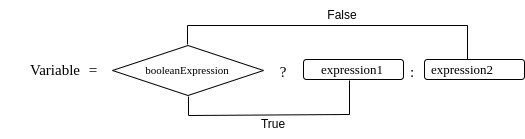

# [Java 中的三元运算符](https://www.baeldung.com/java-ternary-operator)  

核心 Java 定义 · Java 运算符  

1. 概述

    Java 中的三元条件运算符 `?:` 允许我们定义表达式。它是 `if-else` 语句的简洁形式，并且**会返回一个值**。

    在本教程中，我们将学习何时以及如何使用三元结构。首先了解其语法，然后探索实际用法。

2. 语法

    Java 中的三元运算符 `?:` 是**唯一接受三个操作数**的运算符：

    ```java
    booleanExpression ? expression1 : expression2
    ```

    - 第一个操作数必须是**布尔表达式**。
    - 第二和第三个操作数可以是任意表达式，但它们的类型必须相互兼容，并且与接收结果的变量类型兼容。

    

    **工作原理**：如果 `booleanExpression` 为 `true`，则返回 `expression1`；否则返回 `expression2`。  

    **重要提示**：`expression1` 和 `expression2` 必须是**返回值的表达式**，不能是 `void` 类型的语句。如果需要根据条件执行 `void` 方法（如打印日志），应使用 `if-else` 语句。

3. 三元运算符的优势

   - **代码更简洁**：将 `if-else` 语句压缩为一行。
   - **便于初始化 `final` 变量**：可在声明时直接赋值。
   - **调试更方便**：对于简单条件，单行代码更容易设置断点并检查结果。
   - **可直接用于 `return` 语句或变量初始化**，而 `if-else` 块不能直接作为表达式使用。

4. 三元运算符示例

    先看一个传统的 `if-else` 示例：

    ```java
    int num = 8;
    String msg = "";
    if (num > 10) {
        msg = "Number is greater than 10";
    } else {
        msg = "Number is less than or equal to 10";
    }
    ```

    1. 基本用法

        使用三元运算符重写上述逻辑：

        ```java
        int num = 8;
        String msg = num > 10 
        ? "Number is greater than 10" 
        : "Number is less than or equal to 10";
        ```

    2. 与 `final` 变量一起使用

        ```java
        final int num = 8;
        final String msg = num > 10 
        ? "Number is greater than 10" 
        : "Number is less than or equal to 10";
        ```

        这允许我们在声明 `final` 变量时根据条件赋值，且赋值后不可更改。

    3. 在 `return` 语句中使用

        ```java
        String checkNumber(int num) {
            return num > 10 
            ? "Number is greater than 10" 
            : "Number is less than or equal to 10";
        }
        ```

        方法直接返回三元表达式的结果。

    4. 错误用法

        三元运算符**不能用于不返回值的语句**。例如：

        ```java
        // 正确：if-else 执行日志
        int num = 8;
        if (num > 10) {
            LOGGER.info("Number is greater than 10");
        } else {
            LOGGER.info("Number is less than or equal to 10");
        }
        ```

        以下写法是**错误的**：

        ```java
        // 编译错误！LOGGER.info() 是 void 方法，无返回值
        num > 10 
        ? LOGGER.info("Number is greater than 10") 
        : LOGGER.info("Number is less than or equal to 10");
        ```

5. 表达式求值

    三元运算符在运行时**只计算其中一个分支**（`expression1` 或 `expression2`）。

    **测试示例（JUnit）：**

    ```java
    @Test
    public void whenConditionIsTrue_thenOnlyFirstExpressionIsEvaluated() {
        int exp1 = 0, exp2 = 0;
        int result = 12 > 10 ? ++exp1 : ++exp2;
        
        assertThat(exp1).isEqualTo(1); // 被执行
        assertThat(exp2).isEqualTo(0); // 未执行
        assertThat(result).isEqualTo(1);
    }
    ```

    当条件为 `false` 时：

    ```java
    @Test
    public void whenConditionIsFalse_thenOnlySecondExpressionIsEvaluated() {
        int exp1 = 0, exp2 = 0;
        int result = 8 > 10 ? ++exp1 : ++exp2;

        assertThat(exp1).isEqualTo(0); // 未执行
        assertThat(exp2).isEqualTo(1); // 被执行
        assertThat(result).isEqualTo(1);
    }
    ```

6. 嵌套三元运算符

    可以嵌套多层三元运算符：

    ```java
    String msg = num > 10 ? "Number is greater than 10" : 
    num > 5 ? "Number is greater than 5" : "Number is less than or equal to 5";
    ```

    为提高可读性，建议使用括号：

    ```java
    String msg = num > 10 ? "Number is greater than 10" 
    : (num > 5 ? "Number is greater than 5" : "Number is less than or equal to 5");
    ```

    > **注意**：不建议在实际项目中使用深度嵌套的三元运算符，因为会降低代码可读性和可维护性。此时应改用 `if-else if-else` 结构。

7. 结论

    在本文中，我们学习了 Java 中的三元运算符。虽然并非所有 `if-else` 结构都能被三元运算符替代，但在合适场景下，它能让代码更简短、更清晰。合理使用三元运算符，可以提升代码质量与开发效率。
