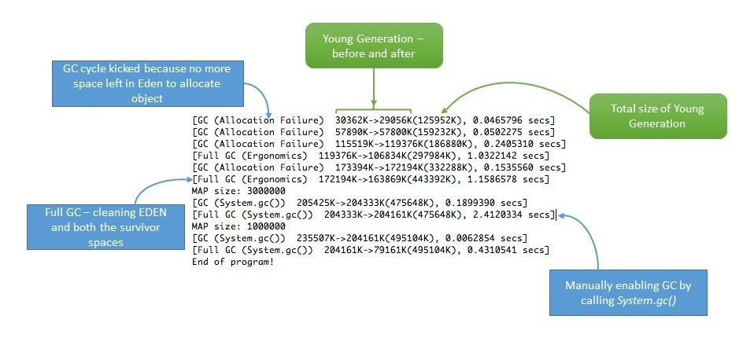

# 核心Java性能

本模块包含有关 Java 应用程序性能的文章

- [Java 中的冗长垃圾回收](<https://www.baeldung.com/java-verbose-gc>)
- [ ] [捕获Java堆数据的不同方法](#捕获java堆数据的不同方法)
- [ ] [了解Java中的内存泄漏](#了解java中的内存泄漏)
- [OutOfMemoryError: GC Overhead Limit Exceeded](<http://www.baeldung.com/java-gc-overhead-limit-exceeded>)
- [JMX 基本介绍](<http://www.baeldung.com/java-management-extensions>)
- [使用 Flight Recorder 监控 Java 应用程序](<https://www.baeldung.com/java-flight-recorder-monitoring>)
- [Java 中的分支预测](<https://www.baeldung.com/java-branch-prediction>)
- [捕获 Java 线程转储](<https://www.baeldung.com/java-thread-dump>)
- [JMX 端口](<https://www.baeldung.com/jmx-ports>)
- [从 Shell 脚本调用 JMX MBean 方法](<https://www.baeldung.com/jmx-mbean-shell-access>)

## 捕获Java堆数据的不同方法

1. 简介

    在本教程中，我们将探讨在 Java 中捕获堆转储的不同方法。

    堆转储是 JVM 中某一时刻内存中所有对象的快照。它们对于排除内存泄漏问题和优化 Java 应用程序中的内存使用非常有用。

    堆转储通常存储在二进制格式的 hprof 文件中。我们可以使用 jhat 或 JVisualVM 等工具打开并分析这些文件。此外，对于 Eclipse 用户来说，使用 MAT 也很常见。

    在接下来的章节中，我们将介绍生成堆转储的多种工具和方法，并展示它们之间的主要区别。

2. JDK 工具

    JDK 自带了多种工具，可以通过不同的方式捕获堆转储。所有这些工具都位于 JDK 主目录下的 bin 文件夹中。因此，只要系统路径中包含该目录，我们就可以通过命令行启动它们。

    在接下来的章节中，我们将了解如何使用这些工具捕获堆转储。

    1. jmap

        jmap 是一个打印运行中的 JVM 内存统计信息的工具。我们可以将其用于本地或远程进程。

        要使用 jmap 捕捉堆转储，我们需要使用 dump 选项：

        `jmap -dump:[live],format=b,file=<file-path> <pid>`

        除了这个选项，我们还应该指定几个参数：

        - live：如果设置了该参数，则只打印有活动引用的对象，而丢弃那些准备被垃圾回收的对象。该参数为可选参数。
        - format=b：指定转储文件为二进制格式。如果未设置，则结果相同。
        - file：将转储写入的文件
        - pid：Java 进程的 id

        示例如下

        `jmap -dump:live,format=b,file=/tmp/dump.hprof 12587`

        请记住，我们可以使用 jps 命令轻松获取 Java 进程的 pid。

        另外，请记住 jmap 是作为实验工具引入 JDK 的，不受支持。因此，在某些情况下，使用其他工具可能会更好。

    2. jcmd

        jcmd 是一个非常完整的工具，它通过向 JVM 发送命令请求来工作。我们必须在运行 Java 进程的同一台机器上使用它。

        GC.heap_dump 是它的众多命令之一。只需指定进程的 pid 和输出文件路径，我们就可以用它来获取堆转储：

        `jcmd <pid> GC.heap_dump <file-path>`

        我们可以使用与之前相同的参数来执行它：

        `jcmd 12587 GC.heap_dump /tmp/dump.hprof`

        与 jmap 一样，生成的 dump 也是二进制格式。

    3. JVisualVM

        JVisualVM 是一款具有图形用户界面的工具，可让我们监控、排除故障并对 Java 应用程序进行剖析。图形用户界面很简单，但非常直观且易于使用。

        在它的众多选项中，有一个选项允许我们捕获堆转储。如果我们右键单击 Java 进程并选择 "Heap Dump" 选项，该工具就会创建堆转储并在新标签页中打开。

        请注意，我们可以在 "Basic Info" 部分找到创建文件的路径。

        从 JDK 9 开始，Visual VM 不再包含在 Oracle JDK 和 Open JDK 发行版中。因此，如果我们使用的是比 Java 9 更新的版本，可以从 Visual VM 开源项目网站获取 JVisualVM。

3. 自动捕获堆转储

    前面介绍的所有工具都是为了在特定时间手动捕获堆转储。在某些情况下，我们希望在发生 java.lang.OutOfMemoryError 时获取堆转储，以帮助我们调查错误。

    针对这些情况，Java 提供了 HeapDumpOnOutOfMemoryError 命令行选项，它会在抛出 java.lang.OutOfMemoryError 时生成堆转储：

    `java -XX:+HeapDumpOnOutOfMemoryError`

    默认情况下，它会将转储存储在运行应用程序的目录下的 `java_pid<pid>.hprof` 文件中。如果我们想指定其他文件或目录，可以在 HeapDumpPath 选项中进行设置：

    `java -XX:+HeapDumpOnOutOfMemoryError -XX:HeapDumpPath=<file-or-dir-path>`

    当我们的应用程序使用此选项运行到内存不足时，我们就能在日志中找到创建的包含堆转储的文件：

    ```log
    java.lang.OutOfMemoryError: Requested array size exceeds VM limit
    Dumping heap to java_pid12587.hprof ...
    Exception in thread "main" Heap dump file created [4744371 bytes in 0.029 secs]
    java.lang.OutOfMemoryError: Requested array size exceeds VM limit
    at com.baeldung.heapdump.App.main(App.java:7)
    ```

    在上例中，它被写入了 java_pid12587.hprof 文件。

    正如我们所见，该选项非常有用，使用该选项运行应用程序时不会产生任何开销。因此，强烈建议始终使用该选项，尤其是在生产环境中。

    最后，还可以通过使用 HotSpotDiagnostic MBean 在运行时指定该选项。为此，我们可以使用 JConsole 并将 HeapDumpOnOutOfMemoryError VM 选项设置为 true。

    有关 MBeans 和 JMX 的更多信息，请[参阅本文](https://www.baeldung.com/java-management-extensions)。

4. JMX

    本文将介绍的最后一种方法是使用 JMX。我们将使用上一节简要介绍过的 HotSpotDiagnostic MBean。该 MBean 提供了一个 dumpHeap 方法，该方法接受两个参数：

    - outputFile：转储文件的路径。该文件的扩展名应为 hprof。
    - live：如果设置为 "true"，则只转储内存中的活动对象，就像我们之前在 jmap 中看到的那样。

    1. JConsole

        使用 HotSpotDiagnostic MBean 的最简单方法是使用 JMX 客户端，如 JConsole。

        如果我们打开 JConsole 并连接到一个正在运行的 Java 进程，就可以导航到 MBeans 选项卡，并在 com.sun.management 下找到 HotSpotDiagnostic。在操作中，我们可以找到之前描述过的 dumpHeap 方法。

        

        如图，我们只需在 p0 和 p1 文本字段中引入 outputFile 和 live 参数，即可执行 dumpHeap 操作。

    2. 编程方式

        使用 HotSpotDiagnostic MBean 的另一种方法是从 Java 代码中以编程方式调用它。

        为此，我们首先需要获取一个 MBeanServer 实例，以便获得在应用程序中注册的 MBean。然后，我们只需获取一个 HotSpotDiagnosticMXBean 的实例，并调用其 dumpHeap 方法。

        让我们看看代码：

        ```java
        public static void dumpHeap(String filePath, boolean live) throws IOException {
            MBeanServer server = ManagementFactory.getPlatformMBeanServer();
            HotSpotDiagnosticMXBean mxBean = ManagementFactory.newPlatformMXBeanProxy(
            server, "com.sun.management:type=HotSpotDiagnostic", HotSpotDiagnosticMXBean.class);
            mxBean.dumpHeap(filePath, live);
        }
        ```

        请注意，hprof 文件不能被覆盖。因此，我们在创建打印堆转储的应用程序时应考虑到这一点。如果我们没有这样做，就会出现异常：

        ```log
        Exception in thread "main" java.io.IOException: File exists
        at sun.management.HotSpotDiagnostic.dumpHeap0(Native Method)
        at sun.management.HotSpotDiagnostic.dumpHeap(HotSpotDiagnostic.java:60)
        ```

5. 结论

    在本文中，我们学习了在 Java 中捕获堆转储的多种方法。

    根据经验，在运行 Java 应用程序时，我们应始终记住使用 HeapDumpOnOutOfMemoryError 选项。出于不同的目的，我们可以使用任何其他工具，只要牢记 jmap 的不支持状态即可。

## 了解Java中的内存泄漏

1. 简介

    Java 的核心优势之一是借助内置的垃圾回收器（简称 GC）实现自动内存管理。GC 隐式地负责分配和释放内存，因此能够处理大多数内存泄漏问题。

    虽然 GC 能有效处理大部分内存，但它并不能保证万无一失地解决内存泄漏问题。GC 非常聪明，但并非完美无瑕。即使是在认真负责的开发人员的应用程序中，内存泄漏仍有可能偷偷出现。

    在某些情况下，应用程序仍可能生成大量多余的对象，从而耗尽重要的内存资源，有时甚至导致整个应用程序失败。

    内存泄漏是 Java 中的一个真正问题。在本教程中，我们将了解内存泄漏的潜在原因、如何在运行时识别内存泄漏以及如何在应用程序中处理内存泄漏。

2. 什么是内存泄漏

    内存泄漏是指堆中存在不再使用的对象，但垃圾回收器无法将其从内存中删除，因此这些对象被不必要地保留下来。

    内存泄漏很糟糕，因为它会阻塞内存资源，并随着时间的推移降低系统性能。如果不加以处理，应用程序最终会耗尽其资源，最后以致命的 java.lang.OutOfMemoryError 结束。

    堆内存中存在两种不同类型的对象：引用对象和非引用对象。引用对象是那些在应用程序中仍有活动引用的对象，而未引用对象则没有任何活动引用。

    垃圾回收器会定期删除未引用的对象，但从不收集仍被引用的对象。这就是发生内存泄漏的原因：

    内存泄漏的症状

    - 当应用程序长时间持续运行时，性能严重下降
    - 应用程序中出现堆错误(OutOfMemoryError)
    - 自发和奇怪的应用程序崩溃
    - 应用程序偶尔会出现连接对象耗尽的情况。

3. Java 中的内存泄漏类型

    在任何应用程序中，发生内存泄漏的原因有很多。在本节中，我们将讨论最常见的几种情况。

    1. 通过静态字段泄漏内存

        可能导致潜在内存泄漏的第一种情况是大量使用静态变量。

        在 Java 中，静态字段的生命周期通常与运行应用程序的整个生命周期一致（除非 ClassLoader 符合垃圾回收条件）。

        让我们创建一个简单的 Java 程序来填充静态 List：

        ```java
        public class StaticTest {
            public static List<Double> list = new ArrayList<>();
            public void populateList() {
                for (int i = 0; i < 10000000; i++) {
                    list.add(Math.random());
                }
                Log.info("Debug Point 2");
            }
            public static void main(String[] args) {
                Log.info("Debug Point 1");
                new StaticTest().populateList();
                Log.info("Debug Point 3");
            }
        }
        ```

        如果我们分析一下程序执行期间的堆内存，就会发现在调试点 1 和 2 之间，堆内存如预期般增加了。

        但当我们在调试点 3 离开 populateList() 方法时，堆内存还没有被垃圾回收，正如我们在 VisualVM 的响应中所看到的那样。

        但是，如果我们在上述程序的第 2 行中去掉关键字 static，那么内存使用情况就会发生巨大变化，如 VisualVM 响应所示。

        直到调试点的前半部分与使用 static 时的情况几乎一样。但这次，在我们离开 populateList() 方法后，列表的所有内存都被垃圾回收了，因为我们没有对它进行任何引用。

        因此，我们需要密切关注静态变量的使用情况。如果将集合或大型对象声明为静态，那么它们就会在应用程序的整个生命周期中一直保留在内存中，从而阻塞了本可用于其他地方的重要内存。

        如何预防？

        - 尽量减少静态变量的使用。
        - 在使用单例时，依赖于懒散加载(lazily loads)对象的实现，而不是急切加载。

    2. 通过未关闭的资源

        每当我们建立新连接或打开数据流时，JVM 都会为这些资源分配内存。其中的几个例子包括数据库连接、输入流和会话对象。

        如果忘记关闭这些资源，就会阻塞内存，从而使其无法进入 GC。这种情况甚至可能发生在出现异常的情况下，导致程序执行无法到达处理关闭这些资源的代码的语句。

        在这两种情况下，资源留下的开放连接都会消耗内存，如果我们不处理它们，它们就会降低性能，甚至导致 OutOfMemoryError。

        如何避免？

        - 始终使用 finally 块关闭资源。
        - 关闭资源的代码（即使在 finally 代码块中）本身也不应出现任何异常。
        - 在使用 Java 7+ 时，我们可以使用 try-with-resources 块。

    3. 不正确的 equals() 和 hashCode() 实现

        在定义新类时，一个很常见的疏忽是没有为 equals() 和 hashCode() 方法编写适当的重载方法。

        HashSet 和 HashMap 在许多操作中都会用到这些方法，如果没有正确地重载这些方法，它们就会成为潜在内存泄漏问题的根源。

        让我们以一个微不足道的 Person 类为例，将其用作 HashMap 中的键：

        memoryleaks.equalshashcode\Person.java

        现在，我们将在使用此键的 Map 中插入重复的 Person 对象。

        请记住，Map 不能包含重复的键：

        PersonMemoryLeakUnitTest.java\givenMap_whenEqualsAndHashCodeNotOverridden_thenMemoryLeak()

        这里我们使用 Person 作为键。由于 Map 不允许使用重复的键，因此我们作为键插入的大量重复 Person 对象应该不会增加内存。

        但由于我们没有定义适当的 equals() 方法，重复对象堆积起来，增加了内存，这就是为什么我们在内存中看到不止一个对象的原因。VisualVM 中显示堆内存。

        但是，如果我们正确地重载了 equals() 和 hashCode() 方法，那么这个 Map 中就只会存在一个 Person 对象。

        让我们看看 Person 类 equals() 和 hashCode() 的正确实现：

        PersonOptimized.java

        在这种情况下，以下断言将为真：

        PersonMemoryLeakUnitTest.java\givenMap_whenEqualsAndHashCodeNotOverridden_thenMemoryLeak()

        在正确覆盖 equals() 和 hashCode() 后，同一程序的堆内存如VisualVM所示。

        另一种方法是使用像 Hibernate 这样的 ORM 工具，它使用 equals() 和 hashCode() 方法来分析对象并将其保存在缓存中。

        如果不重载这些方法，内存泄漏的几率就会很高，因为 Hibernate 无法比较对象，并会用重复对象填充缓存。

        如何避免？

        - 根据经验，在定义新实体时，一定要重载 equals() 和 hashCode() 方法。
        - 仅仅覆盖还不够，还必须以最佳方式覆盖这些方法。
        如需了解更多信息，请访问我们的教程[使用 Eclipse 生成 equals() 和 hashCode()](https://www.baeldung.com/java-eclipse-equals-and-hashcode)和[Java中的hashCode()指南](https://www.baeldung.com/java-hashcode)。

    4. 引用外层类的内层类

        这种情况发生在非静态内部类（匿名类）中。在初始化时，这些内部类总是需要外层类的实例。

        默认情况下，每个非静态内部类都隐式引用其包含的类。如果我们在应用程序中使用这个内部类的对象，那么即使我们的包含类对象退出作用域，它也不会被垃圾回收。

        考虑一个持有大量大块对象引用的类，它有一个非静态的内部类。当我们只创建内部类的对象时，引用外层类时导致内存leak。

        但是，如果我们只将内部类声明为静态类，那么引用相同的外层类时内存可正常回收。

        出现这种情况的原因是，内层类对象隐式地持有对外层类对象的引用，从而使其成为垃圾回收的无效候选对象。匿名类的情况也是如此。

        如何避免？

        - 迁移到使用现代垃圾回收器（如 ZGC）的最新 Java 版本，ZGC 使用根引用来查找无法访问的对象。由于引用是从根中查找的，这将解决循环问题，如匿名类持有对容器类的引用。有关 ZGC 的更多信息，请点击[此处](https://www.baeldung.com/jvm-zgc-garbage-collector)。
        - 如果内部类不需要访问包含类的成员，可以考虑将其转化为静态类。

    5. 通过 finalize() 方法

        使用 finalizers 是潜在内存泄漏问题的另一个来源。只要类的 finalize() 方法被重载，该类的对象就不会立即被垃圾回收。取而代之的是，GC 会将其排队等待最终化，而最终化会在稍后的时间点进行。

        此外，如果在 finalize() 方法中编写的代码不是最佳代码，而且如果最终化队列跟不上 Java 垃圾收集器的速度，那么我们的应用程序迟早会遇到 OutOfMemoryError。

        为了演示这一点，让我们想象一下，我们重载了一个类的 finalize() 方法，而该方法的执行需要一点时间。当这个类的大量对象被垃圾回收时，在 VisualVM 中会出现 Used heap 不被回收的情况：最终确定方法被重载。

        但是，如果我们删除重载的 finalize() 方法，同样的程序会给出以下响应：最终确定方法未被重载，Used heap 回收。

        如何避免？

        - 我们应该始终避免使用 finalizers。
        - 有关 finalize() 的更多详情，请参阅《Java 中的 finalize 方法指南》中的第 3 节（[避免使用终结者](https://www.baeldung.com/java-finalize)）。

    6. 内部字符串

        Java 字符串池在 Java 7 中经历了从 PermGen 到 HeapSpace 的重大变化。不过，对于在版本 6 及以下运行的应用程序，我们在处理大型字符串时需要更加小心。

        如果我们读取了一个大字符串对象，并对该对象调用 intern()，即形成内部字符串，它就会进入位于 PermGen（永久内存）中的字符串池，而且只要我们的应用程序在运行，它就会一直在那里。

        在 JVM 1.6 中，这将阻塞内存，并在我们的应用程序中造成严重的内存泄漏。

        相反，如果我们只是在方法中从文件中读取字符串，而不对其进行内联，即正常字符串，那么 PermGen 会正常回收。

        如何避免？

        - 解决这个问题的最简单方法是升级到最新的 Java 版本，因为从 Java 版本 7 开始，字符串池已转移到 HeapSpace。
        - 如果我们正在处理大字符串，可以增加 PermGen 空间的大小，以避免任何潜在的 OutOfMemoryErrors：`-XX:MaxPermSize=512m`

    7. 使用线程本地

        [ThreadLocal](https://docs.oracle.com/en/java/javase/17/docs/api/java.base/java/lang/ThreadLocal.html)（在[ThreadLocal简介教程](https://www.baeldung.com/java-threadlocal)中有详细讨论）是一种构造，它使我们能够将状态隔离到特定线程，从而实现线程安全。

        使用这种结构时，只要线程存活，每个线程都将持有对 ThreadLocal 变量副本的隐式引用，并维护自己的副本，而不是在多个线程之间共享资源。

        尽管 ThreadLocal 变量有很多优点，但它的使用却饱受争议，因为如果使用不当，就会导致内存泄漏。Joshua Bloch 曾就线程本地变量的使用发表过如下评论

        "线程池的马虎使用与线程局部的马虎使用相结合，可能会导致意外的对象保留，这一点在很多地方都有所提及。但是，将责任归咎于线程局部是毫无道理的"。

        线程局部的内存泄漏

        ThreadLocals 本应在持有线程不再存活时被垃圾回收。但是，当我们将 ThreadLocals 与现代应用程序服务器一起使用时，问题就出现了。

        现代应用程序服务器使用线程池来处理请求，而不是创建新的线程（例如 Apache Tomcat 中的 [Executor](https://tomcat.apache.org/tomcat-7.0-doc/config/executor.html)）。此外，它们还使用单独的类加载器。

        由于应用服务器中的[线程池](https://www.baeldung.com/thread-pool-java-and-guava)是基于线程重用的概念工作的，因此它们永远不会被垃圾回收；相反，它们会被重用来服务另一个请求。

        如果任何类创建了 ThreadLocal 变量，但没有显式地将其删除，那么即使在网络应用程序停止后，该对象的副本也会保留在工作线程中，从而防止该对象被垃圾回收。

        如何防止这种情况发生？

        - 好的做法是在不再使用 ThreadLocals 时将其清理干净。ThreadLocals 提供了 [remove()](https://docs.oracle.com/en/java/javase/17/docs/api/java.base/java/lang/ThreadLocal.html#remove()) 方法，用于删除当前线程对该变量的值。
        - 不要使用 ThreadLocal.set(null) 来清除值。它实际上不会清除值，而是会查找与当前线程关联的 Map，并将键值对分别设置为当前线程和 null。
        - 最好将 ThreadLocal 视为我们需要在 finally 代码块中关闭的资源，即使在出现异常的情况下也是如此：

            ```java
            try {
                threadLocal.set(System.nanoTime());
                //... further processing
            }
            finally {
                threadLocal.remove();
            }
            ```

4. 处理内存泄漏的其他策略

    虽然在处理内存泄漏时没有放之四海而皆准的解决方案，但我们可以通过一些方法来尽量减少这些泄漏。

    1. 启用剖析

        Java 剖析器是通过应用程序监控和诊断内存泄漏的工具。它们会分析应用程序的内部情况，如如何分配内存。

        使用剖析器，我们可以比较不同的方法，找到可以优化使用资源的地方。

        在本教程的第 3 节中，我们使用了 [Java VisualVM](https://visualvm.github.io/)。请查看我们的[Java剖析器指南](java-profilers-zh.md)，了解不同类型的剖析器。

    2. 冗余垃圾回收

        通过启用冗余垃圾回收，我们可以跟踪 GC 的详细轨迹。要启用此功能，我们需要在 JVM 配置中添加以下内容：

        `-verbose:gc`
        通过添加此参数，我们可以看到 GC 内部发生的详细情况：

        
    3. 使用引用对象避免内存泄漏

        我们还可以利用 Java 中 java.lang.ref 包内置的引用对象来解决内存泄漏问题。使用 java.lang.ref 包后，我们不再直接引用对象，而是使用特殊的引用对象，这样就可以轻松地对它们进行垃圾回收。

        引用队列可以让我们了解垃圾回收器执行的操作。如需了解更多信息，请阅读 Java 中的[软引用教程](/java-soft-references-zh.md)。

    4. Eclipse 内存泄漏警告

        对于 JDK 1.5 及以上版本的项目，只要遇到明显的内存泄漏情况，Eclipse 就会显示警告和错误。因此，在 Eclipse 中开发时，我们可以定期访问 "Problems（问题）"选项卡，并对内存泄漏警告（如果有的话）提高警惕。

    5. 基准测试

        我们可以通过执行基准来衡量和分析 Java 代码的性能。这样，我们就可以比较完成相同任务的其他方法的性能。这可以帮助我们选择最佳方法，还可以帮助我们节省内存。

        有关基准测试的更多信息，请访问我们的 [Java 微基准测试教程](https://www.baeldung.com/java-microbenchmark-harness)。

    6. 代码审查

        最后，我们还有一种经典的老式方法，即进行简单的代码演练。

        在某些情况下，即使是这种看起来微不足道的方法，也有助于消除一些常见的内存泄漏问题。

5. 结论

    通俗地说，我们可以把内存泄漏看作是一种疾病，它会通过阻塞重要的内存资源来降低应用程序的性能。就像所有其他疾病一样，如果不加以治疗，随着时间的推移，它可能会导致致命的应用程序崩溃。

    要解决内存泄漏问题非常棘手，要找到它们需要对 Java 语言的精通和熟练掌握。在处理内存泄漏时，没有放之四海而皆准的解决方案，因为泄漏可能会通过各种不同的事件发生。

    不过，如果我们采用最佳实践，定期执行严格的代码演练和剖析，就能最大限度地降低应用程序中的内存泄漏风险。

## Code

一如既往，我们可以在 [GitHub](https://github.com/eugenp/tutorials/tree/master/core-java-modules/core-java-perf) 上获取示例的完整源代码。

[ ] TODO: VSCode下的JVM的跟踪？测试代码运行？

## Relevant Articles

- [Verbose Garbage Collection in Java](https://www.baeldung.com/java-verbose-gc)
- [Different Ways to Capture Java Heap Dumps](https://www.baeldung.com/java-heap-dump-capture)
- [Understanding Memory Leaks in Java](https://www.baeldung.com/java-memory-leaks)
- [OutOfMemoryError: GC Overhead Limit Exceeded](http://www.baeldung.com/java-gc-overhead-limit-exceeded)
- [Basic Introduction to JMX](http://www.baeldung.com/java-management-extensions)
- [Monitoring Java Applications with Flight Recorder](https://www.baeldung.com/java-flight-recorder-monitoring)
- [Branch Prediction in Java](https://www.baeldung.com/java-branch-prediction)
- [Capturing a Java Thread Dump](https://www.baeldung.com/java-thread-dump)
- [JMX Ports](https://www.baeldung.com/jmx-ports)
- [Calling JMX MBean Method From a Shell Script](https://www.baeldung.com/jmx-mbean-shell-access)
