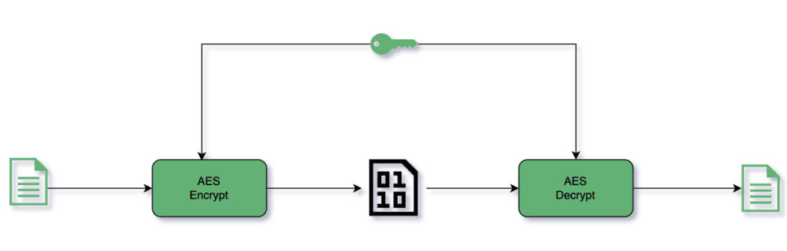

# [生成安全的 AES 密钥（Java 实现）](https://www.baeldung.com/java-secure-aes-key)

安全 | 安全算法

1. 概述  
    本文将深入探讨 AES（或一般加密算法）中密钥的作用，介绍生成密钥时应遵循的最佳实践，并比较多种生成方法是否符合这些准则。

2. AES 简介  
    高级加密标准（[AES](https://nvlpubs.nist.gov/nistpubs/FIPS/NIST.FIPS.197.pdf)）是数据加密标准（DES）的继任者，由美国国家标准与技术研究院（NIST）于 2001 年发布。它是一种对称分组密码。

    对称密码意味着加密和解密使用相同的密钥。分组密码表示它每次处理 128 位的明文数据块：

    

    1. AES 变体  
        根据密钥长度，AES 支持三种变体：AES-128（128 位）、AES-192（192 位）和 AES-256（256 位）。密钥越长，加密强度越高，因为可能的密钥数量呈指数级增长。同时，算法执行所需的加密轮数也随之增加，计算开销也更大：

        | 密钥长度 | 分组长度 | 加密轮数 |
        | -------- | -------- | -------- |
        | 128      | 128      | 10       |
        | 192      | 128      | 12       |
        | 256      | 128      | 14       |

    2. AES 的安全性如何？  
        AES 算法本身是公开的——真正保密的是 AES 密钥。因此，破解 AES 的核心在于获取密钥。假设密钥被妥善保管，攻击者只能尝试暴力猜测。

        让我们看看暴力破解在实际中是否可行。

        AES-128 的密钥有 128 位，意味着存在 2¹²⁸ 种可能的密钥。[穷举所有可能需要难以想象的时间和资源](https://www.reddit.com/r/theydidthemath/comments/1x50xl/time_and_energy_required_to_bruteforce_a_aes256/)，因此 AES 在实践中无法通过暴力破解攻破。

        虽然存在一些[非暴力破解方法](https://threatpost.com/new-attack-finds-aes-keys-several-times-faster-brute-force-081911/75562/)，但它们最多只能将密钥搜索空间减少几个比特。

        这意味着：只要攻击者对密钥一无所知，AES 在现实中几乎是不可破解的。

3. 优质密钥应具备的特性  

    1. 密钥长度  
        AES 支持三种密钥长度，应根据实际场景选择合适的长度。AES-128 是商业应用中最常见的选择，它在安全性和性能之间取得了良好平衡。各国政府通常使用 AES-192 或 AES-256 以获得最高级别的安全性。如果你希望获得更强的安全保障，可以选择 AES-256。

        量子计算机确实可能降低破解大密钥空间所需的计算量。因此，使用 AES-256 能更好地应对未来威胁。不过目前，量子计算对商业应用尚不构成现实威胁。

    2. 熵（随机性）  
        熵指的是密钥的随机程度。如果生成的密钥不够随机——例如依赖于时间、机器特征，或使用字典单词等——就会变得脆弱。攻击者可以大幅缩小密钥搜索范围，从而削弱 AES 的安全性。因此，密钥必须具备真正的随机性。

4. 生成 AES 密钥的方法  

    在以下所有代码示例中，我们都将加密算法定义为：

    ```java
    private static final String CIPHER = "AES";
    ```

    1. 使用 Random 类（不推荐）  

        ```java
        private static Key getRandomKey(String cipher, int keySize) {
            byte[] randomKeyBytes = new byte[keySize / 8];
            Random random = new Random();
            random.nextBytes(randomKeyBytes);
            return new SecretKeySpec(randomKeyBytes, cipher);
        }
        ```

        我们创建一个指定长度的字节数组，并使用 `Random.nextBytes()` 填充随机字节，再用该字节数组构造 `SecretKeySpec`。

        但 Java 的 `Random` 类是一个伪随机数生成器（Pseudo-Random Number Generator, [PRNG](https://en.wikipedia.org/wiki/Pseudorandom_number_generator)），也称为确定性随机数生成器（Deterministic Random Number Generator, DRNG）。这意味着它生成的序列完全由种子决定，不具备密码学安全性。Java 官方明确[不建议](https://docs.oracle.com/en/java/javase/21/docs/api/java.base/java/util/Random.html)在加密场景中使用 `Random`。

        因此，请**切勿**使用 `Random` 生成密钥。

    2. 使用 SecureRandom 类  

        ```java
        private static Key getSecureRandomKey(String cipher, int keySize) {
            byte[] secureRandomKeyBytes = new byte[keySize / 8];
            SecureRandom secureRandom = new SecureRandom();
            secureRandom.nextBytes(secureRandomKeyBytes);
            return new SecretKeySpec(secureRandomKeyBytes, cipher);
        }
        ```

        与上例类似，但这里使用 `SecureRandom` 生成随机字节。`SecureRandom` 是 Java [推荐](https://docs.oracle.com/en/java/javase/21/docs/api/java.base/java/security/SecureRandom.html)用于加密场景的随机数生成器，至少符合 FIPS 140-2[《密码模块安全要求》](http://nvlpubs.nist.gov/nistpubs/FIPS/NIST.FIPS.140-2.pdf)标准。

        显然，在 Java 中，`SecureRandom` 是获取密码学安全随机数的事实标准。但它是否是生成密钥的最佳方式？我们继续看下一种方法。

    3. 使用 KeyGenerator 类（推荐）  

        ```java
        private static Key getKeyFromKeyGenerator(String cipher, int keySize) throws NoSuchAlgorithmException {
            KeyGenerator keyGenerator = KeyGenerator.getInstance(cipher);
            keyGenerator.init(keySize);
            return keyGenerator.generateKey();
        }
        ```

        我们获取指定加密算法的 `KeyGenerator` 实例，用期望的密钥长度初始化，然后调用 `generateKey()` 生成密钥。

        这种方法与前两种有两大关键区别：

        首先，`Random` 和 `SecureRandom` 无法验证生成的密钥长度是否符合 AES 规范。只有在实际加密时才会抛出异常（例如使用了 111 位密钥）：

        ```java
        encrypt(plainText, getSecureRandomKey(CIPHER, 111));
        ```

        会抛出：

        ```log
        java.security.InvalidKeyException: Invalid AES key length: 13 bytes
        ```

        而使用 `KeyGenerator` 时，错误会在密钥生成阶段就暴露出来，便于提前处理：

        ```java
        encrypt(plainText, getKeyFromKeyGenerator(CIPHER, 111));
        ```

        抛出：

        ```log
        java.security.InvalidParameterException: Wrong keysize: must be equal to 128, 192 or 256
        ```

        其次，`KeyGenerator` 默认使用 `SecureRandom`。查看其源码可知：

        ```java
        public final void init(int keysize) {
            init(keysize, JCAUtil.getSecureRandom());
        }
        ```

        因此，使用 `KeyGenerator` 能确保永远不会误用 `Random`，是更安全、更规范的做法。

    4. 基于密码的密钥（Password-Based Key）  

        前面的方法生成的是随机字节密钥，对人类不友好。基于密码的密钥（PBK）允许我们从用户可记忆的密码派生出 `SecretKey`：

        ```java
        private static Key getPasswordBasedKey(String cipher, int keySize, char[] password)
                throws NoSuchAlgorithmException, InvalidKeySpecException {
            byte[] salt = new byte[100];
            SecureRandom random = new SecureRandom();
            random.nextBytes(salt);
            PBEKeySpec pbeKeySpec = new PBEKeySpec(password, salt, 1000, keySize);
            SecretKey pbeKey = SecretKeyFactory.getInstance("PBKDF2WithHmacSHA256").generateSecret(pbeKeySpec);
            return new SecretKeySpec(pbeKey.getEncoded(), cipher);
        }
        ```

        这段代码包含多个关键要素，我们逐一说明：

        - **密码**：这是用户提供的秘密，必须妥善保护。应遵循密码强度指南，如至少 8 位、包含大小写字母、数字和特殊字符等。OWASP 还[建议](https://cheatsheetseries.owasp.org/cheatsheets/Authentication_Cheat_Sheet.html#implement-proper-password-strength-controls)检查密码是否已出现在泄露数据库中。
        - **盐值（Salt）**：用户密码本身熵值不足，因此需添加随机生成的盐值以增加破解难度。[盐值长度](https://nvlpubs.nist.gov/nistpubs/Legacy/SP/nistspecialpublication800-132.pdf)应至少为 128 位（16 字节），我们使用 `SecureRandom` 生成。盐值无需保密，可明文存储，但**必须为每个密码单独生成**，不能全局复用，以防范彩虹表攻击。
        - **迭代次数**：指密钥派生函数[重复执行的次数](https://nvlpubs.nist.gov/nistpubs/Legacy/SP/nistspecialpublication800-132.pdf)。推荐至少 1000 次。更高的迭代次数会显著增加暴力破解的成本，但对合法用户影响较小。
        - **密钥长度**：仍为 128/192/256 位。

        我们将上述参数封装为 `PBEKeySpec`，再通过 `SecretKeyFactory` 使用 `PBKDF2WithHmacSHA256` 算法生成密钥，最终转换为 AES 兼容的 `SecretKeySpec`。

5. 结论  

    密钥生成主要有两类方式：完全随机生成，或基于人类可读密码派生。

    对于随机密钥，我们介绍了三种方法。其中 `KeyGenerator` 不仅确保使用密码学安全的随机源（`SecureRandom`），还能在密钥生成阶段就验证密钥长度是否合法，因此是**最佳选择**。

    对于基于密码的密钥，应使用 `SecretKeyFactory`，配合 `SecureRandom` 生成的唯一盐值和足够高的迭代次数，以确保安全性。
