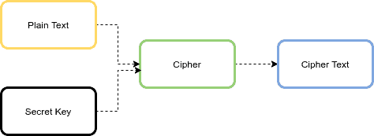

# [Java 中的 AES 加密与解密](https://www.baeldung.com/java-aes-encryption-decryption)

安全

1. 概述
    对称密钥分组密码在数据加密中扮演着重要角色，其特点是加密和解密使用相同的密钥。高级加密标准（[AES](https://en.wikipedia.org/wiki/Advanced_Encryption_Standard)）是一种广泛使用的对称密钥加密算法。

    在本教程中，我们将学习如何使用 JDK 中的 Java 加密架构（JCA）实现 AES 加密与解密。

2. AES 算法
    AES 是一种迭代式的对称密钥分组密码，支持 128、192 和 256 位的密钥，用于以 128 位（16 字节）为单位的数据块进行加解密。下图展示了 AES 算法的高层结构：

    

    如果待加密的数据长度不足 128 位，则必须进行填充（padding）。填充是指将最后一个数据块补足至 128 位的过程。

3. AES 的工作模式

    AES 算法有六种工作模式：

    - ECB（电子密码本模式，Electronic Code Book）
    - CBC（密码分组链接模式，Cipher Block Chaining）
    - CFB（密文反馈模式，Cipher FeedBack）
    - OFB（输出反馈模式，Output FeedBack）
    - CTR（计数器模式，Counter）
    - GCM（伽罗瓦/计数器模式，Galois/Counter Mode）

    通过选择不同的工作模式，可以增强加密算法的效果，甚至将分组密码转换为流密码。每种模式各有优缺点，下面我们简要介绍。

    1. ECB 模式
        这是最简单的工作模式。明文被划分为 128 位的块，每个块使用相同的密钥和算法独立加密。因此，相同的明文块会产生相同的密文块。这一特性是 ECB 的主要弱点，**不推荐用于实际加密**。ECB 需要填充。

    2. CBC 模式
        为克服 ECB 的缺陷，CBC 引入了初始化向量（[IV](https://en.wikipedia.org/wiki/Initialization_vector)）。首先将明文块与 IV 进行异或（XOR），再对结果加密得到密文块。后续每个块都使用前一个密文块与当前明文块异或后再加密。

        CBC 模式下，**加密无法并行化，但解密可以并行化**。它也需要填充。

    3. CFB 模式
        CFB 可作为流密码使用。首先加密 IV，然后将结果与明文块异或得到密文。后续步骤中，继续加密前一步的加密结果，并与下一个明文块异或。

        该模式下，**解密可并行化，但加密不可并行化**，且需要 IV。

    4. OFB 模式
        OFB 也可作为流密码。首先加密 IV，然后将加密结果与明文异或得到密文。

        该模式**不需要填充**，且单个数据块的错误（如传输噪声）不会影响其他块。

    5. CTR 模式
        CTR 使用计数器值作为 IV。它与 OFB 类似，但每次加密的是递增的计数器值，而非 IV。

        CTR 模式具有两大优势：**加解密均可并行化**，且**单个块的错误不会传播到其他块**。

    6. GCM 模式
        GCM 是 CTR 模式的扩展，受到 NIST（美国国家标准与技术研究院）高度推荐。与 CBC 不同，GCM 通过内置的认证标签（authentication tag）同时提供**机密性**和**完整性验证**。它**无需填充**，且由于可并行化，性能高效。

    7. CBC 与 GCM 的对比

        虽然 AES/CBC 仍在广泛使用（若正确实现仍可安全），但**AES/GCM 是现代应用的推荐选择**，因其具备认证和性能优势。

        下表对比了 AES/CBC 与 AES/GCM：

        | 特性         | AES/CBC                            | AES/GCM                                    |
        | ------------ | ---------------------------------- | ------------------------------------------ |
        | 机密性       | ✅                                 | ✅                                         |
        | 数据完整性   | ❌（需额外 MAC）                   | ✅（内置认证标签）                         |
        | 是否需要填充 | ✅（如 PKCS5Padding）              | ❌                                         |
        | 性能         | 较慢（串行加密）                   | 更快（可并行）                             |
        | IV 要求      | 需唯一 IV                          | 必须唯一（重复使用会导致严重安全漏洞） |
        | 安全性弱点   | 易受填充预言攻击（padding oracle） | 抵抗篡改攻击                               |
        | 认证标签     | ❌                                 | ✅（默认 128 位）                          |
        | NIST 推荐    | ❌                                 | ✅                                         |
        | 适用场景     | 遗留系统、兼容性需求               | 现代应用、TLS 1.3、云安全                  |

    8. 加密后的数据大小

        如前所述，AES 的分组大小为 128 位（16 字节）。在 ECB 和 CBC 等需要填充的模式下，密文大小为：

        ```text
        ciphertext_size (bytes) = cleartext_size + (16 - (cleartext_size % 16))
        ```

        若将 IV 与密文一起存储，还需额外增加 16 字节（CBC）或 12 字节（GCM）。

4. AES 参数

    AES 加密需要三个参数：输入数据、密钥和初始化向量（IV）。注意：ECB 模式不使用 IV。

    1. 输入数据
        输入可以是字符串、文件、Java 对象或基于密码的数据。

    2. 密钥（Secret Key）
        生成 AES 密钥有两种方式：

        - 从安全随机数生成；
        - 从用户密码派生。

        **方式一：随机生成密钥**
        应使用密码学安全的随机数生成器（如 `SecureRandom`）。推荐使用 `KeyGenerator` 类：

        ```java
        public static SecretKey generateKey(int n) throws NoSuchAlgorithmException {
            KeyGenerator keyGenerator = KeyGenerator.getInstance("AES");
            keyGenerator.init(n); // n = 128, 192, 或 256
            return keyGenerator.generateKey();
        }
        ```

        **方式二：从密码派生密钥**
        可使用 PBKDF2（基于密码的密钥派生函数），并配合盐值（salt）增强安全性。盐值也应是随机生成的。

        ```java
        public static SecretKey getKeyFromPassword(String password, String salt)
            throws NoSuchAlgorithmException, InvalidKeySpecException {

            SecretKeyFactory factory = SecretKeyFactory.getInstance("PBKDF2WithHmacSHA256");
            KeySpec spec = new PBEKeySpec(password.toCharArray(), salt.getBytes(), 65536, 256);
            SecretKey secret = new SecretKeySpec(factory.generateSecret(spec).getEncoded(), "AES");
            return secret;
        }
        ```

        此处使用 65,536 次迭代和 256 位密钥长度，符合当前安全实践。

    3. 初始化向量（IV）
        IV 是一个伪随机值，确保相同明文和密钥每次加密产生不同密文。在 AES/GCM 中，**推荐使用 12 字节（96 位）的 IV**，并配合 128 位认证标签。

        ```java
        public static GCMParameterSpec generateIv() {
            byte[] iv = new byte[12];
            new SecureRandom().nextBytes(iv);
            return new GCMParameterSpec(128, iv); // 128 位认证标签
        }
        ```

5. 加密与解密实现

    1. 字符串加密/解密

        **加密：**

        ```java
        public static String encrypt(String algorithm, String input, SecretKey key,
            GCMParameterSpec iv) throws Exception {

            Cipher cipher = Cipher.getInstance(algorithm);
            cipher.init(Cipher.ENCRYPT_MODE, key, iv);
            byte[] cipherText = cipher.doFinal(input.getBytes());
            return Base64.getEncoder().encodeToString(cipherText);
        }
        ```

        **解密：**

        ```java
        public static String decrypt(String algorithm, String cipherText, SecretKey key,
            GCMParameterSpec iv) throws Exception {

            Cipher cipher = Cipher.getInstance(algorithm);
            cipher.init(Cipher.DECRYPT_MODE, key, iv);
            byte[] plainText = cipher.doFinal(Base64.getDecoder().decode(cipherText));
            return new String(plainText);
        }
        ```

        **测试示例：**

        ```java
        @Test
        void givenString_whenEncrypt_thenSuccess() throws Exception {
            String input = "baeldung";
            SecretKey key = AESUtil.generateKey(128);
            GCMParameterSpec iv = AESUtil.generateIv();
            String algorithm = "AES/GCM/NoPadding";

            String encrypted = AESUtil.encrypt(algorithm, input, key, iv);
            String decrypted = AESUtil.decrypt(algorithm, encrypted, key, iv);

            Assertions.assertEquals(input, decrypted);
        }
        ```

    2. 文件加密/解密

        为避免内存溢出，应使用缓冲区逐块处理大文件。

        **加密文件：**

        ```java
        public static void encryptFile(String algorithm, SecretKey key, GCMParameterSpec iv,
            File inputFile, File outputFile) throws Exception {

            Cipher cipher = Cipher.getInstance(algorithm);
            cipher.init(Cipher.ENCRYPT_MODE, key, iv);

            try (FileInputStream in = new FileInputStream(inputFile);
                FileOutputStream out = new FileOutputStream(outputFile)) {

                byte[] buffer = new byte[64];
                int bytesRead;
                while ((bytesRead = in.read(buffer)) != -1) {
                    byte[] output = cipher.update(buffer, 0, bytesRead);
                    if (output != null) out.write(output);
                }
                byte[] finalBytes = cipher.doFinal();
                if (finalBytes != null) out.write(finalBytes);
            }
        }
        ```

        **解密文件**逻辑类似，只需将模式改为 `DECRYPT_MODE`。

        **测试示例：**

        ```java
        @Test
        void givenFile_whenEncrypt_thenSuccess() throws Exception {
            SecretKey key = AESUtil.generateKey(128);
            GCMParameterSpec iv = AESUtil.generateIv();
            String algorithm = "AES/GCM/NoPadding";

            File inputFile = new ClassPathResource("inputFile/baeldung.txt").getFile();
            File encryptedFile = new File("baeldung.encrypted");
            File decryptedFile = new File("document.decrypted");

            AESUtil.encryptFile(algorithm, key, iv, inputFile, encryptedFile);
            AESUtil.decryptFile(algorithm, key, iv, encryptedFile, decryptedFile);

            assertThat(inputFile).hasSameTextualContentAs(decryptedFile);
        }
        ```

    3. 基于密码的加解密

        使用从密码派生的密钥进行加解密，流程与字符串加解密相同。

        **测试示例：**

        ```java
        @Test
        void givenPassword_whenEncrypt_thenSuccess() throws Exception {
            String plainText = "www.baeldung.com";
            String password = "baeldung";
            String salt = "12345678"; // 实际应用中 salt 应随机生成并存储

            GCMParameterSpec iv = AESUtil.generateIv();
            SecretKey key = AESUtil.getKeyFromPassword(password, salt);

            String encrypted = AESUtil.encryptPasswordBased(plainText, key, iv);
            String decrypted = AESUtil.decryptPasswordBased(encrypted, key, iv);

            Assertions.assertEquals(plainText, decrypted);
        }
        ```

        > 注意：实际应用中，salt 必须为每个密码单独随机生成，并与密文一起存储，不能硬编码。

    4. Java 对象加密/解密

        可使用 `SealedObject` 类加密可序列化的对象。

        **定义可序列化类：**

        ```java
        public class Student implements Serializable {
            private String name;
            private int age;
            // getter/setter...
        }
        ```

        **加密对象：**

        ```java
        public static SealedObject encryptObject(String algorithm, Serializable obj,
            SecretKey key, GCMParameterSpec iv) throws Exception {

            Cipher cipher = Cipher.getInstance(algorithm);
            cipher.init(Cipher.ENCRYPT_MODE, key, iv);
            return new SealedObject(obj, cipher);
        }
        ```

        **解密对象：**

        ```java
        public static Serializable decryptObject(String algorithm, SealedObject sealed,
            SecretKey key, GCMParameterSpec iv) throws Exception {

            Cipher cipher = Cipher.getInstance(algorithm);
            cipher.init(Cipher.DECRYPT_MODE, key, iv);
            return (Serializable) sealed.getObject(cipher);
        }
        ```

        **测试示例：**

        ```java
        @Test
        void givenObject_whenEncrypt_thenSuccess() throws Exception {
            Student student = new Student("Baeldung", 20);
            SecretKey key = AESUtil.generateKey(128);
            GCMParameterSpec iv = AESUtil.generateIv();
            String algorithm = "AES/GCM/NoPadding";

            SealedObject sealed = AESUtil.encryptObject(algorithm, student, key, iv);
            Student decrypted = (Student) AESUtil.decryptObject(algorithm, sealed, key, iv);

            assertThat(student).isEqualToComparingFieldByField(decrypted);
        }
        ```

6. 结论

    本文介绍了如何在 Java 中使用 AES 算法对字符串、文件、Java 对象以及基于密码的数据进行加密和解密。我们还讨论了 AES 的不同工作模式及其对密文大小的影响。

    **最佳实践建议：**

    - 优先使用 **AES/GCM/NoPadding** 模式；
    - 密钥使用 `KeyGenerator` 安全生成；
    - IV 必须唯一且不可预测（使用 `SecureRandom`）；
    - 若基于密码，务必使用 PBKDF2 + 随机 salt + 足够迭代次数；
    - 切勿在 ECB 模式下加密结构化或重复数据。
