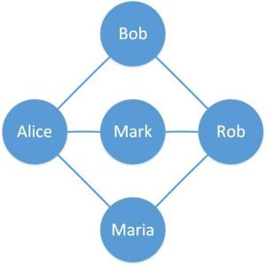
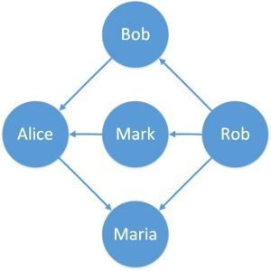
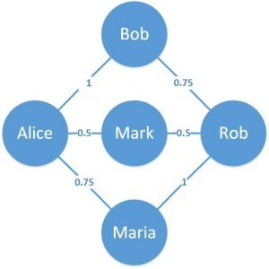
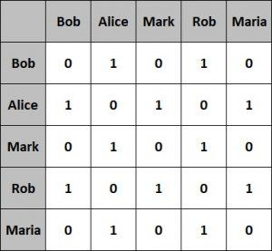
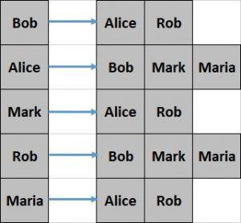

# 数据结构

本模块包含有关 Java 数据结构的文章

- [Java 中的 Trie 数据结构](<https://www.baeldung.com/trie-java>)
- [Java 中二叉树的实现](<https://www.baeldung.com/java-binary-tree>)
- [循环链接表的 Java 实现](<https://www.baeldung.com/java-circular-linked-list>)
- [如何打印二叉树图](<https://www.baeldung.com/java-print-binary-tree-diagram>)
- [大队列简介](<https://www.baeldung.com/java-big-queue>)
- [Java 中的 AVL 树指南](<https://www.baeldung.com/java-avl-trees>)
- [ ] [Java中的图形](#java-中的图形)
- [用 Java 实现环形缓冲区](<https://www.baeldung.com/java-ring-buffer>)
- [如何在 Java 中实现最小-最大堆](<https://www.baeldung.com/java-min-max-heap>)
- [如何在 Java 中实现 LRU 缓存](<https://www.baeldung.com/java-lru-cache>)

## Java 中的图形

1. 概述

    在本教程中，我们将了解图形作为数据结构的基本概念。

    我们还将探讨 Java 中的图形实现，以及对图形可能进行的各种操作。我们还将讨论提供图实现的 Java 库。

2. 图数据结构

    图是一种用于存储连接数据（如社交媒体平台上的人际网络）的数据结构。

    图由顶点和边组成。顶点代表实体（如人），边代表实体之间的关系（如人的朋友关系）。

    让我们定义一个简单的图来更好地理解这一点：

    
    在这里，我们定义了一个有五个顶点和六条边的简单图。圆圈是顶点，代表人，连接两个顶点的线是边，代表在线门户网站上的朋友。

    根据边的属性，这个简单图有几种变化。让我们在接下来的章节中简单介绍一下。

    不过，在本教程的 Java 示例中，我们将只关注这里介绍的简单图。

    1. 有向图

        我们迄今为止定义的图都是没有任何方向的边。如果这些边上有方向，那么得到的图就称为有向图。

        举个例子，在在线门户网站上，谁向谁发送了交友请求：

        
        在这里，我们可以看到这些边都有固定的方向。这些边也可以是双向的。

    2. 加权图

        同样，我们的简单图具有无偏或无权的边。

        如果这些边具有相对权重，则称为加权图。

        实际应用中的一个例子就是在在线门户网站上表示一段友谊的相对年龄：

        
        在这里，我们可以看到这些边都有相关的权重。这为这些边提供了相对意义。

3. 图的表示

    图可以用不同的形式表示，如邻接矩阵和邻接表。在不同的设置中，每种形式都各有利弊。

    我们将在本节中介绍这些图表示法。

    1. 邻接矩阵

        邻接矩阵是一个正方形矩阵，维数相当于图中的顶点数。

        矩阵元素的值通常为 0 或 1。值为 1 表示行和列中的顶点之间存在邻接关系，否则值为 0。

        让我们来看看上一节中简单图的邻接矩阵：

        
        这种表示法比较容易实现，查询效率也很高。不过，它占用空间的效率较低。

    2. 邻接表

        邻接表只不过是一个列表数组。数组的大小相当于图中顶点的数量。

        数组中特定索引处的列表代表该数组索引所代表顶点的相邻顶点。

        让我们看看上一节中的简单图的邻接列表：

        
        这种表示法创建起来相对困难，查询效率也较低。不过，它的空间效率更高。

        在本教程中，我们将使用邻接表来表示图形。

4. Java 中的图

    Java 没有图数据结构的默认实现。

    不过，我们可以使用 Java 集合来实现图。

    让我们从定义顶点开始：

    ```java
    class Vertex {
        String label；
        Vertex(String label) {
            this.label = label；
        }
        // 等于和哈希代码
    }
    ```

    上述顶点定义只包含一个标签，但它可以代表任何可能的实体，如 Person 或 City。

    此外，请注意我们必须重载 equals() 和 hashCode() 方法，因为这些方法是使用 Java 集合所必需的。

    正如我们之前所讨论的，图只不过是顶点和边的集合，可以用邻接矩阵或邻接列表来表示。

    让我们看看如何使用邻接表来定义图形：

    ```java
    class Graph {
        private Map<Vertex, List<Vertex>> adjVertices;
    }
    ```

    我们可以看到，Graph 类使用了 Java Collections 中的 Map 来定义邻接列表。

    对图形数据结构可以进行多种操作，例如创建、更新或搜索图形。

    我们将介绍一些更常见的操作，看看如何用 Java 实现它们。

5. 图突变操作

    首先，我们将定义一些方法来突变图数据结构。

    让我们定义添加和删除顶点的方法：

    参见 graph\Graph.java

    `void addVertex(String label)`

    `void removeVertex(String label)`

    这些方法只是简单地从顶点集合中添加和删除元素。

    现在，让我们定义一个添加边的方法：

    `void addEdge(String label1, String label2)`

    该方法创建了一个新的边缘，并更新了相邻顶点地图。

    我们将以类似的方式定义 removeEdge() 方法：

    `void removeEdge(String label1, String label2)`

    接下来，让我们看看如何使用迄今为止定义的方法创建我们之前绘制的简单图形：

    GraphUnitTest.java

    `Graph createGraph()`

    最后，我们将定义一个方法来获取特定顶点的相邻顶点：

    `List<Vertex> getAdjVertices(String label)`

6. 遍历图

    既然我们已经定义了图形数据结构以及创建和更新图形的函数，我们就可以定义一些用于遍历图形的附加函数。

    我们需要遍历图来执行任何有意义的操作，例如在图中搜索。

    遍历图有两种可能的方式：深度优先遍历和广度优先遍历。

    代码参见：graph\GraphTraversal.java

    1. 深度优先遍历

        [深度优先遍历](https://www.baeldung.com/cs/depth-first-traversal-methods)从任意根顶点开始，沿着每个分支尽可能深入地探索顶点，然后再探索同一层次的顶点。

        让我们定义一个执行深度优先遍历的方法：

        `Set<String> depthFirstTraversal(Graph graph, String root)`

        在这里，我们使用堆栈来存储需要遍历的顶点。

        让我们在上一小节创建的图上运行这个方法：

        `assertEquals("[Bob, Rob, Maria, Alice, Mark]", depthFirstTraversal(graph, "Bob").toString());`

        请注意，这里我们使用顶点 "Bob "作为遍历的根顶点，但也可以是任何其他顶点。

    2. 广度优先遍历

        相对而言，广度优先遍历从任意根顶点开始，先遍历同级别的所有相邻顶点，然后再深入图中。

        现在，让我们定义一个执行广度优先遍历的方法：

        `Set<String> breadthFirstTraversal(Graph graph, String root)`

        请注意，广度优先遍历使用 Queue 来存储需要遍历的顶点。

        让我们在同一个图上再次运行这个遍历：

        `assertEquals("[Bob, Alice, Rob, Mark, Maria]", breadthFirstTraversal(graph, "Bob").toString());`

        同样，这里的根顶点是 "Bob"，也可以是任何其他顶点。

7. 图形的 Java 库

    不一定非要用 Java 从头开始实现图形。有几个开源和成熟的库可以提供图的实现。

    在接下来的几个小节中，我们将介绍其中的一些库。

    1. JGraphT

        [JGraphT](https://jgrapht.org/) 是 Java 中最流行的图数据结构库之一。它允许创建简单图、有向图和加权图等。

        此外，它还为图数据结构提供了许多可能的算法。我们以前的[教程](https://www.baeldung.com/jgrapht)之一更详细地介绍了 JGraphT。

    2. 谷歌 Guava

        [Google Guava](https://github.com/google/guava/wiki/GraphsExplained) 是一套 Java 库，提供包括图数据结构及其算法在内的一系列功能。

        它支持创建简单的 Graph、ValueGraph 和 Network。这些图形可定义为可变或不可变。

    3. Apache Commons

        [Apache Commons](http://commons.apache.org/sandbox/commons-graph/) 是一个提供可重用 Java 组件的 Apache 项目。其中包括 Commons Graph，它提供了一个创建和管理图数据结构的工具包。它还提供了对数据结构进行操作的通用图形算法。

    4. Sourceforge JUNG

        Java Universal Network/Graph（[JUNG](http://jung.sourceforge.net/)）是一个 Java 框架，提供可扩展的语言，用于对任何可表示为图形的数据进行建模、分析和可视化。

        JUNG 支持多种算法，包括聚类、分解和优化等例程。

        这些库提供了许多基于图数据结构的实现方法。此外，还有一些基于图的功能更强大的框架，如 [Apache Giraph](http://giraph.apache.org/)（目前用于 Facebook 分析其用户形成的图）和 [Apache TinkerPop](http://tinkerpop.apache.org/)（通常用于图数据库）。

8. 结论

    在本文中，我们讨论了作为数据结构的图及其表示方法。我们使用 Java 集合在 Java 中定义了一个非常简单的图，还定义了图的常用遍历。

    我们还简要介绍了 Java 平台之外提供图实现的各种 Java 库。

## Code

一如既往，这些示例的代码可在 [GitHub](https://github.com/eugenp/tutorials/tree/master/data-structures) 上获取。
