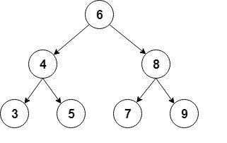

# [在Java中实现二进制树](https://www.baeldung.com/java-binary-tree)

1. 介绍

    在本教程中，我们将介绍在Java中实现二叉树。

    为了本教程，我们将使用包含int值的排序二叉树。

2. 二进制树

    二叉树是一种递归数据结构，每个节点最多可以有2个子节点。

    二进制树的常见类型是二进制搜索树，其中每个节点的值大于或等于左侧子树中的节点值，小于或等于右侧子树中的节点值。

    以下是这种类型的二叉树的可视化表示：

    

    对于实现，我们将使用一个辅助节点类，该类将存储int值，并保留对每个子项的引用：

    ```java
    class Node {
        int value;
        Node left;
        Node right;

        Node(int value) {
            this.value = value;
            right = null;
            left = null;
        }
    }
    ```

    然后，我们将添加树的起始节点，通常称为根节点：

    ```java
    public class BinaryTree {
        Node root;
        // ...
    }
    ```

3. 常见操作

    现在让我们看看我们可以在二叉树上执行的最常见的操作。

    1. 插入元素

        我们将要涵盖的第一个操作是插入新节点。

        首先，我们必须找到想要添加新节点的位置，以便对树进行排序。我们将从根节点开始遵循以下规则：

        - 如果新节点的值低于当前节点的值，我们会转到左侧子节点
        - 如果新节点的值大于当前节点的值，我们转到正确的子节点
        - 当当前节点为空时，我们已经到达了一个叶节点，我们可以在该位置插入新节点

        然后，我们将创建一个递归方法来进行插入：

        ```java
        private Node addRecursive(Node current, int value) {
            if (current == null) {
                return new Node(value);
            }
            if (value < current.value) {
                current.left = addRecursive(current.left, value);
            } else if (value > current.value) {
                current.right = addRecursive(current.right, value);
            } else {
                // value already exists
                return current;
            }
            return current;
        }
        ```

        接下来，我们将创建从根节点启动递归的公共方法：

        ```java
        public void add(int value) {
            root = addRecursive(root, value);
        }
        ```

        让我们看看如何从我们的示例中使用此方法创建树：

        ```java
        private BinaryTree createBinaryTree() {
            BinaryTree bt = new BinaryTree();
            bt.add(6);
            bt.add(4);
            bt.add(8);
            bt.add(3);
            bt.add(5);
            bt.add(7);
            bt.add(9);
            return bt;
        }
        ```

    2. 寻找一个元素

        现在让我们添加一个方法来检查树是否包含特定值。

        和以前一样，我们将首先创建一个遍历树的递归方法：

        ```java
        private boolean containsNodeRecursive(Node current, int value) {
            if (current == null) {
                return false;
            }
            if (value == current.value) {
                return true;
            }
            return value < current.value
            ? containsNodeRecursive(current.left, value)
            : containsNodeRecursive(current.right, value);
        }
        ```

        在这里，我们通过将其与当前节点中的值进行比较来搜索值；然后我们将根据结果在左侧或右侧子节点中继续。

        接下来，我们将创建从根开始的公共方法：

        ```java
        public boolean containsNode(int value) {
            return containsNodeRecursive(root, value);
        }
        ```

        然后，我们将创建一个简单的测试，以验证树是否真的包含插入的元素：

        ```java
        @Test
        public void givenABinaryTree_WhenAddingElements_ThenTreeContainsThoseElements() {
            BinaryTree bt = createBinaryTree();
            assertTrue(bt.containsNode(6));
            assertTrue(bt.containsNode(4));
            assertFalse(bt.containsNode(1));
        }
        ```

        所有添加的节点都应包含在树中。

    3. 删除一个元素

        另一个常见的操作是从树中删除节点。

        首先，我们必须以与以前类似的方式找到要删除的节点：

        ```java
        private Node deleteRecursive(Node current, int value) {
            if (current == null) {
                return null;
            }
            if (value == current.value) {
                // Node to delete found
                // ... code to delete the node will go here
            } 
            if (value < current.value) {
                current.left = deleteRecursive(current.left, value);
                return current;
            }
            current.right = deleteRecursive(current.right, value);
            return current;
        }
        ```

        一旦我们找到要删除的节点，就会有3个主要不同的情况：

        - 节点没有子节点——这是最简单的情况；我们只需要将此节点替换为其父节点中的空值
        - 一个节点正好有一个子节点——在父节点中，我们将此节点替换为其唯一的子节点。
        - 一个节点有两个子节点——这是最复杂的情况，因为它需要树重组

        让我们看看当节点是叶子节点时，我们如何实现第一种情况：

        ```java
        if (current.left == null && current.right == null) {
            return null;
        }
        ```

        现在让我们继续节点有一个子节点的情况：

        ```java
        if (current.right == null) {
            return current.left;
        }

        if (current.left == null) {
            return current.right;
        }
        ```

        在这里，我们返回非空子节点，以便将其分配给父节点。

        最后，我们必须处理节点有两个子节点的情况。

        首先，我们需要找到替换已删除节点的节点。我们将使用即将被删除的节点右侧子树中最小的节点：

        ```java
        private int findSmallestValue(Node root) {
            return root.left == null ? root.value : findSmallestValue(root.left);
        }
        ```

        然后，我们将最小值分配给要删除的节点，之后，我们将从正确的子树中删除它：

        ```java
        int smallestValue = findSmallestValue(current.right);
        current.value = smallestValue;
        current.right = deleteRecursive(current.right, smallestValue);
        return current;
        ```

        最后，我们将创建从根开始删除的公共方法：

        ```java
        public void delete(int value) {
            root = deleteRecursive(root, value);
        }
        ```

        现在让我们检查一下删除是否按预期工作：

        ```java
        @Test
        public void givenABinaryTree_WhenDeletingElements_ThenTreeDoesNotContainThoseElements() {
            BinaryTree bt = createBinaryTree();
            assertTrue(bt.containsNode(9));
            bt.delete(9);
            assertFalse(bt.containsNode(9));
        }
        ```

4. 遍历树

    在本节中，我们将探索遍历树的不同方法，详细涵盖深度优先和宽度优先搜索。

    我们将使用与之前相同的树，我们将检查每个情况的遍历顺序。

    1. 深度优先搜索

        深度优先搜索是一种在探索下一个兄弟姐妹之前，对每个孩子进行尽可能深入的遍历。

        有几种方法可以执行深度优先搜索：按顺序、预购和后订购。

        顺序遍历包括首先访问左侧子树，然后是根节点，最后是右侧子树：

        ```java
        public void traverseInOrder(Node node) {
            if (node != null) {
                traverseInOrder(node.left);
                System.out.print(" " + node.value);
                traverseInOrder(node.right);
            }
        }
        ```

        如果我们调用此方法，控制台输出将显示按顺序遍历：

        `3 4 5 6 7 8 9`

        预序遍历首先访问根节点，然后是左侧子树，最后是右侧子树：

        ```java
        public void traversePreOrder(Node node) {
            if (node != null) {
                System.out.print(" " + node.value);
                traversePreOrder(node.left);
                traversePreOrder(node.right);
            }
        }
        ```

        让我们在控制台输出中检查预购遍历：

        `6 4 3 5 8 7 9`

        后序遍历访问左侧子树、右侧子树和末尾的根节点：

        ```java
        public void traversePostOrder(Node node) {
            if (node != null) {
                traversePostOrder(node.left);
                traversePostOrder(node.right);
                System.out.print(" " + node.value);
            }
        }
        ```

        以下是后序中的节点：

        `3 5 4 7 9 8 6`

    2. 广度优先搜索

        这是另一种常见的遍历类型，在前往下一级之前访问一个级别的所有节点。

        这种遍历也被称为水平顺序，从根部开始，从左到右访问树的所有级别。

        对于实现，我们将使用队列来按顺序保持每个级别的节点。我们将从列表中提取每个节点，打印其值，然后将其子节点添加到队列中：

        ```java
        public void traverseLevelOrder() {
            if (root == null) {
                return;
            }

            Queue<Node> nodes = new LinkedList<>();
            nodes.add(root);

            while (!nodes.isEmpty()) {

                Node node = nodes.remove();

                System.out.print(" " + node.value);

                if (node.left != null) {
                    nodes.add(node.left);
                }

                if (node.right != null) {
                    nodes.add(node.right);
                }
            }
        }
        ```

        在这种情况下，节点的顺序将是：

        `6 4 8 3 5 7 9`

5. 结论

    在本文中，我们学习了如何在Java中实现排序二叉树及其最常见的操作。
