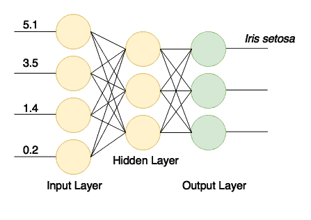

# [Deeplearning4j指南](https://www.baeldung.com/deeplearning4j)

1. 简介

    在本文中，我们将使用 [deeplearning4j](https://deeplearning4j.konduit.ai/) (dl4j) 库创建一个简单的神经网络--这是一个强大的现代机器学习工具。

    在我们开始之前，请注意本指南不要求您具备线性代数、统计学、机器学习理论以及其他大量基础扎实的 ML 工程师必备的知识。

2. 什么是深度学习？

    神经网络是由相互连接的节点层组成的计算模型。

    节点是类似神经元的数字数据处理器。它们从输入端获取数据，对这些数据应用一些权重和函数，然后将结果发送到输出端。这种网络可以通过一些源数据实例进行训练。

    训练本质上是在节点中保存一些数字状态（权重），这些状态随后会影响计算。训练示例可能包含具有特征的数据项和这些数据项的某些已知类别（例如，"这组 16×16 像素包含手写字母'a'"）。

    训练完成后，即使神经网络以前从未见过这些特定的数据项，它也能从新数据中获取信息。一个建模良好、训练有素的网络可以识别图像、手写字母、语音，处理统计数据以生成商业智能结果，等等。

    近年来，随着高性能并行计算的发展，深度神经网络成为可能。这类网络与简单的神经网络不同，它们由多个中间（或[隐藏](https://www.baeldung.com/cs/neural-networks-hidden-layers-criteria)）层组成。这种结构允许网络以更复杂的方式（递归、递归、卷积等）处理数据，并从中提取更多信息。

3. 设置项目

    要使用该库，我们至少需要 Java 7。此外，由于某些本地组件的原因，它只能在 64 位 JVM 版本下运行。

    在开始指南之前，让我们检查一下是否满足要求：

    `$ java -version`

    首先，让我们在 Maven pom.xml 文件中添加所需的库。我们将在属性条目中提取库的版本（如需最新版本的库，请查看 Maven Central 资源库）：

    ```xml
    <properties>
        <dl4j.version>0.9.1</dl4j.version>
    </properties>

    <dependencies>
        <dependency>
            <groupId>org.nd4j</groupId>
            <artifactId>nd4j-native-platform</artifactId>
            <version>${dl4j.version}</version>
        </dependency>
        <dependency>
            <groupId>org.deeplearning4j</groupId>
            <artifactId>deeplearning4j-core</artifactId>
            <version>${dl4j.version}</version>
        </dependency>
    </dependencies>
    ```

    请注意，nd4j-native-platform 依赖项是多个可用实现之一。

    它依赖于可用于多种不同平台（macOS、Windows、Linux、Android 等）的本地库。如果我们想在支持 CUDA 编程模型的显卡上执行计算，也可以将后端切换为 nd4j-cuda-8.0-platform。

4. 准备数据

    1. 准备数据集文件

        我们将编写机器学习的 "Hello World"--[Iris花数据集](https://en.wikipedia.org/wiki/Iris_flower_data_set)分类。这是一组从不同物种（Iris setosa、Iris versicolor 和 Iris virginica）的花朵中收集的数据。

        这些物种的花瓣和萼片的长度和宽度各不相同。要编写一个精确的算法来对输入数据进行分类（即确定某朵花属于哪个物种）是很难的。但训练有素的神经网络却能快速分类，而且错误率极低。

        我们将使用 CSV 版本的数据，其中第 0...3 列包含物种的不同特征，第 4 列包含记录的类别或物种，编码值为 0、1 或 2：

        ```txt
        5.1,3.5,1.4,0.2,0
        4.9,3.0,1.4,0.2,0
        4.7,3.2,1.3,0.2,0
        ...
        7.0,3.2,4.7,1.4,1
        6.4,3.2,4.5,1.5,1
        6.9,3.1,4.9,1.5,1
        ...
        ```

    2. 矢量化和读取数据

        我们用数字对类进行编码，因为神经网络是用数字工作的。将现实世界的数据项转换为一系列数字（矢量）称为矢量化--deeplearning4j 使用 [datavec](https://github.com/deeplearning4j/deeplearning4j/tree/master/datavec) 库来完成这项工作。

        首先，让我们使用该库输入包含矢量化数据的文件。在创建 CSVRecordReader 时，我们可以指定要跳过的行数（例如，如果文件有标题行）和分隔符号（在我们的例子中是逗号）：

        ```java
        try (RecordReader recordReader = new CSVRecordReader(0, ',')) {
            recordReader.initialize(new FileSplit(
            new ClassPathResource("iris.txt").getFile()));
            // …
        }
        ```

        要遍历记录，我们可以使用 DataSetIterator 接口的多个实现中的任意一个。数据集可能相当庞大，翻页或缓存数值的功能可能会派上用场。

        但我们的小数据集只包含 150 条记录，所以我们调用 iterator.next() 一次就能将所有数据读入内存。

        我们还指定了类列的索引，在我们的例子中，它与特征计数（4）和类的总数（3）相同。

        此外，请注意，我们需要对数据集进行洗牌，以消除原始文件中的类排序。

        我们指定了一个恒定的随机种子（42），而不是默认的 System.currentTimeMillis() 调用，这样洗牌的结果就会始终如一。这样，我们每次运行程序时都能获得稳定的结果：

        ```java
        DataSetIterator iterator = new RecordReaderDataSetIterator(
        recordReader, 150, FEATURES_COUNT, CLASSES_COUNT);
        DataSet allData = iterator.next();
        allData.shuffle(42);
        ```

    3. 规范化和拆分

        在训练之前，我们还需要对数据进行归一化处理。归一化分为两个阶段：

        - 收集数据的一些统计数据（拟合）
        - 以某种方式改变（转换）数据，使其统一

        对于不同类型的数据，归一化可能会有所不同。

        例如，如果我们要处理各种尺寸的图像，就应该首先收集尺寸统计数据，然后将图像缩放为统一尺寸。

        但对于数字来说，归一化通常意味着将其转化为所谓的正态分布。NormalizerStandardize 类可以帮助我们做到这一点：

        ```java
        DataNormalization normalizer = new NormalizerStandardize();
        normalizer.fit(allData);
        normalizer.transform(allData);
        ```

        现在数据已经准备就绪，我们需要将数据集分成两部分。

        第一部分将用于训练。我们将使用第二部分数据（网络根本不会看到）来测试训练好的网络。

        这样我们就能验证分类是否正确。我们将使用 65% 的数据（0.65）进行训练，剩下的 35% 用于测试：

        ```java
        SplitTestAndTrain testAndTrain = allData.splitTestAndTrain(0.65);
        DataSet trainingData = testAndTrain.getTrain();
        DataSet testData = testAndTrain.getTest();
        ```

5. 准备网络配置

    1. 流畅配置生成器

        现在，我们可以使用流畅的生成器来构建网络配置：

        ```java
        MultiLayerConfiguration configuration 
        = new NeuralNetConfiguration.Builder()
            .iterations(1000)
            .activation(Activation.TANH)
            .weightInit(WeightInit.XAVIER)
            .learningRate(0.1)
            .regularization(true).l2(0.0001)
            .list()
            .layer(0, new DenseLayer.Builder().nIn(FEATURES_COUNT).nOut(3).build())
            .layer(1, new DenseLayer.Builder().nIn(3).nOut(3).build())
            .layer(2, new OutputLayer.Builder(
            LossFunctions.LossFunction.NEGATIVELOGLIKELIHOOD)
                .activation(Activation.SOFTMAX)
                .nIn(3).nOut(CLASSES_COUNT).build())
            .backprop(true).pretrain(false)
            .build();
        ```

        即使使用这种简化的流畅方式来构建网络模型，仍有很多内容需要消化，很多参数需要调整。让我们来分解这个模型。

    2. 设置网络参数

        iterations() 生成器方法指定了优化迭代的次数。

        迭代优化意味着对训练集进行多次处理，直到网络收敛到良好的结果。

        通常，在真实的大型数据集上进行训练时，我们会使用多个 epoch（网络对数据的完整传递），每个 epoch 进行一次迭代。但由于我们的初始数据集很小，因此我们将使用一次epoch和多次迭代。

        激活函数（activation()）是一个在节点内部运行的函数，用于决定节点的输出。

        最简单的激活函数是线性函数 f(x) = x。但事实证明，只有非线性函数才能让网络使用少量节点解决复杂任务。

        我们可以在 org.nd4j.linalg.activations.Activation 枚举中查找大量不同的激活函数。如果需要，我们也可以编写自己的激活函数。但我们将使用提供的双曲正切（tanh）函数。

        weightInit() 方法指定了为网络设置初始权重的多种方法之一。正确的初始权重会对训练结果产生深远影响。在不涉及太多数学问题的情况下，我们将其设置为高斯分布形式（WeightInit.XAVIER），因为这通常是一个很好的开端。

        所有其他权重初始化方法都可以在 org.deeplearning4j.nn.weights.WeightInit 枚举中找到。

        学习率是一个至关重要的参数，它深刻影响着网络的学习能力。

        在更复杂的情况下，我们可以花很多时间调整这个参数。但对于我们的简单任务，我们将使用一个相当重要的值 0.1，并通过 learningRate() 生成器方法进行设置。

        训练神经网络的问题之一是当网络 "记忆(memorizes)" 训练数据时出现的过拟合情况。

        当网络为训练数据设置了过高的权重时，就会出现这种情况，并在任何其他数据上产生糟糕的结果。

        为了解决这个问题，我们将使用 .regularization(true).l2(0.0001) 行设置 l2 正则化。正则化会 "惩罚(penalizes)" 权重过大的网络，防止过度拟合。

    3. 构建网络层

        接下来，我们创建一个由密集层（也称为全连接层）组成的网络。

        第一层包含的节点数应与训练数据中的列数相同（4）。

        第二个密集层将包含三个节点。这是我们可以改变的值，但上一层的输出数必须相同。

        最终输出层包含的节点数应与类别数（3）相匹配。网络结构如图所示：

        

        训练成功后，我们将拥有一个通过输入接收四个值并向三个输出之一发送信号的网络。这就是一个简单的分类器。

        最后，为了完成网络的构建，我们设置了反向传播（最有效的训练方法之一），并使用 .backprop(true).pretrain(false) 这一行禁用了预训练。

6. 创建和训练网络

    现在，让我们从配置中创建一个神经网络，初始化并运行它：

    ```java
    MultiLayerNetwork model = new MultiLayerNetwork(configuration);
    model.init();
    model.fit(trainingData);
    ```

    现在，我们可以使用其余数据集测试训练好的模型，并用三个类别的评估指标验证结果：

    ```java
    INDArray output = model.output(testData.getFeatureMatrix());
    Evaluation eval = new Evaluation(3);
    eval.eval(testData.getLabels(), output);
    ```

    如果我们现在打印出 eval.stats()，就会发现我们的网络在对虹膜花进行分类方面相当出色，尽管它有三次将 1 类误认为 2 类。

    ```log
    Examples labeled as 0 classified by model as 0: 19 times
    Examples labeled as 1 classified by model as 1: 16 times
    Examples labeled as 1 classified by model as 2: 3 times
    Examples labeled as 2 classified by model as 2: 15 times

    ==========================Scores========================================
    # of classes: 3
    Accuracy: 0.9434
    Precision: 0.9444
    Recall: 0.9474
    F1 Score: 0.9411
    Precision, recall & F1: macro-averaged (equally weighted avg. of 3 classes)
    ========================================================================
    ```

    流畅配置生成器允许我们快速添加或修改网络层，或调整一些其他参数，看看我们的模型是否可以改进。

7. 结论

    在本文中，我们使用 deeplearning4j 库构建了一个简单而强大的神经网络。
