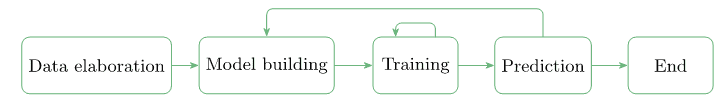
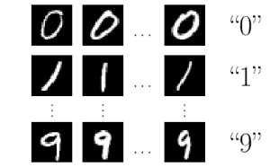
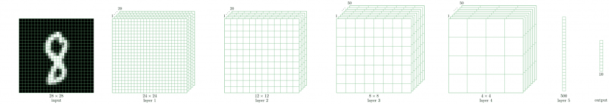
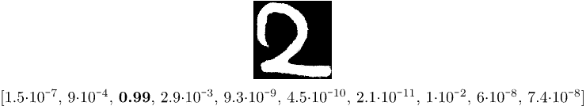

# [Java 中的逻辑回归](https://www.baeldung.com/java-logistic-regression)

1. 简介

    逻辑回归是机器学习（ML）从业者工具箱中的重要工具。

    在本教程中，我们将探讨逻辑回归背后的主要思想。

    首先，让我们简要介绍一下 ML 范例和算法。

2. 概述

    ML 使我们能够解决可以用人类友好术语表述的问题。然而，这对我们软件开发人员来说可能是一个挑战。我们已经习惯于用计算机友好的术语来解决我们可以提出的问题。例如，作为人类，我们可以很容易地检测出照片上的物体或确定一句话的情绪。我们怎样才能为计算机提出这样的问题呢？

    为了找到解决方案，在 ML 中有一个特殊的阶段，叫做训练。在这一阶段，我们向算法输入输入数据，使其尝试得出一组最佳参数（即所谓的权重）。我们向算法输入的输入数据越多，我们就能期望从算法中得到越精确的预测结果。

    训练是迭代式 ML 工作流程的一部分：

    

    我们从获取数据开始。通常，数据来自不同的来源。因此，我们必须确保数据格式一致。我们还应确保数据集能公平地代表研究领域。如果模型从未在红苹果上进行过训练，它就很难预测红苹果。

    接下来，我们应该建立一个能够使用数据并进行预测的模型。在 ML 中，没有预先定义的模型可以在所有情况下都能很好地工作。

    在寻找正确的模型时，我们很可能会建立一个模型，训练它，查看它的预测结果，然后放弃这个模型，因为我们对它的预测结果并不满意。 在这种情况下，我们应该后退一步，建立另一个模型，并再次重复这一过程。

3. ML 范式

    在 ML 中，根据我们所掌握的输入数据类型，我们可以划分出三种主要范式：

    - 监督学习（图像分类、物体识别、情感分析）
    - 无监督学习（异常检测）
    - 强化学习（游戏策略）

    本教程要介绍的案例属于监督学习。

4. ML 工具箱

    在 ML 中，我们在构建模型时可以使用一系列工具。下面我们就来介绍其中的一些：

    - 线性回归
    - 逻辑回归
    - 神经网络
    - 支持向量机
    - k 最近邻

    在建立一个预测性较强的模型时，我们可以将几种工具结合起来。事实上，在本教程中，我们的模型将使用逻辑回归和神经网络。

5. ML 库

    尽管 Java 并不是用于 ML 模型原型开发的最流行语言，但它在包括 ML 在内的许多领域都享有创建强大软件的可靠工具的美誉。因此，我们可以找到用 Java 编写的 ML 库。

    在这方面，我们可以提到事实上的标准库 [Tensorflow](https://www.tensorflow.org/install/lang_java)，它也有一个 Java 版本。另一个值得一提的是名为 Deeplearning4j 的深度学习库。这是一个非常强大的工具，我们也将在本教程中使用它。

6. 数字识别的逻辑回归

    逻辑回归的主要思想是建立一个模型，尽可能精确地预测输入数据的标签。

    我们对模型进行训练，直到所谓的损失函数或目标函数达到某个最小值。损失函数取决于模型的实际预测值和预期预测值（输入数据的标签）。我们的目标是最大限度地减少实际模型预测与预期预测之间的偏差。

    如果我们对最小值不满意，就应该建立另一个模型并再次进行训练。

    为了了解逻辑回归的实际应用，我们以手写数字识别为例进行说明。这个问题已经成为一个经典问题。Deeplearning4j 库中有一系列实际[示例](https://github.com/deeplearning4j/dl4j-examples/tree/master/dl4j-examples/src/main/java/org/deeplearning4j/examples)，展示了如何使用其 API。本教程中与代码相关的部分主要基于 [MNIST 分类器](https://github.com/eclipse/deeplearning4j-examples/tree/master/dl4j-examples/src/main/java/org/deeplearning4j/examples/quickstart/modeling/convolution)。

    1. 输入数据

        我们使用著名的 [MNIST 手写数字数据库](https://en.wikipedia.org/wiki/MNIST_database)作为输入数据。输入数据是 28×28 像素的灰度图像。每幅图像都有一个自然标签，即图像所代表的数字：

        

        为了估算我们要建立的模型的效率，我们将输入数据分成训练集和测试集：

        ```java
        DataSetIterator train = new RecordReaderDataSetIterator(...);
        DataSetIterator test = new RecordReaderDataSetIterator(...);
        ```

        一旦我们对输入图像进行了标注并将其分成两个数据集，"data elaboration" 阶段就结束了，我们可以进入 "model building" 阶段。

    2. 模型构建

        正如我们所提到的，没有一种模型在任何情况下都能很好地发挥作用。不过，经过多年的人工智能研究，科学家们已经找到了在识别手写数字时表现出色的模型。在这里，我们使用所谓的 [LeNet-5](http://yann.lecun.com/exdb/lenet/) 模型。

        LeNet-5 是一个神经网络，由一系列层组成，可将 28×28 像素的图像转换为十维向量：

        

        十维输出向量包含输入图像标签为 0、1 或 2 等的概率。

        例如，如果输出向量的形式如下

        `{0.1, 0.0, 0.3, 0.2, 0.1, 0.1, 0.0, 0.1, 0.1, 0.0}`

        这意味着输入图像为 0 的概率是 0.1，为 1 的概率是 0，为 2 的概率是 0.3，等等。我们可以看到，最大概率（0.3）对应于标签 3。

        让我们深入了解建立模型的细节。我们将省略 Java 特有的细节，专注于 ML 概念。

        我们通过创建一个 MultiLayerNetwork 对象来建立模型：

        `MultiLayerNetwork model = new MultiLayerNetwork(config);`

        在它的构造函数中，我们应该传递一个 MultiLayerConfiguration 对象。这正是描述神经网络几何形状的对象。为了定义网络的几何形状，我们应该定义每一层。

        让我们用第一层和第二层来演示一下：

        ```java
        ConvolutionLayer layer1 = new ConvolutionLayer
            .Builder(5, 5).nIn(channels)
            .stride(1, 1)
            .nOut(20)
            .activation(Activation.IDENTITY)
            .build();
        SubsamplingLayer layer2 = new SubsamplingLayer
            .Builder(SubsamplingLayer.PoolingType.MAX)
            .kernelSize(2, 2)
            .stride(2, 2)
            .build();
        ```

        我们可以看到，层的定义包含了大量对整个网络性能有重大影响的临时参数。这正是我们能否在众多模型中找到一个好模型的关键所在。

        现在，我们准备构建多层配置（MultiLayerConfiguration）对象：

        ```java
        MultiLayerConfiguration config = new NeuralNetConfiguration.Builder()
            // preparation steps
            .list()
            .layer(0, layer1)
            .layer(1, layer2)
            // other layers and final steps
            .build();
        ```

        传递给 MultiLayerNetwork 构造函数。

    3. 训练

        我们构建的模型包含 431080 个参数或权重。我们不会在这里给出这个数字的精确计算，但我们应该知道，仅第一层就有超过 24x24x20=11520 个权重。

        训练阶段非常简单：

        `model.fit(train);`

        起初，431080 个参数有一些随机值，但经过训练后，它们会获得一些决定模型性能的值。我们可以评估模型的预测能力：

        ```java
        Evaluation eval = model.evaluate(test);
        logger.info(eval.stats());
        ```

        LeNet-5 模型在一次训练迭代（epoch）中就达到了相当高的准确率，几乎达到 99%。如果我们想获得更高的准确率，就应该使用普通的 for 循环进行更多的迭代：

        ```java
        for (int i = 0; i < epochs; i++) {
            model.fit(train);
            train.reset();
            test.reset();
        }
        ```

    4. 预测

        现在，我们已经训练好了模型，并对其在测试数据上的预测结果感到满意，我们可以在一些全新的输入上尝试该模型了。为此，让我们创建一个新类 MnistPrediction，在这个类中，我们将从文件系统中选择的文件中加载一张图像：

        ```java
        INDArray image = new NativeImageLoader(height, width, channels).asMatrix(file);
        new ImagePreProcessingScaler(0, 1).transform(image);
        ```

        变量 image 中的图片被缩小为 28×28 的灰度图片。我们可以将其输入模型：

        `INDArray output = model.output(image);`

        变量 output 将包含图像为 0、1、2 等的概率。

        现在我们来玩一下，写一个数字 2，将图像数字化并输入模型。我们可能会得到如下结果

        

        我们可以看到，最大值为 0.99 的分量的索引为 2。这意味着模型已经正确识别了我们手写的数字。

7. 结论

    在本教程中，我们介绍了机器学习的一般概念。我们以逻辑回归为例说明了这些概念，并将其应用于手写数字识别。
