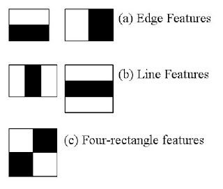

# [使用 Java 的 OpenCV 简介](https://www.baeldung.com/java-opencv)

1. 简介

    在本教程中，我们将学习如何安装和使用 [OpenCV](https://www.baeldung.com/cs/computer-vision) 计算机视觉库，并将其应用于实时[人脸检测](https://www.baeldung.com/cs/cv-face-recognition-mechanism)。

2. 安装

    要在项目中使用 OpenCV 库，我们需要在 pom.xml 中添加 opencv Maven 依赖项：

    ```xml
    <dependency>
        <groupId>org.openpnp</groupId>
        <artifactId>opencv</artifactId>
        <version>3.4.2-0</version>
    </dependency>
    ```

    对于 Gradle 用户，我们需要在 build.gradle 文件中添加依赖关系：

    `compile group: 'org.openpnp', name: 'opencv', version: '3.4.2-0'`

    将该库添加到依赖项后，我们就可以使用 OpenCV 提供的功能了。

3. 使用库

    要开始使用 OpenCV，我们需要初始化该库，这可以在我们的主方法中完成：

    `OpenCV.loadShared();`

    OpenCV 是一个类，其中包含与加载 OpenCV 库在不同平台和架构下所需的本地包相关的方法。

    值得注意的是，[文档](https://opencv-java-tutorials.readthedocs.io/)中的做法略有不同：

    `System.loadLibrary(Core.NATIVE_LIBRARY_NAME)`

    这两种方法调用实际上都会加载所需的本地库。

    不同之处在于，后者需要安装本地库。而前者可以在特定机器上没有本地库的情况下将本地库安装到临时文件夹中。由于存在这种差异，通常最好使用 loadShared 方法。

    现在我们已经初始化了库，让我们看看能用它做些什么。

4. 加载图像

    首先，让我们使用 OpenCV 从磁盘加载示例图像：

    ```java
    public static Mat loadImage(String imagePath) {
        Imgcodecs imageCodecs = new Imgcodecs();
        return imageCodecs.imread(imagePath);
    }
    ```

    该方法将以 Mat 对象（即矩阵表示法）的形式加载给定图像。

    要保存之前加载的图像，我们可以使用 Imgcodecs 类的 imwrite() 方法：

    ```java
    public static void saveImage(Mat imageMatrix, String targetPath) {
        Imgcodecs imgcodecs = new Imgcodecs();
        imgcodecs.imwrite(targetPath, imageMatrix);
    }
    ```

5. 哈尔级联分类器

    在深入研究面部识别之前，我们先来了解一下实现面部识别的核心概念。

    简单地说，分类器是一个程序，它根据过去的经验，将新的观察结果归入一组。级联分类器则是通过多个分类器的组合来实现这一目的。每个后续分类器都会使用前一个分类器的输出作为附加信息，从而大大提高分类效果。

    1. Haar 特征

        OpenCV 中的人脸检测是由基于 Haar 特征的级联分类器完成的。

        [Haar特征](https://docs.opencv.org/3.4/db/d28/tutorial_cascade_classifier.html)是一种滤波器，用于检测图像上的边缘和线条。滤波器被视为黑白两色的正方形：

        

        这些滤波器会逐个像素地多次应用于图像，并将结果收集为一个值。这个值就是黑色方块下的像素总和与白色方块下的像素总和之差。

6. 人脸检测

    一般来说，级联分类器需要经过预先训练才能进行检测。

    由于训练过程可能很长，而且需要一个大的数据集，我们将使用 OpenCV 提供的一个[预训练模型](https://github.com/opencv/opencv/tree/master/data/haarcascades)。我们将把这个 XML 文件放在资源文件夹中，以便于访问。

    让我们一步步完成检测人脸的过程。

    我们将尝试用红色矩形轮廓来检测人脸。

    首先，我们需要从源路径中加载 Mat 格式的图像：

    `Mat loadedImage = loadImage(sourceImagePath);`

    然后，我们将声明一个 MatOfRect 对象来存储我们找到的面：

    `MatOfRect facesDetected = new MatOfRect();`

    接下来，我们需要初始化级联分类器来进行识别：

    ```java
    CascadeClassifier cascadeClassifier = new CascadeClassifier(); 
    int minFaceSize = Math.round(loadedImage.rows() * 0.1f); 
    cascadeClassifier.load("./src/main/resources/haarcascades/haarcascade_frontalface_alt.xml"); 
    cascadeClassifier.detectMultiScale(loadedImage, 
    facesDetected, 
    1.1, 
    3, 
    Objdetect.CASCADE_SCALE_IMAGE, 
    new Size(minFaceSize, minFaceSize), 
    new Size() 
    );
    ```

    上面的参数 1.1 表示我们要使用的缩放因子，它指定了每次缩放时图像大小的缩小程度。下一个参数 3 是 minNeighbors。这是保留候选矩形所需的邻接数。

    最后，我们将循环浏览面孔并保存结果：

    ```java
    Rect[] facesArray = facesDetected.toArray(); 
    for(Rect face : facesArray) { 
        Imgproc.rectangle(loadedImage, face.tl(), face.br(), new Scalar(0, 0, 255), 3); 
    } 
    saveImage(loadedImage, targetImagePath);
    ```

    当我们输入源图像时，现在应该会收到输出图像，图像中的所有面都用红色矩形标记出来。

7. 使用 OpenCV 访问摄像头

    到目前为止，我们已经了解了如何对加载的图像进行人脸检测。但大多数情况下，我们希望实时进行检测。为此，我们需要访问摄像头。

    不过，要显示摄像头中的图像，除了显而易见的摄像头之外，我们还需要一些额外的东西。为了显示图像，我们将使用 JavaFX。

    由于我们将使用 ImageView 来显示相机拍摄的图片，因此我们需要一种将 OpenCV Mat 转换为 JavaFX 图像的方法：

    ```java
    public Image mat2Img(Mat mat) {
        MatOfByte bytes = new MatOfByte();
        Imgcodecs.imencode("img", mat, bytes);
        InputStream inputStream = new ByteArrayInputStream(bytes.toArray());
        return new Image(inputStream);
    }
    ```

    在这里，我们将 Mat 转换为字节，然后将字节转换为图像对象。

    首先，我们将把摄像机视图流式传输到 JavaFX 舞台。

    现在，让我们使用 loadShared 方法初始化库：

    `OpenCV.loadShared();`

    接下来，我们将用一个 VideoCapture 和一个用于显示图像的 ImageView 来创建舞台：

    ```java
    VideoCapture capture = new VideoCapture(0); 
    ImageView imageView = new ImageView(); 
    HBox hbox = new HBox(imageView); 
    Scene scene = new Scene(hbox);
    stage.setScene(scene); 
    stage.show();
    ```

    这里，0 是我们要使用的摄像机的 ID。我们还需要创建一个 AnimationTimer 来处理图像设置：

    ```java
    new AnimationTimer() { 
        @Override public void handle(long l) { 
            imageView.setImage(getCapture()); 
        } 
    }.start();
    ```

    最后，我们的 getCapture 方法会将 Mat 转换为图像：

    ```java
    public Image getCapture() { 
        Mat mat = new Mat(); 
        capture.read(mat); 
        return mat2Img(mat); 
    }
    ```

    应用程序现在应创建一个窗口，然后将相机中的视图实时流式传输到 imageView 窗口。

8. 实时人脸检测

    最后，我们可以将所有点连接起来，创建一个实时检测人脸的应用程序。

    上一节的代码负责从摄像头抓取图像并显示给用户。现在，我们要做的就是在屏幕上显示抓取的图像之前，使用级联分类器类对其进行处理。

    让我们简单修改一下 getCapture 方法，使其也能执行人脸检测：

    ```java
    public Image getCaptureWithFaceDetection() {
        Mat mat = new Mat();
        capture.read(mat);
        Mat haarClassifiedImg = detectFace(mat);
        return mat2Img(haarClassifiedImg);
    }
    ```

    现在，如果我们运行应用程序，人脸应该会被标记为红色矩形。

    我们还可以看到级联分类器的一个缺点。如果我们将脸部向任何方向转动太多，红色矩形就会消失。这是因为我们使用了一个特定的分类器，该分类器只为检测人脸的正面而训练。

9. 总结

    在本教程中，我们学习了如何在 Java 中使用 OpenCV。

    我们使用预先训练好的级联分类器来检测图像上的人脸。在 JavaFX 的帮助下，我们设法让分类器通过摄像头的图像实时检测到人脸。
