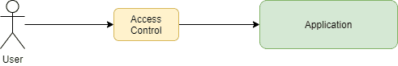
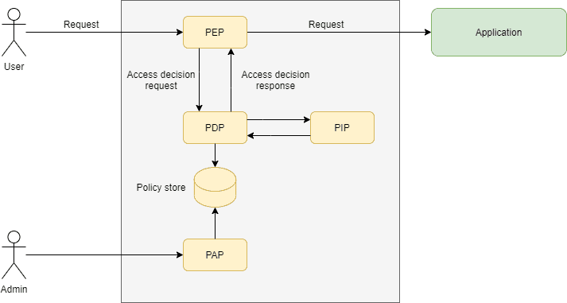
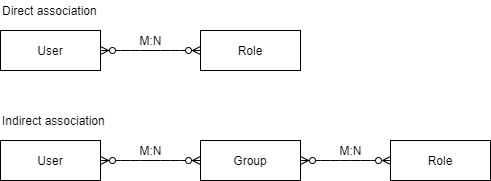
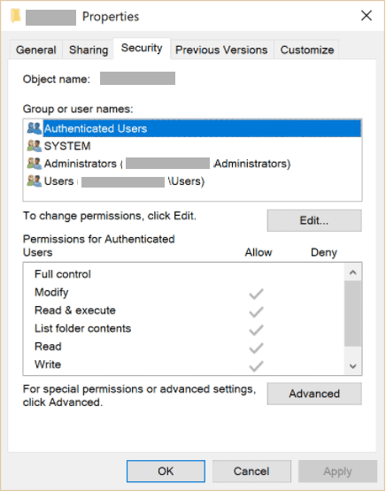

# [访问控制模型](https://www.baeldung.com/java-access-control-models)

1. 简介

    在本文中，我们将探讨如何在实践中实现不同的访问控制模型。

2. 什么是访问控制模型？

    对于应用程序（尤其是基于网络的应用程序）来说，一个常见的要求是，只有满足了一组给定的条件（也称为策略），才能执行某些操作。好吧，这是一个非常通用的要求，让我们举几个例子：

    - 互联网论坛：只有会员才能发布新信息或回复已有信息
    - 电子商务网站：普通用户只能查看自己的订单
    - 银行后台：客户经理可以管理自己客户的投资组合。除了这些投资组合外，他/她还可以管理另一个客户经理的客户的投资组合，当他/她暂时无法使用时（如休假），前者充当其同行。
    - 数字钱包：在用户所在时区的 20:00 至 08:00 期间，支付金额仅限 500 美元。

    我们将为特定应用程序采用的访问控制模型将负责评估传入的请求并做出决定：请求是否可以继续。在后一种情况下，结果通常是向用户发送一条错误信息。

    

    显然，在授权给定请求时，上述每个例子都需要采用不同的方法。

3. 访问控制模型类型

    从前面的例子中我们可以看出，要做出允许/拒绝的决定，我们需要考虑与请求相关的不同方面：

    - 与请求相关的身份。请注意，即使是匿名访问在这里也有一种身份形式
    - 请求所针对的对象/资源
    - 对这些对象/资源执行的操作
    - 请求的上下文信息。时间、时区和使用的验证方法就是这类上下文信息的例子。

    我们可以将访问控制模型分为三种类型：

    - 基于角色的访问控制（RBAC）
    - 访问控制列表（ACL）
    - 基于属性的访问控制（ABAC）

    不管是哪种类型，我们通常都能在模型中识别出以下实体：

    - PEP，即策略执行点：拦截请求，并根据 PDP 返回的结果决定是否让请求继续执行
    - PDP，即策略决策点： 使用策略评估请求，做出访问决定
    - PIP 或政策信息点： 存储和/或调解对 PDP 用来做出访问决定的信息的访问。
    - PAP 或政策管理点： 管理与访问决策相关的策略和其他操作方面。

    下图显示了这些实体之间的逻辑关系：

    

    需要注意的是，虽然被描述为自治实体，但在实践中，我们会发现部分甚至全部模型元素都嵌入了应用程序本身。

    此外，该模型并不涉及如何建立用户身份。不过，在决定是否允许继续处理请求时，可以考虑这方面的问题。

    现在，让我们来看看如何将这一通用架构应用到上述每种模型中。

4. 基于角色的访问控制

    在这种模式中，PDP 的决策过程包括两个步骤：

    - 首先，恢复与接收请求的身份相关联的角色。
    - 其次，尝试将这些角色与请求策略相匹配。

    Java EE 规范中以 @HttpConstraint 注解及其 XML 同等注解的形式给出了该模型的具体实现。这是注解应用于 Servlet 时的典型用法：

    ```java
    @WebServlet(name="rbac", urlPatterns = {"/protected"})
    @DeclareRoles("USER")
    @ServletSecurity(
    @HttpConstraint(rolesAllowed = "USER")
    )
    public class RBACController  extends HttpServlet {
        protected void doGet(HttpServletRequest req, HttpServletResponse resp) throws ServletException, IOException {
            resp.getWriter().println("Hello, USER");
        }
    }
    ```

    对于 Tomcat 服务器，我们可以确定前面描述的访问控制模型实体如下：

    - PEP：安全阀，用于检查目标 servlet 中是否存在此注解，并调用相关的 Realm 来恢复与当前请求相关的身份
    - PDP： Realm：Realm 实现，决定对给定请求应用哪些限制
    - PIP：存储安全相关信息的特定 Realm 实现所使用的任何后端。对于 RBAC 模型，关键信息是用户的角色集，通常从 LDAP 资源库中检索。
    - 策略存储： 在这种情况下，注释就是存储本身
    - PAP： Tomcat 不支持动态策略变更，因此实际上不需要。不过，只要稍加想象，我们就可以用任何用于添加注释和/或编辑应用程序 WEB-INF/web.xml 文件的工具来识别它。

    其他安全框架（如 Spring Security）的工作方式与此类似。这里的关键在于，即使某个特定框架不完全遵循我们的通用模型，其实体仍然存在，即使有些伪装。

    1. 角色定义

        究竟什么是角色？实际上，角色只是用户在特定应用程序中可以执行的相关操作的命名集合。根据应用程序的要求，可以对它们进行粗略或精细的定义。

        无论其细化程度如何，一个好的做法是对其进行定义，以便每个角色都能映射到一组互不关联的功能。这样，我们就可以通过添加/删除角色轻松管理用户配置文件，而不必担心副作用。

        至于用户与角色之间的关联，我们可以采用直接或间接的方法。前者是直接为用户分配角色。后者则有一个中间实体，通常是一个用户组，我们将角色分配给这个用户组：

        

        在这种关联中，使用组作为中间实体的好处是，我们可以很容易地同时为许多用户重新分配角色。在人员不断从一个区域流动到另一个区域的大型组织中，这一点非常重要。

        同样，间接模型还允许我们轻松更改现有的角色定义，通常是在重构应用程序之后。

5. 访问控制列表

    基于 ACL 的安全控制允许我们定义单个域对象的访问限制。这与 RBAC 不同，后者的限制通常适用于整个对象类别。在上面的论坛示例中，我们可以只使用 RBAC 方法来定义能否读取和创建新帖子。

    但是，如果我们决定创建一个新功能，让用户可以编辑自己的帖子，那么仅有 RBAC 是不够的。在这种情况下，决策引擎不仅需要考虑谁是编辑操作的目标，还需要考虑哪个帖子是编辑操作的目标。

    在这个简单的例子中，我们只需在数据库中添加一个作者列，并用它来允许或拒绝编辑操作。但如果我们想支持协作编辑呢？在这种情况下，我们需要存储一个可以编辑文章的所有人员的列表，即 ACL。

    处理 ACL 会带来一些实际问题：

    - 我们在哪里存储 ACL？
    - 在检索大型对象集合时，如何有效地应用 ACL 限制？

    [Spring Security ACL](https://docs.spring.io/spring-security/site/docs/current/reference/html5/#domain-acls) 库就是 ACL 库的一个很好的例子。它使用专用数据库模式和缓存来实现 ACL，并与 Spring Security 紧密集成。下面是从我们关于该库的文章中改编的一个简短示例，展示了如何在对象级实施访问控制：

    ```java
    @PreAuthorize("hasPermission(#postMessage, 'WRITE')")
    PostMessage save(@Param("noticeMessage")PostMessage postMessage);
    ```

    ACL 的另一个好例子是 Windows 用来保护对象安全的权限系统。每个[可保护对象](https://docs.microsoft.com/en-us/windows/win32/secauthz/securable-objects)（如文件、目录、进程等）都附有一个[安全描述符](https://docs.microsoft.com/en-us/windows/win32/secauthz/security-descriptors)，其中包含单个用户/组的列表和相关权限：

    

    Windows ACL 功能强大（或复杂，取决于我们问谁），允许管理员为单个用户和/或组分配权限。此外，单个条目还可定义每个可能操作的允许/拒绝权限。

6. 基于属性的访问控制

    基于属性的控制模型允许访问决策不仅基于身份、操作和目标对象，还基于与请求相关的上下文信息。

    [XACML](http://docs.oasis-open.org/xacml/3.0/xacml-3.0-core-spec-os-en.html) 标准可能是这种模式最著名的例子，它使用 XML 文档来描述访问策略。我们可以这样使用这一标准来描述数字钱包提取规则：

    ```xml
    <Policy xmlns="urn:oasis:names:tc:xacml:3.0:core:schema:wd-17" 
    PolicyId="urn:baeldung:atm:WithdrawalPolicy"
    Version="1.0" 
    RuleCombiningAlgId="urn:oasis:names:tc:xacml:1.0:rule-combining-algorithm:deny-overrides">
        <Target/>
        <Rule RuleId="urn:oasis:names:tc:baeldung:WithDrawalPolicy:Rule1" Effect="Deny">
            <Target>
                <AnyOf>
                    <AllOf>
    ... match rule for the withdrawal action omitted
                    </AllOf>
                </AnyOf>
            </Target>
            <Condition>
    ... time-of-day and amount conditions definitions omitted
            </Condition>
        </Rule>
    </Policy>
    ```

    完整的规则定义可[在线](https://github.com/eugenp/tutorials/tree/master/libraries-security/src/test/resources/xacml4j)查阅。

    尽管规则冗长，但不难理解其一般结构。策略包含一条或多条规则，在评估这些规则时，会产生一个结果： 允许或拒绝。

    每条规则都包含目标，目标使用请求的属性定义逻辑表达式。规则还可选择包含一个或多个条件元素，以定义其适用性。

    在运行时，基于 XACML 的访问控制 PEP 会创建一个 RequestContext 实例，并提交给 PDP 进行评估。然后，引擎会评估所有适用规则，并返回访问决定。

    该 RequestContext 中的信息种类是该模型区别于前几种模型的主要方面。让我们以 XML 表示的请求上下文为例，该请求上下文用于授权数字钱包应用中的提款：

    ```xml
    <Request 
        xmlns="urn:oasis:names:tc:xacml:3.0:core:schema:wd-17"
        CombinedDecision="true"
        ReturnPolicyIdList="false">
        
        <Attributes Category="urn:oasis:names:tc:xacml:3.0:attribute-category:action">
    ... action attributes omitted
        </Attributes>
        <Attributes Category="urn:oasis:names:tc:xacml:3.0:attribute-category:environment">
    ... environment attributes (e.g., current time) omitted
        </Attributes>
        <Attributes Category="urn:baeldung:atm:withdrawal">
    ... withdrawal attributes omitted 
        </Attributes>
    </Request>
    ```

    当我们在 21:00 将此请求提交给 XAML 规则评估引擎时，预期结果将是拒绝此取款，因为它超过了夜间交易的最大允许金额。

    ABAC 模型的主要优势在于其灵活性。我们可以定义复杂的规则，更重要的是，只需修改策略即可。根据执行情况，我们甚至可以实时执行。

    1. XACML4J

        [XACML4J](https://github.com/xacml4j-opensource/xacml4j) 是针对 Java 的 XACML 3.0 标准的开源实现。它提供了 ABAC 模型所需的评估引擎和相关实体的实现。其核心 API 是 PolicyDecisionPoint 接口，毫不奇怪，它实现了 PDP 逻辑。

        一旦我们构建了 PDP，使用它就需要两个步骤。首先，我们创建并填充一个 RequestContext，其中包含我们要评估的请求的相关信息：

        ```java
        ... attribute categories creation omitted
        RequestContext request = RequestContext.builder()
        .attributes(actionCategory,environmentCategory,atmTxCategory)
        .build();
        ```

        在这里，每个 xxxCategory 参数都包含一组相关类别的属性。完整代码使用可用的构建器创建了一个在 21:00 取款 1,200.00 美元的测试请求。或者，我们也可以直接从任何兼容 JAXB 的源创建 RequestContext 对象。

        接下来，我们将此对象传递给 PolicyDecisionPoint 服务的 decide() 方法，以便对其进行评估：

        ```java
        ResponseContext response = pdp.decide(request);
        assertTrue(response.getDecision() == Decision.DENY);
        ```

        返回的 ResponseContext 包含一个包含策略评估结果的 Decision 对象。此外，它还可能向 PEP 返回诊断信息以及附加义务和/或建议。义务和建议本身就是一个主题，因此我们不会在此涉及；更多详情请查看本介绍性[指南](https://medium.com/identity-beyond-borders/a-beginners-guide-to-xacml-6dc75b547d55)。

    2. 没有 XACML 的 ABAC

        XACML 的复杂性通常使其对大多数应用来说都是多余的。不过，我们仍然可以在应用程序中使用底层模型。毕竟，我们总能针对特定用例实现一个更简单的版本，也许只需将几个参数外部化，不是吗？

        任何经验丰富的开发人员都知道这样做的结果...

        任何 ABAC 实现的一个棘手问题是如何从请求的有效负载中提取属性。在处理请求前插入自定义逻辑的标准方法（如 servlet 过滤器或 JAX-RS 拦截器）只能访问原始有效负载数据。

        由于现代应用程序倾向于使用 JSON 或类似表示法，因此 PEP 必须先对其进行解码，然后才能提取任何有效负载属性。这意味着 CPU 和内存的使用可能会受到影响，尤其是对于大型有效载荷。

        在这种情况下，更好的方法是使用 AOP 来实现 PEP。在这种情况下，方面处理程序代码可以访问已解码的有效负载版本。

7. 结论

    在本文中，我们介绍了不同的访问控制模型，以及应用程序如何使用它们来执行访问规则。
