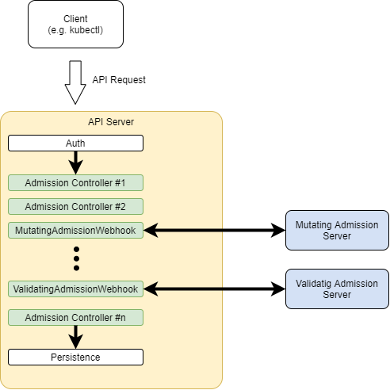

# [在Java中创建一个Kubernetes准入控制器](https://www.baeldung.com/java-kubernetes-admission-controller)

1. 简介

    在使用Kubernetes一段时间后，我们很快就会意识到有很多模板代码涉及。即使是一个简单的服务，我们也需要提供所有需要的细节，通常采取相当冗长的YAML文档的形式。

    另外，当处理部署在一个特定环境中的几个服务时，这些YAML文档往往包含很多重复的元素。例如，我们可能想在所有的部署中添加一个特定的ConfigMap或一些sidecar容器。

    在这篇文章中，我们将探讨如何坚持DRY原则，利用Kubernetes接纳控制器避免所有这些重复的代码。

2. 什么是准入控制器？

    接纳控制器是Kubernetes使用的一种机制，在API请求被验证后但被执行前对其进行预处理。

    API服务器进程（kube-apiserver）已经内置了几个控制器，每个控制器负责API处理的某个方面。

    AllwaysPullImage就是一个很好的例子： 这个接纳控制器修改了pod创建请求，因此图像拉动策略变成了 "总是"，而不考虑通知值。[Kubernetes文档](https://kubernetes.io/docs/reference/access-authn-authz/admission-controllers/#what-does-each-admission-controller-do)包含了标准接纳控制器的完整列表。

    除了这些内置的控制器（实际上是作为kubeapi-server进程的一部分运行），Kubernetes还支持外部接纳控制器。在这种情况下，接纳控制器只是一个HTTP服务，处理来自API服务器的请求。

    此外，这些外部接纳控制器可以动态地添加和删除，因此被称为动态接纳控制器。这就导致了一个处理管道看起来像这样：

    

    在这里，我们可以看到，传入的API请求一旦经过认证，就会经过每个内置的接纳控制器，直到到达持久化层。

3. 接纳控制器类型

    目前，有两种类型的接纳控制器：

    - 突变型接纳控制器
    - 验证性接纳控制器
    正如它们的名字所示，主要的区别在于它们对传入请求的处理类型。突变型控制器可以在将请求传递给下游之前对其进行修改，而验证型控制器只能对其进行验证。

    关于这些类型的一个重要观点是API服务器执行它们的顺序：先是突变型控制器，然后是验证型控制器。这是有道理的，因为只有当我们得到最终的请求时，验证才会发生，而且可能被任何一个变异控制器所改变。

    1. Admission审查请求

        内置的Admission控制器（变异和验证）使用简单的HTTP请求/响应模式与外部录取控制器通信：

        - 请求：一个AdmissionReview JSON对象，在其请求属性中包含要处理的API调用
        - 响应：一个AdmissionReview JSON对象，在其响应属性中包含结果

        下面是一个请求的例子：

        ```json
        {
        "kind": "AdmissionReview",
        "apiVersion": "admission.k8s.io/v1",
        "request": {
            "uid": "c46a6607-129d-425b-af2f-c6f87a0756da",
            "kind": {
            "group": "apps",
            "version": "v1",
            "kind": "Deployment"
            },
            "resource": {
            "group": "apps",
            "version": "v1",
            "resource": "deployments"
            },
            "requestKind": {
            "group": "apps",
            "version": "v1",
            "kind": "Deployment"
            },
            "requestResource": {
            "group": "apps",
            "version": "v1",
            "resource": "deployments"
            },
            "name": "test-deployment",
            "namespace": "test-namespace",
            "operation": "CREATE",
            "object": {
            "kind": "Deployment",
            ... deployment fields omitted
            },
            "oldObject": null,
            "dryRun": false,
            "options": {
            "kind": "CreateOptions",
            "apiVersion": "meta.k8s.io/v1"
            }
        }
        }
        ```

        在可用的字段中，有些是特别重要的：

        - operation： 这个字段告诉我们这个请求是否会创建、修改或删除一个资源
        - object： 正在处理的资源的规范细节。
        - oldObject： 当修改或删除一个资源时，这个字段包含现有的资源。
        预期的响应也是一个AdmissionReview的JSON对象，用一个响应字段代替响应：

        ```json
        {
        "apiVersion": "admission.k8s.io/v1",
        "kind": "AdmissionReview",
        "response": {
            "uid": "c46a6607-129d-425b-af2f-c6f87a0756da",
            "allowed": true,
            "patchType": "JSONPatch",
            "patch": "W3sib3A ... Base64 patch data omitted"
        }
        }
        ```

        我们来剖析一下响应对象的字段：

        - uid： 这个字段的值必须与传入的请求字段中存在的相应字段相匹配
        - allowed： 审查行动的结果。true意味着API调用处理可以进入下一步
        - patchType： 仅对变异的接纳控制器有效。表示AdmissionReview请求所返回的补丁类型
        - patch： 要在传入对象中应用的补丁。
    2. 补丁数据

        在变异接纳控制器的响应中出现的补丁字段告诉API服务器在请求继续进行之前需要改变什么。它的值是一个Base64编码的[JSONPatch](https://www.baeldung.com/spring-rest-json-patch)对象，包含API服务器用来修改传入的API调用正文的指令数组：

        ```json
        [
        {
            "op": "add",
            "path": "/spec/template/spec/volumes/-",
            "value":{
            "name": "migration-data",
            "emptyDir": {}
            }
        }
        ]
        ```

        在这个例子中，我们有一个单一的指令，将一个卷添加到部署规范的卷数组中。在处理补丁时，一个常见的问题是，没有办法将一个元素添加到一个现有的数组中，除非它已经存在于原始对象中。在处理Kubernetes API对象时，这一点特别令人讨厌，因为最常见的对象（如部署）包括可选数组。

        例如，前面的例子只有在传入的部署已经有至少一个卷时才有效。如果不是这种情况，我们就必须使用一个稍微不同的指令：

        ```json
        [
        {
            "op": "add",
            "path": "/spec/template/spec/volumes",
            "value": [{
            "name": "migration-data",
            "emptyDir": {}
            }]
        }
        ]
        ```

        在这里，我们定义了一个新的卷字段，其值是一个包含卷定义的数组。以前，这个值是一个对象，因为这就是我们要追加到现有数组中的东西。

4. 使用案例示例：Wait-For-It

    现在我们对接纳控制器的预期行为有了基本了解，让我们写一个简单的例子。在Kubernetes中，一个常见的问题是管理运行时的依赖关系，特别是在使用微服务架构时。例如，如果一个特定的微服务需要访问数据库，如果前者是离线的，就没有必要启动。

    为了解决这样的问题，我们可以在我们的pod中使用initContainer，在启动主容器之前做这个检查。一个简单的方法是使用流行的[wait-for-it](https://github.com/vishnubob/wait-for-it) shell脚本，也可以作为[docker镜像使用](https://hub.docker.com/r/willwill/wait-for-it/)。

    该脚本需要一个主机名和端口参数，并尝试连接到它。如果测试成功，容器将以成功的状态代码退出，并继续进行pod初始化。否则，它将失败，相关的控制器将根据定义的策略继续重试。将这个飞行前检查外部化的好处是，任何相关的Kubernetes服务都会注意到这一失败。因此，不会有请求被发送到它那里，可能会提高整体的弹性。

    1. 接纳控制器的案例

        这是一个典型的部署，其中加入了wait-for-it init容器：

        ```yml
        apiVersion: apps/v1
        kind: Deployment
        metadata:
        name: frontend
        labels:
            app: nginx
        spec:
        replicas: 1
        selector:
            matchLabels:
            app: nginx
        template:
            metadata:
            labels:
                app: nginx
            spec:
            initContainers:
            - name: wait-backend
                image: willwill/wait-for-it
                args:
                - www.google.com:80
            containers: 
            - name: nginx 
                image: nginx:1.14.2 
                ports: 
                - containerPort: 80
        ```

        虽然没有那么复杂（至少在这个简单的例子中），但在每个部署中添加相关代码有一些缺点。特别是，我们把指定依赖性检查的确切方式的负担强加给了部署作者。相反，更好的体验只需要定义什么应该被测试。

        进入我们的接纳控制器。为了解决这个用例，我们将编写一个突变的接纳控制器，寻找资源中是否存在特定的注解，如果存在，就将initContainer添加到其中。这就是带注解的部署规范的样子：

        ```yml
        apiVersion: apps/v1 
        kind: Deployment 
        metadata: 
        name: frontend 
        labels: 
            app: nginx 
        annotations:
            com.baeldung/wait-for-it: "www.google.com:80"
        spec: 
        replicas: 1 
        selector: 
            matchLabels: 
            app: nginx 
        template: 
            metadata: 
            labels: 
                app: nginx 
            spec: 
            containers:
            - name: nginx
                image: nginx:1.14.2
                ports:
                - containerPort: 80
        ```

        在这里，我们使用注解com.baeldung/wait-for-it来表示我们必须测试的主机和端口。但重要的是，没有任何东西告诉我们应该如何进行测试。在理论上，我们可以以任何方式改变测试，同时保持部署规范不变。

        现在，让我们继续讨论实现问题。

    2. 项目结构

        如前所述，外部接纳控制器只是一个简单的HTTP服务。因此，我们将创建一个Spring Boot项目作为我们的基本结构。在这个例子中，我们只需要[Spring Web Reactive](https://www.baeldung.com/spring-reactive-guide)启动器，但对于现实世界的应用来说，增加[Actuator](https://www.baeldung.com/spring-boot-actuators)和/或一些[Cloud Config](https://www.baeldung.com/spring-cloud-configuration)的依赖性等功能可能也是有用的。

    3. 处理请求

        接收请求的入口是一个简单的Spring REST控制器，它将传入的有效载荷的处理委托给一个服务：

        ```java
        @RestController
        @RequiredArgsConstructor
        public class AdmissionReviewController {
            private final AdmissionService admissionService;
            @PostMapping(path = "/mutate")
            public Mono<AdmissionReviewResponse> processAdmissionReviewRequest(@RequestBody Mono<ObjectNode> request) {
                return request.map((body) -> admissionService.processAdmission(body));
            }
        }
        ```

        这里，我们使用一个ObjectNode作为输入参数。这意味着我们将尝试处理API服务器发送的任何格式良好的JSON。这种宽松的方法的原因是，截至本文写作时，仍然没有为这种有效载荷发布官方模式。在这种情况下，使用非结构化类型意味着一些额外的工作，但确保我们的实现能够更好地处理特定的Kubernetes实现或版本决定扔给我们的任何额外字段。

        另外，考虑到请求对象可以是Kubernetes API中的任何可用资源，在这里添加太多的结构不会有什么帮助。

    4. 修改接纳请求

        主要的处理过程发生在AdmissionService类中。这是一个注入控制器的@Component类，有一个公共方法：processAdmission。这个方法处理传入的审查请求并返回适当的响应。

        完整的代码可以在网上找到，基本上由一长串的JSON操作组成。其中大部分是微不足道的，但有些摘录值得解释一下：

        ```java
        if (admissionControllerProperties.isDisabled()) {
            data = createSimpleAllowedReview(body);
        } else if (annotations.isMissingNode()) {
            data = createSimpleAllowedReview(body);
        } else {
            data = processAnnotations(body, annotations);
        }
        ```

        首先，为什么要添加一个 "disabled" 属性？嗯，事实证明，在一些高度控制的环境中，改变一个现有部署的配置参数可能比删除and/or更新它要容易得多。由于我们使用[@ConfigurationProperties机制](https://www.baeldung.com/configuration-properties-in-spring-boot)来填充这个属性，它的实际值可以来自各种来源。

        接下来，我们测试是否有缺失的注释，我们将把它视为我们应该保持部署不变的标志。这种方法确保了我们在这种情况下想要的 "opt-in" 行为。

        另一个有趣的片段来自 injectInitContainer() 方法中的JSONPatch生成逻辑：

        ```java
        JsonNode maybeInitContainers = originalSpec.path("initContainers");
        ArrayNode initContainers = 
        maybeInitContainers.isMissingNode() ?
        om.createArrayNode() : (ArrayNode) maybeInitContainers;
        ArrayNode patchArray = om.createArrayNode();
        ObjectNode addNode = patchArray.addObject();
        addNode.put("op", "add");
        addNode.put("path", "/spec/template/spec/initContainers");
        ArrayNode values = addNode.putArray("values");
        values.addAll(initContainers);
        ```

        由于不能保证传入的规范包含initContainers字段，我们必须处理两种情况：它们可能缺失或存在。如果缺失，我们使用ObjectMapper实例（上面片段中的om）来创建一个新的ArrayNode。否则，我们就使用传入的数组。

        在这样做的时候，我们可以使用一个 "add" 补丁指令。尽管它的名字，它的行为是这样的：字段要么被创建，要么替换现有的同名字段。值字段总是一个数组，其中包括（可能是空的）原始initContainers数组。最后一步是添加实际的候补容器：

        ```java
        ObjectNode wfi = values.addObject();
        wfi.put("name", "wait-for-it-" + UUID.randomUUID())
        // ... additional container fields added (omitted)
        ```

        由于容器名称在pod内必须是唯一的，我们只是在一个固定的前缀上添加一个随机的UUID。这就避免了与现有的容器发生任何名称冲突。

    5. 部署

        开始使用我们的接纳控制器的最后一步是将其部署到目标Kubernetes集群上。正如预期的那样，这需要写一些YAML或者使用[Terraform](https://www.baeldung.com/ops/terraform-intro)这样的工具。不管怎样，这些都是我们需要创建的资源：

        - 一个部署来运行我们的接纳控制器。这是一个好主意，可以为这个服务提供一个以上的副本，因为失败可能会阻止任何新的部署发生。
        - 一个服务，将API服务器的请求路由到运行接纳控制器的可用pod上。
        - 一个MutatingWebhookConfiguration资源，描述了哪些API调用应该被路由到我们的服务。
        例如，假设我们希望Kubernetes在每次创建或更新部署时使用我们的接纳控制器。在MutatingWebhookConfiguration文档中，我们会看到这样的规则定义：

        ```yml
        apiVersion: admissionregistration.k8s.io/v1
        kind: MutatingWebhookConfiguration
        metadata:
        name: "wait-for-it.baeldung.com"
        webhooks:
        - name: "wait-for-it.baeldung.com"
        rules:
        - apiGroups:   ["*"]
            apiVersions: ["*"]
            operations:  ["CREATE","UPDATE"]
            resources:   ["deployments"]
        ... other fields omitted
        ```

        关于我们的服务器，有一点很重要： Kubernetes需要HTTPS来与外部接纳控制器通信。这意味着我们需要为我们的SpringBoot服务器提供一个合适的证书和私钥。请查看用于部署样本接纳控制器的Terraform脚本，看看有什么方法可以做到这一点。

        另外，一个简单的提示：虽然文档中没有提到，但一些Kubernetes实施方案（如GCP）要求使用443端口，所以我们需要改变SpringBoot HTTPS端口的默认值（8443）。

    6. 测试

        一旦我们准备好了部署工件，现在终于可以在现有的集群中测试我们的接纳控制器了。在我们的案例中，我们使用Terraform来执行部署，所以我们所要做的只是一个应用：

        `$ terraform apply -auto-approve`

        一旦完成，我们可以使用kubectl检查部署和接纳控制器的状态：

        ```bash
        $ kubectl get mutatingwebhookconfigurations
        NAME                               WEBHOOKS   AGE
        wait-for-it-admission-controller   1          58s
        $ kubectl get deployments wait-for-it-admission-controller         
        NAME                               READY   UP-TO-DATE   AVAILABLE   AGE
        wait-for-it-admission-controller   1/1     1            1           10m
        ```

        现在，让我们创建一个简单的nginx部署，包括我们的注释：

        ```bash
        $ kubectl apply -f nginx.yaml
        deployment.apps/frontend created
        ```

        我们可以检查相关的日志，看是否确实注入了wait-for-it init容器：

        ```bash
        $ kubectl logs --since=1h --all-containers deployment/frontend
        wait-for-it.sh: waiting 15 seconds for www.google.com:80
        wait-for-it.sh: www.google.com:80 is available after 0 seconds
        ```

        为确定起见，让我们检查一下部署的YAML：

        ```bash
        $ kubectl get deployment/frontend -o yaml
        apiVersion: apps/v1
        kind: Deployment
        metadata:
        annotations:
            com.baeldung/wait-for-it: www.google.com:80
            deployment.kubernetes.io/revision: "1"
                ... fields omitted
        spec:
        ... fields omitted
        template:
            ... metadata omitted
            spec:
            containers:
            - image: nginx:1.14.2
                name: nginx
                    ... some fields omitted
            initContainers:
            - args:
                - www.google.com:80
                image: willwill/wait-for-it
                imagePullPolicy: Always
                name: wait-for-it-b86c1ced-71cf-4607-b22b-acb33a548bb2
            ... fields omitted
            ... fields omitted
        status:
        ... status fields omitted
        ```

        这个输出显示了我们的接纳控制器添加到部署中的initContainer。

5. 总结

    在这篇文章中，我们已经介绍了如何在Java中创建一个Kubernetes接纳控制器，并将其部署到现有集群中。
