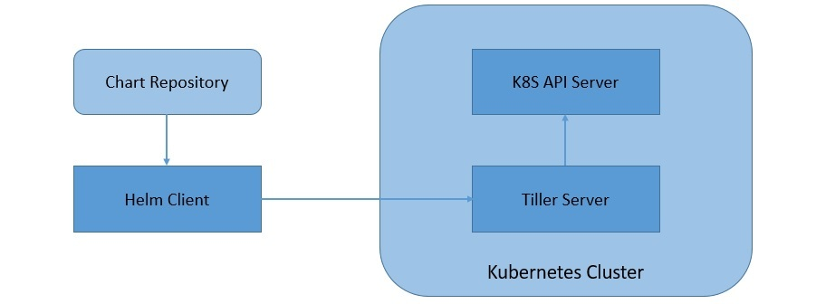
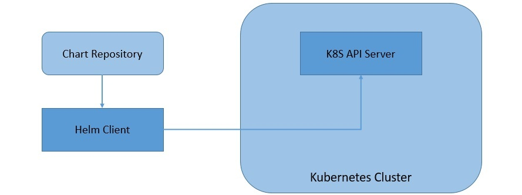

# 使用Helm和Kubernetes

1. 概述

    [Helm](https://helm.sh/)是一个用于Kubernetes应用程序的包管理器。在本教程中，我们将了解Helm的基础知识，以及它们如何形成一个强大的工具来处理Kubernetes资源。

    在过去的几年里，Kubernetes得到了巨大的发展，支持它的生态系统也在不断壮大。最近，Helm被云原生计算基金会（CNCF）授予毕业资格，这表明它在Kubernetes用户中越来越受欢迎。

2. 背景

    虽然这些术语现在相当普遍，特别是在那些从事云技术工作的人中，但让我们为不了解的人快速浏览一下：

    - [Container](https://www.docker.com/resources/what-container)： 容器是指操作系统级的虚拟化。多个容器在一个操作系统中运行，处于隔离的用户空间。在一个容器内运行的程序只能访问分配给该容器的资源。
    - Docker： Docker是一个创建和运行容器的流行程序。它带有Docker Daemon，它是管理容器的主要程序。Docker Daemon通过Docker Engine API提供对其功能的访问，Docker Command-Line Interface（CLI）使用该API。关于Docker的更详细描述，请参考这篇[文章](https://www.baeldung.com/dockerizing-spring-boot-application)。
    - Kubernetes： Kubernetes是一个流行的容器编排程序。尽管它被设计为与不同的容器一起工作，但Docker是最常用的。它提供了广泛的功能选择，包括跨主机集群的部署自动化、扩展和操作。在这篇[文章](https://www.baeldung.com/kubernetes)中对Kubernetes有很好的介绍，可以进一步参考。
3. Helm架构

    作为Helm 3的一部分，Helm经历了一次重大的架构提升。与Helm 2相比，它有一些人们期待已久的重大变化。除了包含一系列新的功能外，Helm 3还对其内部管道进行了修改。我们将研究其中的一些变化。

    Helm 2主要采用客户端-服务器架构，由一个客户端和一个集群内的服务器组成：

    

    - Tiller服务器： Helm通过安装在Kubernetes集群内的Tiller服务器管理Kubernetes应用。Tiller与Kubernetes API服务器互动，安装、升级、查询和删除Kubernetes资源。
    - Helm客户端： Helm为用户提供了一个命令行界面，用于处理Helm图表。它负责与Tiller服务器互动，执行各种操作，如安装、升级和回滚图表。
    Helm 3已经转为完全的纯客户端架构，其中集群内的服务器已经被移除：

    
    正如我们所见，Helm 3的客户端工作原理基本相同，但直接与Kubernetes API服务器而不是Tiller服务器互动。此举简化了Helm的架构，使其能够利用Kubernetes用户集群的安全性。

4. Helm图表、发布和存储库

    Helm通过Charts管理Kubernetes资源包。Charts基本上是Helm的打包格式。与Helm 2相比，作为Helm 3的一部分，Charts基础设施也有了一些变化。

    我们将看到更多关于Charts和Helm 3的变化，因为我们很快就会创建这些Charts。但现在，Charts只不过是在Kubernetes集群中创建Kubernetes应用程序所需的一组信息：

    - Chart是在一个特定的目录结构中组织的文件集合
    - 与chart相关的配置信息是在配置中管理的
    - 最后，一个具有特定配置的chart的运行实例被称为发布。
    Helm 3还引入了图表库(library charts)的概念。基本上，图表库实现了对常用图表的支持，我们可以用它来定义图表基元或定义。这有助于共享代码片段，我们可以在图表之间重复使用。

    Helm使用发布版追踪Kubernetes集群中安装的图表。这使得我们可以在集群中用不同的版本多次安装一个图表。在Helm 2之前，版本被存储为Tiller命名空间下集群中的ConfigMaps或Secrets。从Helm 3开始，发布版本默认为Secrets，直接存储在发布版本的命名空间中。

    最后，我们可以通过存储库将图表作为档案共享。它基本上是一个可以存储和共享软件包图表的位置。有一个名为[Artifact Hub](https://artifacthub.io/)的分布式社区图表库，我们可以在那里进行合作。我们还可以创建我们自己的私人图表库。我们可以添加任何数量的图表库来工作。

5. 先决条件

    在开发我们的第一个Helm图表之前，我们需要先设置一些东西。

    首先，为了开始使用Helm，我们需要一个Kubernetes集群。在本教程中，我们将使用Minikube，它为在本地使用单节点的Kubernetes集群提供了一个很好的方法。在Windows上，现在可以使用Hyper-V作为本地管理程序来运行Minikube。请参考这篇[文章](https://www.baeldung.com/spring-boot-minikube)，更详细地了解Minikube的设置。

    通常建议安装[Helm支持](https://helm.sh/docs/topics/version_skew/)的最兼容的Kubernetes版本。我们还应该安装和配置Kubernetes命令行工具kubectl，使我们能够有效地与我们的集群工作。

    而且，我们还需要一个基本的应用程序来管理Kubernetes集群。在本教程中，我们将使用一个简单的Spring Boot应用程序，它被打包成一个Docker容器。关于如何将这样一个应用程序打包成Docker容器的更详细描述，请参考这篇[文章](https://www.baeldung.com/dockerizing-spring-boot-application#Dockerize)。

6. 安装Helm

    有几种安装Helm的方法，在Helm的官方[安装页面](https://helm.sh/docs/intro/install/)上都有整齐的描述。在Windows上安装Helm最快捷的方法是使用[Chocolaty](https://chocolatey.org/)，这是一个针对Windows平台的软件包管理器。

    使用Chocolaty，只需一个简单的单行命令就可以安装Helm：

    `choco install kubernetes-helm`

    这就在本地安装了Helm客户端。这也为我们提供了Helm命令行工具，我们将在本教程中使用该工具来操作Helm。

    在进行下一步之前，我们应该确保Kubernetes集群正在运行，并且可以使用kubectl命令访问：

    `kubectl cluster-info`

    现在，在Helm 2之前，还需要初始化Helm。这实际上是在Kubernetes集群上安装Tiller服务器并设置Helm状态。我们可以通过Helm CLI使用以下命令初始化Helm：

    `helm init`

    但是，从Helm 3开始，由于不再有Tiller服务器，就没有必要初始化Helm了。事实上，这个命令已经被删除。因此，在需要时，会自动创建Helm状态。

7. 开发我们的第一个图表

    现在我们准备用模板和数值开发我们的第一个Helm图表。我们将使用之前安装的Helm CLI来执行一些与图表相关的常见活动。

    1. 创建一个图表

        第一步当然是创建一个有指定名称的新图表：

        `helm create hello-world`

        请注意，这里提供的图表名称将是创建和存储该图表的目录名称。

        让我们快速看看为我们创建的目录结构：

        ```txt
        hello-world /
        Chart.yaml
        values.yaml
        templates /
        charts /
        .helmignore
        ```

        让我们了解一下为我们创建的这些文件和文件夹的相关性：

        - Chart.yaml： 这是包含我们图表描述的主要文件
        - values.yaml：这是包含我们图表的默认值的文件
        - templates： 这是Kubernetes资源被定义为模板的目录
        - charts： 这是一个可选的目录，可能包含子图表
        - .helmignore： 这是我们可以定义打包时要忽略的模式（与.gitignore的概念相似）
    2. 创建模板

        如果我们看到模板目录里面，我们会注意到，已经为我们创建了一些常见的Kubernetes资源的模板：

        ```txt
        hello-world /
        templates /
            deployment.yaml
            service.yaml
            ingress.yaml
            ......
        ```

        在我们的应用程序中，我们可能需要其中的一些资源，也可能需要其他资源，我们必须自己创建模板。

        在本教程中，我们将创建一个部署和服务来公开该部署。请注意，这里的重点不是要详细了解Kubernetes。因此，我们将尽可能地保持这些资源的简单。

        让我们编辑模板目录下的deployment.yaml文件，使其看起来像：

        ```yml
        apiVersion: apps/v1
        kind: Deployment
        metadata:
        name: {{ include "hello-world.fullname" . }}
        labels:
            app.kubernetes.io/name: {{ include "hello-world.name" . }}
            helm.sh/chart: {{ include "hello-world.chart" . }}
            app.kubernetes.io/instance: {{ .Release.Name }}
            app.kubernetes.io/managed-by: {{ .Release.Service }}
        spec:
        replicas: {{ .Values.replicaCount }}
        selector:
            matchLabels:
            app.kubernetes.io/name: {{ include "hello-world.name" . }}
            app.kubernetes.io/instance: {{ .Release.Name }}
        template:
            metadata:
            labels:
                app.kubernetes.io/name: {{ include "hello-world.name" . }}
                app.kubernetes.io/instance: {{ .Release.Name }}
            spec:
            containers:
                - name: {{ .Chart.Name }}
                image: "{{ .Values.image.repository }}:{{ .Values.image.tag }}"
                imagePullPolicy: {{ .Values.image.pullPolicy }}
                ports:
                    - name: http
                    containerPort: 8080
                    protocol: TCP
        ```

        同样地，让我们编辑service.yaml文件，使其看起来像：

        ```yml
        apiVersion: v1
        kind: Service
        metadata:
        name: {{ include "hello-world.fullname" . }}
        labels:
            app.kubernetes.io/name: {{ include "hello-world.name" . }}
            helm.sh/chart: {{ include "hello-world.chart" . }}
            app.kubernetes.io/instance: {{ .Release.Name }}
            app.kubernetes.io/managed-by: {{ .Release.Service }}
        spec:
        type: {{ .Values.service.type }}
        ports:
            - port: {{ .Values.service.port }}
            targetPort: http
            protocol: TCP
            name: http
        selector:
            app.kubernetes.io/name: {{ include "hello-world.name" . }}
            app.kubernetes.io/instance: {{ .Release.Name }}
        ```

        现在，根据我们对Kubernetes的了解，这些模板文件看起来很熟悉，除了一些奇怪的地方。请注意双括号内文本的自由使用`{{}}`。这就是所谓的模板指令。

        Helm利用Go的模板语言，并将其扩展为称为Helm模板语言的东西。在评估过程中，模板目录内的每个文件都会提交给模板渲染引擎。这就是模板指令将实际值注入模板的地方。

    3. 提供值

        在前面的小节中，我们看到了如何在我们的模板中使用模板指令。现在，让我们了解一下我们如何向模板渲染引擎传递数值。我们通常通过Helm中的内置对象来传递数值。

        Helm中有很多这样的对象，比如Release, Values, Chart, 和Files。

        我们可以在图表中使用values.yaml文件，通过内置对象Values将数值传递给模板渲染引擎。让我们把values.yaml修改成这样：

        ```yml
        replicaCount: 1
        image:
            repository: "hello-world"
            tag: "1.0"
            pullPolicy: IfNotPresent
        service:
            type: NodePort
            port: 80
        ```

        然而，请注意这些值是如何在模板中使用点来分隔命名空间的。我们使用了 "hello-world" 和 "1.0" 的镜像仓库和标签，这必须与我们为Spring Boot应用程序创建的docker镜像标签相匹配。

8. 管理图表

    到目前为止，一切都完成了，我们现在准备玩玩我们的图表了。让我们看看Helm CLI里有哪些不同的命令可以让我们玩得更开心! 请注意，我们将只介绍Helm中的一些可用命令。

    1. Helm Lint

        首先，这是一个简单的命令，它获取图表的路径并运行一系列测试，以确保图表的格式良好：

        ```bash
        helm lint ./hello-world
        ==> Linting ./hello-world
        1 chart(s) linted, no failures
        ```

        输出显示了它所识别的问题的linting结果。

    2. Helm模板

        另外，我们还有这个命令来在本地渲染模板，以便快速反馈：

        `helm template ./hello-world`

        请注意，这个命令伪造了原本预计在集群中检索到的值。

    3. Helm安装

        一旦我们验证了图表没有问题，最后，我们可以运行这个命令将图表安装到Kubernetes集群中：

        `helm install --name hello-world ./hello-world`

        这个命令还提供了几个选项来覆盖图表中的值。注意，我们已经用标志-name命名了这个图表的发布。该命令响应的是在这个过程中创建的Kubernetes资源的摘要。

    4. Helm获取

        现在，我们想看看哪些图表是作为什么版本安装的。这个命令可以让我们查询命名的版本：

        `helm ls --all`

        这个命令有几个子命令可以用来获取扩展信息。这些命令包括全部、钩子、清单、注释和值。

    5. Helm升级

        如果我们修改了我们的图表，需要安装更新的版本怎么办？这个命令可以帮助我们将一个版本升级到指定或当前版本的图表或配置：

        `helm upgrade hello-world ./hello-world`

        请注意，在Helm 3中，发布升级使用了一个三方战略合并补丁。这里，它在生成补丁时考虑了旧的清单、集群的实时状态和新的清单。Helm 2使用的是双向战略合并补丁，它抛弃了应用于Helm之外的集群的变化。

    6. Helm回滚

        总是会发生这样的情况：一个版本出了问题，需要收回来。这个命令可以将一个版本回滚到以前的版本：

        `helm rollback hello-world 1`

        我们可以指定一个特定的版本来回滚，也可以把这个参数留空，在这种情况下会回滚到以前的版本。

    7. Helm卸载

        尽管不太可能，我们可能想完全卸载一个版本。我们可以使用这个命令从Kubernetes卸载一个版本：

        `helm uninstall hello-world`

        它可以删除所有与上次发布的图表和发布历史相关的资源。

9. 分发图表

    虽然模板化是Helm为管理Kubernetes资源世界带来的强大工具，但这并不是使用Helm的唯一好处。正如我们在上一节中看到的，Helm作为Kubernetes应用的包管理器，使安装、查询、升级和删除版本的工作变得相当无缝。

    除此之外，我们还可以使用Helm将Kubernetes应用打包、发布，并以图表存档的方式获取。我们也可以为此使用Helm CLI，因为它提供了几个命令来执行这些活动。和以前一样，我们不会涵盖所有可用的命令。

    1. Helm打包

        首先，我们需要打包我们所创建的图表，以便能够分发它们。这是创建图表的版本存档文件的命令：

        `helm package ./hello-world`

        请注意，它在我们的机器上产生了一个存档，我们可以手动或通过公共或私人图表库分发。我们还有一个选项可以对图表存档进行签名。

    2. Helm Repo

        最后，我们需要一个机制来与共享资源库协作。在这个命令中，有几个子命令可用，我们可以用来添加、删除、更新、列出或索引图表资源库。让我们来看看我们如何使用它们。

        我们可以创建一个git仓库，用它来作为我们的图表仓库。唯一的要求是，它应该有一个index.yaml文件。

        我们可以为我们的图表仓库创建index.yaml：

        `helm repo index my-repo/ --url https://<username>.github.io/my-repo`

        这样就生成了index.yaml文件，我们应该把它和图表档案一起推送到版本库中。

        在成功创建图表仓库后，随后，我们可以远程添加这个 repo：

        `helm repo add my-repo https://my-pages.github.io/my-repo`

        现在，我们应该可以直接从我们的版本库中安装图表了：

        `helm install my-repo/hello-world --name=hello-world`

        有几个命令可以用来处理图表库。

    3. Helm搜索

        最后，我们应该在图表中搜索一个关键词，这个关键词可以存在于任何公共或私人图表库中。

        `helm search repo <KEYWORD>`

        这个命令有一些子命令可用，允许我们搜索不同位置的图表。例如，我们可以在Artifact Hub或我们自己的存储库中搜索图表。此外，我们可以在我们配置的所有资源库中的图表中搜索一个关键词。

10. 从Helm 2迁移到Helm 3

    由于Helm已经使用了一段时间，很明显，我们可以怀疑Helm 2的未来与作为Helm 3一部分的重大变化。虽然如果我们要从新开始，最好从Helm 3开始，但在不久的将来，Helm 3将继续支持Helm 2。虽然，有一些注意事项，因此必须做出必要的调整。

    一些需要注意的重要变化包括：Helm 3不再自动生成发布名称。然而，我们已经有了必要的标志，我们可以用它来生成发布名称。此外，命名空间不再是在创建版本时创建的。我们应该提前创建命名空间。

    但是，对于使用Helm 2并希望迁移到Helm 3的项目，有几个选择。首先，我们可以使用Helm 2和Helm 3来管理同一个集群，慢慢地耗尽Helm 2的版本，同时使用Helm 3来发布新版本。另外，我们也可以决定用Helm 3来管理Helm 2的发布。虽然这可能很麻烦，但Helm提供了一个[插件](https://github.com/helm/helm-2to3)来处理这种类型的迁移。

11. 总结

    总而言之，在本教程中，我们讨论了Helm的核心组件，它是Kubernetes应用程序的一个包管理器。我们了解了安装Helm的选项。此外，我们经历了创建一个样本图表和带有数值的模板。

    然后，我们经历了作为Helm CLI一部分的多个命令，以管理作为Helm包的Kubernetes应用。最后，我们讨论了通过存储库分发Helm包的选项。在这个过程中，我们看到了作为Helm 3的一部分，与Helm 2相比所做的改变。

## Relevant Articles

- [ ] [Using Helm and Kubernetes](https://www.baeldung.com/ops/kubernetes-helm)
