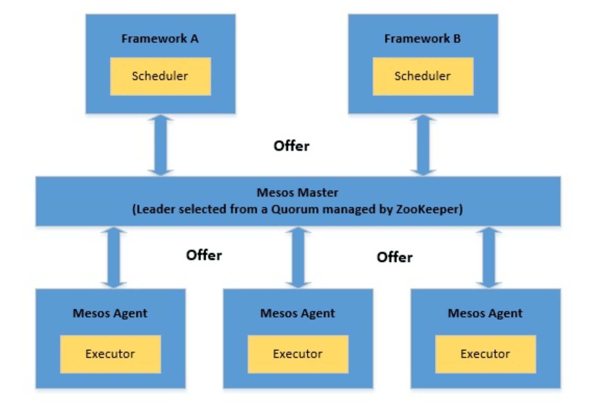
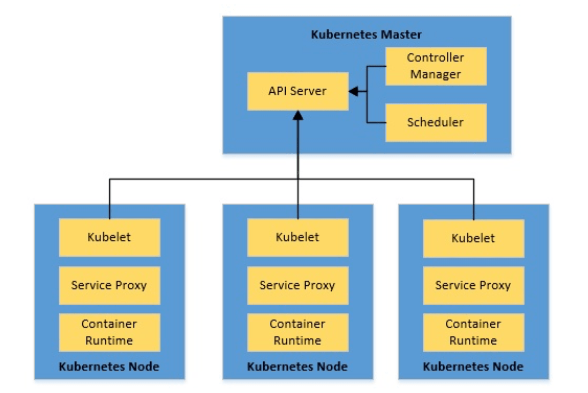

# Mesos vs. Kubernetes

1. 概述

    在本教程中，我们将了解对容器编排系统的基本需求。

    我们将评估这种系统的理想特性。由此，我们将尝试比较当今最流行的两个容器编排系统，[Apache Mesos](http://mesos.apache.org/)和Kubernetes。

2. 容器编排

    在我们开始比较Mesos和Kubernetes之前，让我们花一些时间来了解什么是容器，以及为什么我们需要容器协调。

    1. 容器

        容器是一个标准化的软件单元，它将代码和所有必要的依赖关系打包。

        因此，它提供了平台独立性和操作简单性。Docker是目前最流行的容器平台之一。

        Docker利用Linux内核功能，如CG组和命名空间来提供不同进程的隔离。因此，多个容器可以独立和安全地运行。

        创建Docker镜像非常简单，我们所需要的只是一个Docker文件：

        ```dockerfile
        FROM openjdk:8-jdk-alpine
        VOLUME /tmp
        COPY target/hello-world-0.0.1-SNAPSHOT.jar app.jar
        ENTRYPOINT ["java","-jar","/app.jar"]
        EXPOSE 9001
        ```

        因此，这几行字足以使用Docker CLI创建一个Spring Boot应用程序的Docker镜像：

        `docker build -t hello_world .`

    2. 容器编排Orchestration

        所以，我们已经看到了容器如何使应用程序的部署变得可靠和可重复。但为什么我们需要容器协调呢？

        现在，虽然我们有一些容器需要管理，但我们用Docker CLI就可以了。我们也可以将一些简单的杂事自动化。但是当我们要管理成百上千的容器时，会发生什么？

        例如，想想有几个微服务的架构，都有不同的可扩展性和可用性要求。

        因此，事情很快就会失去控制，而这正是容器协调系统的好处所在。容器协调系统将具有多容器应用程序的机器集群视为一个单一的部署实体。它提供了从初始部署、调度、更新到其他功能的自动化，如监控、扩展和故障转移。

3. Mesos的简要概述

    Apache Mesos是一个开源的集群管理器，最初由UC Berkeley开发。它为应用程序提供了跨集群的资源管理和调度的API。Mesos使我们能够灵活地以分布式方式运行容器化和非容器化的工作负载。

    1. 架构

        Mesos架构由Mesos Master、Mesos Agent和应用框架组成：

        
        让我们在这里了解一下架构的组成部分：

        - Frameworks 框架： 这些是需要分布式执行任务或工作负载的实际应用。典型的例子是Hadoop或[Storm](https://www.baeldung.com/apache-storm)。Mesos的框架由两个主要部分组成：
          - Scheduler 调度器： 它负责向主节点注册，以便主节点可以开始提供资源。
          - Executor 执行器： 这是在代理节点上启动的进程，以运行框架的任务。
        - Mesos Agents： 这些代理负责实际运行任务。每个代理将其可用的资源如CPU和内存公布给主站。在收到来自主站的任务时，它们将所需的资源分配给框架的执行者。
        - Mesos Master： 它负责在一个可用的代理节点上调度从框架中收到的任务。主站向框架提供资源。框架的调度器可以选择在这些可用资源上运行任务。
    2. Marathon马拉松

        正如我们刚刚看到的，Mesos相当灵活，允许[框架通过定义好的API来调度和执行任务](https://www.baeldung.com/apache-mesos)。然而，直接实现这些基元并不方便，特别是当我们想要调度自定义应用程序时。例如，协调打包成容器的应用程序。

        这就是像[马拉松](https://mesosphere.github.io/marathon/)这样的框架可以帮助我们的地方。Marathon是一个运行在Mesos上的容器编排框架。在这方面，马拉松充当了Mesos集群的一个框架。Marathon提供了几个我们通常期望从协调平台获得的好处，如服务发现、负载平衡、指标和容器管理API。

        Marathon将一个长期运行的服务视为一个应用程序，将一个应用程序实例视为一个任务。一个典型的场景可以有多个具有依赖性的应用，形成所谓的[应用组](https://mesosphere.github.io/marathon/docs/application-groups.html)。

    3. 例子

        那么，让我们看看如何使用马拉松来部署我们之前创建的简单Docker镜像。请注意，安装一个Mesos集群可能会有一些麻烦，因此我们可以使用一个更直接的解决方案，比如[Mesos Mini](http://mesos.apache.org/blog/mesos-mini/)。Mesos Mini使我们能够在Docker环境中启动一个本地Mesos集群。它包括一个Mesos主站、单个Mesos代理和马拉松。

        一旦我们把Mesos集群和马拉松启动并运行，我们就可以把我们的容器部署成一个长期运行的应用服务。我们只需要一个小的JSON应用定义：

        ```json
        #hello-marathon.json
        {
        "id": "marathon-demo-application",
        "cpus": 1,
        "mem": 128,
        "disk": 0,
        "instances": 1,
        "container": {
            "type": "DOCKER",
            "docker": {
            "image": "hello_world:latest",
            "portMappings": [
                { "containerPort": 9001, "hostPort": 0 }
            ]
            }
        },
        "networks": [
            {
            "mode": "host"
            }
        ]
        }
        ```

        让我们了解一下这里到底发生了什么：

        - 我们已经为我们的应用程序提供了一个ID
        - 然后，我们定义了我们的应用程序的资源需求
        - 我们还定义了我们想要运行的实例的数量
        - 然后，我们提供了启动应用程序的容器细节
        - 最后，我们定义了网络模式，以便我们能够访问该应用程序。
        我们可以使用马拉松提供的REST APIs来启动这个应用程序：

        ```bash
        curl -X POST \
        http://localhost:8080/v2/apps \
        -d @hello-marathon.json \
        -H "Content-type: application/json"
        ```

4. Kubernetes的简要概述

    Kubernetes是一个开源的容器编排系统，最初由谷歌开发。它现在是云原生计算基金会（[CNCF](https://www.cncf.io/)）的一部分。它提供了一个平台，用于自动部署、扩展和操作跨主机集群的应用容器。

    1. 架构

        Kubernetes架构由Kubernetes Master和Kubernetes Nodes组成：

        
        让我们来看看这个高层架构的主要部分：

        - Kubernetes Master： 主站负责维护集群的理想状态。它管理着集群中的所有节点。正如我们所看到的，主程序是三个进程的集合：
          - kube-apiserver： 这是管理整个集群的服务，包括处理REST操作，验证和更新Kubernetes对象，执行认证和授权
          - kube-controller-manager： 这是一个嵌入Kubernetes所提供的核心控制回路的守护程序，进行必要的修改，使当前状态与集群的理想状态相匹配。
          - kube-scheduler： 这个服务观察未调度的pod，并根据要求的资源和其他约束条件，将它们与节点绑定。
        - Kubernetes Node： Kubernetes集群中的节点是运行我们容器的机器。每个节点都包含运行容器的必要服务：
          - kubelet： 这是主要的节点代理，确保kube-apiserver提供的PodSpecs中描述的容器正在运行和健康。
          - kube-proxy： 这是在每个节点上运行的网络代理，执行简单的TCP、UDP、SCTP流转发或在一组后端上进行轮流转发。
          - container runtime： 这是运行荚内容器的运行时间，Kubernetes有几种可能的容器运行时间，包括最广泛使用的Docker运行时间。
    2. Kubernetes对象

        在上一节中，我们看到了几个Kubernetes对象，它们是Kubernetes系统中的持久性实体。它们反映了集群在任何时间点上的状态。

        让我们来讨论一些常用的Kubernetes对象：

        - Pods： Pod是Kubernetes中的一个基本执行单位，可以由一个或多个容器组成，Pod内的容器被部署在同一台主机上。
        - Deployment： 部署是在Kubernetes中部署Pod的推荐方式，它提供的功能包括不断地将Pod的当前状态与预期状态进行协调
        - Services： Kubernetes中的服务提供了一种抽象的方式来公开一组pod，其中分组是基于针对pod标签的选择器的。
        还有其他几个Kubernetes对象，它们可以有效地实现以分布式方式运行容器的目的。

    3. 例子

        所以，现在我们可以尝试将我们的Docker容器启动到Kubernetes集群中。Kubernetes提供了Minikube，这个工具可以在虚拟机上运行单节点的Kubernetes集群。我们还需要kubectl，即Kubernetes命令行界面，以便与Kubernetes一起工作。

        在我们安装了kubectl和Minikube之后，我们可以在Minikube内的单节点Kubernetes集群上部署我们的容器。我们需要在YAML文件中定义基本的Kubernetes对象：

        ```yml
        # hello-kubernetes.yaml
        apiVersion: apps/v1
        kind: Deployment
        metadata:
        name: hello-world
        spec:
        replicas: 1
        template:
            metadata:
            labels:
                app: hello-world
            spec:
            containers:
            - name: hello-world
                image: hello-world:latest
                ports:
                - containerPort: 9001
        ---
        apiVersion: v1
        kind: Service
        metadata:
        name: hello-world-service
        spec:
        selector:
            app: hello-world
        type: LoadBalancer
        ports:
        - port: 9001
            targetPort: 9001
        ```

        这里不可能对这个定义文件进行详细分析，但让我们来看看其中的重点：

        - 我们在选择器中定义了一个带有标签的部署
        - 我们定义了这个部署所需的副本数量
        - 此外，我们还提供了容器镜像的细节，作为部署的模板。
        - 我们还定义了一个带有适当选择器的服务
        - 我们将该服务的性质定义为LoadBalancer。
        最后，我们可以通过kubectl部署容器并创建所有定义的Kubernetes对象：

        `kubectl apply -f yaml/hello-kubernetes.yaml`

5. Mesos vs. Kubernetes

    现在，我们已经经历了足够的背景，也在Marathon和Kubernetes上进行了基本部署。我们可以尝试了解它们彼此之间的关系。

    不过需要注意的是，直接将Kubernetes与Mesos进行比较并不完全公平。我们所寻求的大多数容器编排功能都是由Mesos框架之一提供的，如Marathon。因此，为了保持正确的视角，我们将尝试将Kubernetes与Marathon进行比较，而不是直接与Mesos进行比较。

    我们将根据这种系统的一些理想属性来比较这些协调系统。

    1. 支持的工作负载

        Mesos被设计用来处理不同类型的工作负载，它们可以是容器化的，甚至是非容器化的。这取决于我们使用的框架。正如我们所看到的，使用Marathon这样的框架在Mesos中支持容器化的工作负载是非常容易的。

        另一方面，Kubernetes专门针对容器化工作负载工作。最广泛的是，我们用Docker容器来使用它，但它也支持其他容器运行时，如Rkt。在未来，Kubernetes可能会支持更多类型的工作负载。

    2. 对可扩展性的支持

        Marathon支持通过应用程序定义或用户界面进行扩展。Marathon也支持自动缩放。我们还可以扩展应用组，它可以自动扩展所有的依赖关系。

        正如我们之前看到的，Pod是Kubernetes的基本执行单位。在部署管理下，Pod可以被扩展，这就是Pod无一例外地被定义为一个部署的原因。缩放可以是手动或自动的。

    3. 处理高可用性

        Marathon中的应用实例分布在Mesos代理中，提供高可用性。通常，一个Mesos集群由多个代理组成。此外，ZooKeeper通过法定人数(quorum)和领导者选举(leader election)为Mesos集群提供高可用性。

        同样，Kubernetes中的pods在多个节点上进行复制，提供高可用性。通常，一个Kubernetes集群由多个工作节点组成。此外，该集群也可以有多个主控器。因此，Kubernetes集群能够为容器提供高可用性。

    4. 服务发现和负载平衡

        Mesos-DNS可以为应用程序提供服务发现和基本的负载平衡。Mesos-DNS为每个Mesos任务生成一个SRV记录，并将它们翻译成运行该任务的机器的IP地址和端口。对于Marathon应用，我们也可以使用Marathon-lb，使用HAProxy提供基于端口的发现。

        Kubernetes中的部署动态地创建和销毁pod。因此，我们通常通过提供服务的Service在Kubernetes中暴露pod，它提供服务发现。 Kubernetes中的服务作为pod的调度器，因此也提供负载平衡。

    5. 执行升级和回滚

        在Marathon中对应用定义的改变是作为部署来处理的。部署支持应用程序的启动、停止、升级或扩展。Marathon还支持滚动启动，以部署较新版本的应用程序。然而，回滚是直接的，通常需要部署一个更新的定义。

        Kubernetes的部署支持升级和回滚。我们可以为部署提供策略，以便在用新的pods重新替换旧的pods时采取。典型的策略是重新创建或滚动更新。Kubernetes中默认保留了Deployment的推出历史，这使得回滚到之前的修订版非常简单。

    6. 日志和监控

        Mesos有一个诊断工具，可以扫描所有的集群组件，并提供与健康和其他指标有关的数据。这些数据可以通过可用的API进行查询和汇总。这些数据中的大部分我们可以使用外部工具（如Prometheus）来收集。

        Kubernetes发布与不同对象相关的详细信息，作为资源指标或完整的指标管道。典型的做法是在Kubernetes集群上部署ELK或Prometheus+Grafana等外部工具。这类工具可以摄取集群指标，并以更方便用户的方式呈现。

    7. 存储

        Mesos为有状态的应用程序提供了持久的本地卷。我们只能从保留的资源中创建持久的卷。它还可以支持有一些限制的外部存储。Mesos对容器存储接口（Container Storage Interface，[CSI](https://github.com/container-storage-interface/spec)）有实验性的支持，这是存储厂商和容器编排平台之间的一套通用API。

        Kubernetes为有状态容器提供了多种类型的持久化卷。这包括iSCSI、NFS等存储。此外，它也支持外部存储，如AWS、GCP。Kubernetes中的卷对象支持这一概念，有多种类型，包括CSI。

    8. 网络化

        Mesos中的容器运行时间提供了两种类型的网络支持，IP-per-container和网络端口映射。Mesos定义了一个通用接口，用于指定和检索容器的网络信息。Marathon 应用可以在主机模式或桥接模式下定义网络。

        Kubernetes的网络为每个pod分配了一个唯一的IP。这就否定了将容器端口映射到主机端口的需要。它进一步定义了这些pod如何在节点间相互对话。这在Kubernetes中由网络插件实现，如Cilium、Contiv。

6. 什么时候使用什么？

    最后，在比较中，我们通常期望有一个明确的判决! 然而，无论如何，宣布一种技术比另一种技术好，并不完全公平。正如我们所看到的，Kubernetes和Mesos都是强大的系统，提供了相当有竞争力的功能。

    然而，性能是相当关键的一个方面。一个Kubernetes集群可以扩展到5000个节点，而Mesos集群上的Marathon则可以支持多达10000个代理。在大多数实际情况下，我们不会处理这么大的集群。

    最后，这可以归结为我们的工作负载的灵活性和类型。如果我们重新开始，并且只计划使用容器化的工作负载，Kubernetes可以提供一个更快速的解决方案。然而，如果我们现有的工作负载是容器和非容器的混合体，那么带有Marathon的Mesos可能是一个更好的选择。

7. 其他替代方案

    Kubernetes和Apache Mesos相当强大，但它们不是这个领域的唯一系统。有相当多的有前途的替代方案可供我们选择。虽然我们不会去研究它们的细节，但让我们快速列出其中的几个：

    - [Docker Swarm](https://docs.docker.com/engine/swarm/)： Docker Swarm是一个用于Docker容器的开源集群和调度工具。它有一个命令行工具来管理Docker主机的集群。它仅限于Docker容器，与Kubernetes和Mesos不同。
    - [Nomad](https://www.nomadproject.io/)： Nomad是HashiCorp的一个灵活的工作负载协调器，用于管理任何容器化或非容器化的应用程序。Nomad实现了声明式基础设施即代码，用于部署像Docker容器一样的应用。
    - [OpenShift](https://www.openshift.com/)： OpenShift是红帽公司的一个容器平台，由Kubernetes在下面进行协调和管理。OpenShift在Kubernetes提供的基础上提供了许多功能，如集成镜像注册表、源到镜像构建、原生网络解决方案，仅此而已。
8. 总结

    总而言之，在本教程中，我们讨论了容器和容器编排系统。我们简要介绍了两个最广泛使用的容器编排系统，Kubernetes和Apache Mesos。我们还根据几个特点对这些系统进行了比较。最后，我们看到了这个领域中的一些其他替代方案。

    在结束之前，我们必须明白，这种比较的目的是为了提供数据和事实。这绝不是要宣布一个比另一个更好，这通常取决于使用情况。因此，我们必须应用我们问题的背景来确定对我们来说最好的解决方案。

## 相关文章

- [ ] [Mesos vs. Kubernetes](https://www.baeldung.com/ops/mesos-kubernetes-comparison)
