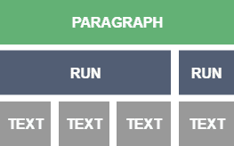

# [Docx4J简介](https://www.baeldung.com/docx4j)

1. 一览表

    在本文中，我们将重点使用[docx4j](https://www.docx4java.org/)库创建.docx文档。

    Docx4j是一个Java库，用于创建和操作Office OpenXML文件——这意味着它只能与.docx文件类型一起使用，而旧版本的Microsoft Word使用.doc扩展名（二进制文件）。

    请注意，从2007版本开始，Microsoft Office支持OpenXML格式。

2. Maven设置

    要开始使用docx4j，我们需要将所需的依赖项添加到我们的pom.xml中：

    ```xml
    <dependency>
        <groupId>org.docx4j</groupId>
        <artifactId>docx4j</artifactId>
        <version>6.1.2</version>
    </dependency>
    <dependency> 
        <groupId>org.glassfish.jaxb</groupId>
        <artifactId>jaxb-runtime</artifactId>
        <version>2.3.1</version>
    </dependency>
    ```

    请注意，我们始终可以在Maven中央存储库中查找最新的依赖版本。

    需要JAXB依赖性，因为docx4j在引擎盖下使用此库来编排/取消编排adocx文件中的XML部分。

3. 创建一个Docx文件

    1. 文本元素和样式

        让我们先看看如何创建一个简单的docx文件——带有文本段落：

        ```java
        WordprocessingMLPackage wordPackage = WordprocessingMLPackage.createPackage();
        MainDocumentPart mainDocumentPart = wordPackage.getMainDocumentPart();
        mainDocumentPart.addStyledParagraphOfText("Title", "Hello World!");
        mainDocumentPart.addParagraphOfText("Welcome To Baeldung");
        File exportFile = new File("welcome.docx");
        wordPackage.save(exportFile);
        ```

        这是生成的welcome.docx文件。

        要创建新文档，我们必须使用WordprocessingMLPackage，它表示OpenXML格式的docx文件，而MainDocumentPart类包含main document.xml部分的表示。

        为了澄清事情，让我们解压缩welcome.docx文件，然后打开word/document.xml文件，看看XML表示是什么样子的：

        ```xml
        <w:body>
            <w:p>
                <w:pPr>
                    <w:pStyle w:val="Title"/>
                </w:pPr>
                <w:r>
                    <w:t>Hello World!</w:t>
                </w:r>
            </w:p>
            <w:p>
                <w:r>
                    <w:t>Welcome To Baeldung!</w:t>
                </w:r>
            </w:p>
        </w:body>
        ```

        正如我们所看到的，每个句子都由段落（p）中的文本（t）运行（r）表示，这就是addParagraphOfText（）方法的用。

        addStyledParagraphOfText（）做得更多；它创建一个段落属性（pPr），该属性保持样式应用于段落。

        简单地说，段落声明单独的运行，每次运行都包含一些文本元素：

        

        为了创建一个好看的文档，我们需要完全控制这些元素（段落、运行和文本）。

        因此，让我们来发现如何使用runProperties（RPr）对象来风格化我们的内容：

        ```java
        ObjectFactory factory = Context.getWmlObjectFactory();
        P p = factory.createP();
        R r = factory.createR();
        Text t = factory.createText();
        t.setValue("Welcome To Baeldung");
        r.getContent().add(t);
        p.getContent().add(r);
        RPr rpr = factory.createRPr();
        BooleanDefaultTrue b = new BooleanDefaultTrue();
        rpr.setB(b);
        rpr.setI(b);
        rpr.setCaps(b);
        Color green = factory.createColor();
        green.setVal("green");
        rpr.setColor(green);
        r.setRPr(rpr);
        mainDocumentPart.getContent().add(p);
        File exportFile = new File("welcome.docx");
        wordPackage.save(exportFile);
        ```

        分别使用createP（）、createR（）和createText（）创建段落、运行和文本元素后，我们声明了一个新的runProperties对象（RPr），以为文本元素添加一些样式。

        rpr对象用于设置格式属性，粗体（B）、斜体（I）和大写（大写），这些属性使用setRPr（）方法应用于文本运行。

    2. 处理图像

        Docx4j提供了将图像添加到我们的Word文档的简单方法：

        ```java
        File image = new File("image.jpg" );
        byte[] fileContent = Files.readAllBytes(image.toPath());
        BinaryPartAbstractImage imagePart = BinaryPartAbstractImage
        .createImagePart(wordPackage, fileContent);
        Inline inline = imagePart.createImageInline(
        "Baeldung Image (filename hint)", "Alt Text", 1, 2, false);
        P Imageparagraph = addImageToParagraph(inline);
        mainDocumentPart.getContent().add(Imageparagraph);
        ```

        以下是addImageToParagraph（）方法的实现：

        ```java
        private static P addImageToParagraph(Inline inline) {
            ObjectFactory factory = new ObjectFactory();
            P p = factory.createP();
            R r = factory.createR();
            p.getContent().add(r);
            Drawing drawing = factory.createDrawing();
            r.getContent().add(drawing);
            drawing.getAnchorOrInline().add(inline);
            return p;
        }
        ```

        首先，我们创建了包含要添加到主文档部分的图像的文件，然后，我们将表示图像的字节数组与wordMLPackage对象链接。

        创建图像部分后，我们需要使用createImageInline（）方法创建一个内联对象。

        addImageToParagraph（）方法将Inline对象嵌入到绘图中，以便将其添加到运行中。

        最后，像文本段落一样，包含图像的段落被添加到mainDocumentPart中。

    3. 创建表格

        Docx4j还使操作表格（Tbl）、行（Tr）和列（Tc）变得非常容易。

        让我们看看如何创建一个3×3表格并向其添加一些内容：

        ```java
        int writableWidthTwips = wordPackage.getDocumentModel()
        .getSections().get(0).getPageDimensions().getWritableWidthTwips();
        int columnNumber = 3;
        Tbl tbl = TblFactory.createTable(3, 3, writableWidthTwips/columnNumber);     
        List<Object> rows = tbl.getContent();
        for (Object row : rows) {
            Tr tr = (Tr) row;
            List<Object> cells = tr.getContent();
            for(Object cell : cells) {
                Tc td = (Tc) cell;
                td.getContent().add(p);
            }
        }
        ```

        给定一些行和列，createTable（）方法会创建一个新的Tbl对象，第三个参数指的是以twips为单位的列宽度（这是距离测量-1/1440英寸）。

        创建后，我们可以迭代tbl对象的内容，并将段落对象添加到每个单元格中。

4. 阅读Docx文件

    既然我们已经发现了如何使用docx4j创建文档，让我们看看如何读取现有的docx文件并打印其内容：

    ```java
    File doc = new File("helloWorld.docx");
    WordprocessingMLPackage wordMLPackage = WordprocessingMLPackage
    .load(doc);
    MainDocumentPart mainDocumentPart = wordMLPackage
    .getMainDocumentPart();
    String textNodesXPath = "//w:t";
    List<Object> textNodes= mainDocumentPart
    .getJAXBNodesViaXPath(textNodesXPath, true);
    for (Object obj : textNodes) {
        Text text = (Text) ((JAXBElement) obj).getValue();
        String textValue = text.getValue();
        System.out.println(textValue);
    }
    ```

    在本例中，我们使用load（）方法基于现有的helloWorld.docx文件创建了一个WordprocessingMLPackage对象。

    之后，我们使用XPath表达式（//w:t）从主文档部分获取所有文本节点。

    getJAXBNodesViaXPath（）方法返回JAXBElement对象的列表。

    因此，mainDocumentPart对象内的所有文本元素都打印在控制台中。

    请注意，我们可以随时解压缩docx文件，以更好地了解XML结构，这有助于分析问题，并更好地了解如何解决这些问题。

5. 结论

    在本文中，我们发现了docx4j如何使在MSWord文档上更轻松地执行复杂操作，例如创建段落、表格、文档部分和添加图像。
