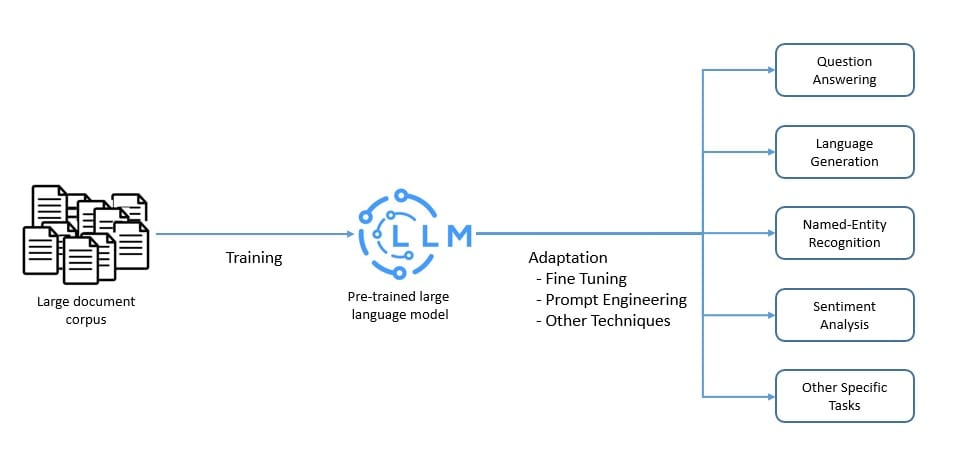
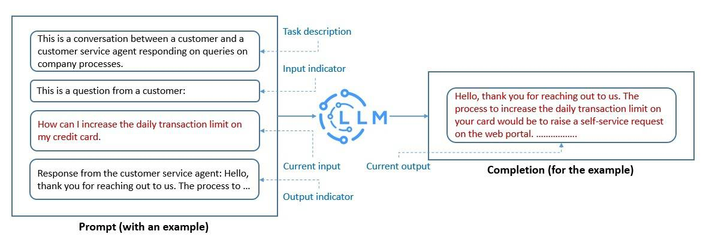
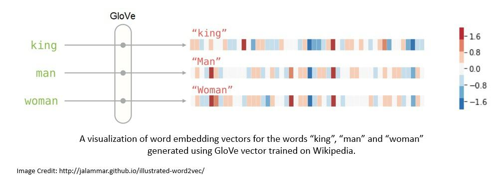
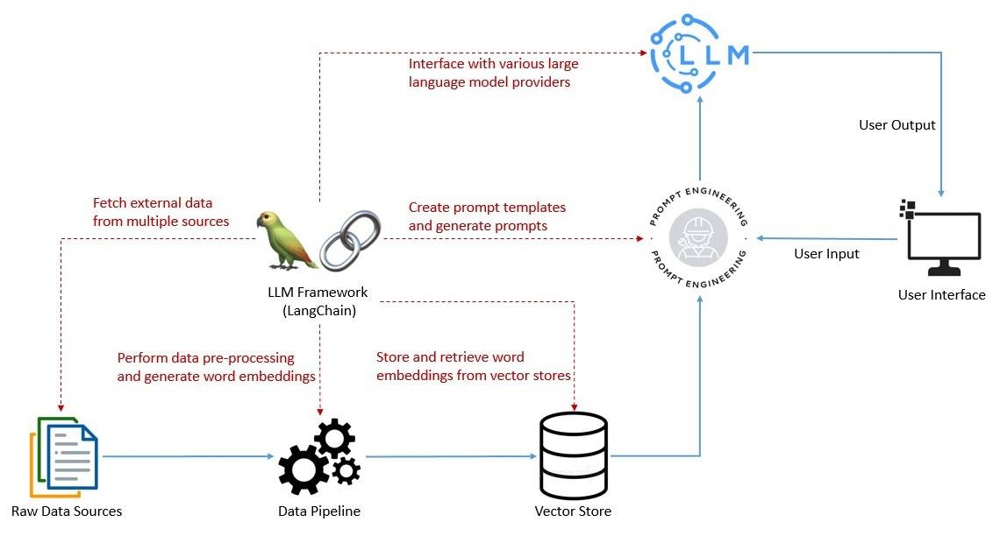
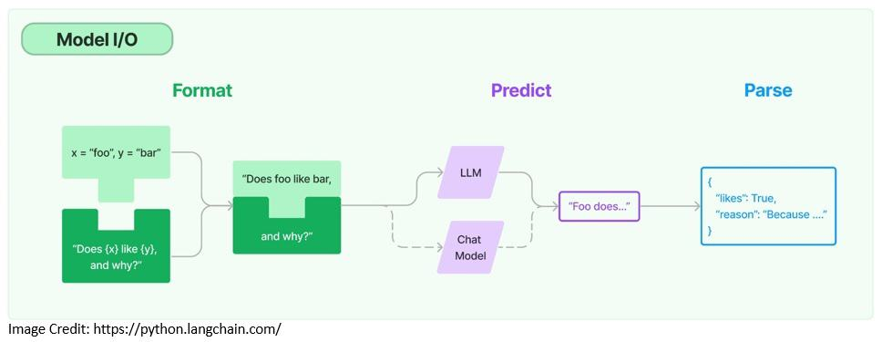
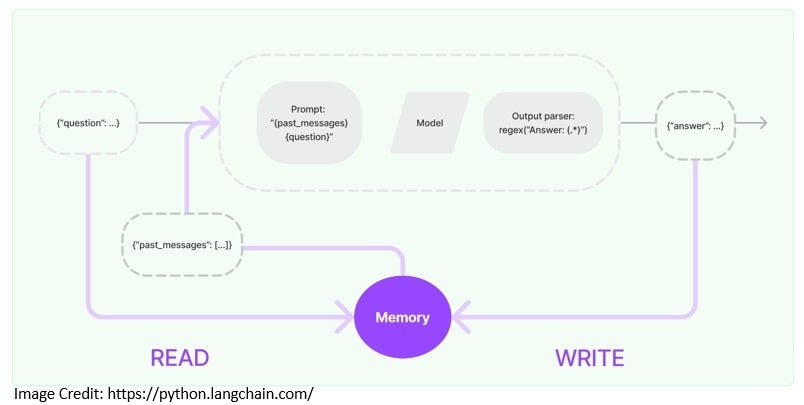
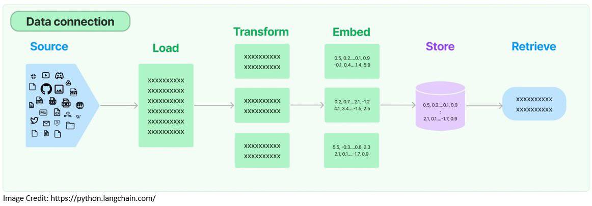

# LangChain简介

人工智能

LangChain   OpenAI

1. 引言

    在本教程中，我们将详细探讨 [LangChain](https://www.langchain.com/)，这是一个用于开发由语言模型驱动的应用程序的框架。我们将从围绕语言模型的基本概念开始，这将有助于理解本教程的内容。

    尽管 LangChain 主要提供 Python 和 JavaScript/TypeScript 版本，但也有选项可以在 Java 中使用 LangChain。我们将讨论 LangChain 作为框架的构建块，然后继续在 Java 中进行实验。

2. 背景

    在深入探讨为什么我们需要一个用于构建由语言模型驱动的应用程序的框架之前，我们有必要先了解什么是语言模型。我们还将介绍在使用语言模型时遇到的一些典型复杂性。

    1. 大型语言模型

        语言模型是自然语言的概率模型，可以生成一系列单词的概率。大型语言模型（LLM）是一种以其庞大尺寸为特征的语言模型。它们是可能拥有数十亿参数的人工神经网络。

        LLM 通常使用自监督和半监督学习技术对大量未标记数据进行预训练。然后，使用各种技术（例如微调和提示工程）将预训练模型适应于特定任务：

        

        这些 LLM 能够执行多种自然语言处理任务，如语言翻译和内容摘要。它们还能够进行内容创作等生成任务。因此，它们在回答问题等应用中极为宝贵。

    2. 提示工程

        LLM 是在海量文本数据集上训练的基础模型。因此，它们可以捕捉到人类语言固有的语法和语义。然而，它们必须被调整以执行我们希望它们完成的具体任务。

        提示工程是调整 LLM 的最快方法之一。它是构造可被 LLM 解释和理解的文本的过程。在这里，我们使用自然语言文本来描述我们期望 LLM 执行的任务：

        

        我们创建的提示帮助 LLM 进行[上下文学习](https://en.wikipedia.org/wiki/Prompt_engineering#In-context_learning)，这是暂时的。我们可以使用提示工程来促进 LLM 的安全使用，并构建新的能力，比如用领域知识和外部工具增强 LLM。

        这是一个活跃的研究领域，新技术不断涌现。然而，像[思维链提示](https://www.promptingguide.ai/techniques/cot)这样的技术已经变得相当流行。这里的想法是让 LLM 在给出最终答案之前，通过一系列中间步骤解决问题。

    3. 词嵌入

        正如我们所见，LLM 能够处理大量的自然语言文本。如果我们用[词嵌入](https://en.wikipedia.org/wiki/Word_embedding)表示自然语言中的单词，LLM 的性能会大大提高。这是一种能够编码单词含义的实值向量。

        通常，词嵌入是使用算法生成的，例如 Tomáš Mikolov 的 [Word2vec](https://en.wikipedia.org/wiki/Word2vec) 或斯坦福大学的 [GloVe](https://nlp.stanford.edu/projects/glove/)。GloVe 是一种无监督学习算法，基于语料库中的全局词-词共现统计进行训练：

        

        在提示工程中，我们将提示转换为它们的词嵌入，使模型更好地理解和响应提示。此外，在向模型提供上下文时也非常有帮助，允许它们提供更具上下文的答案。

        例如，我们可以从现有数据集中生成词嵌入并将它们存储在向量数据库中。然后，我们可以使用用户提供的输入对这个向量数据库进行语义搜索。然后，我们可以将搜索结果作为额外的上下文提供给模型。

3. 使用 LangChain 的 LLM 技术栈

    正如我们已经看到的，创建有效的提示是成功利用任何应用程序中的 LLM 功能的关键元素。这包括使与语言模型的交互具有上下文感知能力，并能够依赖语言模型进行推理。

    为此，我们需要执行多项任务，例如创建提示模板、调用语言模型以及从多个来源向语言模型提供用户特定的数据。为了简化这些任务，我们需要将 LangChain 作为我们 LLM 技术栈的一部分：

    

    该框架还有助于开发需要链接多个语言模型并能够回忆与语言模型过去互动信息的应用程序。然后，还有一些更复杂的用例，涉及将语言模型用作推理引擎。

    最后，我们可以执行日志记录、监控、流式传输和其他维护和故障排除所需的重要任务。LLM 技术栈正在迅速发展以解决许多这些问题。然而，LangChain 正快速成为 LLM 技术栈中有价值的一部分。

4. Java 的 LangChain

    LangChain 于 2022 年作为开源项目推出，并很快通过社区支持获得了动力。它最初由 Harrison Chase 用 Python 开发，很快成为 AI 领域增长最快的初创公司之一。

    2023 年初，出现了 JavaScript/TypeScript 版本的 LangChain，紧随 Python 版本之后。它很快变得非常受欢迎，并开始支持多个 JavaScript 环境，如 Node.js、Web 浏览器、CloudFlare 工作者、Vercel/Next.js、Deno 和 Supabase Edge 函数。

    不幸的是，目前没有适用于 Java/Spring 应用程序的官方 Java 版本的 LangChain。但是，有一个名为 [LangChain4j](https://github.com/langchain4j/langchain4j) 的社区版本的 LangChain。它适用于 Java 8 或更高版本，并支持 Spring Boot 2 和 3。

    LangChain 的各种依赖项可在 [Maven Central](https://mvnrepository.com/artifact/dev.langchain4j/langchain4j/0.23.0) 获取。根据我们使用的功能，我们可能需要在应用程序中添加一个或多个依赖项：

    ```xml
    <dependency>
        <groupId>dev.langchain4j</groupId>
        <artifactId>langchain4j</artifactId>
        <version>0.23.0</version>
    </dependency>
    ```

    例如，在本教程的以下部分，我们还需要支持集成到 [OpenAI](https://mvnrepository.com/artifact/dev.langchain4j/langchain4j-open-ai/0.23.0) 模型的依赖项，提供对[嵌入](https://mvnrepository.com/artifact/dev.langchain4j/langchain4j-embeddings/0.23.0)的支持，以及像 [all-MiniLM-L6-v2](https://mvnrepository.com/artifact/dev.langchain4j/langchain4j-embeddings-all-minilm-l6-v2-q/0.23.0) 这样的句子转换器模型。

    LangChain4j 与 LangChain 具有类似的设计目标，提供了简单且一致的抽象层及其众多实现。它已经支持多个语言模型提供商，如 OpenAI 和嵌入存储提供商，如 Pinecone。

    然而，由于 LangChain 和 LangChain4j 都在快速发展，Python 或 JS/TS 版本中支持的一些功能可能尚未在 Java 版本中实现。尽管如此，基本概念、总体结构和术语大体相同。

5. LangChain 的构建块

    LangChain 为我们的应用程序提供了几个模块组件的价值主张。模块化组件提供了有用的抽象以及与语言模型一起工作的实现集合。让我们讨论其中一些模块，并在 Java 中举例说明。

    1. 模型 I/O

        在使用任何语言模型时，我们需要能够与其接口。LangChain 提供了必要的构建块，例如模板化提示的能力，以及动态选择和管理模型输入的能力。此外，我们可以使用输出解析器从模型输出中提取信息：

        

        提示模板是生成语言模型提示的预定义配方，可能包括指令、[少量示例](https://www.promptingguide.ai/techniques/fewshot)和特定上下文：

        ```java
        PromptTemplate promptTemplate = PromptTemplate
            .from("Tell me a {{adjective}} joke about {{content}}..");
        Map<String, Object> variables = new HashMap<>();
        variables.put("adjective", "funny");
        variables.put("content", "computers");
        Prompt prompt = promptTemplate.apply(variables);
        ```

        在这里，我们创建了一个能够接受多个变量的提示模板。变量是我们从用户输入接收并传递给提示模板的内容。
        LangChain 支持与两种类型的模型集成：语言模型和聊天模型。聊天模型也由语言模型支持，但提供聊天功能：

        ```java
        ChatLanguageModel model = OpenAiChatModel.builder()
            .apiKey(<OPENAI_API_KEY>)
            .modelName(GPT_3_5_TURBO)
            .temperature(0.3)
            .build();
        String response = model.generate(prompt.text());
        ```

        在这里，我们使用特定的 OpenAI 模型和相关的 API 密钥创建了一个聊天模型。我们可以通过免费注册从 OpenAI 获取 API 密钥。温度参数用于控制模型输出的随机性。

        最后，语言模型的输出可能不够结构化以供展示。LangChain 提供了输出解析器，帮助我们结构化语言模型的响应——例如，将输出中的信息提取为 Java 中的 POJO。

    2. 内存

        通常，利用 LLM 的应用程序具有对话界面。任何对话的一个重要方面是能够引用对话早期引入的信息。存储有关过去互动信息的能力称为内存：

        

        LangChain 提供了为应用程序添加内存的关键使能器。例如，我们需要从内存中读取信息以增强用户输入。然后，我们需要将当前运行的输入和输出写入内存的能力：

        ```java
        ChatMemory chatMemory = TokenWindowChatMemory
            .withMaxTokens(300, new OpenAiTokenizer(GPT_3_5_TURBO));
        chatMemory.add(userMessage("Hello, my name is Kumar"));
        AiMessage answer = model.generate(chatMemory.messages()).content();
        System.out.println(answer.text()); // Hello Kumar! How can I assist you today?
        chatMemory.add(answer);
        chatMemory.add(userMessage("What is my name?"));
        AiMessage answerWithName = model.generate(chatMemory.messages()).content();
        System.out.println(answer.text()); // Your name is Kumar.
        chatMemory.add(answerWithName);
        ```

        在这里，我们使用 TokenWindowChatMemory 实现了一个固定窗口聊天内存，允许我们读取和写入与语言模型交换的聊天消息。

        LangChain 还提供了更复杂的数据结构和算法，以从内存中返回选定的消息而不是所有消息。例如，它支持返回过去几条消息的摘要，或者仅返回与当前运行相关联的消息。

    3. 检索

        大型语言模型通常在大量的文本语料库上进行训练。因此，它们在一般任务中非常高效，但在特定领域的任务中可能不太有用。为此，我们需要检索相关的外部数据，并在生成步骤中将其传递给语言模型。

        这一过程被称为检索增强生成（[RAG](https://www.promptingguide.ai/techniques/rag)）。它有助于将模型扎根于相关且准确的信息上，并为我们提供对模型生成过程的洞察。LangChain 提供了创建 RAG 应用程序所需的构建块：

        

        首先，LangChain 提供了文档加载器，用于从存储位置检索文档。然后，有可用的转换器来准备文档以进行进一步处理。例如，我们可以将其拆分为较小的块：

        ```java
        Document document = FileSystemDocumentLoader.loadDocument("simpson's_adventures.txt");
        DocumentSplitter splitter = DocumentSplitters.recursive(100, 0, 
            new OpenAiTokenizer(GPT_3_5_TURBO));
        List<TextSegment> segments = splitter.split(document);
        ```

        在这里，我们使用 FileSystemDocumentLoader 从文件系统加载文档。然后，我们使用 OpenAiTokenizer 将该文档拆分为较小的块。
        为了使检索更高效，文档通常会被转换为其嵌入并存储在向量数据库中。LangChain 支持几种嵌入提供商和方法，并几乎集成了所有流行的向量存储：

        ```java
        EmbeddingModel embeddingModel = new AllMiniLmL6V2EmbeddingModel();
        List<Embedding> embeddings = embeddingModel.embedAll(segments).content();
        EmbeddingStore<TextSegment> embeddingStore = new InMemoryEmbeddingStore<>();
        embeddingStore.addAll(embeddings, segments);
        ```

        在这里，我们使用 AllMiniLmL6V2EmbeddingModel 创建文档段的嵌入。然后，我们将嵌入存储在内存中的向量存储中。

        现在，我们的外部数据以嵌入的形式存在于向量存储中，我们已准备好从中检索。LangChain 支持几种检索算法，如简单的语义搜索和复杂的集成检索器：

        ```java
        String question = "Who is Simpson?";
        // 假设这个问题的答案包含在我们之前处理的文档中。
        Embedding questionEmbedding = embeddingModel.embed(question).content();
        int maxResults = 3;
        double minScore = 0.7;
        List<EmbeddingMatch<TextSegment>> relevantEmbeddings = embeddingStore
        .findRelevant(questionEmbedding, maxResults, minScore);
        ```

        我们创建用户问题的嵌入，然后使用问题嵌入从向量存储中检索相关匹配。现在，我们可以将检索到的相关匹配作为上下文添加到我们打算发送给模型的提示中。

6. LangChain 的复杂应用

    到目前为止，我们已经看到了如何使用单个组件来创建具有语言模型的应用程序。LangChain 还提供了构建更复杂应用程序的组件。例如，我们可以使用链和代理来构建具有增强功能的更具适应性的应用程序。

    1. 链

        通常，应用程序需要按特定顺序调用多个组件。这就是 LangChain 中所谓的链。它简化了更复杂应用程序的开发，并使其更容易调试、维护和改进。

        这对于组合多个链以形成更复杂的应用程序也很有用，这些应用程序可能需要与多个语言模型进行接口。LangChain 提供了方便的方式来创建这样的链，并提供了许多预构建的链：

        ```java
        ConversationalRetrievalChain chain = ConversationalRetrievalChain.builder()
            .chatLanguageModel(chatModel)
            .retriever(EmbeddingStoreRetriever.from(embeddingStore, embeddingModel))
            .chatMemory(MessageWindowChatMemory.withMaxMessages(10))
            .promptTemplate(PromptTemplate
                .from("Answer the following question to the best of your ability: {{question}}
                    Base your answer on the following information:
                    {{information}}"))
            .build();
        ```

        在这里，我们使用预构建的链 ConversationalRetrievalChain，它允许我们将聊天模型与检索器、内存和提示模板一起使用。现在，我们可以简单地使用链来执行用户查询：

        ```java
        String answer = chain.execute("Who is Simpson?");
        ```

        该链带有一个默认的内存和提示模板，我们可以覆盖它们。创建自定义链也相当容易。创建链的能力使得实现复杂应用程序的模块化变得更加容易。

    2. 代理

        LangChain 还提供了更强大的结构，如代理。与链不同，代理使用语言模型作为推理引擎，确定采取哪些行动以及行动的顺序。我们还可以为代理提供访问正确工具以执行必要操作的能力。

        在 LangChain4j 中，代理作为 AI 服务可用，以声明方式定义复杂的 AI 行为。让我们看看是否可以将计算器作为工具提供给 AI 服务，并使语言模型能够执行计算。

        首先，我们将定义一个具有一些基本计算器功能的类，并用自然语言描述每个函数以便模型理解：

        ```java
        public class AIServiceWithCalculator {
            static class Calculator {
                @Tool("Calculates the length of a string")
                int stringLength(String s) {
                    return s.length();
                }
                @Tool("Calculates the sum of two numbers")
                int add(int a, int b) {
                    return a + b;
                }
            }
        }
        ```

        然后，我们将定义接口以构建我们的 AI 服务。这里相当简单，但它也可以描述更复杂的行为：

        ```java
        interface Assistant {
            String chat(String userMessage);
        }
        ```

        现在，我们将使用 LangChain4j 提供的构建工厂，使用我们刚刚定义的接口和创建的工具构建 AI 服务：

        ```java
        Assistant assistant = AiServices.builder(Assistant.class)
            .chatLanguageModel(OpenAiChatModel.withApiKey(<OPENAI_API_KEY>))
            .tools(new Calculator())
            .chatMemory(MessageWindowChatMemory.withMaxMessages(10))
            .build();
        ```

        就是这样！我们现在可以开始发送包含一些计算的问题给我们的语言模型：

        ```java
        String question = "What is the sum of the numbers of letters in the words \"language\" and \"model\"?";
        String answer = assistant.chat(question);
        System.out.prtintln(answer); // The sum of the numbers of letters in the words "language" and "model" is 13. 
        ```

        当我们运行这段代码时，我们会观察到语言模型现在能够执行计算。
        需要注意的是，语言模型在执行某些需要时间和空间概念或执行复杂算术程序的任务时存在困难。然而，我们始终可以为模型补充必要的工具来解决这个问题。

7. 结论

    在本教程中，我们介绍了创建由大型语言模型驱动的应用程序的一些基本要素。此外，我们讨论了将 LangChain 作为开发此类应用程序的技术栈一部分的价值。

    这使我们能够探索 LangChain4j 的一些核心元素，LangChain4j 是 LangChain 的 Java 版本。这些库将在未来迅速发展。但是，它们已经在使开发由语言模型驱动的应用程序成熟和有趣！
