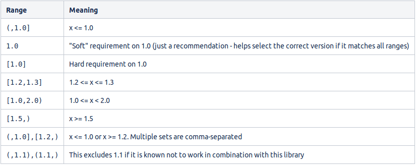

# 在Maven中使用某一依赖的最新版本

1. 概述

    手动升级Maven依赖项一直是一项繁琐的工作，尤其是在有大量库频繁发布的项目中。

    在本教程中，我们将学习如何利用Maven插件的版本，使我们的依赖关系保持最新状态。

    最重要的是，这在实施持续集成管道时非常有用，它能自动升级依赖关系，测试所有东西是否仍能正常工作，并提交或回滚结果（视情况而定）。

2. Maven版本范围语法

    在Maven2时代，开发者可以指定版本范围，在此范围内，工件将被升级，无需人工干预。

    这种语法仍然有效，在一些项目中使用，因此值得了解：

    

    不过，我们应该避免使用这种语法，而是尽可能使用Maven版本插件，因为从外部推进具体的版本，绝对比让Maven自己处理整个操作更有控制力。

    1. 废弃的语法

        Maven2还提供了两个特殊的元版本值（metaversion）来实现这一结果： LATEST和RELEASE。

        LATEST寻找的是可能的最新版本，而RELEASE则是最新的非SNAPSHOT版本。

        事实上，它们对于常规的依赖关系解决仍然绝对有效。

        然而，这种传统的升级方法在CI需要重现性的地方造成了不可预测性。因此，在解决插件依赖关系方面，它们已经被[废弃](https://cwiki.apache.org/confluence/display/MAVEN/Maven+3.x+Compatibility+Notes#Maven3.xCompatibilityNotes-PluginMetaversionResolution)了。

3. 版本Maven插件

    [Versions Maven插件](http://www.mojohaus.org/versions-maven-plugin/index.html)是目前处理版本管理的事实上的标准方法。

    从远程仓库之间的高级比较到SNAPSHOT版本的低级时间戳锁定，其庞大的目标列表使我们能够照顾到项目中涉及依赖关系的各个方面。

    虽然其中很多都不在本教程的范围内，但让我们仔细看看那些对我们的升级过程有帮助的目标。

    1. 测试案例

        在开始之前，让我们定义我们的测试案例：

        - 三个有硬编码版本的 RELEASE
        - 一个带有属性版本的 RELEASE
        - 一个SNAPSHOT

        ```xml
        <dependencies>
            <dependency>
                <groupId>commons-io</groupId>
                <artifactId>commons-io</artifactId>
                <version>2.3</version>
            </dependency>
            <dependency>
                <groupId>org.apache.commons</groupId>
                <artifactId>commons-collections4</artifactId>
                <version>4.0</version>
            </dependency>
            <dependency>
                <groupId>org.apache.commons</groupId>
                <artifactId>commons-lang3</artifactId>
                <version>3.0</version>
            </dependency>
            <dependency>
                <groupId>org.apache.commons</groupId>
                <artifactId>commons-compress</artifactId>
                <version>${commons-compress-version}</version>
            </dependency>
            <dependency>
                <groupId>commons-beanutils</groupId>
                <artifactId>commons-beanutils</artifactId>
                <version>1.9.1-SNAPSHOT</version>
            </dependency>
        </dependencies>

        <properties>        
            <commons-compress-version>1.15</commons-compress-version>
        </properties>
        ```

        最后，让我们在定义插件的时候也把一个工件排除在过程之外：

        ```xml
        <build>
            <plugins>
                <plugin>
                    <groupId>org.codehaus.mojo</groupId>
                    <artifactId>versions-maven-plugin</artifactId>
                    <version>2.7</version>
                    <configuration>
                        <excludes>
                            <exclude>org.apache.commons:commons-collections4</exclude>
                        </excludes>
                    </configuration>
                </plugin>
            </plugins>
        </build>
        ```

4. 显示可用的更新

    首先，要简单地知道我们是否可以更新我们的项目以及如何更新，正确的工具是 [versions:display-dependency-updates](http://www.mojohaus.org/versions-maven-plugin/display-dependency-updates-mojo.html)：

    `mvn versions:display-dependency-updates`

    我们可以看到，这个过程包括了每一个RELEASE版本。它甚至包括了commons-collections4，因为配置中的排除法是指更新过程，而不是发现过程。

    相反，它忽略了SNAPSHOT，原因是它是一个开发版本，自动更新通常不安全。

5. 更新依赖关系

    当第一次运行更新时，该插件会创建一个名为pom.xml.versionBackup的pom.xml备份。

    虽然每次迭代都会改变pom.xml，但备份文件将保留项目的原始状态，直到用户提交（通过mvn versions:commit）或恢复（通过mvn versions:revert）整个过程的时刻。

    1. 将SNAPSHOT转换为RELEASE

        有时会发生这样的情况，一个项目包括一个SNAPSHOT（一个仍在大量开发中的版本）。

        我们可以使用 versions:use-releases 来检查相应的 RELEASE 是否已经发布，甚至可以同时将我们的 SNAPSHOT 转换成 RELEASE：

        `mvn versions:use-releases`

    2. 更新到下一个 RELEASE

        我们可以用version:use-next-releases把每个非SNAPSHOT的依赖关系移植到最近的版本：

        `mvn versions:use-next-releases`

        我们可以清楚地看到，该插件将commons-io、commons-lang3，甚至commons-beanutils（不再是SNAPSHOT）都更新到了它们的下一个版本。

        最重要的是，它忽略了commons-collections4和commons-compress，前者在插件配置中被排除，后者的版本号是通过属性动态指定的。

    3. 更新到最新的RELEASE版本

        将每个非SNAPSHOT依赖关系更新到最新版本的方法相同，只需将目标改为version:use-latest-releases：

        mvn versions:use-latest-releases

6. 过滤掉不需要的版本

    如果我们想忽略某些版本，[可以调整插件的配置](http://www.mojohaus.org/versions-maven-plugin/version-rules.html#Ignoring_certain_versions)，从外部文件动态加载规则：

    ```xml
    <plugin>
        <groupId>org.codehaus.mojo</groupId>
        <artifactId>versions-maven-plugin</artifactId>
        <version>2.7</version>
        <configuration>
            <rulesUri>http://www.mycompany.com/maven-version-rules.xml</rulesUri>
        </configuration>
    </plugin>
    ```

    最值得注意的是，`<rulesUri>`也可以引用一个本地文件：

    `<rulesUri>file:///home/andrea/maven-version-rules.xml</rulesUri>`

    1. 全局性地忽略版本

        我们可以配置我们的规则文件，让它忽略匹配特定正则表达式的版本：

        ```xml
        <ruleset comparisonMethod="maven"
        xmlns="http://mojo.codehaus.org/versions-maven-plugin/rule/2.0.0"
        xmlns:xsi="http://www.w3.org/2001/XMLSchema-instance"
        xsi:schemaLocation="http://mojo.codehaus.org/versions-maven-plugin/rule/2.0.0 
        http://mojo.codehaus.org/versions-maven-plugin/xsd/rule-2.0.0.xsd">
            <ignoreVersions>
                <ignoreVersion type="regex">.*-beta</ignoreVersion>
            </ignoreVersions>
        </ruleset>
        ```

    2. 在每条规则的基础上忽略版本

        最后，如果我们的需求更具体，我们可以建立一套规则来代替：

        ```xml
        <ruleset comparisonMethod="maven"
        xmlns="http://mojo.codehaus.org/versions-maven-plugin/rule/2.0.0"
        xmlns:xsi="http://www.w3.org/2001/XMLSchema-instance"
        xsi:schemaLocation="http://mojo.codehaus.org/versions-maven-plugin/rule/2.0.0 
            http://mojo.codehaus.org/versions-maven-plugin/xsd/rule-2.0.0.xsd">
            <rules>
                <rule groupId="com.mycompany.maven" comparisonMethod="maven">
                    <ignoreVersions>
                        <ignoreVersion type="regex">.*-RELEASE</ignoreVersion>
                        <ignoreVersion>2.1.0</ignoreVersion>
                    </ignoreVersions>
                </rule>
            </rules>
        </ruleset>
        ```

7. 总结

    我们已经了解了如何以安全、自动、符合Maven3标准的方式检查和更新项目的依赖关系。

## Relevant Articles

- [Use the Latest Version of a Dependency in Maven](https://www.baeldung.com/maven-dependency-latest-version)

## Code

像往常一样，我们在[GitHub](https://github.com/eugenp/tutorials/tree/master/maven-modules/versions-maven-plugin)上提供了源代码，还有一个脚本，可以帮助我们一步一步地展示所有的东西，而且不复杂。

要看它的运行情况，只需下载该项目并在终端运行（如果使用Windows，则在Git Bash中运行）：

`./run-the-demo.sh`

> macos: `sh run-the-demo.sh`
