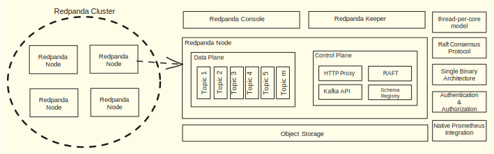
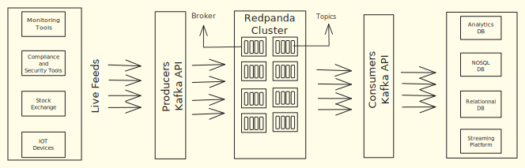

# [红熊猫简介](https://www.baeldung.com/redpanda)

1. 概述

    在本教程中，我们将讨论一个名为 [Redpanda](https://docs.redpanda.com/current/home/) 的强大事件流平台。它是事实上的行业流平台 Kafka 的竞争对手，有趣的是，它还兼容 Kafka API。

    我们将了解 Redpanda 的关键组件、功能和用例，创建 Java 程序向 Redpanda 主题发布消息，然后从中读取消息。

2. 红熊猫与卡夫卡

    既然Redpanda的制造商声称自己是Kafka的竞争对手，那么让我们就几个重要因素对它们进行比较：

    | 特点     | Redpanda                                                                              | Kafka                                                             |
    |--------|---------------------------------------------------------------------------------------|-------------------------------------------------------------------|
    | 开发人员体验 | 包含一个二进制软件包，易于安装；不依赖 JVM 和第三方工具                                                        | 它依赖于 Zookeeper 或 KRaft；安装时，开发人员需要更多专业知识                           |
    | 性能     | 由于采用了每核线程编程模型，速度比 Kafka 快 10 倍；用 C++ 编写；每个内核可处理每秒 1 GB 的写入量；支持内核自动调整；p99999 延迟为 16 毫秒 | Kafka 是很久以前开发的，因此没有针对运行多核的新时代 CPU 进行优化；用 Java 编写；p99999 延迟为 1.8 秒 |
    | 成本     | 比卡夫卡低 6 倍                                                                             | 需要更多基础设施来支持类似性能                                                   |
    | 连接器    | 红熊猫云提供了少量开箱即用的[托管连接器](https://docs.redpanda.com/current/deploy/deployment-option/cloud/managed-connectors/)                                                                   | 相当成熟，支持许多开箱即用的连接器                                                 |
    | 社区支持   | 在可接受性方面，与 Kafka 相比还有很长的路要走；拥有 [Slack 频道](https://redpanda.com/slack)                                                | 在各行各业得到广泛应用，因此有一个非常成熟的社区可用                                        |

3. Redpanda 的架构

    Redpanda 的架构不仅简单，而且非常容易掌握。有趣的是，它只有一个二进制安装包，易于安装。这为开发者提供了一个快速入门的机会，也是它广受欢迎的原因。此外，它还提供了一个性能极高、吞吐量极大的流媒体平台。

    1. 关键组件和功能

        让我们深入了解 Redpanda 的关键组件和功能，它们使 Redpanda 变得异常强大、性能卓越：

        

        控制平面支持 Kafka API，用于管理代理、创建消息主题、发布和消费消息等。因此，依赖于Kafka的传统系统迁移到Redpanda可以大大减少工作量。不过，管理和配置Redpanda集群需要一套不同的管理员应用程序接口（Admin API）。

        Redpanda支持分层存储。这意味着我们可以配置它将数据日志从本地缓存卸载或归档到云中更便宜的对象存储。此外，根据消费者的需求，数据会实时从远程对象存储移回本地缓存。

        Redpanda 有一个 [Raft 共识算法](https://raft.github.io/)实现层，可在节点间复制主题分区数据。这一功能可防止故障情况下的数据丢失。当然，这也保证了较高的数据安全性和容错性。

        Redpanda 具有强大的[身份验证和授权](https://docs.redpanda.com/current/manage/security/)支持。它可以使用 SASL、OAuth、OpenID Connect（OIDC）、基本身份验证、Kerberos 等方法对外部用户和应用程序进行身份验证。此外，它还能通过基于角色的访问控制（RBAC）机制对其资源进行细粒度访问控制。

        模式对于定义 Redpanda 代理、消费者和生产者之间的数据交换至关重要。因此，集群拥有一个[模式注册](https://docs.redpanda.com/current/manage/schema-reg/schema-reg-overview/)中心。模式注册 API 可帮助注册和修改模式。

        HTTP 代理（[pandaproxy](https://docs.redpanda.com/api/pandaproxy-rest/)）应用程序接口提供了与 Redpanda 交互的便捷方式，可用于基本数据操作，如列出主题和代理、获取事件、生成事件等。

        最后，Redpanda 为其监控提供了[度量端点](https://docs.redpanda.com/current/manage/monitoring/)。可以在 Prometheus（监控工具）上配置这些端点，以提取重要指标并将其显示在 [Grafana](https://grafana.com/grafana/dashboards/18135-redpanda-ops-dashboard/) 面板上。

    2. 单一二进制安装包

        Redpanda 的安装包由一个二进制文件组成，因此其安装比 Kafka 简单得多。与 Kafka 不同，它不依赖于 JVM 或像 Zookeeper 这样的集群管理器。由于这些因素，Redpanda 的操作非常简单。

        它是用 C++ 开发的，拥有引人注目的[每核线程编程模型](https://docs.redpanda.com/current/reference/glossary/#thread-per-core)，有助于优化利用 CPU 内核、内存和网络。因此，其部署的硬件成本大大降低。这种模式还能实现低延迟和高吞吐量。

        Redpanda 集群由多个节点组成。每个节点既可以是数据平面，也可以是控制平面。这些节点只需安装一个二进制软件包，并进行适当的配置即可。如果节点具有高端计算能力，它们就能同时扮演这两种角色，而不会出现性能瓶颈。

    3. 管理工具

        Redpanda 提供两种管理工具，一种是[网络控制台](https://docs.redpanda.com/current/reference/console/)，另一种是名为 Redpanda Keeper ([RPK](https://docs.redpanda.com/current/reference/rpk/)) 的 CLI。控制台是集群管理员可以使用的用户友好型 Web 应用程序。

        RPK 主要用于底层集群管理和调整。不过，控制台提供了数据流的可视性，以及排除故障和管理群集的功能。

4. 部署

    Redpanda 支持[自托管部署和 Redpanda 云部署](https://docs.redpanda.com/current/deploy/)。

    在自托管部署中，客户可将Redpanda集群部署在其私有数据中心或公有云的VPC中。它可以部署在物理机、虚拟机和 Kubernetes 上。根据经验，每个代理都应该有自己的专用节点。目前支持 RHEL/CentOS 和 Ubuntu 操作系统。

    此外，AWS Simple Storage Service（S3）、Azure Blob Storage（ABS）和 Google Cloud Storage（GCS）可用于支持分层存储。

    有趣的是，客户还可以选择 [Redpanda Cloud](https://docs.redpanda.com/current/deploy/deployment-option/cloud/) 的托管服务。他们既可以将整个集群完全放在Redpanda Cloud上，也可以选择拥有运行在其私有数据中心或公共云账户中的数据平面。控制平面仍由 Redpanda 云负责监控、配置和升级。

5. 关键用例

    与Kafka不同，Redpanda的架构简单、安装方便，因此对于开发者来说是一个非常强大的流媒体平台。让我们沿着同样的思路快速了解一下使用案例：

    

    一般来说，流媒体平台的参与者有：

    - 源系统生成源
    - 源可以是监控事件、指标、通知等
    - 集群中的经纪人管理主题
    - 生产者从源系统读取信息源并将其发布到主题中
    - 消费者不断对订阅的主题进行轮询
    - 目标系统接收来自消费者的转换信息

    Redpanda 保证将来自监控工具、合规和安全平台、物联网设备等不同来源的实时信息传送到目标系统，平均延迟时间降低了惊人的 10 倍。

    它支持消费者和生产者模式，用于处理来自各种来源的实时信息源或事件。生产者是从源系统读取数据并将其发布到 Redpanda 集群主题的应用程序。集群中的代理具有高度可靠性和容错性，可保证消息的传递。

    消费者应用程序订阅集群中的主题。最终，它们从主题中读取数据，并在进一步转换数据后将其发送到各种目标系统，如分析平台、NoSQL 数据库、关系数据库或其他流平台。

    在微服务架构中，Redpanda 通过促进微服务之间的异步通信来帮助它们解耦。

    因此，它可以在各行业的开发中发挥重要作用：

    - 用于事件和日志处理、报告、故障排除和自动修复的可观察性平台
    - 实时合规性和欺诈检测系统
    - 实时分析仪表板和应用程序

6. 利用Kafka API实现Redpanda客户端

    值得注意的是，Redpanda支持Kafka API。因此，我们将使用Kafka客户端来编写能与Redpanda Stream交互的程序。

    在我们的示例中，我们使用Java Testcontainers在Windows桌面上部署了一个单节点的Redpanda。

    此外，我们还将探索基本程序，包括主题创建、消息发布和消息消费。这只是为了演示目的，因此我们不会深入探讨 Kafka API 概念。

    1. 前提条件

        在开始之前，让我们为 Kafka 客户端库导入必要的 Maven 依赖项：

        ```xml
        <dependency>
            <groupId>org.apache.kafka</groupId>
            <artifactId>kafka-clients</artifactId>
            <version>3.6.1</version>
        </dependency>
        ```

    2. 创建主题

        要在 Redpanda 上创建一个主题，我们首先要实例化 Kafka 客户端库中的 [AdminClient](https://kafka.apache.org/36/javadoc/org/apache/kafka/clients/admin/AdminClient.html) 类：

        test/.redpanda/RedpandaLiveTest.java:createAdminClient()

        为了设置 AdminClient，我们获取了代理 URL 并将其传递给它的静态 create() 方法。

        现在，让我们看看如何创建一个主题：

        test/.redpanda/RedpandaLiveTest.java:createTopic(String topicName)

        AdminClient 类的 createTopics() 方法将 NewTopic 对象作为创建主题的参数。

        最后，让我们看看 createTopic() 方法的实际运行情况：

        test/.redpanda/RedpandaLiveTest.java:whenCreateTopic_thenSuccess()

        程序在 Redpanda 上成功创建了 test-topic 主题。我们还使用 AdminClient 类的 listTopics() 方法验证了该主题是否存在于代理中。

    3. 向主题发布消息

        可以理解的是，生产者应用程序最基本的要求就是向主题发布消息。为此，我们将使用 [KafkaProducer](https://kafka.apache.org/36/javadoc/org/apache/kafka/clients/producer/KafkaProducer.html)：

        test/.redpanda/RedpandaLiveTest.java:createProducer()

        我们通过向 KafkaProducer 构造函数提供基本属性（如代理 URL 和 StringSerializer 类）来实例化生产者。

        现在，让我们使用生产者将消息发布到主题中：

        test/.redpanda/RedpandaLiveTest.java:publishMessage()

        创建 ProducerRecord 对象后，我们将其传递给 KafkaProducer 对象中的 send() 方法，以发布消息。send() 方法是异步操作的，因此我们调用 get() 方法来确保阻塞，直到消息发布。

        最后，现在让我们发布一条消息：

        test/.redpanda/RedpandaLiveTest.java:givenTopic_whenPublishMsg_thenSuccess()

        首先，我们通过调用 createProducer() 方法创建 KafkaProducer 对象。然后，我们调用之前介绍过的 publishMessage() 方法，将消息 "Hello Redpanda!"发布到主题 baeldung-topic。

    4. 从主题中消费消息

        下一步，我们将首先创建一个 [KafkaConsumer](https://kafka.apache.org/36/javadoc/org/apache/kafka/clients/consumer/KafkaConsumer.html)，然后才能从流中消费消息：

        test/.redpanda/RedpandaLiveTest.java:createConsumer()

        我们通过向 KafkaConsumer 构造函数提供基本属性（如 broker URL、StringDeSerializer 类等）来实例化消费者。此外，我们还确保消费者从偏移量 0（"最早"）开始消费消息。

        接下来，让我们消费一些消息：

        test/.redpanda/RedpandaLiveTest.java:givenTopic_whenConsumeMessage_thenSuccess()

        该方法在创建 KafkaConsumer 对象后，会订阅一个主题。然后，每 1000 毫秒轮询一次，从中读取消息。在这里，为了演示，我们跳出了循环，但在现实世界中，应用程序会持续轮询消息，然后进一步处理它们。

7. 总结

    在本教程中，我们探索了红熊猫流平台。从概念上讲，它与 Apache Kafka 相似，但安装、监控和管理要简单得多。此外，只需较少的计算和内存资源，它就能实现极高的性能和容错能力。

    不过，与 Kafka 相比，Redpanda 在行业应用方面仍有相当大的差距。此外，Redpanda 的社区支持力度也不如 Kafka。

    最后，由于Redpanda与Kafka的API兼容，应用程序从Kafka迁移到Redpanda可以大大减少工作量。
