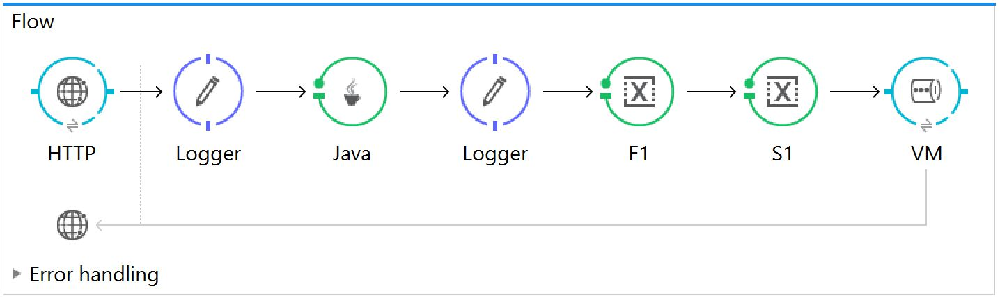
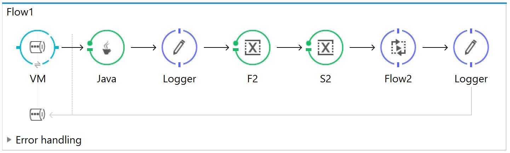
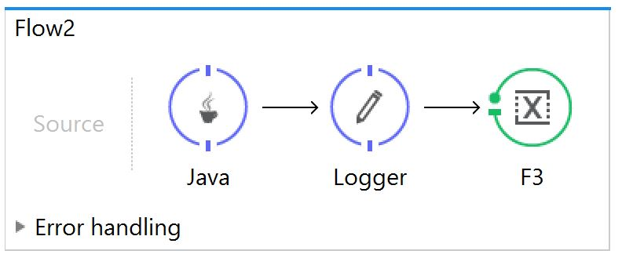

# Mule ESB

This module contains articles about the Mule Enterprise Service Bus (ESB).

## 开始使用Mule ESB

1. 概述

    [Mule ESB](https://www.mulesoft.com/platform/soa/mule-esb-open-source-esb)是一个基于Java的轻量级企业服务总线。它允许开发者通过交换不同格式的数据将多个应用程序连接在一起。它以消息的形式携带数据。

    ESB通过提供一些服务提供了强大的功能，例如：

    - 服务创建和托管 Service creation and hosting
    - 服务调解 Service mediation
    - 消息路由 Message routing
    - 数据转换 Data transformation

    如果我们需要将多个应用程序整合在一起，或者我们有在未来增加更多的应用程序的概念，我们会发现ESB很有用。

    ESB还用于处理一种以上的通信协议和需要消息路由功能时。
    ESB is also used for dealing with more than one type of communication protocol and when message routing capabilities are required.

    - [ ] 让我们在第5节中使用AnyPoint Studio创建一个示例项目，该项目可在此[下载](https://www.mulesoft.com/lp/dl/studio)。

2. Mule消息结构

    简单地说，ESB的主要目的是在服务之间进行调解，并将消息路由到各种端点。所以它需要处理不同类型的内容或有效载荷。

    消息结构被分为两部分：

    - 头部，包含消息元数据 The header, which contains message metadata
    - 有效载荷，包含特定业务数据 The payload, which contains business-specific data

    消息被嵌入到一个消息对象中。我们可以从上下文中检索到消息对象。我们可以在Mule flow中使用自定义的Java组件和转换器来改变它的属性和有效载荷。

    每个应用程序由一个或多个流组成。

    在一个流程中，我们可以使用组件来访问、过滤或改变一个消息和它的不同属性。

    例如，我们可以使用Java组件获得一个消息的实例。这个组件类实现了org.mule.api.lifecycle包中的一个Callable接口：

    ```java
    public Object onCall(MuleEventContext eventContext) throws Exception {
        MuleMessage message = eventContext.getMessage();
        message.setPayload("Message payload is changed here.");
        return message;
    }
    ```

3. 属性和变量

    消息元数据由属性组成。变量代表关于消息的数据。属性和变量如何在消息的生命周期中应用是由它们的作用域定义的。根据其范围，属性可以有两种类型：入站(inbound)和出站(outbound)。

    入站属性包含元数据，防止消息在穿越流量时被扰乱。入站属性是不可变的，不能被用户改变。它们只在流的持续时间内存在，一旦消息退出流，入站属性就不再存在。

    出站属性可以由Mule自动设置，或者用户可以通过流程配置来设置它们。这些属性是可变的。当一个消息在跨越运输障碍后进入另一个流时，它们就成为入站属性。

    我们可以通过调用相关的setter和getter方法来分别设置和获取出站和入站的属性，在他们各自的范围内：

    ```java
    message.setProperty(
    "outboundKey", "outboundpropertyvalue", PropertyScope.OUTBOUND);
    String inboundProp = (String) message.getInboundProperty("outboundKey");
    ```

    在应用程序中，有两种类型的变量可供声明。

    一种是流变量(flow variable)，它是Mule流的本地变量，在流、子流和私有流中可用。

    会话变量(Session variables)一旦声明就会在整个应用程序中可用。

4. Transport Barriers传输障碍物和flow-ref流量参考

    传输障碍是HTTP连接器、虚拟机、JMS或类似的连接器，它们需要路径或端点来路由消息。流程变量在传输障碍中是不可用的，但是会话变量在整个项目的所有流程中都是可用的。
    Flow variables aren't available across transport barriers, but session variables are available across the project in all flows.

    当我们需要创建子流或私有流时，我们可以使用flow-ref组件从父流或另一个流引用该流。流量变量和会话变量在使用flow-ref引用的子流和私有流中都是可用的。
    Both flow variables and session variables are available in sub-flows and private flows referred to using flow-ref.

5. 项目实例

    让我们在Anypoint Studio中创建一个包含多个流的应用程序，这些流之间通过入站和出站连接器进行通信。

    让我们来看看第一个流：

    

    我们可以将一个HTTP监听器配置为：

    参见：ap/variablescopetest.xml

    ```xml
    <http:listener-config name="HTTP_Listener_Configuration"
    host="localhost" port="8081" doc:name="HTTP Listener Configuration"/>
    ```

    流程组件必须在`<flow>`标签内。因此，一个有多个组件的例子流程是：

    ```xml
    <flow name="Flow">
        <http:listener 
        config-ref="HTTP_Listener_Configuration" 
        path="/" doc:name="HTTP" 
        allowedMethods="POST"/>
        <logger message="Original 
        paylaod: #[payload]" 
        level="INFO" doc:name="Logger"/>
        <custom-transformer 
        class="com.baeldung.transformer.InitializationTransformer" 
        doc:name="Java"/>
        <logger message="Payload After Initialization: #[payload]" 
        level="INFO" doc:name="Logger"/>
        <set-variable variableName="f1" 
        value="#['Flow Variable 1']" doc:name="F1"/>
        <set-session-variable variableName="s1" 
        value="#['Session variable 1']" doc:name="S1"/>
        <vm:outbound-endpoint exchange-pattern="request-response" 
        path="test" doc:name="VM"/>
    </flow>
    ```

    在这个流程中，我们提供了一个对配置的HTTP监听器的引用。然后，我们保留一个记录器来记录HTTP监听器通过POST方法接收的有效载荷。

    之后，我们放置了一个自定义的Java转化器类，在收到消息后对有效载荷进行转化：

    ```java
    public Object transformMessage(
    MuleMessage message, 
    String outputEncoding) throws TransformerException {
    
        message.setPayload("Payload is transferred here.");
        message.setProperty(
        "outboundKey", "outboundpropertyvalue", PropertyScope.OUTBOUND);
        return message;
    }
    ```

    变换器类必须扩展AbstractMessageTransformer。我们还在该类里面设置一个出站属性。

    现在，我们已经在消息对象中转换了有效载荷，并使用logger将其记录在控制台中。我们正在设置一个流量变量和一个会话变量。

    最后，我们通过出站的VM连接器发送我们的有效载荷。VM连接器中的路径决定了接收端点：

    

    由初始流携带和转换的消息通过入站的VM端点到达Flow1。

    Java组件检索由第一个流设置的出站属性，并返回成为消息有效载荷的对象。

    这个任务的transformMessage()方法：

    ```java
    public Object transformMessage(
    MuleMessage message, 
    String outputEncoding) throws TransformerException {

        return (String) message.getInboundProperty("outboundKey");
    }
    ```

    然后，流量和会话变量被设置为第二个流量。之后，我们使用flow-ref组件得到了一个对Flow2的引用。

    

    在Flow2中，我们使用Java组件类转换了消息，并将其记录在控制台中。我们还设置了一个流量变量F3。

    使用flow-ref调用Flow2后，Flow1将等待消息在Flow2中被处理。

    在Flow1和Flow2中设置的任何流变量都将在两个流中可用，因为这些流并没有被任何传输障碍分开。

    最后，消息通过虚拟机被送回给HTTP请求者。我们将所有的虚拟机配置为请求-响应。

    我们可以通过在正文中发布任何JSON数据，从任何REST客户端调用这个应用程序。URL将是HTTP监听器中配置的localhost:8081。

6. Maven Archetype

    我们可以使用Mulesoft的Maven原型构建一个Mule ESB项目。

    在Maven的settings.xml文件中，我们首先需要添加org.mule.tools插件组：

    ```xml
    <pluginGroups>
        <pluginGroup>org.mule.tools</pluginGroup>
    </pluginGroups>
    ```

    然后，我们需要添加一个profile标签，说明Maven应该从哪里寻找Mulesoft工件：

    ```xml
    <profile>
        <id>Mule Org</id>
        <activation>
            <activeByDefault>true</activeByDefault>
        </activation>
        <repositories>
            <repository>
                <id>mulesoft-releases</id>
                <name>MuleSoft Repository</name>
                <url>https://repository.mulesoft.org/releases/</url>
                <layout>default</layout>
            </repository>
        </repositories>
    </profile>
    ```

    最后，我们可以使用 mule-project-archetype:create 来创建该项目：

    `mvn mule-project-archetype:create -DartifactId=muleesb -DmuleVersion=3.9.0`

    在配置完我们的项目后，我们可以使用mvn package创建一个可部署的档案。

    之后，我们将存档部署到任何独立的Mule服务器的apps文件夹中。

7. 通过MuleSoft的Maven资源库建立独立的Mule服务器

    如前所述，我们刚刚创建的项目需要一个独立的[Mule服务器](https://repository.mulesoft.org/nexus/content/repositories/releases/org/mule/distributions/mule-standalone/)。

    如果我们还没有，我们可以编辑pom.xml，[从MuleSoft的Maven仓库中提取一个](https://repository.mulesoft.org/nexus/content/repositories/releases/org/mule/tools/maven/mule-maven-plugin/)：

    ```xml
    <plugin>
        <groupId>org.mule.tools.maven</groupId>
        <artifactId>mule-maven-plugin</artifactId>
        <version>2.2.1</version>
        <configuration>
            <deploymentType>standalone</deploymentType>
            <muleVersion>3.9.0</muleVersion>
        </configuration>
        <executions>
            <execution>
                <id>deploy</id>
                <phase>deploy</phase>
                <goals>
                    <goal>deploy</goal>
                </goals>
            </execution>
        </executions>
    </plugin>
    ```

8. 总结

    在这篇文章中，我们已经经历了在Mule中构建ESB应用的各种必要概念。我们已经创建了一个示例项目来说明所有描述的概念。

    我们现在可以开始使用Anypoint Studio创建ESB应用来满足我们的各种需求。

## Relevant Articles

- [x] [Getting Started With Mule ESB](https://www.baeldung.com/mule-esb)

## Code

像往常一样，完整的项目可以在[GitHub](https://github.com/eugenp/tutorials/tree/master/muleesb)上找到。
