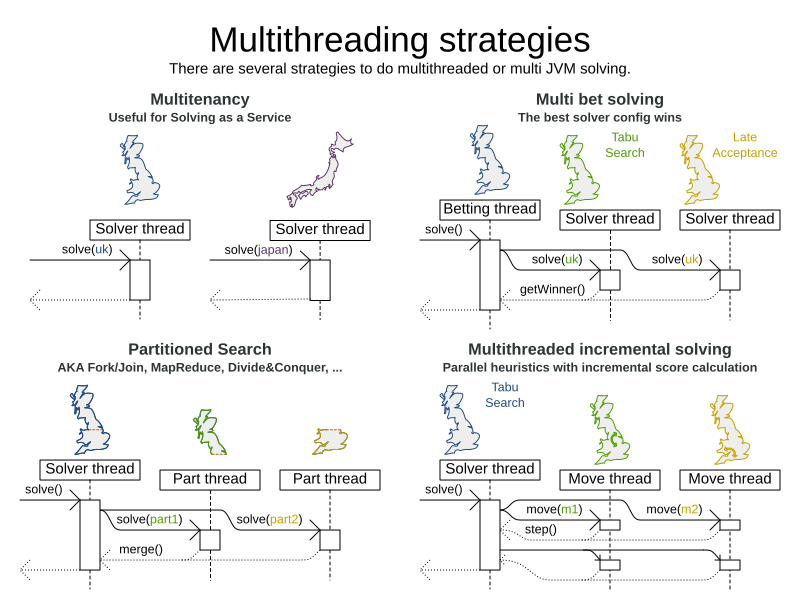

# 优化算法

<https://www.optaplanner.org/docs/optaplanner/latest/optimization-algorithms/optimization-algorithms.html>

1. 现实世界中的搜索空间大小
    一个规划问题的可能解决方案的数量可能是令人震惊的。比如说：

    - 四个皇后有256个可能的解决方案（4^4）和两个最优解决方案。
    - 五个皇后有3125个可能的解决方案（5^5）和一个最佳解决方案。
    - 8个皇后有16777216个可能的解决方案（8^8）和92个最佳解决方案。
    - 64个皇后有超过10^115个可能的解决方案（64^64）。
    - 大多数现实生活中的规划问题都有数量惊人的可能解，而只有一个或几个最优解。

    作为比较：已知宇宙中原子的最小数量（10^80）。当一个规划问题变得更大时，搜索空间往往会快速爆炸。仅仅增加一个额外的规划实体或规划值，就会使一些算法的运行时间大大增加。
    

    计算可能的解决方案的数量取决于领域模型的设计：
    

    **NOTE**
    这种搜索空间大小的计算包括不可行的解决方案（如果它们能被模型所代表），因为：

    - 最佳解可能是不可行的。
    - 有许多类型的硬性约束不能实际纳入公式中。例如，在云平衡中，尝试在公式中纳入CPU容量约束。

    即使在公式中加入一些硬约束条件是实用的情况下（例如，课程调度），产生的搜索空间仍然是巨大的。

    一个检查每一个可能的解决方案的算法（即使有修剪，如[Branch And Bound](https://www.optaplanner.org/docs/optaplanner/latest/exhaustive-search/exhaustive-search.html#branchAndBound)）可以很容易地在一个现实生活的规划问题上运行数十亿年。我们的目标是在现有的时间范围内找到最佳解决方案。规划竞赛（如国际时间安排竞赛）表明，在现实世界的时间限制下，局部搜索的变化（[Tabu Search](https://www.optaplanner.org/docs/optaplanner/latest/local-search/local-search.html#tabuSearch)、[Simulated Annealing](https://www.optaplanner.org/docs/optaplanner/latest/local-search/local-search.html#simulatedAnnealing)、[Late Acceptance](https://www.optaplanner.org/docs/optaplanner/latest/local-search/local-search.html#lateAcceptance)...）通常对现实世界的问题表现得最好。
2. OptaPlanner能找到最佳解决方案吗？
    企业希望得到最佳解决方案，但他们也有其他要求：

    - 扩大规模： 大型生产数据集必须不崩溃，并且也有好的结果。
    - 优化正确的问题：约束条件必须符合实际业务需求。
    - 可用的时间： 必须及时找到解决方案，否则执行起来就没有用了。
    - 可靠性： 每一个数据集都必须至少有一个像样的结果（比人类规划者更好）。

    鉴于这些要求，尽管一些销售人员承诺，通常任何人或事物都不可能找到最佳解决方案。因此，OptaPlanner专注于在可用时间内找到最佳解决方案。在 "现实的、独立的竞争" 中，它经常作为最好的可重复使用的软件出现。

    NP-完整问题的性质使得扩展成为首要关注的问题。

    > NOTE: 一个小数据集的结果的质量并不能说明一个大数据集的结果的质量。

    规模问题不能通过以后购买硬件来缓解。尽快用生产规模的数据集开始测试。不要在小数据集上评估质量（除非生产中只遇到这种数据集）。相反，解决一个生产规模的数据集，比较更长的执行时间、不同的算法和--如果有的话--人类规划者的结果。

3. 架构概述
    OptaPlanner是第一个将优化算法（元启发式算法，......）与规则引擎（如Drools）的分数计算相结合的框架。这种结合是非常有效的，因为：

    - 规则引擎，如Drools，非常适用于计算规划问题的解决方案的分数。它使添加额外的软约束或硬约束变得容易和可扩展。它不需要任何额外的代码就可以进行[增量的分数计算（deltas）](https://www.optaplanner.org/docs/optaplanner/latest/score-calculation/score-calculation.html#incrementalScoreCalculation)。然而，它往往不适合实际寻找新的解决方案。
    - 优化算法在为规划问题寻找新的改进方案方面非常出色，不一定要对每一种可能性都进行粗暴的处理。然而，它需要知道一个解决方案的分数，并且没有提供有效计算该分数的支持。

    

4. 优化算法概述

    OptaPlanner支持三个系列的优化算法：穷举搜索、构建启发式算法和元启发式算法。在实践中，元启发式算法（与构造启发式算法相结合进行初始化）是推荐的选择：

    

    这些算法系列中的每一个都有多种优化算法：

    表1. 优化算法概述

    | Algorithm                     | Scalable? | Optimal? | Easy to use? | Tweakable? | Requires CH? |
    |-------------------------------|-----------|----------|--------------|------------|--------------|
    | Exhaustive Search (ES)        |           |          |              |            |              |
    | Brute Force                   | 0/5       | 5/5      | 5/5          | 0/5        | No           |
    | Branch And Bound              | 0/5       | 5/5      | 4/5          | 2/5        | No           |
    | Construction heuristics (CH)  |           |          |              |            |              |
    | First Fit                     | 5/5       | 1/5      | 5/5          | 1/5        | No           |
    | First Fit Decreasing          | 5/5       | 2/5      | 4/5          | 2/5        | No           |
    | Weakest Fit                   | 5/5       | 2/5      | 4/5          | 2/5        | No           |
    | Weakest Fit Decreasing        | 5/5       | 2/5      | 4/5          | 2/5        | No           |
    | Strongest Fit                 | 5/5       | 2/5      | 4/5          | 2/5        | No           |
    | Strongest Fit Decreasing      | 5/5       | 2/5      | 4/5          | 2/5        | No           |
    | Cheapest Insertion            | 3/5       | 2/5      | 5/5          | 2/5        | No           |
    | Regret Insertion              | 3/5       | 2/5      | 5/5          | 2/5        | No           |
    | Metaheuristics (MH)           |           |          |              |            |              |
    | Local Search (LS)             |           |          |              |            |              |
    | Hill Climbing                 | 5/5       | 2/5      | 4/5          | 3/5        | Yes          |
    | Tabu Search                   | 5/5       | 4/5      | 3/5          | 5/5        | Yes          |
    | Simulated Annealing           | 5/5       | 4/5      | 2/5          | 5/5        | Yes          |
    | Late Acceptance               | 5/5       | 4/5      | 3/5          | 5/5        | Yes          |
    | Great Deluge                  | 5/5       | 4/5      | 3/5          | 5/5        | Yes          |
    | Step Counting Hill Climbing   | 5/5       | 4/5      | 3/5          | 5/5        | Yes          |
    | Variable Neighborhood Descent | 3/5       | 3/5      | 2/5          | 5/5        | Yes          |
    | Evolutionary Algorithms (EA)  |           |          |              |            |              |
    | Evolutionary Strategies       | 3/5       | 3/5      | 2/5          | 5/5        | Yes          |
    | Genetic Algorithms            | 3/5       | 3/5      | 2/5          | 5/5        | Yes          |

    要了解更多关于元启发法的信息，请参见《[元启发法要点](http://www.cs.gmu.edu/~sean/book/metaheuristics/)》或《[聪明算法](http://www.cleveralgorithms.com/)》。

5. 我应该使用哪些优化算法？
    要使用的最佳优化算法配置在很大程度上取决于你的用例。然而，这个基本程序提供了一个良好的起始配置，将产生比平均水平更好的结果。

    1. 从一个快速配置开始，它只涉及很少或没有配置和优化代码： 请看[First Fit](https://www.optaplanner.org/docs/optaplanner/latest/construction-heuristics/construction-heuristics.html#firstFit)。
    2. 接下来，实现[规划实体难度](https://www.optaplanner.org/docs/optaplanner/latest/planner-configuration/planner-configuration.html#planningEntityDifficulty)比较，并把它变成[First Fit递减](https://www.optaplanner.org/docs/optaplanner/latest/construction-heuristics/construction-heuristics.html#firstFitDecreasing)。
    3. 接下来，在它后面加上晚期接受：
        1. 首次适合性递减。
        2. [迟来的接受](https://www.optaplanner.org/docs/optaplanner/latest/local-search/local-search.html#lateAcceptance)。

    这时，投入时间的回报率降低，结果可能是足够的。

    然而，这可以在较低的投资时间回报率下得到改善。使用[Benchmarker](https://www.optaplanner.org/docs/optaplanner/latest/benchmarking-and-tweaking/benchmarking-and-tweaking.html#benchmarker)，尝试一些不同的Tabu Search、Simulated Annealing和Late Acceptance配置，例如：

    1. 首先适合递减：[Tabu搜索](https://www.optaplanner.org/docs/optaplanner/latest/local-search/local-search.html#tabuSearch)。

    使用Benchmarker来改进大小参数的值。

    也可以运行其他实验。例如，可以将以下多种算法结合在一起：

    1. 首次拟合递减
    2. 晚期接受（相对较长的时间）
    3. Tabu搜索（相对较短的时间）

6. 功率调整或默认参数值

    许多优化算法都有影响结果和可扩展性的参数。OptaPlanner通过例外情况应用配置，所以所有优化算法都有默认参数值。这与JVM中的垃圾收集参数非常相似：大多数用户不需要调整它们，但强力用户往往需要调整。
    默认参数值对许多情况来说是足够的（特别是对原型），但如果开发时间允许，用基准器对它们进行功率调整(power tweak)可能是有益的，以便在特定的使用情况下获得更好的结果和扩展性。每个优化算法的文档也声明了功率调整的高级配置。
    参数的默认值将在次要版本之间改变，以便为大多数用户改进它们。高级配置可以用来防止不需要的变化，然而，不建议这样做。

7. 解算器阶段
    一个解算器可以依次使用多种优化算法。每种优化算法由一个求解器阶段表示。从来没有一个以上的Phase在同一时间求解。
    一些Phase的实现可以结合多种优化算法的技术，但它仍然只是一个Phase。例如：一个局部搜索阶段可以做模拟退火与实体Tabu。

    下面是一个依次运行三个阶段的配置：

    ```xml
    <solver xmlns="https://www.optaplanner.org/xsd/solver" xmlns:xsi="http://www.w3.org/2001/XMLSchema-instance"
        xsi:schemaLocation="https://www.optaplanner.org/xsd/solver https://www.optaplanner.org/xsd/solver/solver.xsd">
    ...
    <constructionHeuristic>
        ... <!-- First phase: First Fit Decreasing -->
    </constructionHeuristic>
    <localSearch>
        ... <!-- Second phase: Late Acceptance -->
    </localSearch>
    <localSearch>
        ... <!-- Third phase: Tabu Search -->
    </localSearch>
    </solver>
    ```

    解算器阶段是按照解算器配置定义的顺序运行的。

    - 当第一个阶段结束时，第二个阶段开始，以此类推。
    - 当最后一个阶段结束时，求解器就结束了。

    通常情况下，求解器会首先运行一个构造启发式，然后运行一个或多个元启发式：
    

    如果没有配置任何阶段，OptaPlanner将默认为一个构造启发式阶段，然后是一个本地搜索阶段。

    一些阶段（特别是构造启发式）将自动终止。其他阶段（尤其是元启发式）只有在该阶段被配置为终止时才会终止：

    ```xml
    <solver xmlns="https://www.optaplanner.org/xsd/solver" xmlns:xsi="http://www.w3.org/2001/XMLSchema-instance"
        xsi:schemaLocation="https://www.optaplanner.org/xsd/solver https://www.optaplanner.org/xsd/solver/solver.xsd">
    ...
    <termination><!-- Solver termination -->
        <secondsSpentLimit>90</secondsSpentLimit>
    </termination>
    <localSearch>
        <termination><!-- Phase termination -->
        <secondsSpentLimit>60</secondsSpentLimit><!-- Give the next phase a chance to run too, before the Solver terminates -->
        </termination>
        ...
    </localSearch>
    <localSearch>
        ...
    </localSearch>
    </solver>
    ```

    如果Solver终止了（在最后一个阶段自己终止之前），当前阶段就会被终止，所有后续阶段都不会运行。

8. 范围概述
    一个求解器将迭代地运行阶段。每个阶段通常会迭代地运行步骤。每个步骤又通常迭代地运行动作。这些形成了四个嵌套的作用域：

    1. Solver解算器
    2. Phase 阶段
    3. Step 步骤
    4. Move 移动

    

    配置[日志](https://www.optaplanner.org/docs/optaplanner/latest/planner-configuration/planner-configuration.html#logging)以显示每个作用域的日志信息。

9. 终止
    并非所有的阶段都会自动终止，可能需要大量的时间。一个Solver可以通过前期配置同步终止，或者从另一个线程异步终止。
    特别是元启发式阶段，需要被指示停止求解。这可能是由于一些原因，例如，如果时间到了，或者在使用其解决方案之前已经达到了完美的分数。找到最优解是不能依靠的（除非你知道最优分数），因为元启发式算法一般不知道最优解的情况。
    对于现实生活中的问题来说，这不是一个问题，因为寻找最优解可能需要比可用的时间更多。在可用时间内找到最佳解决方案是最重要的结果。
    如果没有配置终止（并且使用了元启发式算法），Solver将永远运行，直到从另一个线程调用[terminateEarly()](https://www.optaplanner.org/docs/optaplanner/latest/optimization-algorithms/optimization-algorithms.html#asynchronousTermination)。这在[实时规划](https://www.optaplanner.org/docs/optaplanner/latest/repeated-planning/repeated-planning.html#realTimePlanning)中特别常见。

    对于同步终止，当它需要停止时，在求解器或阶段上配置一个终止。这些内置的实现应该是足够的，但也支持自定义的终止。每个终止可以计算时间梯度（某些优化算法需要），这是已经花费的求解时间和估计的整个求解器或阶段的求解时间之间的比率。
    1. 花费时间终止

        当使用了一定量的时间时，就会终止。

        ```xml
        <termination>
            <!-- 2 minutes and 30 seconds in ISO 8601 format P[n]Y[n]M[n]DT[n]H[n]M[n]S -->
            <spentLimit>PT2M30S</spentLimit>
        </termination>
        ```

        除了ISO 8601格式的java.util.Duration之外，你还可以使用：

        毫秒`<millisecondsSpentLimit>500</millisecondsSpentLimit>`

        秒数`<secondsSpentLimit>10</secondsSpentLimit>`

        分钟`<minutesSpentLimit>5</minutesSpentLimit>`

        小时`<hoursSpentLimit>1</hoursSpentLimit>`

        天数`<daysSpentLimit>2</daysSpentLimit>`

        多个时间类型可以一起使用，如使用一个组合，总和为150分钟：

        ```xml
        <termination>
            <hoursSpentLimit>2</hoursSpentLimit>
            <minutesSpentLimit>30</minutesSpentLimit>
        </termination>
        ```

        这种终止很可能会牺牲完美的重现性（即使是在environmentalMode REPRODUCIBLE的情况下），因为可用的CPU时间在不同的运行之间经常不同：
        - 可用的CPU时间影响到可以采取的步骤数量，可能多几步，也可能少几步。
        - 终止可能会产生略有不同的时间梯度值，这将使基于时间梯度的算法（如模拟退火(Simulated Annealing)）走上完全不同的道路。

    2. 未改进的时间花费终止
        当最佳得分在指定时间内没有提高时，就会终止。每次找到一个新的最佳解，计时器基本上都会重置。

        ```xml
        <localSearch>
            <termination>
            <!-- 2 minutes and 30 seconds in ISO 8601 format P[n]Y[n]M[n]DT[n]H[n]M[n]S -->
            <unimprovedSpentLimit>PT2M30S</unimprovedSpentLimit>
            </termination>
        </localSearch>
        ```

        除了ISO 8601格式的java.util.Duration之外，你还可以使用：

        毫秒  `<unimprovedMillisecondsSpentLimit>500</unimprovedMillisecondsSpentLimit>`

        秒数 `<unimprovedSecondsSpentLimit>10</unimprovedSecondsSpentLimit>`

        分钟 `<unimprovedMinutesSpentLimit>5</unimprovedMinutesSpentLimit>`

        小时 `<unimprovedHoursSpentLimit>1</unimprovedHoursSpentLimit>`

        天数 `<unimprovedDaysSpentLimit>1</unimprovedDaysSpentLimit>`

        就像终止所花费的时间一样，组合被加起来。
        最好是在一个特定的阶段（如`<localSearch>`）而不是在求解器本身上配置这个终止。

        这种终止很可能会牺牲完美的可重复性（即使是在环境模式REPRODUCIBLE下），因为可用的CPU时间在不同的运行中经常不同：

        - 可用的CPU时间影响到可以采取的步骤数量，可能多几步也可能少几步。
        - 终止可能会产生稍微不同的时间梯度值，这将使基于时间梯度的算法（如模拟退火）走上根本不同的道路。

        可选地，配置一个分数差异阈值，最佳分数必须在指定时间内提高。例如，如果分数不能在每30秒或更短的时间内提高至少100个软点数，它就会终止：

        ```xml
        <localSearch>
            <termination>
            <unimprovedSecondsSpentLimit>30</unimprovedSecondsSpentLimit>
            <unimprovedScoreDifferenceThreshold>0hard/100soft</unimprovedScoreDifferenceThreshold>
            </termination>
        </localSearch>
        ```

        如果分数提高了1个硬分，下降了900个软分，它仍然符合阈值，因为1hard/-900soft大于0hard/100soft的阈值。
        另一方面，任何以牺牲1个或更多的软分数为代价来提高1个硬分数的新的最佳方案都不符合阈值1hard/0soft，因为1hard/-100soft小于阈值1hard/0soft。
        为了要求每30秒有一个可行性的改进，同时避免上面的陷阱，使用通配符*来表示较低的分数水平，如果较高的分数水平有改进，则允许其恶化：

        ```xml
        <localSearch>
            <termination>
            <unimprovedSecondsSpentLimit>30</unimprovedSecondsSpentLimit>
            <unimprovedScoreDifferenceThreshold>1hard/*soft</unimprovedScoreDifferenceThreshold>
            </termination>
        </localSearch>
        ```

        这实际上意味着阈值为 1hard/-2147483648soft，因为它依赖于 Integer.MIN_VALUE。

    3. BestScoreTermination
        BestScoreTermination 在达到某个分数时终止。在已知满分的情况下使用这个终止，例如，对于四个皇后（使用[SimpleScore](https://www.optaplanner.org/docs/optaplanner/latest/score-calculation/score-calculation.html#simpleScore)）：

        ```xml
        <termination>
            <bestScoreLimit>0</bestScoreLimit>
        </termination>
        ```

        一个使用[HardSoftScore](https://www.optaplanner.org/docs/optaplanner/latest/score-calculation/score-calculation.html#hardSoftScore)的规划问题可能看起来像这样：

        ```xml
        <termination>
            <bestScoreLimit>0hard/-5000soft</bestScoreLimit>
        </termination>
        ```

        一个带有三个硬级别和一个软级别的[BendableScore](https://www.optaplanner.org/docs/optaplanner/latest/score-calculation/score-calculation.html#bendableScore)的规划问题可能看起来像这样：

        ```xml
        <termination>
            <bestScoreLimit>[0/0/0]hard/[-5000]soft</bestScoreLimit>
        </termination>
        ```

        在这个例子中，一旦达到一个可行的解决方案就终止是不实际的，因为它需要一个bestScoreLimit，比如0hard/-2147483648soft。使用下一个终止来代替。
    4. 最佳分数可行终止(BestScoreFeasibleTermination)
        一旦发现一个可行的解决方案，就立即终止。

        ```xml
        <termination>
            <bestScoreFeasible>true</bestScoreFeasible>
        </termination>
        ```

        这种终止通常与其他终止相结合。
    5. 步数终止(StepCountTermination)
        当达到一定的步骤数时终止。这对于独立于硬件性能的运行很有用。

        ```xml
        <localSearch>
            <termination>
            <stepCountLimit>100</stepCountLimit>
            </termination>
        </localSearch>
        ```

        这个终止只能用于一个阶段（如`<localSearch>`），而不能用于求解器本身。
    6. UnimprovedStepCountTermination
        当最佳得分在一定的步数内没有提高时，就会终止。这对于独立于硬件性能的运行是很有用的。

        ```xml
        <localSearch>
            <termination>
            <unimprovedStepCountLimit>100</unimprovedStepCountLimit>
            </termination>
        </localSearch>
        ```

        如果分数最近没有改善，那么在一个合理的时间范围内，它就不太可能改善。据观察，一旦找到新的最佳解（即使在最佳解长时间没有改进的情况下），接下来的几步往往会改进最佳解。
        这种终止只能用于某个阶段（如`<localSearch>`），而不能用于求解器本身。
    7. ScoreCalculationCountTermination
        ScoreCalculationCountTermination 在达到一定数量的分数计算后终止。这通常是移动次数和步骤次数的总和。这对基准测试很有用。

        ```xml
        <termination>
            <scoreCalculationCountLimit>100000</scoreCalculationCountLimit>
        </termination>
        ```

        切换[EnvironmentMode](https://www.optaplanner.org/docs/optaplanner/latest/planner-configuration/planner-configuration.html#environmentMode)会严重影响这个终止的时间。
    8. 合并多个终端
        终止可以结合起来，例如：在100步后终止，或者在达到0分时终止：

        ```xml
        <termination>
            <terminationCompositionStyle>OR</terminationCompositionStyle>
            <bestScoreLimit>0</bestScoreLimit>
            <stepCountLimit>100</stepCountLimit>
        </termination>
        ```

        另外，你也可以使用AND，例如：在达到至少-100分的可行分数，并且在5个步骤中没有改进后终止：

        ```xml
        <termination>
            <terminationCompositionStyle>AND</terminationCompositionStyle>
            <bestScoreLimit>-100</bestScoreLimit>
            <unimprovedStepCountLimit>5</unimprovedStepCountLimit>
        </termination>
        ```

        这个例子确保了它不只是在找到一个可行的解决方案后终止，而且还在终止前完成了对该解决方案的任何明显改进。
    9. 来自另一个线程的异步终止
        异步终止不能由终止配置，因为不可能预测它何时以及是否会发生。例如，用户操作或服务器重启可能要求求解器比预测的时间更早终止。
        为了从另一个线程异步地终止一个求解器，可以从另一个线程调用terminateEarly()方法：
        solver.terminateEarly()；
        然后，求解器在其最早的时候就终止了。终止后，Solver.solve(Solution)方法在Solver线程（也就是调用它的原始线程）中返回。
        当一个ExecutorService关闭时，它将中断其线程池中的所有线程。

        当一个ExecutorService关闭时，它会中断其线程池中的所有线程。
        为了保证包含求解器线程的线程池的优雅关闭，求解器线程的中断与明确调用Solver.terminateEarly()的效果相同。

10. SolverEventListener
    每次找到一个新的最佳解，一个新的BestSolutionChangedEvent就会在Solver线程中触发。
    为了监听这样的事件，请给Solver添加一个SolverEventListener：

    ```java
    public interface Solver<Solution_> {
        ...
        void addEventListener(SolverEventListener<S> eventListener);
        void removeEventListener(SolverEventListener<S> eventListener);

    }
    ```

    BestSolutionChangedEvent的newBestSolution可能没有被初始化或者不可行。使用BestSolutionChangedEvent的新最佳得分上的isFeasible()方法来检测这种情况：

    ```java
        solver.addEventListener(new SolverEventListener<CloudBalance>() {
            public void bestSolutionChanged(BestSolutionChangedEvent<CloudBalance> event) {
                // Ignore infeasible (including uninitialized) solutions
                if (event.getNewBestSolution().getScore().isFeasible()) {
                    ...
                }
            }
        });
    ```

    使用Score.isSolutionInitialized()而不是Score.isFeasible()来只忽略未初始化的解决方案，但也接受不可行的解决方案。
    bestSolutionChanged()方法是在求解器的线程中调用的，作为Solver.solve()的一部分。所以它应该快速返回，以避免拖慢解题速度。
11. 自定义求解器阶段
    在各阶段之间或在第一阶段之前运行一个自定义优化算法，以初始化解决方案，或快速获得更好的分数。你仍然要重复使用分数计算。例如，为了实现一个自定义的构造启发式，而不实现整个阶段。
    大多数情况下，自定义求解器阶段不值得投入开发时间。支持的[构造启发式](https://www.optaplanner.org/docs/optaplanner/latest/construction-heuristics/construction-heuristics.html#constructionHeuristics)是可配置的（使用[基准测试器](https://www.optaplanner.org/docs/optaplanner/latest/benchmarking-and-tweaking/benchmarking-and-tweaking.html#benchmarker)来调整它们），终止意识，也支持部分初始化的解决方案。

    CustomPhaseCommand的接口如下：

    ```java
    public interface CustomPhaseCommand<Solution_> {
        ...
        void changeWorkingSolution(ScoreDirector<Solution_> scoreDirector);

    }
    ```

    例如，实现CustomPhaseCommand和它的changeWorkingSolution（）方法：

    ```java
    public class ToOriginalMachineSolutionInitializer extends AbstractCustomPhaseCommand<MachineReassignment> {
        public void changeWorkingSolution(ScoreDirector<MachineReassignment> scoreDirector) {
            MachineReassignment machineReassignment = scoreDirector.getWorkingSolution();
            for (MrProcessAssignment processAssignment : machineReassignment.getProcessAssignmentList()) {
                scoreDirector.beforeVariableChanged(processAssignment, "machine");
                processAssignment.setMachine(processAssignment.getOriginalMachine());
                scoreDirector.afterVariableChanged(processAssignment, "machine");
                scoreDirector.triggerVariableListeners();
            }
        }

    }
    ```

    **WARNING** 对CustomPhaseCommand中的规划实体的任何改变都必须通知ScoreDirector。

    不要改变CustomPhaseCommand中的任何问题事实。这将破坏求解器，因为之前的分数或解决方案是针对不同的问题。要做到这一点，请阅读关于重复规划的文章，用[ProblemChange](https://www.optaplanner.org/docs/optaplanner/latest/repeated-planning/repeated-planning.html#problemChange)来代替它。

    在求解器配置中配置CustomPhaseCommand：

    ```xml
    <solver xmlns="https://www.optaplanner.org/xsd/solver" xmlns:xsi="http://www.w3.org/2001/XMLSchema-instance"
        xsi:schemaLocation="https://www.optaplanner.org/xsd/solver https://www.optaplanner.org/xsd/solver/solver.xsd">
    ...
    <customPhase>
        <customPhaseCommandClass>org.optaplanner.examples.machinereassignment.solver.solution.initializer.ToOriginalMachineSolutionInitializer</customPhaseCommandClass>
    </customPhase>
    ... <!-- Other phases -->
    </solver>
    ```

    配置多个customPhaseCommandClass实例，让它们依次运行。
    如果CustomPhaseCommand的改变没有带来更好的分数，那么最佳解决方案将不会被改变（所以实际上对下一个阶段或CustomPhaseCommand来说没有任何改变）。
    如果在CustomPhaseCommand仍在运行时，Solver或Phase想要终止，它会等待终止，直到CustomPhaseCommand完成。这可能需要大量的时间。内置的解算器阶段没有这个问题。

    要在求解器配置中动态地配置CustomPhaseCommand的值（这样Benchmarker就可以调整这些参数），请添加customProperties元素并使用[自定义属性](https://www.optaplanner.org/docs/optaplanner/latest/planner-configuration/planner-configuration.html#customPropertiesConfiguration)：

    ```xml
    <customPhase>
        <customPhaseCommandClass>...MyCustomPhase</customPhaseCommandClass>
        <customProperties>
        <property name="mySelectionSize" value="5"/>
        </customProperties>
    </customPhase>
    ```

12. 不改变求解器阶段

    在极少数情况下，不运行任何求解器阶段是有用的。但是在默认情况下，配置无阶段将触发运行默认阶段。为了避免这些，配置一个NoChangePhase：

    ```xml
    <solver xmlns="https://www.optaplanner.org/xsd/solver" xmlns:xsi="http://www.w3.org/2001/XMLSchema-instance"
        xsi:schemaLocation="https://www.optaplanner.org/xsd/solver https://www.optaplanner.org/xsd/solver/solver.xsd">
    ...
    <noChangePhase/>
    </solver>
    ```

13. 多线程求解
    有几种方法可以进行多线程解算：

    - Multitenancy 多租户：并行解决不同的数据集
      - 在未来的版本中，SolverManager将使这种设置更加容易。
    - Multi bet solving 多注解算：用多个独立的解算器解算1个数据集，并取其最佳结果。
      - 不推荐： 这是一个硬件资源高成本的边际收益。
      - 在开发过程中使用Benchmarker来确定最合适的算法，尽管这只是平均水平。
      - 使用多线程的增量求解来代替。
    - Partitioned Search 分区搜索： 将1个数据集分成多个部分并独立求解。
      - 配置一个[分区搜索](https://www.optaplanner.org/docs/optaplanner/latest/partitioned-search/partitioned-search.html#partitionedSearch)。
    - Multithreaded incremental solving 多线程增量求解：在不影响增量分数计算的情况下，用[多个线程解决](https://www.optaplanner.org/docs/optaplanner/latest/score-calculation/score-calculation.html#incrementalScoreCalculation)一个数据集。
      - 将你的一部分CPU核心捐给OptaPlanner，以提高分数计算速度，并在一小部分时间内获得相同的结果。
      - 配置[多线程增量解算](https://www.optaplanner.org/docs/optaplanner/latest/optimization-algorithms/optimization-algorithms.html#multithreadedIncrementalSolving)。
        

    注意：调试或跟踪的日志级别可能会造成多线程解算的拥堵，并[减慢分数计算](https://www.optaplanner.org/docs/optaplanner/latest/score-calculation/score-calculation.html#scoreCalculationSpeed)速度。

    1. @PlanningId
        对于某些功能（如多线程求解和实时规划），OptaPlanner需要将问题事实和规划实体映射到一个ID。OptaPlanner使用该ID来重新确定从一个线程的解决状态到另一个线程的移动。
        为了启用这样的功能，在识别字段或getter方法上指定@PlanningId注解，例如在数据库ID上：

        ```java
        public class CloudComputer {
            @PlanningId
            private Long id;
            ...
        }
        ```

        或者说，在另一种类型的ID上：

        ```java
        public class User {
            @PlanningId
            private String username;
            ...
        }
        ```

        一个@PlanningId属性必须是：

        - 对该特定类来说是唯一的
          - 它不需要在不同的问题事实类中是唯一的（除非在那种罕见的情况下，这些类混合在同一个值范围或规划实体集合中）。
        - 一个实现Object.hashCode()和Object.equals()的类型的实例。
          - 建议使用Integer, int, Long, long, String或UUID类型。
        - 在调用Solver.solve()时，永远不会为空。

    2. 自定义线程工厂（WildFly, Android, GAE, ...）
        threadFactoryClass允许插入一个自定义的ThreadFactory，用于应避免任意创建线程的环境，如大多数应用服务器（包括WildFly）、Android或Google App Engine。
        在求解器上配置ThreadFactory，用它来创建[移动线程](https://www.optaplanner.org/docs/optaplanner/latest/optimization-algorithms/optimization-algorithms.html#multithreadedIncrementalSolving)和[分区搜索线程](https://www.optaplanner.org/docs/optaplanner/latest/partitioned-search/partitioned-search.html#partitionedSearch)：

        ```xml
        <solver xmlns="https://www.optaplanner.org/xsd/solver" xmlns:xsi="http://www.w3.org/2001/XMLSchema-instance"
            xsi:schemaLocation="https://www.optaplanner.org/xsd/solver https://www.optaplanner.org/xsd/solver/solver.xsd">
        <threadFactoryClass>...MyAppServerThreadFactory</threadFactoryClass>
        ...
        </solver>
        ```

    3. 多线程增量解算
        通过在每个规划实体类和规划值类上添加@PlanningId注解来启用多线程增量求解。然后配置一个moveThreadCount：

        ```xml
        <solver xmlns="https://www.optaplanner.org/xsd/solver" xmlns:xsi="http://www.w3.org/2001/XMLSchema-instance"
            xsi:schemaLocation="https://www.optaplanner.org/xsd/solver https://www.optaplanner.org/xsd/solver/solver.xsd">
        <moveThreadCount>AUTO</moveThreadCount>
        ...
        </solver>
        ```

        假设你的机器有足够的空闲CPU核心，这额外的一行就能极大地提高分数的计算速度。
        高级配置：

        ```xml
        <solver xmlns="https://www.optaplanner.org/xsd/solver" xmlns:xsi="http://www.w3.org/2001/XMLSchema-instance"
            xsi:schemaLocation="https://www.optaplanner.org/xsd/solver https://www.optaplanner.org/xsd/solver/solver.xsd">
        <moveThreadCount>4</moveThreadCount>
        <moveThreadBufferSize>10</moveThreadBufferSize>
        <threadFactoryClass>...MyAppServerThreadFactory</threadFactoryClass>
        ...
        </solver>
        ````

        moveThreadCount为4的时候，几乎5个CPU核都饱和了：4个移动线程完全占满了4个CPU核，而求解器线程则使用了另一个CPU核的大部分。
        支持以下moveThreadCount：

        - NONE（默认）： 不要运行任何移动线程。使用单线程代码。
        - AUTO：让OptaPlanner决定并行运行多少个移动线程。在只有很少或没有CPU的机器或容器上，这将退回到单线程代码。
        - 静态数： 平行运行的移动线程的数量。
          `<moveThreadCount>4</moveThreadCount>`
          这个数字可以是1，以强制运行只有一个移动线程的多线程代码（这比NONE效率低）。

        设置一个高于可用CPU核数的moveThreadCount是有反作用的，因为这会减慢分数的计算速度。一个很好的理由是，无论如何都要这样做，以重现高端生产机器的一个错误。

        > 注意：只要解决的moveThreadCount是稳定的，多线程求解仍然是可重现的。在两台CPU数量不同的机器上运行相同的求解a器配置，仍然是可以重现的，除非moveThreadCount被设置为AUTO或者是availableProcessorCount的一个函数。

        moveThreadBufferSize的作用是调整被选中但不会被觅食(foraged)的移动的数量。把它设置得太低会降低性能，但设置得太高也会降低性能。除非你对多线程解法的内部工作原理非常熟悉，否则不要配置这个参数。
        要在一个不喜欢任意创建线程的环境中运行，可以使用threadFactoryClass插入一个自定义的[线程工厂](https://www.optaplanner.org/docs/optaplanner/latest/optimization-algorithms/optimization-algorithms.html#customThreadFactory)。
